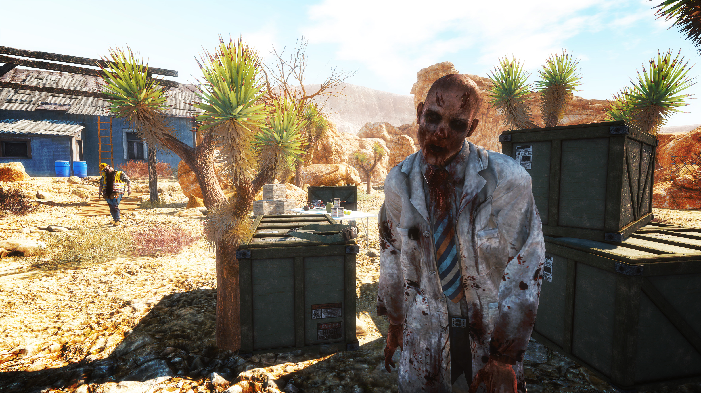

The week in .NET - On .NET with Glenn Versweyveld, Protobuf.NET, Arizona Sunshine
===================================================================

To read last week's post, see [The week in .NET – On .NET with Steve Smith, Jint, Blue Effect](https://blogs.msdn.microsoft.com/dotnet/2016/12/28/the-week-in-net-on-net-with-steve-smith-jint/).

On .NET
-------

Last week, I published [another short interview from the MVP Summit, this time with Glenn Versweyveld about Kliva, his Strava client for Windows](https://channel9.msdn.com/Shows/On-NET/Glenn-Versweyveld-Kliva):

<iframe src="https://channel9.msdn.com/Shows/On-NET/Glenn-Versweyveld-Kliva/player" width="960" height="540" allowFullScreen frameBorder="0"></iframe>

This week, I'll publish the last of our MVP Summit interviews, in which Reed Copsey, Jr. told me about [the F# Software Foundation](http://fsharp.org/) and its new programs. Next week, we'll resume our regular shows.

Package of the week: Protobuf.NET
---------------------------------

[Protocol Buffers](https://developers.google.com/protocol-buffers/), or Protobufs for short, are a serialization format invented by Google, that is popular for its performance and simplicity. [Google's C# library](https://developers.google.com/protocol-buffers/docs/csharptutorial) generates C# code from a Protobuf specification. [Protobuf.NET](https://github.com/mgravell/protobuf-net) takes a different approach, that is arguably more idiomatic, and closer to existing .NET serializers such as `DataContractSerializer`, by starting from C# code, using attributes to specify contracts.

```csharp
[ProtoContract]
class Person {
    [ProtoMember(1)]
    public int Id {get;set;}
    [ProtoMember(2)]
    public string Name {get;set;}
    [ProtoMember(3)]
    public Address Address {get;set;}
}

[ProtoContract]
class Address {
    [ProtoMember(1)]
    public string Line1 {get;set;}
    [ProtoMember(2)]
    public string Line2 {get;set;}
}
```

The serialization and deserialization APIs are then very simple:

```csharp
var person = new Person {
    Id = 12345, Name = "Fred",
    Address = new Address {
        Line1 = "Flat 1",
        Line2 = "The Meadows"
    }
};

using (var file = File.Create("person.bin")) {
    Serializer.Serialize(file, person);
}

Person newPerson;
using (var file = File.OpenRead("person.bin")) {
    newPerson = Serializer.Deserialize<Person>(file);
}
```

* NuGet: [protobuf-net](https://www.nuget.org/packages/protobuf-net/)
* GitHub: [mgravell/protobuf-net](https://github.com/mgravell/protobuf-net)

Game of the week: Arizona Sunshine
----------------------------------

[Arizona Sunshine](http://www.arizona-sunshine.com/) is a post-apocalypse first-person shooter designed for virtual reality. Strap on your headset and jump into a zombie invested world, exploring freely, scavenging and battling flesh eating undead who need to be put back into their graves! Arizona Sunshine features over 25 different weapons that operate with real-life movements, multiple environments for exploration, a full-size single player campaign and co-op multiplayer.



[Arizona Sunshine](http://www.arizona-sunshine.com/) was created by [Vertigo Games](http://vertigo-games.com/) and [Jaywalkers Interactive](http://jaywalkersinteractive.com/) using [C#](https://channel9.msdn.com/Series/C-Sharp-Fundamentals-Development-for-Absolute-Beginners) and [Unity](unity3d.com). It is available on [Steam](http://store.steampowered.com/app/342180/) for the HTC Vive and Oculus Rift.

User group meeting of the week: HoloLens mixed reality experiences in Burlington, MA
------------------------------------------------

The [New England Microsoft Developers user group](https://www.meetup.com/NE-MSFT-Devs/) holds [a meeting tonight, Thursday, January 5 in Burlington, MA](https://www.meetup.com/NE-MSFT-Devs/events/236361630/), where Gavin Bauman will show you how to build mixed reality experiences with HoloLens.

.NET
----

* [Back to Basics: String Interpolation in C#](https://weblog.west-wind.com/posts/2016/Dec/27/Back-to-Basics-String-Interpolation-in-C) by Rick Strahl.
* [Not your grandad’s .net - Pipes Part 1](https://cetus.io/tim/Part-1-Not-your-grandads-dotnet/), [A faster lower allocation stream stack wielded for ALPN/TLS and… HTTP2 - Pipes Part 2](https://cetus.io/tim/Part-2-pipelines/), and [The journey continues to Secure Pipelines, via OpenSsl - Pipes Part 3](https://cetus.io/tim/Part-3-Pipelines-OpenSsl/) by Tim Seaward.
* [In-memory C# compilation (and .dll generation) using Roslyn](http://josephwoodward.co.uk/2016/12/in-memory-c-sharp-compilation-using-roslyn) by Joseph Woodward.
* [.NET Posts - 2016 Year In Review](http://miniml.ist/dotnet/2016-year-in-review/) by Joe Petrakovich.
* [Implementing the retry pattern in C# using Polly](https://alastaircrabtree.com/implementing-the-retry-pattern-using-polly/) by Alastair Crabtree.
* [Rx over the wire](https://sachabarbs.wordpress.com/2016/12/23/rx-over-the-wire/) by Sacha Barber.
* [New release of my NATS client focusing on simplifying usage](http://danielwertheim.se/new-release-of-my-nats-client-focusing-on-simplifying-usage/) by Daniel Wertheim.

ASP.NET
-------

* [Building production ready Angular apps with Visual Studio and ASP.NET Core](https://damienbod.com/2017/01/01/building-production-ready-angular-apps-with-visual-studio-and-asp-net-core/) by Damien Bod.
* [Introducing a new Markdown View Engine for ASP.NET Core](http://www.hishambinateya.com/introducing-a-new-markdown-view-engine-for-asp.net-core) by Hisham Bin Ateya.
* [Creating a WebSockets middleware for ASP.NET Core](https://radu-matei.github.io/blog/aspnet-core-websockets-middleware/) by Radu Matei.
* [How to enable gZip compression in ASP.NET Core](http://www.talkingdotnet.com/how-to-enable-gzip-compression-in-asp-net-core/) by Talking DotNet.
* [Change primary key for ASP.NET Core Identity and more](http://thienn.com/change-primary-key-aspnetcore-identity-and-more/) by Thien Nguyen.
* [Content Negotiation and Custom Formatter in ASP.NET Web API](https://www.codeproject.com/Articles/1163143/Content-Negotiation-and-Custom-Formatter-ASP-NET) by Snesh Prajapati.
* [Create HTTP request pipeline using ASP.NET Core custom middleware: build/run on Mac, Windows, Linux or Docker container](https://www.codeproject.com/Articles/1158001/Create-HTTP-request-pipeline-using-ASP-NET-Core) by Neal Pandey.
* [In-Memory Caching In ASP.NET Core](http://www.c-sharpcorner.com/article/in-memory-caching-in-asp-net-core/) by Jignesh Trivedi.

F#
--

* [F# Software Foundation grows from over 200 members to over 1200 members since January of 2015](http://foundation.fsharp.org/welcome_to_2017).
* [F# Advent 2016 Gitbook - over 600 pages of F# Wisdom!](https://www.gitbook.com/book/swlaschin/fsadvent-2016/details), curated by Scott Wlaschin.
* [The magic of Type Providers](https://medium.com/@nevoroman/the-magic-of-type-providers-7f6825acd54#.3ayur4gj3 by Roman Nevolin.
* [End to End F# with the Elm Architecture](https://medium.com/@dogwith1eye/introducing-the-elm-architecture-with-suave-fable-and-arch-a0ffea40e13f#.kg01krlfp) by Matthew Doig.
* [Azure Notebook in F# - creative way to share your notes beside the code](https://mnie.github.io/2016-12-26-AzureNotebooksInF/) by Michał Niegrzybowski.
* [More Simple Mocking with Object Expressions](https://jeremybytes.blogspot.com.by/2016/12/more-simple-mocking-in-f-with-object.html) by Jeremy Bytes.
* [Suave Web Services](https://aspnetmonsters.com/2016/12/2016-12-31-suave/) by ASP.NET Monsters.

[F# contributions](https://twitter.com/VisualFSharp/status/815084733537189888): 118 Pull Requests from 17 contributors, 13 of which are community members.

New F# Language Proposals:

* [Allow multiple base types/interfaces on flexible type annotation](https://github.com/fsharp/fslang-suggestions/issues/528).
* [Enumerable.OfType\<TResult\> equivalent for List, Array and Seq modules](https://github.com/fsharp/fslang-suggestions/issues/527).

Check out the [F# Advent Calendar](https://sergeytihon.wordpress.com/2016/10/23/f-advent-calendar-in-english-2016/) for loads of great F# blog posts for the month of December.

Check out [F# Weekly](https://sergeytihon.wordpress.com/category/f-weekly/) for more great content from the F# community.

Xamarin
-------

* [Xamarin.Android - Entity Framework](http://www.jon-douglas.com/2016/12/28/xamarin-android-entity-framework/) by Jon Douglas.
* [Making It Snow! Xamarin.Forms and CocosSharp and Particles](https://codemilltech.com/making-it-snow-xamarin-forms-and-cocossharp-and-particles/) by Matthew Soucoup.
* [Introduction to the Mobile Software Development Lifecycle](https://developer.xamarin.com/guides/cross-platform/getting_started/introduction_to_mobile_sdlc/) by Xamarin.
* [Enabling TLS 1.2 in Xamarin.Android and Xamarin.iOS](https://developer.xamarin.com/guides/cross-platform/transport-layer-security/) by Xamarin.
* [An Introduction to SkiaSharp](https://developer.xamarin.com/guides/cross-platform/drawing/introduction/) by Xamarin.
* [Xamarin Show Snack Pack 5: Android Archive Manager for Visual Studio](https://channel9.msdn.com/Shows/XamarinShow/Snack-Pack-5-Android-Archive-Manager-for-Visual-Studio) by James Montemagno.
* [Creating Tizen Applications Using Xamarin.Forms](http://geeks.ms/xamarinteam/2016/12/23/creating-tizen-applications-using-xamarin-forms/) by Javier Suárez Ruiz.
* [Xamarin Forms Pull To Refresh With ListView](https://xamarinhelp.com/pull-to-refresh-listview/) by Adam Pedley.
* [Identifying users with HockeyApp](http://blog.ostebaronen.dk/2016/12/identifying-users-with-hockeyapp.html) by Tomasz Cielecki.
* [Wrapping views in Xamarin.iOS](https://marcoscobena.wordpress.com/2016/12/22/wrapping-views-in-xamarin-ios/) by Marcos Cobeña Morián.

Azure
-----

* [Sharing Code Between Azure Functions](https://www.codeproject.com/Articles/1162887/Sharing-Code-Between-Azure-Functions) by Jeremy Hutchinson.
* [My Take on an Azure Open Source Cross-Platform DevOps Toolkit – The Beginning](https://blogs.msdn.microsoft.com/allthingscontainer/2016/12/17/my-take-on-an-azure-open-source-cross-platform-devops-toolkit/), a 12-part series by Bruno Terkaly.

Games
-----

* [Game Design Deep Dive: How Rogue Legacy handles tutorials without being boring](http://www.gamasutra.com/view/news/228326/Game_Design_Deep_Dive_How_Rogue_Legacy_handles_tutorials_without_being_boring.php) by Teddy Lee.
* [Ludum Dare 37 Results](http://ludumdare.com/compo/ludum-dare-37/?more=1)
* [Unity: Blend Trees are awesome! A quick tutorial!](https://www.youtube.com/watch?v=YgaLKrSApWM) by TheoremGames.
* [16 Highlights From 2016 On The Unity Blog](https://blogs.unity3d.com/2016/12/29/16-highlights-from-2016-on-the-unity-blog/) by Community Team.
* [(SadConsole) Controls overview](https://github.com/Thraka/SadConsole/wiki/Controls%20overview) by Andy De George.
* [[Unity 5] Tutorial: How to make an inventory system - part 3](https://youtu.be/odtBzplsTUE) by Gamad.
* [A* Pathfinding (E07: smooth weights)](https://youtu.be/Tb-rM3wGwv4) by Sebastian Lague.

And this is it for this week!

Contribute to the week in .NET
------------------------------

As always, this weekly post couldn't exist without community contributions, and I'd like to thank all those who sent links and tips. The F# section is provided by [Phillip Carter](https://twitter.com/_cartermp), the gaming section by [Stacey Haffner](https://twitter.com/yecats131), and the Xamarin section by [Dan Rigby](https://twitter.com/DanRigby).

You can participate too. Did you write a great blog post, or just read one? Do you want everyone to know about an amazing new contribution or a useful library? Did you make or play a great game built on .NET?
We'd love to hear from you, and feature your contributions on future posts:

* Send an email to beleroy at Microsoft,
* [comment on this gist](https://gist.github.com/bleroy/0265c7325cea73299a40f658f8393f1c)
* Leave us a pointer in the comments section below.
* [Send Stacey (@yecats131) tips on Twitter about .NET games](https://twitter.com/yecats131).

This week's post (and future posts) also contains news I first read on [The ASP.NET Community Standup](https://blogs.msdn.microsoft.com/webdev/tag/communitystandup/), on [Weekly Xamarin](http://weeklyxamarin.com/), on [F# weekly](https://sergeytihon.wordpress.com/category/f-weekly/), and on [Chris Alcock's The Morning Brew](http://themorningbrew.net/).
