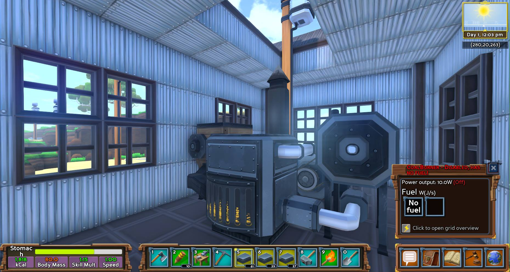

The week in .NET - On .NET with Reed Copsey, Jr., Orchard Harvest, Ammy, Concurrency Visualizer, Eco
=====================================================

To read last week's post, see [The week in .NET – On .NET with Glenn Versweyveld, Protobuf.NET, Arizona Sunshine](https://blogs.msdn.microsoft.com/dotnet/2017/01/04/the-week-in-net-on-net-with-glenn-versweyveld-protobuf-net-arizona-sunshine/).

Starting this week, UWP links, which have been in the general .NET section until now, are getting their own section thanks to [Michael Crump](http://twitter.com/mbcrump) who graciously accepted to provide weekly contents along with [Phillip Carter](https://twitter.com/_cartermp) for F#, [Stacey Haffner](https://twitter.com/yecats131) for gaming, and [Dan Rigby](https://twitter.com/DanRigby) for Xamarin.

Orchard Harvest
---------------

The [Orchard CMS](http://orchardproject.net) community will hold [its yearly conference in New York City from February 21 to the 22](http://orchardharvest.org/). This week is the last one to benefit from early registration fees. I'll be there myself, to give a talk about .NET Core and C# 7.

On .NET
-------

Last week, [Reed Copsey, Jr., executive director of the F# Software Foundation was on the show](https://channel9.msdn.com/Shows/On-NET/Reed-Copsey-Jr-F-Software-Foundation) to speak about the Foundation's mentoring and speaker programs:

<iframe src="https://channel9.msdn.com/Shows/On-NET/Reed-Copsey-Jr-F-Software-Foundation/player" width="960" height="540" allowFullScreen frameBorder="0"></iframe>

This week, we'll speak with [David Pine](https://twitter.com/davidpine7) about [building a magic mirror](https://ievangelist.github.io/blog/building-a-magic-mirror/). The show is on Thursdays and begins at 10AM Pacific Time [on Channel 9](https://channel9.msdn.com/Shows/On-NET). We'll take questions on Gitter, on [the dotnet/home channel](https://gitter.im/dotnet/home) and on Twitter. Please use the `#onnet` tag. It's OK to start sending us questions in advance if you can't do it live during the show.

Package of the week: Ammy
-------------------------

[XAML](https://msdn.microsoft.com/en-us/library/cc295302.aspx) is a way to describe instances of components. It uses an XML dialect, which is not to the taste of everyone, and may not be the best for manual authoring. The same ideas that XAML implements can however perfectly well be implemented with other persistence formats.

[Ammy](http://www.ammyui.com/) is one such format, that is inspired from JSON and [Qt's QML](https://en.wikipedia.org/wiki/QML). It's lightweight, expressive, and extensible.

```QML
Window "MainWindow" {
  Width: 200
  Height: 100
  TextBlock { 
    Text: "Hello, World!"
  }
}
```

Tool of the week: Concurrency Visualizer
----------------------------------------

[Concurrency Visualizer](https://msdn.microsoft.com/en-us/library/dd537632.aspx) is an invaluable extension to Visual Studio that helps you visualize multithreaded application performance. It can monitor processor and core utilization, threads, spot anti-patterns, and recommend best practices.


Sergey Teplyakov has a great post this week on [understanding different GC modes with Concurrency Visualizer](https://blogs.msdn.microsoft.com/seteplia/2017/01/05/understanding-different-gc-modes-with-concurrency-visualizer/).

Game of the week: Eco
---------------------

[Eco](https://www.strangeloopgames.com/eco/) is a global survival game with a focus on ecology and collaboration. In Eco, players must team up to build a civilization and evolve it quick enough to destroy an incoming meteor before it takes out the planet, but not so quickly that it destroys the ecosystem and everyone along with it. Eco takes the typical survival genre and puts a unique spin on it by providing a fully simulated ecosystem, where every single action taken affects the countless species, even the humans. (If not properly balanced, it is possible to destroy the food source and cause a server-wide perma-death.) Players also establish and run the government by enacting laws, a criminal justice system to enforce the laws and the economy by selling goods and services.



[Eco](https://www.strangeloopgames.com/eco/) was created [Strange Loop Games](https://www.strangeloopgames.com/) using [C#](https://channel9.msdn.com/Series/C-Sharp-Fundamentals-Development-for-Absolute-Beginners) and [Unity](unity3d.com) for the client and ASP.NET and the .NET Framework for their website and server backend. It is currently in [alpha](https://ecoauth.strangeloopgames.com/home) for Windows, Mac, and Linux. Eco is also being piloted in serveral schools as a means to teach students about ecology, collaboration and cause and effect.

User group meeting of the week: Serverless .NET Core app for the AWS IoT Button in San Diego, CA
------------------------------------------------

The [λ# user group](https://www.meetup.com/lambdasharp/) holds [a meeting on Wednesday, January 18, at 6:00 PM in San Diego, CA](https://www.meetup.com/lambdasharp/events/236703830/) where you'll learn how to build a serverless .NET Core app for the AWS IoT Button.

.NET
----

* [Multi-targeting the world: a single project to rule them all](https://oren.codes/2017/01/04/multi-targeting-the-world-a-single-project-to-rule-them-all/) by Oren Novotny.
* [Understanding and updating package versions for .NET Core 1.0.3](https://andrewlock.net/understanding-and-updating-package-versions-for-net-core-1-0-3/) by Andrew Lock.
* [Exploring the.NET managed heap with ClrMD](https://blog.maartenballiauw.be/post/2017/01/03/exploring-.net-managed-heap-with-clrmd.html) by Maarten Balliauw.
* [.NET Core command-line file watcher (dotnet watch) for MSBuild](http://www.natemcmaster.com/blog/2017/01/03/dotnet-watch-msbuild/) and [MSBuild + .NET Core CLI Tools: Getting information about the project](http://www.natemcmaster.com/blog/2016/12/26/project-evalutation-cli-tool/) by Nate McMaster.
* [Reactive Extensions (Rx) – Part 8 – Timeouts](http://rehansaeed.com/reactive-extensions-rx-part-8-timeouts/) by Muhammad Rehan Saeed.
* [Explaining .NET Standard Like I'm Five](http://miniml.ist/dotnet/explaining-dotnet-standard-like-im-five/) by Joe Petrakovich.
* [Understanding OutOfMemoryException](http://indexoutofrange.com/Understanding-OutOfMemoryException/) by Szymon Warda.
* [An efficient filtering DSL for Serilog](https://nblumhardt.com/2017/01/serilog-filtering-dsl/) by Nicholas Blumhardt.
* [Deploying a self contained .Net core application on Linux and run as a daemon process](http://cloudauthority.blogspot.co.uk/2017/01/deploying-self-contained-net-core.html) by Arindam Datta.
* [Breakpoints in Auto-Properties in Visual Studio 2015](https://blog.falafel.com/breakpoints-auto-properties-visual-studio-2015/) by Rachel Hagerman.

ASP.NET
-------

* [Having a merry, geeky Christmas… creating an Alexa skill with ASP.Net Web API](https://tutorials.botsfloor.com/having-a-merry-geeky-christmas-creating-an-alexa-skill-with-asp-net-web-api-d4a2cd6d016d#.9htpngngo) by Andy Butland.
* [Custom Tag Helper: Toggling Visibility On Existing HTML elements](https://scottsauber.com/2017/01/02/custom-tag-helper-toggling-visibility-on-existing-html-elements/) by Scott Sauber.
* [Using MongoDB with ASP.NET Core – Part I (Setup)](https://www.janaks.com.np/using-mongodb-with-aspnet-core-i/) and [Using MongoDB with ASP.NET Core – Part II (Implementation)](https://www.janaks.com.np/using-mongodb-with-aspnet-core-ii/) by Janak shrestha.
* [Response Caching in ASP.Net Core 1.1](http://www.talkingdotnet.com/response-caching-in-asp-net-core-1-1/) by Talking Dotnet.
* [Prefix: A lightweight ASP.NET profiler helping you write better software](http://stackify.com/asp-net-profiler/) by Matt Watson.

F#
--

* [F# Software Fondation: Reed Copsey talks about the Mentorship Program](https://www.youtube.com/watch?v=YQLgMd65rt8).
* [Testimonial on Using F# by Microsoft's Project Springfield Team](https://www.infoq.com/news/2017/01/fsharp-project-springfield) by Pierre-Luc Maheu via InfoQ.
* [Pong in F#](https://medium.com/@joshmiles/pong-in-f-940ac1c9c24d#.cm60kfenj) by Josh Miles.
* [Getting Emotional with Affectiva, F#, and Emgu](https://viralfsharp.com/2017/01/05/getting-emotional-with-affectiva-f-and-emgu/) by Boris Kogan.
* [Decoupling application errors from domain models](http://blog.ploeh.dk/2017/01/03/decoupling-application-errors-from-domain-models/) by Mark Seemann.
* [F# Type Providers](https://www.youtube.com/watch?v=RK3IGYNZDPA) by Chris Gardner.

New F# Language Proposal:

* [F# 2017](https://github.com/fsharp/fslang-suggestions/issues/529).

Check out [F# Weekly](https://sergeytihon.wordpress.com/category/f-weekly/) for more great content from the F# community.

Azure
-----

* [Hello world! Welcome to AzureCAT Guidance!](https://blogs.msdn.microsoft.com/azurecat/2017/01/05/hello-world-welcome-to-azurecat-guidance/) by Ed Price.
* [Streamlining a search experience with ASP.NET Core and Azure Search](https://auth0.com/blog/azure-search-with-aspnetcore/)  by Matías Quaranta.
* [Enable System.Net tracing on Azure App Service](https://blogs.msdn.microsoft.com/benjaminperkins/2017/01/05/enable-system-net-tracing-on-azure-app-service-unable-to-connect-to-remote-server/) by Benjamin Perkins.
* [Azure Functions preview versioning update](https://blogs.msdn.microsoft.com/appserviceteam/2017/01/03/azure-functions-preview-versioning-update/) by Chris Anderson.
* [Create and deploy an ASP.NET Core Web API to Azure Windows](https://blogs.msdn.microsoft.com/benjaminperkins/2017/01/03/create-and-deploy-an-asp-net-core-web-api-to-azure-windows/) by Benjamin Perkins.


UWP
----

* [Using text to speech in your Windows Holographic apps](https://abhijitjana.net/2017/01/02/using-text-to-speech-in-your-holographic-app/) by Abhijit.
* [Beautiful, cross-device, feature-rich and functional Universal Windows Platform app samples](https://github.com/Microsoft/uwp-experiences) by Nikola Metulev.
* [Web Real-Time Communications samples for the Universal Windows Platform](https://github.com/Microsoft/WebRTC-universal-samples) by James Cadd.

Games
-----

* [Game Design Deep Dive: Creating believable crowds in Planet Coaster](http://www.gamasutra.com/view/news/288020/Game_Design_Deep_Dive_Creating_believable_crowds_in_Planet_Coaster.php) by Owen Mc Carthy
* [Basics of Unity](https://channel9.msdn.com/Shows/dotGAME/Basics-of-Unity#comments) by Stacey Haffner
* [Unity3D analog style Synthesizer Tutorial](https://youtu.be/GqHFGMy_51c) by Dano Kablamo
* [Fading Sprites in Unity 5](http://www.alanzucconi.com/2016/12/29/fading-sprites-unity-5/) by Alan Zucconi
* [How to make a Sniper Scope Effect - Unity FPS Tutorial](https://youtu.be/adcKX1c-kag) by Brackeys
* [Draw Normals Script](https://www.reddit.com/r/Unity3D/comments/5m2uuw/draw_normals/) by WaterfordSS
* [[Unity 5] Tutorial: How to make an inventory system - part 4](https://youtu.be/EdF6tOxmKws) by Gamad
* [Adam - VFX In the Real-Time Short Film](https://blogs.unity3d.com/2017/01/04/adam-vfx-in-the-real-time-short-film/) by Zdravko Pavlov 

And this is it for this week!

Contribute to the week in .NET
------------------------------

As always, this weekly post couldn't exist without community contributions, and I'd like to thank all those who sent links and tips. The F# section is provided by [Phillip Carter](https://twitter.com/_cartermp), the gaming section by [Stacey Haffner](https://twitter.com/yecats131), the Xamarin section by [Dan Rigby](https://twitter.com/DanRigby), and the UWP section by [Michael Crump](http://twitter.com/mbcrump).

You can participate too. Did you write a great blog post, or just read one? Do you want everyone to know about an amazing new contribution or a useful library? Did you make or play a great game built on .NET?
We'd love to hear from you, and feature your contributions on future posts:

* Send an email to beleroy at Microsoft,
* [comment on this gist](https://gist.github.com/bleroy/ea0870e11856d7b27351b7db7b998eb5)
* Leave us a pointer in the comments section below.
* [Send Stacey (@yecats131) tips on Twitter about .NET games](https://twitter.com/yecats131).

This week's post (and future posts) also contains news I first read on [The ASP.NET Community Standup](https://blogs.msdn.microsoft.com/webdev/tag/communitystandup/), on [Weekly Xamarin](http://weeklyxamarin.com/), on [F# weekly](https://sergeytihon.wordpress.com/category/f-weekly/), and on [Chris Alcock's The Morning Brew](http://themorningbrew.net/).
