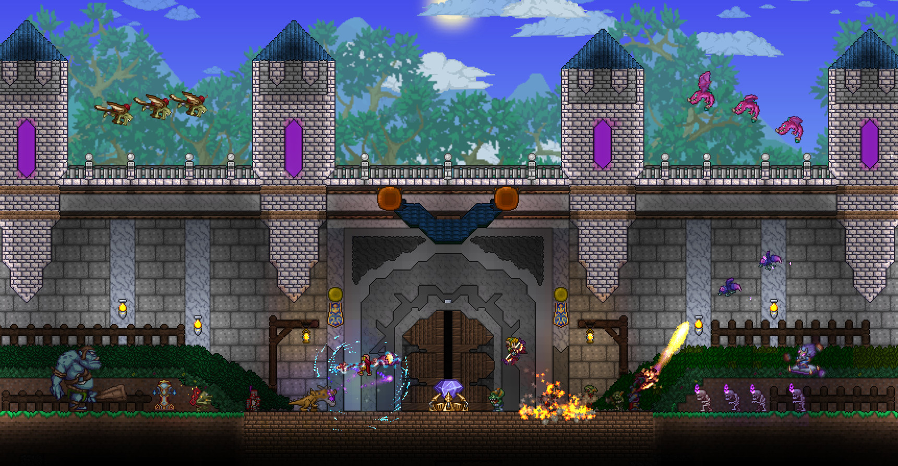

The week in .NET - On .NET with David Pine, PwdLess, Terraria
=============================================================

To read last week's post, see [The week in .NET – On .NET with Reed Copsey, Jr., Orchard Harvest, Ammy, Concurrency Visualizer, Eco](https://blogs.msdn.microsoft.com/dotnet/2017/01/10/the-week-in-net-on-net-with-reed-copsey-jr-orchard-harvest-ammy-concurrency-visualizer-eco/).

On .NET
-------

Last week, [David Pine was on the show](https://channel9.msdn.com/Shows/On-NET/David-Pine-Magic-mirror-on-the-wall-who-is-the-fairest-one-of-all) to talk about his magic mirror, a screen in a mirror, that can display useful information such as his schedule for the day, the weather forecast, and much more. The mirror uses a Raspberry Pi 3 running Windows 10 IoT Core, and runs a custom, open-source UWP application. It also has a camera, microphone, and sound bar, enabling voice-based interactions.

<iframe src="https://channel9.msdn.com/Shows/On-NET/David-Pine-Magic-mirror-on-the-wall-who-is-the-fairest-one-of-all/player" width="960" height="540" allowFullScreen frameBorder="0"></iframe>

This week, we'll talk about the year ahead for .NET. The list of guests is still TBD as I'm writing this, but I hope to have some good surprises. We'll take questions on Gitter, on [the dotnet/home channel](https://gitter.im/dotnet/home) and on Twitter. Please use the `#onnet` tag. It's OK to start sending us questions in advance if you can't do it live during the show.

Package of the week: PwdLess
----------------------------

[Passwords](https://en.wikipedia.org/wiki/Password) suffer from many issues, and their efficacy is to be doubted more and more with each mass breach, [some of which leaked hundreds of millions and up to a billion passwords](http://www.informationisbeautiful.net/visualizations/worlds-biggest-data-breaches-hacks/). There are alternatives to passwords, however, that may be appropriate for your applications.

One such alternative is "magic links", that are [nonces](https://en.wikipedia.org/wiki/Cryptographic_nonce) that the application usually sends to an email address or phone number that is known to belong to the user.

Even though [PwdLess is built with .NET](https://github.com/PwdLess/PwdLess), it's usable from any platform through its simple HTTP API. `GET /auth/sendNonce?identifier=[IDENTIFIER]` sends the nonce, and `GET /auth/nonceToToken?nonce=[NONCE]` responds 200 with the [JWT](https://jwt.io/) if the nonce is valid.

PwdLess configuration is done through a simple JSON file:

```json
{
  "PwdLess": {
    "Totp": {
      "Expiry": 15,
      "Length": 10
    },
    "Jwt": {
      "SecretKey": "9e38e3-REPLACE-WITH-YOUR-SECRET-5181742b",
      "Issuer": "YOUR_ISS_NAME",
      "Expiry": "",
      "Audience": "YOUR_CLIENT_ID"
    },
    "EmailAuth": {
      "From": "EMAIL_ADDRESS_FROM",
      "Server": "EMAIL_SERVER",
      "Port": 465,
      "SSL": true,
      "Username": "EMAIL_USER",
      "Password": "EMAIL_PASSWORD"
    },
    "EmailContents": {
      "Subject": "Welcome! Continue your passwordless Auth here.",
      "Body": "Continue by opening this link: http://YOUR_SITE/?totp={{totp}}. Alternatively, use the following code: {{totp}}",
      "BodyType":  "plain"
    }
  },
  // ...
}
```

Game of the week: Terraria 
--------------------------

[Terraria](https://terraria.org/) is an incredibly popular 2D adventure-survival game that blends classic action game mechanics with sandbox style freedom. In Terraria, players dig, fight and explore the world gathering materials that can be used to craft gear, machinery, and dwellings. You can seek out foes that grow in difficulty as you build up your very own city, giving allies that you encounter along your travels a place to stay. Terraria features randomly generated open worlds, a vast amount of weapons and armor, and numerous crafting options.



[Terraria](https://terraria.org/) was created by [Re-Logic](https://re-logic.com/) using [C#](https://channel9.msdn.com/Series/C-Sharp-Fundamentals-Development-for-Absolute-Beginners) and XNA. It is available on [Steam](http://store.steampowered.com/app/105600/) for Windows and Mac, Xbox 360, Xbox One, PlayStation 3, PlayStation 4, PSVita, Android and iOS.

User group meeting of the week: migrating from TFS to the cloud in Sydney
-------------------------------------------------------------------------

On [Wednesday, January 18 at 6:30PM](https://www.meetup.com/Sydney-NET-User-Group/events/236688869/), the [Sydney .NET User Group](https://www.meetup.com/Sydney-NET-User-Group/) will have a session with Danijel Malik on migrating from TFS to the VSTS portal.

.NET
----

* [What .NET Developers ought to know to start in 2017](http://www.hanselman.com/blog/WhatNETDevelopersOughtToKnowToStartIn2017.aspx) by Scott Hanselman.
* [Essential .NET - Essential MSBuild: a build engine overview for .NET tooling](https://msdn.microsoft.com/en-us/magazine/mt791801) by Mark Michaelis.
* [Engineering changes for corefx](https://github.com/dotnet/corefx/issues/15135) by Wes Haggard.
* [Smarter build scripts with MSBuild and .NET Core](http://www.inversionofcontrol.co.uk/smarter-build-scripts-with-msbuild-and-net-core/) by Matthew Abbott.
* [Faking out the .NET Runtime version](https://weblog.west-wind.com/posts/2017/Jan/09/Faking-out-the-NET-Runtime-Version) by Rick Strahl.
* [My first ScriptCS](http://wildermuth.com/2017/01/10/My-First-ScriptCS) by Shawn Wildermuth.
* [Implement IDisposable](https://github.com/jbe2277/waf/wiki/Implement-IDisposable) by jbe2277.
* [Analysing pause times in the .NET GC](http://mattwarren.org/2017/01/13/Analysing-Pause-times-in-the-.NET-GC/) by Matt Warren.
* [Visual Studio 2017 and Visual Studio 2015 with .NET Core](https://csharp.christiannagel.com/2017/01/10/dotnetcoreversionissues/) by Christian Nagel.
* [C# code formatting settings in VS Code and OmniSharp](http://www.strathweb.com/2017/01/c-code-formatting-settings-in-vs-code-and-omnisharp/) by Filip W.
* [Analyzing GitHub LINQ usage – the results](https://blog.oz-code.com/analyzing-github-linq-usage-the-results/) by Dror Helper.
* [VSTS and MSBuild (v15)](https://dneimke.github.io/aspnet_msbuild) by Darren Neimke.

ASP.NET
-------

* [An introduction to ViewComponents - a login status view component](https://andrewlock.net/an-introduction-to-viewcomponents-a-login-status-view-component/) by Andrew Lock.
* [Getting down to business building an ASP.NET Core API service](http://www.codemag.com/Article/1701061) by Rick Strahl.
* [When a single ASP.NET client makes concurrent requests for writeable session variables](https://www.simple-talk.com/dotnet/asp-net/single-asp-net-client-makes-concurrent-requests-writeable-session-variables/) by Sanjay Patel.
* [.NET Core and NancyFX: can writing a WebApi get any simpler?](https://carlos.mendible.com/2017/01/16/net-core-and-nancyfx-can-writing-a-webapi-get-any-simpler/) by Carlos Mendible.
* [Enabling gzip compression with ASP.NET Core](http://www.softfluent.com/blog/dev/2017/01/13/Enabling-gzip-compression-with-ASP-NET-Core) by Gérald Barré.
* [Standardize page objects with Visual Studio item templates](https://automatetheplanet.com/page-objects-item-templates/) by Anton Angelov.
* [File logging on ASP.NET Core](http://gunnarpeipman.com/2017/01/aspnet-core-file-logging/) by Gunnar Peipman.

F#
--

* [F# has won me over: coming to .NET world from outside .NET](http://www.prigrammer.com/?p=363), by Tom Prior.
* [New release of @fsibot, now on Azure Functions](http://brandewinder.com/2017/01/10/fsibot-on-azure-functions/), by Matthias Brandewinder.
* [You too can build Xamarin apps with F# ](https://visualstudiomagazine.com/articles/2017/01/01/build-xamarin-apps.aspx), by Greg Shackles.
* [Pairwise distance calculation on the GPU](https://github.com/quantalea/AleaNotebooks/blob/master/AleaGPU_PairwiseDist.ipynb), by Xiang Zhang.
* [Estimating Pi on the GPU](https://github.com/quantalea/AleaNotebooks/blob/master/AleaGPU_CalculatePI.ipynb), by Xiang Zhang.

Check out [F# Weekly](https://sergeytihon.wordpress.com/category/f-weekly/) for more great content from the F# community.

Xamarin
-------

* [What Xamarin developers ought to know to start 2017](http://motzcod.es/post/155770642197/what-xamarin-developers-ought-to-know-to-start-2017) by James Montemagno.
* [Xamarin Alpha Preview 7: Cycle 9](https://releases.xamarin.com/alpha-preview-7-cycle-9/) by Adrian Murphy.
* [Webinar series: Xamarin University presents getting started with Xamarin](https://blog.xamarin.com/webinar-series-xamarin-university-presents-getting-started-with-xamarin/) by Bryan Costanich.
* [The top 12 Xamarin blog posts of 2016](https://blog.xamarin.com/the-top-12-xamarin-blog-posts-of-2016/) by Courtney Witmer.
* [Start the new year with Xamarin developer events](https://blog.xamarin.com/start-the-new-year-with-xamarin-developer-events/) by Jayme Singleton.
* [The Xamarin show: getting started with MVVM](https://blog.xamarin.com/the-xamarin-show-getting-started-with-mvvm/) & [snack pack 6: managing Android SDKs](https://channel9.msdn.com/Shows/XamarinShow/Snack-Pack-6-Managing-Android-SDKs) by James Montemagno.
* [Securing Mac application with Touch ID](https://prashantvc.com/2017/01/05/securing-mac-application-with-touch-id/) by Prashant Cholachagudda.
* [Jumpstart your Xamarin app development](https://dzone.com/articles/jumpstart-your-xamarin-app-development-1) by Sam Basu.
* [Designing a responsive music player in sketch (Part 1)](https://www.smashingmagazine.com/2017/01/designing-responsive-music-player-sketch-part-1/) by Christian Krammer.
* [Multi-targeting the world: a single project to rule them all](https://oren.codes/2017/01/04/multi-targeting-the-world-a-single-project-to-rule-them-all/) by Oren Novotny.
* [Adding databound pickers to a ListView](http://jesseliberty.com/2017/01/03/adding-databound-pickers-to-a-listview/) by Jesse Liberty.

Azure
-----

* [Azure Mobile Apps .NET SDK releases](https://blogs.msdn.microsoft.com/appserviceteam/2017/01/10/azure-mobile-apps-net-sdk-releases/) by Adrian Hall.
* [Announcing the Azure Tools Extension for Visual Studio Code](http://www.bradygaster.com/posts/announcing-azure-tools-for-visual-studio-code) by Brady Gaster.
* [Create you first ASP.NET Core App and host it in a Linux Docker container on Microsoft Azure Part 1](https://blogs.msdn.microsoft.com/malte_lantin/2017/01/12/create-you-first-asp-net-core-app-and-host-it-in-a-linux-docker-container-on-microsoft-azure-part-13/), [Part 2](https://blogs.msdn.microsoft.com/malte_lantin/2017/01/13/create-you-first-asp-net-core-app-and-host-it-in-a-linux-docker-container-on-microsoft-azure-part-23/), and [Part 3](https://blogs.msdn.microsoft.com/malte_lantin/2017/01/13/create-you-first-asp-net-core-app-and-host-it-in-a-linux-docker-container-on-microsoft-azure-part-33/) by Malte Lantin.
* [Azure Storage Queues new feature: pop-receipt on add message](https://azure.microsoft.com/en-us/blog/azure-storage-queues-new-feature-pop-receipt-on-add-message/) by Sercan Guler.

UWP
---

* [Join us on Feb 8th for Windows Developer Day – Creators Update livestream](https://blogs.windows.com/buildingapps/2017/01/11/join-us-feb-8th-windows-developer-day-creators-update-livestream/) by Windows Apps Team.
* [Adafruit Class Library for Windows IoT Core](https://learn.adafruit.com/adafruit-class-library-for-windows-iot-core/overview) by Rick Lesniak.
* [Modern Apps - Exploring the UWP Community Toolkit](https://msdn.microsoft.com/en-us/magazine/mt791802) by Frank La Vigne.
* [Using custom fonts in C# UWP apps](http://blog.mzikmund.com/2017/01/using-custom-fonts-in-cs-uwp-apps/) by Martin Zikmund.
* [Hitchhiking the HoloToolkit-Unity, Leg 9–Holes in the Walls](https://mtaulty.com/2017/01/02/hitchhiking-the-holotoolkit-unity-leg-9-holes-in-the-walls/) by Mike Taulty.
* [Windows 10, UWP, IoT Core, SpeechSynthesizer, Raspberry PI and ‘Audio Popping'](https://mtaulty.com/2017/01/15/windows-10-uwp-iot-core-speechsynthesizer-raspberry-pi-and-audio-popping/) by Mike Taulty.

Data
----

* [Paging with Entity Framework Core](http://gunnarpeipman.com/2017/01/ef-core-paging/) by Gunnar Peipman.
* [What's New in Entity Framework Core 1.1](https://weblogs.asp.net/ricardoperes/what-s-new-in-entity-framework-core-1-1) by Ricardo Peres.

Games
-----

* [Unity Navigation - Part 1](https://channel9.msdn.com/Shows/dotGAME/Unity-Navigation-Part-1) by Stacey Haffner.
* [How I taught people to play my game in 8 steps](http://imgur.com/a/ZrRcA).
* [Character design - some tips and tricks](http://www.2dgameartguru.com/2017/01/character-design-some-tips-and-tricks.html) by Chris Hildenbrand.
* [Why Angry Birds is so successful and popular: a cognitive teardown of the user experience](http://www.mauronewmedia.com/blog/why-angry-birds-is-so-successful-a-cognitive-teardown-of-the-user-experience/) by Charles Mauro.
* [Developer perspectives: lessons from E McNeill](https://developer.oculus.com/blog/developer-perspectives-lessons-from-e-mcneill/) by E McNeill.
* [Why adventure games rock - Part 1](http://www.tickstales.com/dev-blog/2017/1/11/why-adventure-games-rock-part-1) by Bryce Covert.
* [Curated #UnityTips No. 28 by DevDog January 2017](http://devdog.io/blog/2017/01/14-best-unity-tips-for-game-developers-28) by DevDog.
* [Unity UFPS tutorial: enemy hit & damage animation](https://youtu.be/SAU5UTP53Ho) by Jay AnAm.

And this is it for this week!

Contribute to the week in .NET
------------------------------

As always, this weekly post couldn't exist without community contributions, and I'd like to thank all those who sent links and tips. The F# section is provided by [Phillip Carter](https://twitter.com/_cartermp), the gaming section by [Stacey Haffner](https://twitter.com/yecats131), and the Xamarin section by [Dan Rigby](https://twitter.com/DanRigby), and the UWP section by [Michael Crump](http://twitter.com/mbcrump).

You can participate too. Did you write a great blog post, or just read one? Do you want everyone to know about an amazing new contribution or a useful library? Did you make or play a great game built on .NET?
We'd love to hear from you, and feature your contributions on future posts:

* Send an email to beleroy at Microsoft,
* [comment on this gist](https://gist.github.com/bleroy/a1073a955c90227c822d203f010589db)
* Leave us a pointer in the comments section below.
* [Send Stacey (@yecats131) tips on Twitter about .NET games](https://twitter.com/yecats131).

This week's post (and future posts) also contains news I first read on [The ASP.NET Community Standup](https://blogs.msdn.microsoft.com/webdev/tag/communitystandup/), on [Weekly Xamarin](http://weeklyxamarin.com/), on [F# weekly](https://sergeytihon.wordpress.com/category/f-weekly/), and on [Chris Alcock's The Morning Brew](http://themorningbrew.net/).
