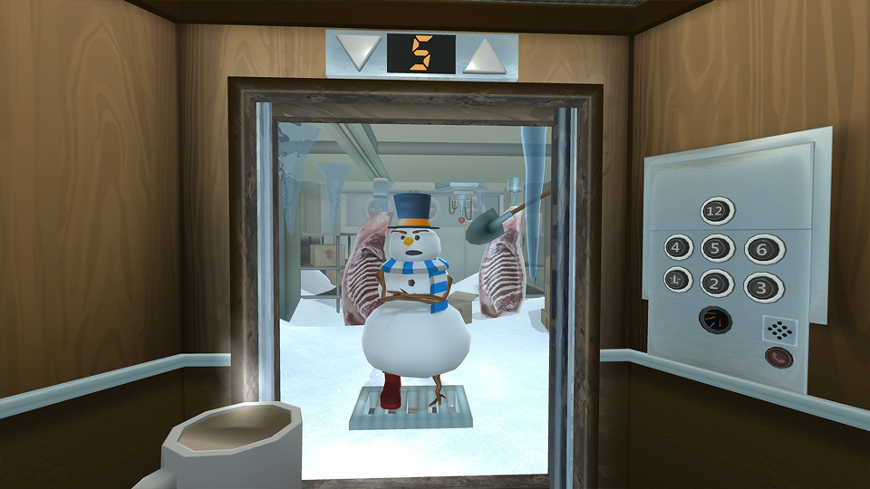

The week in .NET - Adafruit Class Library for Windows IoT Core
==============================================================

Previous posts:
* [On .NET with David Pine, PwdLess, Terraria](https://blogs.msdn.microsoft.com/dotnet/2017/01/18/the-week-in-net-on-net-with-david-pine-pwdless-terraria/).
* [On .NET with Reed Copsey, Jr., Orchard Harvest, Ammy, Concurrency Visualizer, Eco](https://blogs.msdn.microsoft.com/dotnet/2017/01/10/the-week-in-net-on-net-with-reed-copsey-jr-orchard-harvest-ammy-concurrency-visualizer-eco/)
* [On .NET with Glenn Versweyveld, Protobuf.NET, Arizona Sunshine](https://blogs.msdn.microsoft.com/dotnet/2017/01/04/the-week-in-net-on-net-with-glenn-versweyveld-protobuf-net-arizona-sunshine/)

On .NET
-------

We had no show last week, but we'll have two this week.

On **Wednesday at 9:00AM Pacific Time**, **Scott Hanselman** will host a panel discussion on public speaking, with **Kasey Uhlenhuth**, **Maria Naggaga Nakanwagi**, **Donovan Brown**, and **Mitch Muenster**.

On **Thursday at 9:00AM Pacific Time**, **Patrick Smacchia** will be on the show to talk about the brand new version of **[ndepend](http://www.ndepend.com/)**.

Both shows will stream live [on Channel 9](https://channel9.msdn.com/Shows/On-NET). We'll take questions on Gitter, on [the dotnet/home channel](https://gitter.im/dotnet/home) and on Twitter. Please use the `#onnet` tag. It's OK to start sending us questions in advance if you can't do it live during the shows.

Package of the week: Adafruit Class Library for Windows IoT Core
----------------------------------------------------------------

[Adafruit](https://www.adafruit.com/) is a familiar brand for anyone involved in the maker movement. Entrepreneur extraordinaire and open source advocate Limor Fried built the success of the company on [high quality tutorials](https://learn.adafruit.com/) and a [line of open source and US-manufactured products](https://www.adafruit.com/categories).

Adafruit recently released the [Adafruit Class Library for Windows IoT Core](https://learn.adafruit.com/adafruit-class-library-for-windows-iot-core/overview), a set of classes and associated tutorials for using some of their most popular products with Windows IoT Core, for example on a Raspberry Pi.

Here's an example of an event handler that displays the altitude, longitude and latitude when a [GPS HAT](https://www.adafruit.com/product/2324) receives new coordinates:

```csharp
private void OnGGAEvent(object sender, GPS.GPSGGA GGA)
{
    if (GGA.Quality != GPS.GPSGGA.FixQuality.noFix)
    {
        AltitudeTextBox.Text = GGA.Altitude.ToString();
        LatitudeTextBox.Text = GGA.LatDegrees.ToString();
        LogitudeTextBox.Text = GGA.LonDegrees.ToString();
    }
}
```

Game of the week: Floor Plan
----------------------------

[Floor Plan](http://www.turbo-button.com/games/floorplan) is a puzzle adventure game designed for virtual reality. In Floor Plan, players travel in an elevator in order to find items that can be used to solve various puzzles. You'll meet a whole cast of cooky characters as you move between floors, each of which is designed with their own whimsical theme.

[Floor Plan](http://www.turbo-button.com/games/floorplan) was created by [Turbo Button](http://www.turbo-button.com/about/) using [C#](https://channel9.msdn.com/Series/C-Sharp-Fundamentals-Development-for-Absolute-Beginners) and [Unity](unity3d.com). It is available for Gear VR, Oculus Rift, and Daydream.


User group meeting of the week: Mocking - Making fun of unit tests using DI in Raleigh, NC
------------------------------------------------

[TRINUG](https://www.meetup.com/TRINUG/) holds [a meeting on Wednesday, January 25 at 6:00PM in Raleigh, NC](https://www.meetup.com/TRINUG/events/236616674/) on mocking, and using dependency injection in tests.

.NET
----

* [Open sourcing the VS Test platform](https://blogs.msdn.microsoft.com/bharry/2017/01/20/open-sourcing-the-vs-test-platform/) by Brian Harry.
* [.NET Core image processing](https://blogs.msdn.microsoft.com/dotnet/2017/01/19/net-core-image-processing/) by Bertrand Le Roy.
* [Custom project templates using dotnet new](http://rehansaeed.com/custom-project-templates-using-dotnet-new/) by Muhammad Rehan Saeed.
* [Creating .NET bindings for C libraries with ObjectiveSharpie](http://tirania.org/blog/archive/2017/Jan-18.html) by Miguel de Icaza.
* [Project.json to MSBuild conversion guide](http://www.natemcmaster.com/blog/2017/01/19/project-json-to-csproj/) by Nate McMaster.
* [Working with Multiple .NET Core SDKs - both project.json and msbuild/csproj](http://www.hanselman.com/blog/WorkingWithMultipleNETCoreSDKsBothProjectjsonAndMsbuildcsproj.aspx) by Scott Hanselman.
* [Exploring Intermediate Language (IL) with ReSharper and dotPeek](https://blog.jetbrains.com/dotnet/2017/01/19/exploring-intermediate-language-il-with-resharper-and-dotpeek/) by Maarten Balliauw.
* [Essential MSBuild: A Build Engine Overview for .NET Tooling](https://msdn.microsoft.com/en-us/magazine/mt791801.aspx) by Mark Michaelis.
* [New code coverage highlighting in dotCover 2016.3](https://blog.jetbrains.com/dotnet/2017/01/18/new-code-coverage-highlighting-in-dotcover-2016-3/) by Alexey Totin.
* [Introduction to Akka.Cluster.Sharding in Akka.NET](https://petabridge.com/blog/introduction-to-cluster-sharding-akkadotnet/) by Bartosz Sypytkowski.
* [The .NET Core 2 Wave](http://developer.telerik.com/topics/net/the-net-core-2-wave/) by Ed Charbeneau.

ASP.NET
-------

* [Error handling in ASP.NET Core](https://dusted.codes/error-handling-in-aspnet-core) by Dustin Moris Gorski.
* [How to pass parameters to a view component](https://andrewlock.net/passing-variables-to-a-view-component/) by Andrew Lock.
* [Defensive logging on ASP.NET Core](http://gunnarpeipman.com/2017/01/aspnet-core-defensive-logging/) by Gunnar Peipman.
* [Inside compiled views in the Razor view engine](https://aspnetmonsters.com/2017/01/monsters-weekly/ep88/) by the ASP.NET Monsters.

F#
--

* [F# for Azure Notebooks](https://notebooks.azure.com/library/fsharp/html/FSharp%20for%20Azure%20Notebooks.ipynb)
* [Security testing in the cloud with F# and Project Springfield](https://channel9.msdn.com/Blogs/Seth-Juarez/Security-testing-in-the-cloud-with-F-and-Project-Springfield)
* [ASP.NET Monsters #85: Suave Web Services](http://www.codechannels.com/video/microsoft/dotnet/asp-net-monsters-85-suave-web-services/)
* [F# Unit Test Simplified - Expecto with Visual Studio Code](http://www.prigrammer.com/?p=398), by Tomr Prior
* [Experimenting with data in F#](http://chris-alexander.co.uk/on-engineering/f-sharp/experimenting-with-data-in-f-sharp/), by Chris Alexander

New F# RFC: [Implement IReadOnlyCollection<'T> in list<'T>](https://github.com/fsharp/fslang-design/blob/master/RFCs/FS-1029-Implement%20IReadOnlyCollection%20in%20list.md)

Check out [F# Weekly](https://sergeytihon.wordpress.com/category/f-weekly/) for more great content from the F# community.

Xamarin
-------

* [Xamarin Beta Release: Cycle 9 RC builds](https://releases.xamarin.com/beta-release-cycle-9-rc-builds/) by Adrian Murphy.
* [Try the next major Xamarin release candidate](https://blog.xamarin.com/try-the-next-major-xamarin-release-candidate/) by Joseph Hill.
* [New Xamarin.Forms Pre-release 2.3.4.184-pre1: quality improvements, bindable picker](https://blog.xamarin.com/new-xamarin-forms-pre-release-2-3-4-pre1-quality-improvements-bindable-picker/) by David Ortinau.
* [Xamarin podcast: designing mobile apps](https://blog.xamarin.com/podcast-designing-mobile-apps/) by Pierce Boggan.
* [What Xamarin developers ought to know to start 2017](http://motzcod.es/post/155770642197/what-xamarin-developers-ought-to-know-to-start-2017) & [How to build & ship an app in a week with Xamarin.Forms](http://motzcod.es/post/155490770717/building-shipping-an-app-in-a-week-with-xamarinforms) by James Montemagno.
* [The Xamarin Show 13: MVVM Helpers](https://channel9.msdn.com/Shows/XamarinShow/The-Xamarin-Show-12-MVVM-Helpers) by James Montemagno.
* [You too can build Xamarin apps with F#](https://visualstudiomagazine.com/articles/2017/01/01/build-xamarin-apps.aspx) by Greg Shackles.
* [Xamarin Forms WebView advanced series](https://xamarinhelp.com/xamarin-forms-webview-advanced-series/), [Xamarin Forms WebView bindable actions](https://xamarinhelp.com/xamarin-forms-webview-bindable-actions/), & [Xamarin Forms WebView executing JavaScript](https://xamarinhelp.com/xamarin-forms-webview-executing-javascript/) by Adam Pedley.
* [Codemash and Xamarin.Forms](https://jfarrell.net/2017/01/15/codemash-and-xamarin-forms/) by Jason Farrell.
* [ReactiveUI v7.1.0 released](https://ghuntley.com/archive/2017/01/13/reactiveui-v7-1-0-released/) by Geoffrey Huntley.
* [Attached properties - what are they good for?](https://codemilltech.com/attached-properties-what-are-they-good-for/) by Matthew Soucoup.

UWP
---

* [Announcing "UWPDesktop" NuGet package version 14393](https://blogs.windows.com/buildingapps/2017/01/17/announcing-uwpdesktop-nuget-package-version-14393/) by Vladimir Postel.
* [Windows 10 development for beginners (free course)](http://devproconnections.com/windows-development/windows-10-development-beginners-free-course) by Richard Hay.
* [Dragging holograms with gaze and tapping them in place on a surface](http://dotnetbyexample.blogspot.com/2017/01/dragging-holograms-with-gaze-and.html) by Joost van Schaik.
* [windows.updatetask - The hidden gem in UWP](https://www.suchan.cz/2017/01/windows-updatetask-the-hidden-gem-in-universal-windows-platform/) by Martin Suchan.

Games
-----

* [Unity Navigation - Part 2](https://channel9.msdn.com/Shows/dotGAME/Unity-Navigation-Part-2) by Stacey Haffner.
* [Building a 3D Game Engine with .NET Core](https://mellinoe.wordpress.com/2017/01/18/net-core-game-engine/) by Eric Mellino.
* [(Unity) Live Session: Localization Tools](https://unity3d.com/learn/tutorials/topics/scripting/overview-and-goals).
* [Simple LODs in Unity - Unity 5.xx](https://youtu.be/Y9DZAuYX_SY) by James Arndt.
* [Circle Loading Animation In Unity3D](http://www.salusgames.com/2017/01/08/circle-loading-animation-in-unity3d/) by Salus Games.

And this is it for this week!

Contribute to the week in .NET
------------------------------

As always, this weekly post couldn't exist without community contributions, and I'd like to thank all those who sent links and tips. The F# section is provided by [Phillip Carter](https://twitter.com/_cartermp), the gaming section by [Stacey Haffner](https://twitter.com/yecats131), and the Xamarin section by [Dan Rigby](https://twitter.com/DanRigby), and the UWP section by [Michael Crump](http://twitter.com/mbcrump).

You can participate too. Did you write a great blog post, or just read one? Do you want everyone to know about an amazing new contribution or a useful library? Did you make or play a great game built on .NET?
We'd love to hear from you, and feature your contributions on future posts:

* Send an email to beleroy at Microsoft,
* [comment on this gist](https://gist.github.com/bleroy/cbb76a05bd3b5ddfe67ab19212c3bddf)
* Leave us a pointer in the comments section below.
* [Send Stacey (@yecats131) tips on Twitter about .NET games](https://twitter.com/yecats131).

This week's post (and future posts) also contains news I first read on [The ASP.NET Community Standup](https://blogs.msdn.microsoft.com/webdev/tag/communitystandup/), on [Weekly Xamarin](http://weeklyxamarin.com/), on [F# weekly](https://sergeytihon.wordpress.com/category/f-weekly/), and on [Chris Alcock's The Morning Brew](http://themorningbrew.net/).
