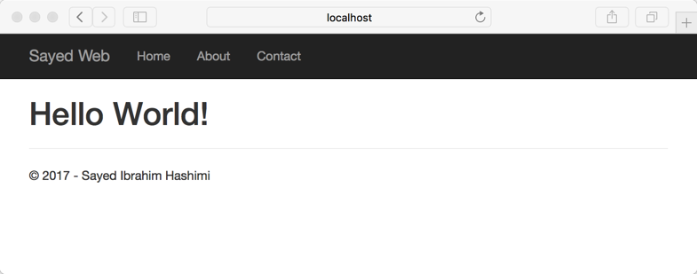

How to create templates for dotnet new using the Template Engine
=================================================================================

A couple of weeks ago we released an update to the .NET Core SDK, and Visual Studio 2017. In the .NET Core SDK we have updated the
experience of creating new projects with `dotnet new`. In this release we have completly replaced the guts of `dotnet new`.
This new version of `dotnet new` is now built on top of the new [Template Engine](https://github.com/dotnet/templating/), which
is a library that we are developing as an Open Source project. To learn more about how to use `dotnet new` see 
[Announcing .NET Core Tools Updates in VS 2017 RC](https://blogs.msdn.microsoft.com/dotnet/2017/02/07/announcing-net-core-tools-updates-in-vs-2017-rc/).
In this article we'll show how to create some custom templates and then use them from `dotnet new`.

When we started working on the Template Engine, one of our goals was to make it easy to create, maintain and share templates. In this release we have a
great story for creating and maintaing templates. We have some features for sharing templates, but we are still working in that area and will make that process
much easier as we have some more time. Let's dive into the demos, and see how to create some templates.
Everything that we cover here is in a github repository at https://github.com/sayedihashimi/dotnet-new-samples.

I have a web project which I'd like to create a template out of. The original source can be found in 
[OriginalSource](https://github.com/sayedihashimi/dotnet-new-samples/tree/master/OriginalSource/Sayedha.StarterWeb). This is a modified version of
the mvc template which is available
out of the box. Before we create a template out of this, let's run the sample to see what was created. After running 
`dotnet restore`, and 
`dotnet run`, we can view the app at `http://localhost:5000` (or if running in Visual Studio it will launch automatically when you run the app).
Below is a screenshot of this app running on my machine (I'm creating these samples on a Mac, but you can use any platform).



You can see that this is a pretty basic app which only has a few pages. There are also some strings that need to be replaced when
we create a template out of this. First let's create a basic template out of this and then we can start adding the replacements
that are needed.

How to create a basic template
------------------------------
_Sources for this example are in [01-basic-template](https://github.com/sayedihashimi/dotnet-new-samples/tree/master/01-basic-template/SayedHa.StarterWeb)_

To create a template out of this we will need to add at `.template.config\template.json`. You should place the `.template.config` folder at the root
of the files which should become the template. For example, in this case I'm going to add the `.template.config` directory in the `Sayedha.StarterWeb`
folder. This is the same folder that contains the `.csproj` file itself. Let's take a look at the content of the `template.json` file.

```json
{
  "author": "Sayed Ibrahim Hashimi",
  "classifications": [ "Web" ], 
  "name": "Sayed Starter Web",
  "identity": "Sayedha.StarterWeb",        // Unique name for this template
  "shortName": "sayedweb",                 // Short name that can be used on the cli
  "tags": {
    "language": "C#"                       // Specify that this template is in C#.
  },
  "sourceName": "Sayedha.StarterWeb",      // Will replace the string 'Sayedha.StarterWeb' with the value provided via -n.
  "preferNameDirectory" : "true"
}
```

The contents of `template.json` shown above are all pretty straight forward. One important point here regarding `sourceName`, which is an optional field.
When a user invokes `dotnet new` and specifies a new project name, by using `--name`, the project is created, and the string value for `sourceName`
will be replaced with the value provided for `--name`. For example, in the `template.json` here it's set to `Sayedha.StarterWeb`.
This string is the same as the namespace used in the `.cs` files in this project.
When the template is used, all of those values will be updated. We will discuss `preferNameDirectory` later.
Let's try out our template now and see that in action.

Now that we have created the template, it's time to test it out. To start using this with `dotnet new` the first thing to do
is to install the template. To do that, execute the command `dotnet new --install <PATH>` where `<PATH>` is the path to the folder containing
`.template.config`. When that command is executed it will discover any template files under that path and then populate the
list of available templates. The output of running that command on my machine is below.

```
$ dotnet new --install /Users/sayedhashimi/Documents/mycode/dotnet-new-samples/01-basic-template/SayedHa.StarterWeb
Templates                                 Short Name      Language      Tags
--------------------------------------------------------------------------------------
Console Application                       console         [C#], F#      Common/Console
Class library                             classlib        [C#], F#      Common/Library
Unit Test Project                         mstest          [C#], F#      Test/MSTest
xUnit Test Project                        xunit           [C#], F#      Test/xUnit
Sayed Starter Web                         sayedweb        [C#]          Web
Empty ASP.NET Core Web Application        web             [C#]          Web/Empty
MVC ASP.NET Core Web Application          mvc             [C#], F#      Web/MVC
Web API ASP.NET Core Web Application      webapi          [C#]          Web/WebAPI
Solution File                             sln                           Solution

Examples:
    dotnet new mvc --auth None --framework netcoreapp1.0
    dotnet new sln
    dotnet new --help
```

_Note: in the RC4 release the install command would not work if the path ends in a slash. Please ensure the path does
not have a trailing slash_

Here we can see that the new template is included in the template list as expected.
Before moving on to create a new project using this template, there are a few important things to mention about this release.
In this release the `--install` switch is hidden because it's currently in preview. The syntax of this command is likely to change.
We have fixed that in the latest sources.
After running install, to reset your templates back to the default list you can run the command `dotnet new --debug:reinit`. We don't
currently have support for `--uninstall`, but we are working on that. Now let's move on to using this template.

To create a new project we can run the command below.

```
$ dotnet new sayedweb -n Netblog.Web -o Netblog.Web
Content generation time: 150.1564 ms
The template "Sayed Starter Web" created successfully.
```

After executing this command the project was created in a new folder named `Netblog.Web`. In additon, all the namespace elements in the .cs files
have been updated to be `namespace Netblog.Web` instead of `namespace SayedHa.StarterWeb`. If you recall from the previous screenshot there were
two things that needed to be updated in the app; the title and the copyright. Let's see how we can add these parameters to the template.

How to create a template with replacable parameters
---------------------------------------------------

_Sources for this example are in [02-add-parameters](https://github.com/sayedihashimi/dotnet-new-samples/tree/master/02-add-parameters/SayedHa.StarterWeb)_

Now that we have our basic template created, let's see how we can customize this a bit. There are two elements in the home page that
should be updated when the template is used.

 - Title
 - Copyright

For each of these, we will create a parameter that can be customized by the user during project creation. To make these changes the only file
that we will need to modify is the `template.json` file. I've pasted the updated `template.json` file below (source files are located in the 
[02-add-parameters](https://github.com/sayedihashimi/dotnet-new-samples/tree/master/02-add-parameters) folder).

```
{
  "author": "Sayed Ibrahim Hashimi",
  "classifications": [ "Web" ], 
  "name": "Sayed Starter Web",
  "identity": "SayedHa.StarterWeb",         
  "shortName": "sayedweb",
  "tags": {
    "language": "C#"
  },
  "sourceName": "SayedHa.StarterWeb",
  "symbols":{
    "copyrightName": {
      "type": "parameter",
      "defaultValue": "John Smith",
      "replaces":"Sayed Ibrahim Hashimi"
    },
    "title": {
      "type": "parameter",
      "defaultValue": "Hello Web",
      "replaces":"Sayed Web"
    }
  }
}
```

Here we have added a new element `symbols` with two child elements, one for each parameter. Let's look at the `copyrightName` element a bit closer.
When creating a parameter the `type` value will be `parameter`. The `replaces` element defines the text which will be replaced. In this case 
`Sayed Ibrahim Hashimi` will be replaced. If the user doesn't pass in a value when invoking this template, the `defaultValue` value will be applied
to that. In this case, the default is `John Smith`.

Now that we've added the two parameters we need. Lets test it with `dotnet new`. Since we changed the `template.json` file, we will need to re-invoke
`dotnet new -i` again to update the template metadata. After installing the template again, lets see what the help output looks like.
After executing `dotnet new sayedweb -h`, in additon to the default help output we see the following.

```
Sayed Starter Web (C#)
Author: Sayed Ibrahim Hashimi
Options:
  -c|--copyrightName
                      string - Optional
                      Default: John Smith

  -t|--title
                      string - Optional
                      Default: Hello Web
```

Here we can see the two parameters which we defined in `template.json`. Below is an example of invoking this template and customizing these values.

```
$ dotnet new sayedweb -n Netblog.Web -o Netblog.Web -c Netblog -t Netblog
```

This will result in the `_Layout.cshtml` file being updated. The `<title>` and `<footer>` elements are both updated and shown below.

```
<title>@ViewData["Title"] - Netblog</title>
```

```
<footer>
     <p>&copy; 2017 - Netblog</p>
</footer>
```

Now that we've shown how to add a parameter which replaces some text content in the source project, lets move to a more interesting example.

Add optional content
--------------------

The existing template that we have created has a few pages, incluing a Contact page. Our next step is to make the Contact page an
optional part of the template. The Contact page is integrated into the project in the following ways.

 - Method in `Controllers/HomeController.cs`
 - View in `Views/Home/Contact.cshtml`
 - Link in `Views/Home/Shared/_Layout.cshtml`

Before we start modifiying the sources the first thing we should do is to create a new parameter, `EnableContactPage`, in the `template.json` file.
In the snippet below you can see what needs to be added for this new parameter.

```
"EnableContactPage":{
  "type": "parameter",
  "dataType":"bool",
  "defaultValue": "false"
}
```

Here we used `"dataType":"bool"` to indicate that this parameter should support `true`/`false` values. Now we will use the value of this parameter
to determine if content will be added to the project. First let's see how we can exclude `Contact.cshtml` when `EnableContactPage` is set to false.
To exclude a file from being processed during creation, we need to add a new element in to the `template.json` file. The required content to add is
shown in the code block below.

```
"sources": [
    {
      "modifiers": [
        {
          "condition": "(!EnableContactPage)",
          "exclude": [
            "Views/Home/Contact.cshtml"
          ]
        }
      ]
    }
  ]
```

Here we've added a modifier to the `sources` element which excludes the `Views/Home/Contact.cshtml` if `EnableContactPage` is set not `true`.
The expression used in the condition here,`(EnableContentPage)`, is very basic but, you can create more complex conditions using operators
such as `&&`,`||`,`!`,`<`,`>=`,etc. For more info see https://aka.ms/dotnetnew-template-config. Now let's see how we can modify the controller and 
the layout page to conditionally omit the Contact specific content.

Below is the modified version of `HomeController.cs` file that contains the condition for the Contact method.

```
using System;
using System.Collections.Generic;
using System.Linq;
using System.Threading.Tasks;
using Microsoft.AspNetCore.Mvc;

namespace SayedHa.StarterWeb.Controllers
{
    public class HomeController : Controller
    {
        public IActionResult Index()
        {
            return View();
        }

        public IActionResult About()
        {
            ViewData["Message"] = "Your application description page.";

            return View();
        }

#if (EnableContactPage)
        public IActionResult Contact()
        {
            ViewData["Message"] = "Your contact page.";

            return View();
        }

#endif
        public IActionResult Error()
        {
            return View();
        }
    }
}
```

Here we use a C# `#if` preprocessor to define an optional section in the template. When editing template source files, the idea is that the
files should be editable in a way that allows the files to still be "runnable". For example, in this case, instead of modifing the C# file
by adding elements which are invalid, the `#if`/`#endif` directives are used for template regions. Because of this each file type has its
own syntax for conditional regions. For more info on what syntax is used for each file type see https://aka.ms/dotnetnew-template-config.

When this template is processed, if `EnableContactPage` is true then the `Contact` controller will be present in the `HomeController.cs` file.
Otherwise it will not be present. In additon to the Contact method in the Controller, there is a link in the `_Layout.cshtml` file which
be omitted if the Contact page is not created. The code fragement shows the definition of the navbar from the `_Layout.cshtml` file.

```
    <div class="navbar-collapse collapse">
        <ul class="nav navbar-nav">
            <li><a asp-area="" asp-controller="Home" asp-action="Index">Home</a></li>
            <li><a asp-area="" asp-controller="Home" asp-action="About">About</a></li>
@*#if (EnableContactPage)
            <li><a asp-area="" asp-controller="Home" asp-action="Contact">Contact</a></li>
#endif*@
        </ul>
    </div>
```

Here the tag helper element creating the Contact link is surrounded with a condition to check the value of `EnableContactPage`.
Similar to the contoller, if `EnableContactPage` is not `true` then this link (along with `#if`/`#endif` lines) will not be present in the generated 
`_Layout.cshtml` file. The full config file is available at 
[`template.config`]()https://github.com/sayedihashimi/dotnet-new-samples/blob/master/03-optional-page/SayedHa.StarterWeb/.template.config/template.json.
Lets move on to the next example, giving the user a set of choices.

Add a choice from a list of options
-----------------------------------

In the project the background color is set in the `site.css`, and `site.min.css`, to `skyblue`. We now want to create a new parameter for the template
and give the user a choice of different background colors to choose from. To do this we will create a new template parameter, and define the available
choices in the `template.json` file. The parametername that we are going to create is `BackgroundColor`. The snippet to create this new parameter
is below.

```
"BackgroundColor":{
  "type":"parameter",
  "datatype": "choice",
  "defaultValue":"aliceblue",
  "choices": [
    {
      "choice": "aliceblue",
      "description": "Alice Blue"
    },
    {
      "choice": "dimgray",
      "description":"dimgray"
    },
    {
      "choice":"skyblue",
      "description":"skyblue"
    }
  ],
  "replaces":"skyblue"
}
```

Here we define the name of the paramter, the available choices, the default value (aliceblue), and the string that it replaces 'skyblue'.

How to create projects with the name matching the directory
-----------------------------------------------------------

Earlier we saw a property in the `template.json` file, `preferNameDirectory`, which we skipped over. We'll cover that now. This flag helps simplify
creating projects where the name of the project matches the folder name. Most project templates should have this parameter set to true.

For example, earlier we created a project with the command `dotnet new sayedweb -n Netblog.Web -o Netblog.Web`. This created a new project named
`Netblog.Web` in a folder with the same name. This can be simplified by adding `"preferNameDirectory":"true"` in the `template.json` file. 
When a project is created using a template that has this set to true the project name will match the directory name (assuming that the `--name`
parameter is not passed in). With this approach instead of calling `dotnet new` with both `-n` and `-o` can be simplified to the
commands below.

```
$ mkdir Netblog.Web
$ cd Netblog.Web
$ dotnet new sayedweb
```

When the project is created the name of the folder, `Netblog.Web` will be used as the project name and it will be generated into the
current directory.

In this post we have covered creating templates for `dotnet new` with the Template Engine. We have just scrathed the surface here. We will
be authoring more posts here and creating some official docs in the coming months. Below you'll find some links to existing resources.
Please share your comments below and file [issues](https://github.com/dotnet/templating) as needed. We're very excited to see the
awesome templates that the community creates.


Resources
---------

 - [Template Engine repository](https://github.com/dotnet/templating)
 - [wiki](https://github.com/dotnet/templating/wiki)
 - [`template.json` reference](https://github.com/dotnet/templating/wiki/%22Runnable-Project%22-Templates)
 - [Templates available for `dotnet new`](https://github.com/dotnet/templating/wiki/Available-templates-for-dotnet-new)

