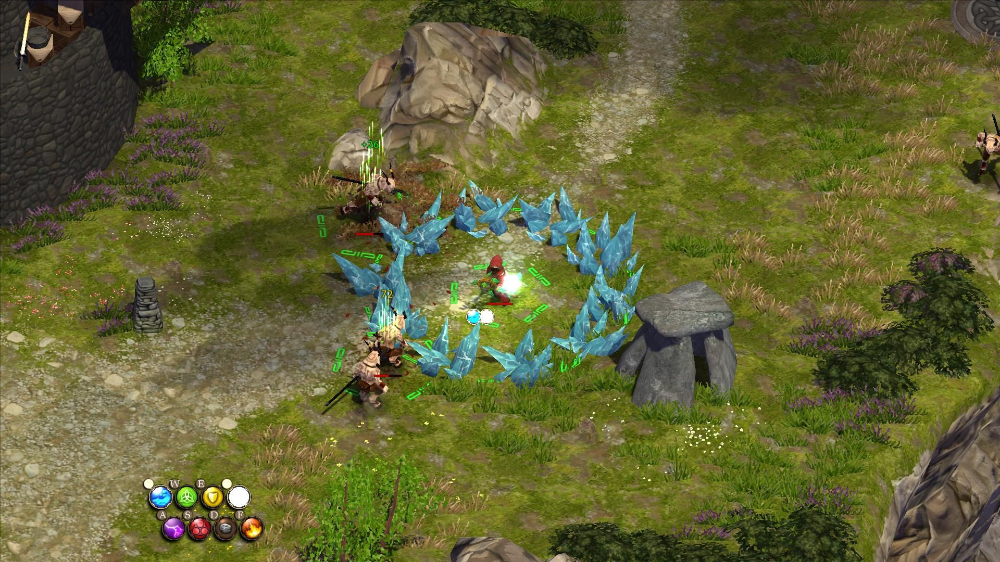

The week in .NET - On .NET on Docker and new Core tooling, Benchmark.NET, Magicka
=================================================================================

Previous posts:
* [On .NET on public speaking, ndepend, CrazyCore, The Perils of Man](https://blogs.msdn.microsoft.com/dotnet/2017/01/31/the-week-in-net-on-net-on-public-speaking-ndepend-crazycore-the-perils-of-man/).
* [On .NET with David Pine, PwdLess, Terraria](https://blogs.msdn.microsoft.com/dotnet/2017/01/18/the-week-in-net-on-net-with-david-pine-pwdless-terraria/).
* [On .NET with Reed Copsey, Jr., Orchard Harvest, Ammy, Concurrency Visualizer, Eco](https://blogs.msdn.microsoft.com/dotnet/2017/01/10/the-week-in-net-on-net-with-reed-copsey-jr-orchard-harvest-ammy-concurrency-visualizer-eco/)

On .NET
-------

Last week, we recorded the show twice. Apologies to those of you who watched live: the sound was badly calibrated, and the demos did not go well. As a consequence, we did [a second recording, which is now on Channel 9](https://channel9.msdn.com/Shows/On-NET/Docker-New-NET-Core-tooling). In this episode, we're running ASP.NET in a Docker image, and we look at some of the changes in the .NET Core .csproj tooling.

<iframe src="https://channel9.msdn.com/Shows/On-NET/Docker-New-NET-Core-tooling/player" width="960" height="540" allowFullScreen frameBorder="0"></iframe>

This week, we'll have [Phil Haack](https://twitter.com/haacked) on the show. Phil works for [GitHub](https://github.com/), and before that was the Program Manager for ASP.NET MVC. We'll stream live [on Channel 9](https://channel9.msdn.com/Shows/On-NET). We'll take questions on [Gitter's dotnet/home channel](https://gitter.im/dotnet/home) and on Twitter. Please use the `#onnet` tag. It's OK to start sending us questions in advance if you can't do it live during the shows.

We'll also record a couple of additional surprise interviews in preparation for the celebration of the 15th anniversary of .NET, and the 20th anniversary of Visual Studio. Stay tuned!

Package of the week: Benchmark.NET
----------------------------------

When done properly, benchmarking is a great way to guide your engineering choices by comparing multiple solutions to a problem known to cause performance bottlenecks in your applications. There's a lot of methodology involved if you want to do it right, however, that is both tricky and repetitive. And no, surrounding your code with a `StopWatch` won't cut it.

Benchmark.NET makes it very easy to decorate the code that you want to test so it can be discovered, run many times, and measured. Benchmark.NET takes care of warmup and cooldown periods as needed, and will compute mean running times and standard deviation for you. It can also generate reports in a variety of formats.

```csharp
[Benchmark(Description = "ImageSharp Resize")]
public ImageSharpSize ResizeImageSharp()
{
    ImageSharpImage image = new ImageSharpImage(Width, Height);
    image.Resize(ResizedWidth, ResizedHeight);
    return new ImageSharpSize(ResizedWidth, ResizedHeight);
}
```

Game of the week: Magicka
-------------------------

[Magicka](http://arrowheadgamestudios.com/games/magicka/) is an action-adventure game set in a world based on Norse mythology. Take on the role of a wizard from a sacred order while you embark on a quest to stop an evil sorcerer who has thrown the world into turmoil. Magicka features a dynamic spell casting system that has you combining the elements to cast spells. You can also play with up to three of your friends in co-op and versus modes. 



[Magicka](http://arrowheadgamestudios.com/games/magicka/) was created by [Arrowhead Game Studios](http://arrowheadgamestudios.com/) using [C#](https://channel9.msdn.com/Series/C-Sharp-Fundamentals-Development-for-Absolute-Beginners) and XNA. It is available for Windows on [Steam](http://store.steampowered.com/app/42910/).

User group meeting of the week: C# 7 with Jon Skeet in Adelaide
---------------------------------------------------------------

If you're around Adelaide on Wednesday, February 8, don't miss the [Adelaide .NET User Group](https://www.meetup.com/Adelaide-dotNET/)'s [meetup with Jon Skeet on C# 7](https://www.meetup.com/Adelaide-dotNET/events/236985545/). Jon Skeet is none other than [the #1 member on StackOverflow](http://stackoverflow.com/users/22656/jon-skeet), and an absolute authority on C#.

.NET
----

* [The .NET language strategy](https://blogs.msdn.microsoft.com/dotnet/2017/02/01/the-net-language-strategy/) by Mads Torgersen.
* [Digging deeper into the Visual Basic language strategy](https://blogs.msdn.microsoft.com/vbteam/2017/02/01/digging-deeper-into-the-visual-basic-language-strategy/) by Anthony D. Green.
* [NuGet: introducing scoped API keys](http://blog.nuget.org/20170202/introducing-scoped-api-keys.html) by Anand Gaurav.
* [How do .NET delegates work?](http://mattwarren.org/2017/01/25/How-do-.NET-delegates-work/) by Matt Warren.
* [Application Insights telemetry processors](https://blog.maartenballiauw.be/post/2017/01/31/application-insights-telemetry-processors.html) by Maarten Balliauw.
* [Dissecting the new() constraint in C#: a perfect example of a leaky abstraction](https://blogs.msdn.microsoft.com/seteplia/2017/02/01/dissecting-the-new-constraint-in-c-a-perfect-example-of-a-leaky-abstraction/) by Sergey Teplyakov.
* [Pattern matching in C# 7.0 case blocks](https://visualstudiomagazine.com/articles/2017/02/01/pattern-matching.aspx) by Tim Patrick.
* [Tackling tuples: understanding the new C# 7 value type](http://our.componentone.com/2017/01/30/tackling-tuples-understanding-the-new-c-7-value-type/) by Christian Gaetano.
* [C# 7.0 out vars and ref returns](https://csharp.christiannagel.com/2017/02/01/refreturns/) by Christian Nagel.
* [Dependency injection, logging and configuration in a .NET Core console application](http://pioneercode.com/post/dependency-injection-logging-and-configuration-in-a-dot-net-core-console-app?platform=hootsuite) by Chad Ramos.
* [Stratis Bitcoin Full Node Daemon Alpha released](https://cointelegraph.com/press-releases/stratis-bitcoin-full-node-daemon-alpha-released) by Cointelegraph.
* [Building DockNetFiddle using Docker and .NET Core](http://www.dotnetcurry.com/windows-azure/1339/docknetfiddle-using-docker-dotnet-core) by Daniel Jimenez Garcia.
* [Cross-Platform DevOps for .NET Core](http://rehansaeed.com/cross-platform-devops-net-core/) by Muhammad Rehan Saeed.
* [Serverless C# on AWS Lambda (part 1)](http://thingrepository.com/2017/02/05/Serverless-C-on-AWS-Lambda-pt-1/) by Ryan Stelly.
* [Using Docker env vars in .NET Core](http://cmelendeztech.com/posts/2017/02/using-docker-env-vars-in-dotnet-core.html) by Christian Melendez.
* [.Net Core, Roslyn and Code Generation](https://carlos.mendible.com/2017/01/29/net-core-roslyn-and-code-generation/) by Carlos Mendible.
* [Visualising my heart rate on stage using a Hue lamp and a heart rate sensor and .NET](http://danielwertheim.se/visualising-my-heart-rate-on-stage-using-a-hue-lamp-and-a-heart-rate-sensor-and-net/) by Daniel Wertheim.
* [Refactoring towards resilience: evaluating Stripe](https://jimmybogard.com/refactoring-towards-resilience-evaluating-stripe-options/) and [SendGrid options](https://jimmybogard.com/refactoring-towards-resilience-evaluating-sendgrid-options/) by Jimmy Bogard.
* [.NET Core on ARM](https://stevedesmond.ca/blog/net-core-on-arm) by Steve Desmond.
* [C# IL Viewer for Visual Studio Code using Roslyn side project](http://josephwoodward.co.uk/2017/01/c-sharp-il-viewer-vs-code-using-roslyn) by Joseph Woodward.

ASP.NET
-------

* [Logging using DiagnosticSource in ASP.NET Core](https://andrewlock.net/logging-using-diagnosticsource-in-asp-net-core/) by Andrew Lock.
* [Send form input via an Angular 2 component to ASP.NET Core Web API](https://jonhilton.net/2017/02/01/send-form-input-via-an-angular-2-component-to-asp-net-core-web-api/) by Jon Hilton.
* [Middleware vs. filters (video)](https://aspnetmonsters.com/2017/01/monsters-weekly/ep91/) and [Saving CPU cycles with static resource hashes](https://aspnetmonsters.com/2017/01/monsters-weekly/ep92/) by the ASP.NET Monsters.
* [Using the ASP.NET Core Script TagHelper to polyfill the latest JavaScript features](https://scottsauber.com/2017/01/30/using-the-asp-net-core-script-taghelper-to-polyfill-the-latest-javascript-features/) by Scott Sauber.

F#
--

* [Type driven domain modelling, part 1: types and property testing](http://lucasmreis.github.io/blog/type-driven-domain-modelling-part-1/) and [part 2: evolving models with F#](http://lucasmreis.github.io/blog/type-driven-domain-modelling-part-2/) by Lucas Reis.
* [F# Historical Acknowledgements](http://research.microsoft.com/en-us/um/cambridge/projects/fsharp/ack.aspx)
* [Railway Oriented Programming (Functional approach to error-handling](https://jbrestan.github.io/FSharpingROP/#/), by Honza Brestan
* [Dependency Rejection](http://blog.ploeh.dk/2017/02/02/dependency-rejection/), by Mark Seemann
* [Using R in Excel with NeXL Connector and F# RProvider ](https://statfactory.wordpress.com/2017/01/31/using-r-in-excel-with-nexl-connector-and-f-rprovider/), by Adam Mlocek
* [Higher Kindended Types in F# – The Introduction](https://robkuz.github.io/Higher-kinded-types-in-fsharp-Intro-Part-I/), by Robert Kuzelj

Check out [F# Weekly](https://sergeytihon.wordpress.com/category/f-weekly/) for more great content from the F# community.

Xamarin
-------

* [Xamarin Stable Release: Cycle 8 Service Release 2 Xamarin Studio Refresh](https://releases.xamarin.com/stable-release-cycle-8-service-release-2-refresh/) by Bri Brothers.
* [Xamarin Beta Release: Cycle 9 RC Refresh Builds](https://releases.xamarin.com/beta-release-cycle-9-rc-refresh-builds3/) by Bri Brothers.
* [Enhanced device logging in Visual Studio](https://blog.xamarin.com/enhanced-device-logging-in-visual-studio/) by James Montemagno.
* [Native Facebook authentication with Azure App Service](https://blog.xamarin.com/native-facebook-authentication-with-azure-app-service/) by Mike James.
* [#DocumentDB loves Xamarin: planet scale mobile app in five steps](https://blog.xamarin.com/documentdb-loves-xamarin-planet-scale-mobile-app-in-five-steps/) by Kirill Gavrylyuk.
* [Tips for creating a smooth and fluid Android UI](https://blog.xamarin.com/tips-for-creating-a-smooth-and-fluid-android-ui/) by Jon Douglas.
* [Round launcher icons in Android 7.1](https://blog.xamarin.com/round-launcher-icons-in-android-7-1/) by James Montemagno.
* [Samsung releases new preview of Visual Studio Tools for Tizen](https://blog.xamarin.com/samsung-releases-new-preview-of-visual-studio-tools-for-tizen/) by Samsung Tizen Team.
* [Fall in love with Xamarin at an event near you this February](https://blog.xamarin.com/fall-in-love-with-xamarin-at-an-event-near-you-this-february/) by Jayme Singleton.
* [Integrating in-app purchases in mobile apps](https://blog.xamarin.com/integrating-in-app-purchases-in-mobile-apps/) by James Montemagno.
* [New HockeySDK releases for Xamarin and Unity](https://www.hockeyapp.net/blog/2017/01/23/HockeySDK-Xamarin-4-1-1.html) by HockeyApp Team.
* [The Xamarin Show 14: DocumentDB with Kirill Gavrylyuk](https://channel9.msdn.com/Shows/XamarinShow/The-Xamarin-Show-14-DocumentDB-with-Kirill-Gavrylyuk) & [The Xamarin Show Snack Pack 8: visualizing XAML with the Xamarin.Forms previewer](https://channel9.msdn.com/Shows/XamarinShow/Snack-Pack-8-Visualizing-XAML-with-the-XamarinForms-Previewer) by James Montemagno.
* [WebView rendering engine configuration](https://xamarinhelp.com/webview-rendering-engine-configuration/), [Xamarin Forms profiling](https://xamarinhelp.com/xamarin-forms-profiling/), [Tracking memory leaks in Xamarin with the profiler](https://xamarinhelp.com/tracking-memory-leaks-xamarin-profiler/), & [Using Xamarin Inspector with your live apps](https://xamarinhelp.com/xamarin-inspector-live-apps/) by Adam Pedley.
* [The underestimated power of color in mobile app design](https://www.smashingmagazine.com/2017/01/underestimated-power-color-mobile-app-design/) by Nick Babich.
* [New Xamarin.Forms item templates!](http://motzcod.es/post/156373777552/new-xamarin-forms-item-templates) by James Montemagno.
* [Creating a reusable styles assembly for Xamarin.Forms](http://jmillerdev.net/creating-a-xamarin-forms-theme-assembly/) by John Miller.
* [Supporting Xamarin.Forms tabbed page in Caliburn.Micro](http://compiledexperience.com/blog/posts/tabbed-page-conductor) by Nigel Sampson.
* [Unable to connect or debug to Visual Studio Android Emulator with Visual Studio 2017 RC](http://nicksnettravels.builttoroam.com/post/2017/01/29/Unable-to-Connect-or-Debug-to-Visual-Studio-Android-Emulator-with-Visual-Studio-2017-RC.aspx) by Nick Randolph.
* [Visual Studio Emulator for Android](http://davidyardy.com/archive/visual-studio-emulator-for-android/) by David Yardy.

Azure
-----

* [Event Hubs .NET Standard client is now generally available](https://azure.microsoft.com/en-us/blog/event-hubs-dotnet-standard-client-reaches-ga/) by	John Taubensee.
* [Creating documents in DocumentDB with Azure Functions HTTP API](https://shellmonger.com/2017/02/02/creating-documents-in-documentdb-with-azure-functions-http-api/) and [Updating documents in DocumentDb](https://shellmonger.com/2017/02/02/updating-documents-in-documentdb/) by Adrian Hall.
* [Building Azure Functions: part 1 - creating and binding](http://geekswithblogs.net/tmurphy/archive/2017/01/31/building-azure-functions-part-1ndashcreating-and-binding.aspx), [part 2 - settings and references](http://geekswithblogs.net/tmurphy/archive/2017/02/01/building-azure-functions-part-2ndashsettings-and-references.aspx), and [part 3 – coding concerns](http://geekswithblogs.net/tmurphy/archive/2017/02/02/building-azure-functions-part-3-ndash-coding-concerns.aspx) by Tim Murphy.
* [Create a memory dump for your slow performing Web App](https://blogs.msdn.microsoft.com/benjaminperkins/2017/02/01/create-a-memory-dump-for-your-slow-performing-web-app/) by Benjamin Perkins.

UWP
---

* [Adding UWP features to your existing PC software](https://blogs.windows.com/buildingapps/2017/02/01/adding-uwp-features-existing-pc-software/) by Stefan Wick.
* [How to use Surface Dial with WPF applications](https://blogs.msdn.microsoft.com/mvpawardprogram/2017/01/31/surface-dial-with-wpf/) by Ricardo Pons.
* [VisualStateManager pitfalls]() by Martin Zikmund.
* [Primary Live Tile API – Windows 10](https://blogs.msdn.microsoft.com/tiles_and_toasts/2017/02/01/primary-live-tile-api-windows-10/) by Andrew Bares.
* [Progress UI and data binding inside toast notifications – Windows 10 Creators Update](https://blogs.msdn.microsoft.com/tiles_and_toasts/2017/02/01/progress-ui-and-data-binding-inside-toast-notifications-windows-10-creators-update/) by leixu2046.

Games
-----

* [.GAME's item system – part 1 challenge explained](https://blogs.msdn.microsoft.com/dotnet/2017/02/03/games-item-system-part-1-challenge-explained/) by Stacey Haffner.
* [Inventory and store system - part 2 (scriptable objects)](https://channel9.msdn.com/Shows/dotGAME/Inventory-and-Store-System-Part-2-Scriptable-Objects) by Stacey Haffner.
* [Against the burning hells: Diablo III's road to redemption with Reaper of Souls](https://youtu.be/bajI1oGPhog) by GDC.
* [[Unity 5] tutorial: how to create a split screen](https://youtu.be/yt867hlKD30) by Gamad.
* [Real Time Strategy in Unity - unit selection GUI](https://youtu.be/MXTTEh0hhGk) by Unit02Games.

And this is it for this week!

Contribute to the week in .NET
------------------------------

As always, this weekly post couldn't exist without community contributions, and I'd like to thank all those who sent links and tips. The F# section is provided by [Phillip Carter](https://twitter.com/_cartermp), the gaming section by [Stacey Haffner](https://twitter.com/yecats131), and the Xamarin section by [Dan Rigby](https://twitter.com/DanRigby), and the UWP section by [Michael Crump](http://twitter.com/mbcrump).

You can participate too. Did you write a great blog post, or just read one? Do you want everyone to know about an amazing new contribution or a useful library? Did you make or play a great game built on .NET?
We'd love to hear from you, and feature your contributions on future posts:

* Send an email to beleroy at Microsoft,
* [comment on this gist](https://gist.github.com/bleroy/284fecd0d36444e6a57d0dd4aa9e8272)
* Leave us a pointer in the comments section below.
* [Send Stacey (@yecats131) tips on Twitter about .NET games](https://twitter.com/yecats131).

This week's post (and future posts) also contains news I first read on [The ASP.NET Community Standup](https://blogs.msdn.microsoft.com/webdev/tag/communitystandup/), on [Weekly Xamarin](http://weeklyxamarin.com/), on [F# weekly](https://sergeytihon.wordpress.com/category/f-weekly/), and on [Chris Alcock's The Morning Brew](http://themorningbrew.net/).
