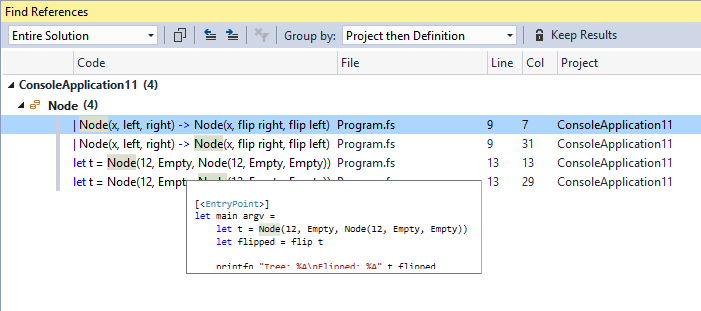
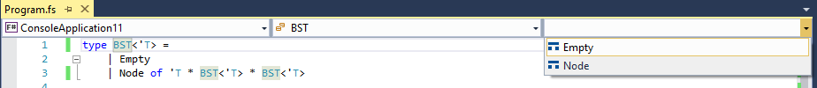
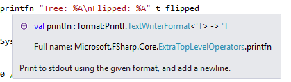
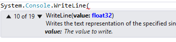
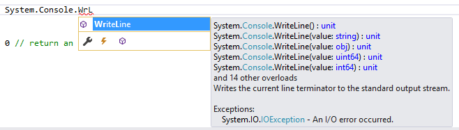
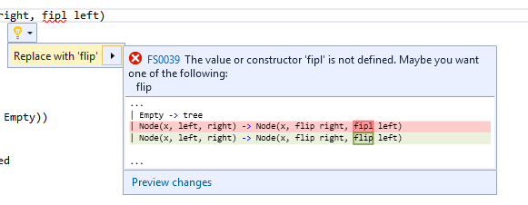
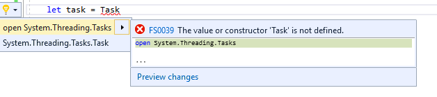
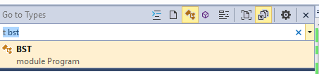

# Announcing F# 4.1 and the Visual F# Tools for Visual Studio 2017

Last year, we announced F# 4.1 via a [Peek in F# 4.1](https://blogs.msdn.microsoft.com/dotnet/2016/07/25/a-peek-into-f-4-1/).  As a recap, we mentioned:

* Alpha support for .NET Core and .NET Standard
* Language features for F# 4.1
* A big update to the Visual F# tools for Visual Studio 2017 (called Visual Studio "15" at the time)

We're tremendously excited to share updates in those areas.

## .NET Core and .NET Standard Support for F# 4.1

Corresponding with the release of Visual Studio 2017 is preview support for using F# on .NET Core 1.0-1.1 and .NET Standard 1.6.  Although this is in preview, certain pieces are RC-quality.  Specifically, the following are in RC:

* FSharp.Core as a .NET Standard NuGet package
* The F# compiler running on .NET Core as a .NET Core console application
* F# support in the .NET CLI and the .NET Core SDK

However, the following are not supported at this time, but will be supported in a future Visual Studio 2017 update:

* F# support for .NET Core Visual Studio tooling
* F# Interactive (FSI) running on .NET Core as a .NET Core console application

That means you can create an F# application on .NET Core via `dotnet new` in the .NET CLI, have it run on all platforms, and create NuGet packages based on .NET Standard 1.6 with F# today.  Doing so is quite easy:

1. Install .NET Core either through Visual Studio 2017 (Windows) or your the [platform installer for your OS](dot.net/core).
2. Create a new folder with a meaningful name.
3. Open a command line in that folder and invoke `dotnet new`.

    ```dotnet new console -lang f#```

4. Use `dotnet run` to compile and run your application.

    ```dotnet run```

5. Use `dotnet publish` to create a publish directory with your app and its dependencies.

    ```dotnet publish -o pubish-directory```

6. You can run the published `.dll` file with the `dotnet` command:

    ```dotnet path-to-dll/MyApp.dll```

There are two important things to note about using F# on .NET Core today:

1. Type Providers and fully-fledged Code Quotation compilers are not supported.
2. Excluding (1), all other F# code runs on .NET Core 1.1 on all platforms.

.NET Core and .NET Standard are both moving towards a 2.0 release scheduled for later this year.  The most significant aspect of this is bringing back the large amount of APIs which were not available in 1.0, along with reverting breaking changes to certain APIs such as Reflection.  This will unblock support for Type Providers and Code Quotations, but there is still an open question about `System.Reflection.Emit`.  This is needed to support *Generative* Type Providers and fully-fledged Code Quotation evaluators/compilers.

We are also aiming to land full FSI support and Visual Studio tooling support for F# on .NET Core in the .NET Standard/.NET Core 2.0 time frame.

To learn more about Type Provider support, see [this issue](https://github.com/Microsoft/visualfsharp/issues/1496).  To learn more about FSI on .NET Core, see [this RFC](https://github.com/fsharp/fslang-design/pull/166).  To track F# support on the Roslyn Project System, see [this Pull Request](https://github.com/dotnet/roslyn-project-system/pull/1670).

Lastly, we would like to extend a very special thanks to [Enrico Sada](https://github.com/enricosada) for building out support for F# in the .NET CLI and .NET Core SDK since the early days of .NET Core.  This support was built entirely by [Enrico and other members of the F# community](https://github.com/dotnet/netcorecli-fsc/graphs/contributors) in partnership with Microsoft, which is a testament to how incredible the F# OSS community is.

## F# 4.1 is Released

In the [previous F# 4.1 blog post](https://blogs.msdn.microsoft.com/dotnet/2016/07/25/a-peek-into-f-4-1/), we described and provided examples out all of the language features shipping in F# 4.1.  We're really excited about F# 4.1 because in addition to being driven by a community RFC process, F# 4.1 had many community contributions.  To recap, here are those features:

* Struct tuples which inter-operate with C# tuples
* Struct annotations for Records (by [Will Smith](https://github.com/tihan)
* Struct annotations for Single-case Discriminated Unions
* `fixed` keyword support
* Underscores in numeric literals (by [Avi Avni](https://github.com/AviAvni))
* Caller info argument attributes (by [Lincoln Atkinson](https://github.com/latkin) and [Avi Avni](https://github.com/AviAvni))
* Result type and some basic Result functions (by [Oskar Gewalli](https://github.com/wallymathieu))
* Mutually referential types and modules within the same file
* Implicit "Module" syntax on modules which share the same name as a type
* Byref returns, which support consuming C# ref-returning methods
* Error message improvements (by [Steffen Forkmann](https://github.com/forki), [Isaac Abraham](https://github.com/isaacabraham), [Libo Zeng](https://github.com/liboz), [Gauthier Segay](https://github.com/smoothdeveloper), [Richard Minerich](https://github.com/Rickasaurus), and others)

Since then, the following have also shipped with F# 4.1:

* Implement `IReadonlyCollection<'T>` in `list<'T>` (by [Libo Zeng](https://github.com/liboz))
* `Optional` and `DefaultParameterValue` attribute support (by [Kurt Schelfthout](https://github.com/kurtschelfthout))
* Additional `Option` module functions (by [Marcus Griep](https://github.com/neoeinstein))
* Statically Resolved Type Parameter improvements (Microsoft and [Gustavo Leon](https://github.com/gmpl))
* Compiler performance improvements (by [Gustavo Leon](https://github.com/gmpl), [Steffen Forkmann](https://github.com/forki), [Libo Zeng](https://github.com/liboz), and more)
* Struct annotations for multi-case Discriminated Unions

Here are some examples of those features:

### `IReadonlyCollection<'T>` Implemented in `list<'T>`

This is a very straightforward feature: F# lists now implement [`IReadonlyCollection<'T>`](https://msdn.microsoft.com/library/hh881542).

### `Optional` and `DefaultParameterValue` Attribute Support

The `Optional` and `DefaultParameterValue` attributes are used in F# for C#/VB interop so that C#/VB callers can see arguments as optional.  Prior to F# 4.1, the F# compiler did not compile `DefaultParameterValue` correctly.  Additionally, F# was unable to consume arguments defined in F# assemblies with the `Optional` attribute.  These are now possible with F# 4.1.  Here's an example:

```fsharp
type FoodPrinter() =
    member __.Message([<Optional; DefaultParameterValue("bananas")>] s) =
        printfn "I'm eating %s!" s // If 's' isn't specified, prints "I'm eating bananas!
```

### Additional `Option` Module Functions

New functions were added to the `Option` module in F# 4.1, providing a few different utilities.

Variations on providing default values in the case of `None`:

```fsharp
val defaultValue: 'a -> 'a option -> 'a
val defaultWith: (unit -> 'a) -> 'a option -> 'a
val orElse: 'a option -> 'a option -> 'a option
val orElseWith: (unit -> 'a option) -> 'a option -> 'a option
```

Overloads for `Option.map`:

```fsharp
val map2: ('a -> 'b -> 'c) -> 'a option -> 'b option -> 'c option
val map3: ('a -> 'b -> 'c -> 'd) -> 'a option -> 'b option -> 'c option -> 'd option
```

A test if an Option contains a value:

```fsharp
val contains: 'a -> 'a option -> bool
```

Flattening a nested option:

```fsharp
val flatten: 'a option option -> 'a option
```

### Statically Resolved Type Parameter Improvements

Performance improvements and two major bug fixes for Statically Resolved Type Parameters (SRTP) were introduced.  Prior to F# 4.1, there was a case where some usages of SRTP were capable of compiling, but shouldn't have been.  Additionally, it was possible to infer type names in SRTP syntax, but not actually specify the type name.

### Compiler Performance, FSharp.Core Performance, and Error Message Improvements

Lastly, the community involvement for compiler performance, FSharp.Core performance, and [Error Message improvements](https://github.com/Microsoft/visualfsharp/issues/1103) kept going since the initial F# 4.1 post.  For example, improvements in predictions were made:

```fsharp
let firstName = "Phillip"
let lastName = "Carter"

printfn "I'm %s %s" firstName Lasntame // Note the misspelling.
// Error message:
// The value or constructor 'Lasntame' is not defined.  Maybe you want one of the following:
//     lastName
```

This effort by the community, particularly in predicting correct names for things, is crucial for F# adoption.  We're extremely excited this for F# 4.1 and look forward to future improvements.  We're incredibly thankful for the efforts of the F# community here.

### Struct Single-case Discriminated Unions

Annotating single-case Discriminated Unions is fully supported and stable with F# 4.1.  Here's an example:

```fsharp
[<Struct>]
type Email = Email of string
[<Struct>]
type Name = Name of string
```

This allows you to do the same kind of typesafe domain modeling with Discriminated Unions you've done in the past, but this time with structs rather than reference types as the backing data type.

### Struct Multicase Discriminated Unions

Annotating multi-case Discriminated Unions as structs is now also supported, with the following design caveats:

* Each case must have a unique name
* The type cannot be recursively defined

**This feature is currently buggy and should not be used in production code.**  You can track the progress with [this issue](https://github.com/Microsoft/visualfsharp/issues/2463).

### Using F# 4.1

You can use F# 4.1 with the following tools:

* .NET Core and the .NET CLI
* Visual Studio 2017
* Visual Studio for Mac
* Visual Studio Code with the [Ionide](https://marketplace.visualstudio.com/items?itemName=Ionide.Ionide-fsharp) plugin suite

If you're interested in the design of the features in F# 4.1, you can see [each RFC for F# 4.1 here](https://github.com/fsharp/fslang-design/tree/master/FSharp-4.1).

## Updates to the Visual F# Tools in Visual Studio 2017

Visual Studio 2017 ships with significant changes in the Visual F# Tools.  We're excited to share what's new and what to look forward to.

### What's New

In short, the Visual F# Tools now use Roslyn Workspaces, which is the same IDE infrastructure that C# and Visual Basic use.  This has enabled the F# community to provide many new features, leading to a much better UI experience that is closer in parity to C# and Visual Basic.  Many of these features were ported over from the [Visual F# Power Tools](https://marketplace.visualstudio.com/items?itemName=FSharpSoftwareFoundation.VisualFPowerTools) (VFPT for short), and are now "in-box".  They include:

* Find All References



* Navigation Bar Support



* Syntax and Type Colorization in Hovers and Signature Help
* IntelliSense Filters and Glyph Improvements
* Fuzzy matching on names in IntelliSense






 

* Better colorization in the editor
* Code Indentation Improvements
* Breakpoint Resolution Improvements
* Go to Definition Improvements
* The ability to trigger Lightbulbs for various code fixes





* Semantic highlighting of tokens
* Support in the new "Go to All" feature (ctrl+T)



* Roslyn-style Inline Rename
* Many more improvements to other features

**Note:** Inline Rename is temporarily disabled due to a last-minute bug which caused the IDE to crash.  The fix has already been completed and the feature will work in a future VS 2017 update.

To see the full list of features added, see the F# section of the [Visual Studio 2017 Release Notes](https://www.visualstudio.com/en-us/news/releasenotes/vs2017-relnotes#a-idfsharp-a-f).  As you can see, there were a tremendous amount of fixes and new features added by the community.  This is new for the Visual F# Tools, and something we hope to see more of in the future.

### Known Issues

There are a number of known issues which are either already fixed and pending a release, or are on the immediate roadmap for getting fixed.  You can see this list [here](https://github.com/Microsoft/visualfsharp/milestone/9).  Our highest priority is to address these issues.  Items which are closed have already been completed.

See [VS 2017 Status and Roadmap for F# and the Visual F# Tools](https://github.com/Microsoft/visualfsharp/issues/2400) for more context on what we have planned.

### Model for Updates

Because of the rapid nature with which the Visual F# Tools are evolving, we are introducing a new model for releases of the Visual F# Tools:

Stable and thoroughly tested bits will ship in-box with Visual Studio 2017.  Updates here will correlate with updates to Visual Studio 2017 itself.

There will be nightly, signed VSIXs for those who wish to try out the latest advancements in tooling.  Think of these as builds of [the latest master branch](https://github.com/Microsoft/visualfsharp/commits/master) for Visual F#, signed so that you don't have to do anything crazy to get them working correctly on your machine.  These will not be as well-tested as those which will update alongside Visual Studio 2017.

The first of these "nightly" builds is available right now.  We highly encourage trying it out, because this nightly in particular addresses multiple known issues.

### Historical Context

Prior to Visual Studio 2017, tooling for F# effectively lived in its own universe.  Over time, especially with the release of Visual Studio 2015 and Roslyn, this has had a cost on the number of features available "in-box".  The VFPT filled some gaps when compared to C# tooling features, but not everybody used the extension, and as the UI for C# and Visual Basic evolved, F# tooling was not able to take advantage of those UI advancements.  Additionally, adding and improving features in the Visual F# tools or VFPT required knowledge of various Visual Studio SDK APIs.  The barrier to entry for open source developers to add value was very high.

Late last year, we "flipped the switch" on our work to sit the F# language service atop Roslyn Workspaces.  As a result, we introduced a vast number of bugs and regressions.  The F# community worked tirelessly to address those issues, and along the way, added a significant amount of new features and improvements to existing features.

The work also hasn't stopped, nor has it slowed.  The F# community has been relentlessly adding more features and improvements to existing features at a pace that has been almost impossible to keep up with.  We're extremely excited about this release, and even more so about forthcoming updates which will address multiple regressions, make vast memory usage improvements, and introduce even more new features.  The Visual F# Tools are evolving at a pace that they have never evolved before, all thanks to the amazing F# community.

## A Thank You to the F# Community

Many people from across the F# community have contributed to F# 4.1 and the Visual F# Tools for Visual Studio 2017. We acknowledge all of them and extend our warmest thanks to them and their immense efforts in making F# so amazing.

The focus of this post is on F# 4.1 and the Visual F# Tools for Visual Studio 2017.  These are but part of the overall F# ecosystem, which includes components such as FSharp.Data, Ionide, the Xamarin tooling for F#, and hundreds of F# community libraries and tools.  While it is difficult to thank everyone by name, we would like to mention some specific individuals who have made many contributions to the F# 4.1 language design and the Visual F# Tools. Please note this doesn’t include contributions to the other components in the F# ecosystem.  We have also inevitably forgotten some specific people, and please feel free mention them with a thank you in the comments below, or by linking to your favorite pull requests and comments.

[Steffen Forkman](https://github.com/forki) has contributed over 100 Pull Requests in the past year, spearheading the improvements to F# 4.1 error message improvements.  He has improved compiler performance, cleaned up code, increased our test coverage, and added Lightbulb suggests in Visual Studio 2017.  Moreover, he's been a leader in the F# open source community, leading development for tools like FAKE and Paket to create a fantastic open source ecosystem.  To those who know him, it should be no surprise that he's been such a prolific contributor.

[Vasily Kirichenko](https://github.com/vasily-kirichenko) has contributed the majority of new features in the Visual Studio 2017 tools.  Just a casual glance at the open Pull Requsts in the VisualFSharp repository will make it clear that Vasily is a truly special person in the F# community.  He continues to implement entire features end-to-end, diving deep into the codebase to improve complex and incredibly difficult code.  Frankly, we're lucky to have him as a part of the F# community.

[Enrico Sada](https://github.com/enricosada) is another prolific contributor who, as previously mentioned, created the .NET Core SDK bindings and .NET CLI support for F#.  He has partnered with us and with the teams who own those areas to succeed there.  But that's not all.  He made many significant contributions on multiple occasions to improve our test suite and CI system, which is the kind of important work that few people are willing to do.  And of course, anyone who works with him knows that he's one of the kindest individuals on the planet.

[Ahn-Dung Phan](https://github.com/dungpa) has been an F# developer and active tooling and open source developer for a long time.  As the original author of the Visual F# Power Tools extension (VFPT), he is incredibly knowledgeable about F# tooling in Visual Studio.  As the Visual F# Tools moved from RC to RTW, he fixed endless bugs and ported over features from VFPT, including improving those features in the process.  One such feature which is particularly involved in the Implement Interface analyzer and code fix, which any .NET developer knows is incredibly useful when working with interfaces.  We're incredibly happy to have accepted his many contributions.

[Libo Zeng](https://github.com/liboz) has been quite active in improving the F# compiler codebase.  Libo has worked with the community in compiler error message improvements, and he has contributed multiple performance improvements to FSharp.Core and the F# compiler.  Libo's Pull Requests for performance improvements are always backed with benchmark results, making it obvious and easy to take his changes.

[Avi Avni](https://github.com/aviavni) is an active member of the F# community and mentor through the F# Software Foundation's mentorship program.  He also contributed the Underscores in Numeric Literals feature for F# 4.1 end-to-end.  For anyone who has attempted to contribute compiler features, you will know that this is no small task.  He also worked with Lincoln Atkinson to implement Caller Info Argument Attributes in F# 4.1.  He has also been working on an even bigger feature to recognize when a recursive function is not tail-recursive, which may end up in F# 4.2.  This advanced feature will surely take time to get right, but we're excited that he's so involved here, and we look forward to what can be done in the future.

[Will Smith](https://github.com/tihan) is another active member of the F# community who contributed the Struct Records features for F# 4.1 in its entirety.  Will technically works for Microsoft now, but he contributed the feature as an F# community member in his own time.  He is an incredibly kind, intelligent, and helpful member of the F# community and demonstrated amazing patience as his language feature was getting rounds of feedback from us over a long period of time.  We're super happy to have his contributions, and we're sure the greater F# community is as well.

[Kurt Schelfthout](https://github.com/kurtschelfthout), as mentioned above, also implemented an F# 4.1 language feature from end-to-end.  He has also been active in F# language design and managing the F# Language Suggestions and F# Language RFC repositories.

[Chet Husk](https://github.com/baronfel/) has been active in F# language evolution and performed the large majority of work in moving F# Language Suggestions from UserVoice over to GitHub.  This is a someone lengthy process, but because of his work, all of F# evolution is now done on GitHub.

[Saul Rennison](https://github.com/saul) began contributing to the Visual F# Tools not too long ago, but his contributions have already had an impact.  In addition to being active in code reviews and reporting issues, he contributed multiple fixes to the F# project system and MSBuild integration.  He also contributed type colorization for FSI when run as a console app, giving us a taste of what may yet come for F# Interactive.  We're very excited that he's so engaged in the Visual F# Tools.

[Gustavo Leon](https://github.com/gmpl) made contributions deep in the F# compiler, including in the Constraint Solver (an area few dare to venture), to speed up compile times for code which makes heavy use of overload resolution.  His work also improved Statically Resolved Type Parameters, and he was key in identifying tricky bugs there.  He is also active in F# language evolution, contributing his ideas and feedback to F# language suggestions.  His expertise is very much appreciated.

[Jared Hester](https://github.com/cloudroutine) has been a member of the F# OSS community for quite some time, working on the Visual F# Power Tools and Ionide.  In addition to extensive and detailed bug reports for IDE features, he contributed additions to Untyped Parse Tree traversal code which were necessary to implement IDE features.  This kind of work is very difficult and detail-oriented, and we're very grateful to have his contributions.  He's also very active in the F# language evolution process, providing numerous insights and feedback.

[Marcus Griep](https://github.com/neoeinstein) has been one of the more active members of the F# OSS community in getting F# ecosystem support working on .NET Core and .NET Standard.  This is crucial work which helps move us out of a "chicken and egg" situation.  Additionally, he's helped managed to F# Language Design and F# RFC repositories.

[Gauthier Segay](https://github.com/smoothdeveloper) has been very active in the F# ecosystem, both in contributions and creating issues.  There's a good chance that you've seen him commenting on a bug somewhere.  He was a contributor to the Visual F# Power Tools, and we hope to continue to see his enthusiasm for F# and the Visual F# Tools in the future.

Lastly, we would like to thank the [F# Software Foundation](http://fsharp.org) for helping cultivate a growing F# community.  Their [mentorship program](http://fsharp.org/mentorship/) is one of their most exciting offerings in helping people learn F#, and the focus on community growth and empowerment has lead to a surge in new members over the past two years.  We're grateful to partner with such a special organization.