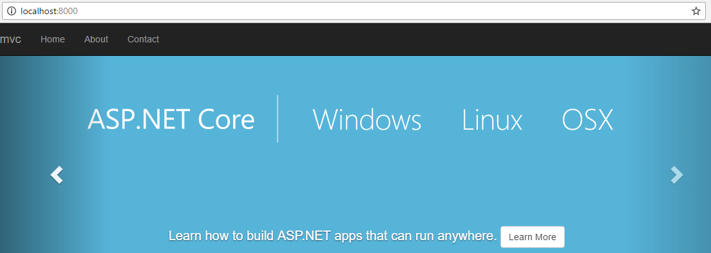
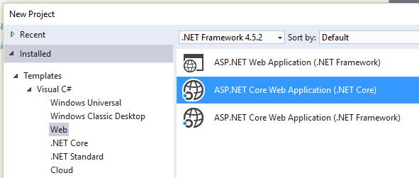
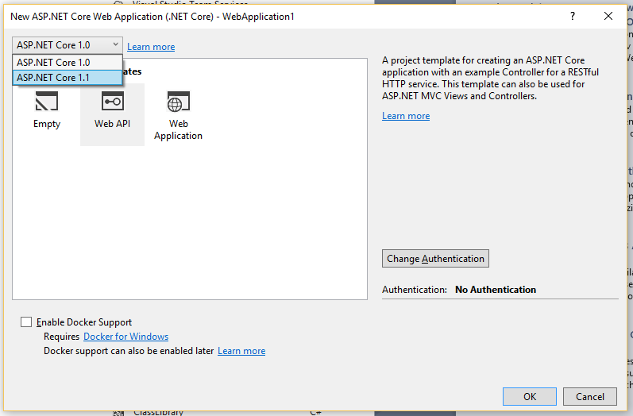
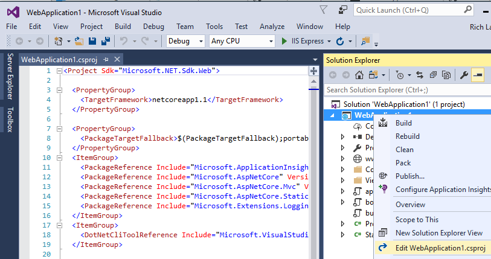
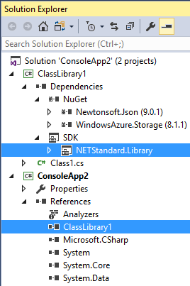

# Announcing .NET Core Tools 1.0

Today, we are releasing .NET Core Tools 1.0. It's an exciting day and an important milestone in the .NET Core journey. The tools are supported on Windows, macOS and Linux. You can use them at the command-line, with VS Code or as part of Visual Studio 2017.

You can download the new .NET Core tools at [.NET Core Downloads](https://www.microsoft.com/net/download/core), for using .NET Core on the command-line. 

The tools are also integrated into [Visual Studio 2017](https://www.visualstudio.com/vs/), also releasing today. You need to select the **.NET Core cross-platform development** workload when you install Visual Studio.

You can read more about the Visual Studio 2017 release in [Announcing Visual Studio 2017 General Availability… and more
](https://blogs.msdn.microsoft.com/visualstudio/2017/03/07/announcing-visual-studio-2017-general-availability-and-more/). Also check out [Visual Studio 2017: Productivity, Performance, and Partners](https://blogs.msdn.microsoft.com/visualstudio/2017/03/07/visual-studio-2017-productivity-performance-and-partners/).

[Visual Studio for Mac](https://blog.xamarin.com/better-apps-visual-studio-2017/) also includes support for .NET Core. Visual Studio for Mac Preview 4 is also releasing today.

[Visual Studio Code](https://code.visualstudio.com) works great with .NET Core, too. The [C# extension](https://marketplace.visualstudio.com/items?itemName=ms-vscode.csharp) is a must-have for .NET Core development, and is typically suggested to you as soon as you open a C# or csproj file. You can also try a more [experimental extension that offers csproj intellisense](https://marketplace.visualstudio.com/items?itemName=MadsKristensen.ProjectFileTools).

New versions of the [.NET Languages](https://blogs.msdn.microsoft.com/dotnet/2017/02/01/the-net-language-strategy/) are included in Visual Studio. You can now use [C# 7] (https://blogs.msdn.microsoft.com/dotnet/2016/08/24/whats-new-in-csharp-7-0/), Visual Basic 15 and F# 4.1. C# 7 is already supported with .NET Core (just by using the latest Roslyn!). We expect F# support in the first half of 2017 and then VB support after that.

[.NET Core 1.0.4](https://github.com/dotnet/core/blob/master/release-notes/1.0/1.0.4.md) and [.NET Core 1.1.1](https://github.com/dotnet/core/blob/master/release-notes/1.1/1.1.1.md) were also released today. Both releases include a set of reliability updates to improve the quality of .NET Core. You can download the [.NET Core Runtime](https://www.microsoft.com/net/download/core#/runtime) releases via our [.NET Core Runtimes download page](https://www.microsoft.com/net/download/core#/runtime). If you are looking for the .NET Core SDK to get the latest tools, try the [.NET Core SDK download page](https://www.microsoft.com/net/download/core#/sdk).

## A Quick Tour of .NET Core

There are some great experiences and features that we've [built over the last several months
](https://blogs.msdn.microsoft.com/dotnet/2017/02/07/announcing-net-core-tools-updates-in-vs-2017-rc/), a big step forward over the tools that were previously available for .NET Core. 

You can take the tour of .NET Core by watching [What's new in .NET Core and Visual Studio 2017](https://channel9.msdn.com/Events/Visual-Studio/Visual-Studio-2017-Launch/T108). It's a great video, showing you a lot of the new .NET Core experience in just 8 minutes.

We are encouraging everyone doing .NET Core development to move to Visual Studio 2017, including [migrating from project.json to csproj](https://docs.microsoft.com/dotnet/articles/core/migration). We will not be supporting csproj and MSBuild for .NET Core in Visual Studio 2015.

Let's take a look at some of the key improvements, starting with the command-line experience, moving to Docker and then into Visual Studio.

### Command-line experience

You can very quickly create and run a .NET Core app on your favorite OS. Let's see what the experience looks like on Windows, creating and launching a .NET Core 1.0 console app. You need the .NET Core SDK installed for this experience.

```console
C:\>dotnet new console -o myapp
The template "Console Application" created successfully.

C:\>cd myapp

C:\myapp>dotnet restore
  Restoring packages for C:\myapp\myapp.csproj...

C:\myapp>dotnet run
Hello World!
```

### Docker experience

You can see a similar command-line experience using Docker. In this example, I'm creating and launching an ASP.NET Core 1.1 MVC site using a [.NET Core SDK Linux Docker image](https://hub.docker.com/r/microsoft/dotnet/) with [Docker for Windows](https://docs.docker.com/docker-for-windows/install/) (I prefer "Stable channel"). You just need Docker for Windows installed, configured to Linux containers for this experience. You do not need .NET Core installed. You can [do the same thing with .NET Core and Windows containers](https://github.com/dotnet/dotnet-docker#interactively-build-and-run-an-aspnet-core-application).

```console
C:\Users\rich>docker run -p 8000:80 -e "ASPNETCORE_URLS=http://+:80" -it --rm microsoft/dotnet

root@9ea6f0be8ef7:/# dotnet new mvc -o mvc --framework netcoreapp1.1
The template "ASP.NET Core Web App" created successfully.

root@9ea6f0be8ef7:/# cd mvc

root@9ea6f0be8ef7:/mvc# dotnet restore
  Restoring packages for /mvc/mvc.csproj...

root@9ea6f0be8ef7:/mvc# dotnet run
Hosting environment: Production
Content root path: /mvc
Now listening on: http://+:80
Application started. Press Ctrl+C to shut down.
```

I then navigated the web browser to `http://localhost:8000` and saw the following page load, instantly. I still find this configuration amazing, loading ASP.NET sites from a Linux container, on Windows. Try it; it works!



### Visual Studio Templates

There are new templates that you can use in Visual Studio 2017, for .NET Core, ASP.NET Core  and [.NET Standard](https://github.com/dotnet/standard/blob/master/docs/faq.md). You can see them located in the new project dialog, displayed in the following screenshot.



You should use the **ASP.NET Core** template if you want to build web sites or services, use the **.NET Core** template for tools or .NET Core experimentation and use the **.NET Standard (Class Library)** templates for libraries that you want to use with multiple apps of different application types (for example, .NET Core, .NET Framework and Xamarin). There are also platform-specific library templates (for example, **.NET Core (Class Library)** and **.NET Framework (Class Library)**) that enable you want to take advantage of APIs available in those respective platforms and not in .NET Standard.

The ASP.NET Core "new project" experience includes a version picker, making it easy to select the version of ASP.NET Core that you want. The selection controls both the .NET Core target framework and ASP.NET Core package versions. See the experience in the following screenshot.



### Editing csproj files in Visual Studio

With .NET Core projects, you can edit project files "live" while the project is loaded. This option is available by right-clicking on the project file and selecting **Edit [project-name].csproj**. You can add or remove package references and other aspects of the project file. It seems magic compared to the existing Visual Studio "Unload Project" experience. See the new experience in the following screenshot.



### .NET Standard Project-to-Project References

.NET Standard libraries are a new project type that you can use in nearly all .NET project types. They are the replacement for and a big step forward over Portable Class Libraries. You can now reference .NET Standard projects and NuGet packages from .NET Framework, Xamarin and Universal Windows Apps. The image below shows a .NET Framework console app with a project dependency on a .NET Standard project, which has dependencies on two popular NuGet packages.



### Migrating project.json Projects to csproj

We're now encouraging everyone to migrate to MSBuild and csproj from project.json. As I stated above, we will not be supporting any of the new .NET Core tools in Visual Studio 2015. We also won't be updating the Visual Studio 2015 experience.

There are two experiences for migrating project.json projects. You can migrate project.json files on the command-line, with the `dotnet migrate` command. The command will produce a .csproj project file that you can use with the latest .NET Core tools or open in Visual Studio 2017.

You can also open .xproj files in Visual Studio 2017. Visual Studio will migrate your .xproj files for you, producing a .csproj file that you can use going forward for use with both Visual Studio 2017 and with the latest tools at the command-line.

### Visual Studio for Mac

[Visual Studio for Mac](https://blog.xamarin.com/better-apps-visual-studio-2017/) is an IDE for mobile-first, cloud-first workloads with support for building iOS, Android, and Mac apps in C# and F# with Xamarin, as well as web and server apps with .NET Core and ASP.NET Core. You’ll find the same Roslyn-powered compiler, IntelliSense code completion, and refactoring experience you would expect from a Visual Studio IDE. And, since Visual Studio for Mac uses the same MSBuild solution and project format as Visual Studio, developers working on Mac and Windows can share projects across Mac and Windows transparently.

### Documentation

[.NET Core documentation](https://docs.microsoft.com/dotnet/articles/core/) and [ASP.NET Core documentation](https://docs.microsoft.com/aspnet/core/) have been updated to document the .NET Core Tools 1.0 and Visual Studio 2017 experience. 

We still have a lot of work to do to improve and expand the docs and will endeavor to do just that. Like the .NET Core product, the [.NET Core docs are open source](https://github.com/dotnet/docs). Please don't hesitate to file issues and improve the docs with a pull request.

## What's in the release

Let's first define the release. We released the following today:

- .NET Core Tools 1.0.0 - only ships in Visual Studio 2017
- .NET Core Tools 1.0.1 - available in the SDK and via Docker SDK images
- .NET Core Runtime 1.0.4 - available as a Runtime install or Docker image and in the .NET Core SDK
- .NET Core Runtime 1.1.1 - available as a Runtime install or Docker image and in the .NET Core SDK

We didn't intend to release two versions of the SDK on the same day. That would be silly! Instead, there is a good story! Support for Fedora 24 and OpenSUSE 42.1 Linux distros was added to the .NET Core SDK 1.0.1 and is missing from the .NET Core SDK 1.0.0 release. The short version of the story is that we missed an internally-set date to update the .NET Core 1.0.0 release for these two distros, so were forced to create the 1.0.1 in order to make Fedora and OpenSUSE developers happy.

We also updated both .NET Core 1.0 and 1.1, with patch releases. Both releases contain a variety of reliability fixes and no new features. 

You can also read the [.NET Core Tools 1.0 release notes](https://github.com/dotnet/core/tree/master/release-notes) to learn more about the changes.

## Docker

The latest .NET Core runtime and tools are available in the following Docker SDK images:

- `1.0.4-sdk`
- `1.0.4-sdk-nanoserver`
- `1.1.1-sdk`
- `1.1.1-sdk-nanoserver`

You can also use the latest .NET Core runtime images, which are recommended for production deployments since they are much smaller than the SDK images:

- `1.0.4-runtime`
- `1.0.4-runtime-nanoserver`
- `1.1.1-runtime`
- `1.1.1-runtime-nanoserver`

We adopted changes to the Docker tag scheme we use at [microsoft/dotnet](https://hub.docker.com/r/microsoft/dotnet/). The "-projectjson" and "-msbuild" differentiation is now gone. The tags are significantly simpler, as you can see from the tags above.

We have changed the tags multiple times over the last few months. These changes were required to properly represent the changing nature of the product. We believe that we will no longer need to make significant tag scheme changes going forward and that we are now at "steady state". Thanks to all .NET Core Docker users for your patience!

As previously stated, we will no longer be producing any project.json-based Docker images.

## Closing

Thanks to everyone that helped to get .NET Core Tools to 1.0. There are so many people to thank that helped the product get to today and we thank you for your patience as we iterated on our tools. We hope that you are happy with the product, specifically the 1.0 tools. Sincerely, thank you!

I looked back in our blog history and found the [first mention of .NET Core](https://blogs.msdn.microsoft.com/dotnet/2015/04/29/net-announcements-at-build-2015/#dnx) and related tools on this blog. Enjoy that. Certainly, much of what I wrote there remains true. There are some DNX-isms that we'd still like to bring back, too.

.NET Core 1.x is just the start of this new platform. We're very excited to see what you do with it. We'll listen closely to your feedback and look forward to working closely with many of you on GitHub.

Again, thanks so much for using the product and for helping us build it. 

Note: You can always find our released builds documented in [release notes](https://github.com/dotnet/core/tree/master/release-notes).