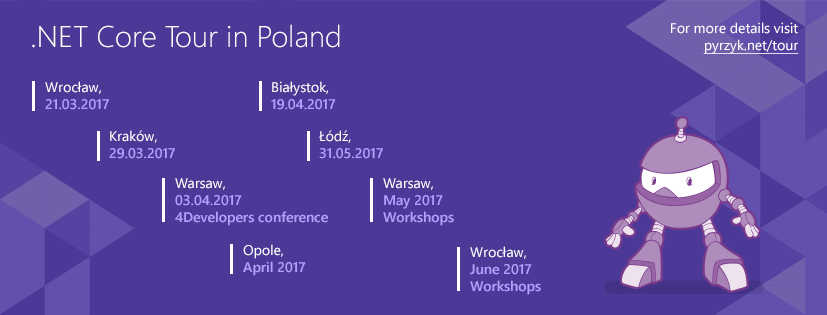

The week in .NET - 
======================================================================================

Previous posts:

* [On .NET with Scott Hunter, On .NET with Matt Watson, MessagePack](https://blogs.msdn.microsoft.com/dotnet/2017/03/14/the-week-in-net-on-net-with-scott-hunter-on-net-with-matt-watson-messagepack/)
* [Visual Studio 2017, .NET Core SDK, F# 4.1, On .NET with Phillip Carter, Happy Birthday from John Shewchuk, FNA, Pyre](https://blogs.msdn.microsoft.com/dotnet/2017/03/08/the-week-in-net-visual-studio-2017-net-core-sdk-f-4-1-on-net-with-phillip-carter-happy-birthday-from-john-shewchuk-pyre/)
* [On .NET with Eric Mellino, Happy Birthday from Scott Hunter, OzCode](https://blogs.msdn.microsoft.com/dotnet/2017/02/28/the-week-in-net-on-net-with-eric-mellino-happy-birthday-from-scott-hunter-ozcode/).

On .NET
-------

This week, we'll have Sidarth Gupta and Hong-Seok Kim from Samsung on the show to talk about their Tizen OS and its support for .NET Core. The show won't be live this week, because of the time difference with Korea, but you may still send us your questions on [Gitter's dotnet/home channel](https://gitter.im/dotnet/home) and on Twitter. Please use the `#onnet` tag.

Package of the week: Coypu
--------------------------

[Coypu](https://github.com/featurist/coypu) is a robust .NET wrapper for browser automation tools such as Selenium WebDriver, that eases automating ajax-heavy websites and reduces coupling to the HTML, CSS & JS. It implements an intuitive DSL for interacting with the browser in the way a human being would.

```csharp
using (var browser = new BrowserSession(new SessionConfiguration 
    {
        AppHost = "microsoft.com",
        SSL = true,
        Driver = typeof (SeleniumWebDriver),
        Browser = Drivers.Browser.Firefox,
        Timeout = TimeSpan.FromSeconds(1),
        RetryInterval = TimeSpan.FromSeconds(0.1)
    })
{
    browser.FillIn("Attachment").With(@"c:\coypu\bigfile.mp4");
    browser.ClickButton("Upload");
    Assert.That(browser,
        Shows.Content("File bigfile.mp4 (10.5mb) uploaded successfully",
            new Options { Timeout = TimeSpan.FromSeconds(60) } ));
}
```

Meetups of the week: .NET Core Tour in Poland
---------------------------------------------

Łukasz Pyrzyk and Piotr Gankiewicz are going on a three months tour across Poland to present live demos of ASP.NET Core and .NET Core. The tour begins today in Wrocław, and will end in June. Check out [the planning on Łukasz's blog](https://pyrzyk.net/tour/) and register!



.NET
----

* [ComponentOne Studio sim-ships with Visual Studio 2017](http://our.componentone.com/2017/03/15/whats-new-in-componentone-ultimate-v1-2017/) by Jody Handley.
* [What is the NETStandard.Library metapackage?](https://andrewlock.net/what-is-the-netstandard-library-metapackage/) by Andrew Lock.
* [Referencing system assemblies in Roslyn compilations](https://luisfsgoncalves.wordpress.com/2017/03/20/referencing-system-assemblies-in-roslyn-compilations/) by Luís Gonçalves.
* [Dogfooding .NET Standard 2.0 latest build](http://yizhang82.me/dogfooding-netstandard-2) by Yi Zhang.
* [Domain Events with Convention-Based Registration and Deferred Execution Support](https://www.codeproject.com/Tips/1176046/Domain-Events-With-Convention-Based-Registration-A) by Arthur Minduca.
* [Windows IoT Core: Logging to Syslog server](http://gunnarpeipman.com/2017/03/windows-iot-syslog/) by Gunnar Peipman.

ASP.NET
-------

* [Notes from the ASP.NET Community Standup](https://blogs.msdn.microsoft.com/webdev/2017/03/13/notes-from-the-asp-net-community-standup-march-9-2017/) by Maria Naggaga.
* [ASP.NET Core Anatomy (Part 2) – AddMvc: Dissecting and understanding the internals of ASP.NET Core](https://www.stevejgordon.co.uk/asp-net-core-anatomy-part-2-addmvc) by Steve Gordon.
* [Options for CSS and JS Bundling and Minification with ASP.NET Core](https://www.hanselman.com/blog/OptionsForCSSAndJSBundlingAndMinificationWithASPNETCore.aspx) by Scott Hanselman.
* [Debug ASP.NET Core via lldb on Ubuntu](https://blogs.msdn.microsoft.com/wushuai/2017/03/13/debug-asp-net-core-via-lldb-on-ubuntu/) by Wu Shuai.
* [More on ASP.NET Core Running under IIS](https://weblog.west-wind.com/posts/2017/Mar/16/More-on-ASPNET-Core-Running-under-IIS) by Rick Strahl.
* [ASP.NET Core Error Management with elmah.io](https://damienbod.com/2017/03/16/asp-net-core-error-management-with-elmah-io/) by Damien Bowden.
* [ASP.NET Core pipelines](https://devblog.dymel.pl/2017/03/20/asp-net-core-pipelines/) by Michał Dymel.
* [Generate a change log from VSTS work items](https://www.softfluent.com/blog/dev/2017/03/13/Generate-a-change-log-from-VSTS-work-items) by Gérald Barré.
* [Disposing resources at the end of an ASP.NET Core request](http://www.strathweb.com/2017/03/disposing-resources-at-the-end-of-asp-net-core-request/) by Filip W.
* [ASP.NET Core: Building chat room using WebSocket](http://gunnarpeipman.com/2017/03/aspnet-core-websocket-chat/) by Gunnar Peipman.
* [.NET Core 1.1 – Where to start?](https://blogs.msdn.microsoft.com/luisdem/2017/03/19/netcore-1-1-where-to-start/), [.NET Core 1.1 – Creating an ASP.NET Core using the .NET CLI](https://blogs.msdn.microsoft.com/luisdem/2017/03/19/net-core-1-1-creating-an-asp-net-core-using-the-net-cli/), [.NET Core 1.1 – How to publish an ASP.NET Core using .NET CLI](https://blogs.msdn.microsoft.com/luisdem/2017/03/19/net-core-1-1-how-to-publish-an-asp-net-core-using-net-cli/), and [.NET Core 1.1 – How to publish a self-contained application](https://blogs.msdn.microsoft.com/luisdem/2017/03/19/net-core-1-1-how-to-publish-a-self-contained-application/) by Luís Henrique Demetrio.
* [Extending ASP.NET Core response compression with support for Brotli](http://tpeczek.blogspot.co.uk/2017/03/extending-aspnet-core-response.html) by Tomasz Pęczek.
* [IIS Logs, Error Logs and More – 6 Ways to Find Failed ASP.NET Requests](https://stackify.com/beyond-iis-logs-find-failed-iis-asp-net-requests/) by Matt Watson.
* [Environment based start-up classes](http://gunnarpeipman.com/2017/03/aspnet-core-startup-classes/) by Gunnar Peipman.

C#
--

* [C# value type boxing under the hood](http://yizhang82.me/value-type-boxing) by Yi Zhang.
* [Getting Started with Async / Await](https://blog.xamarin.com/getting-started-with-async-await/) by Jon Goldberger.

F#
--

* [Announcing Nightly Releases for the Visual F# Tools](https://blogs.msdn.microsoft.com/dotnet/2017/03/14/announcing-nightly-releases-for-the-visual-f-tools/)
* [Azure Functions F# Support is now generally available](https://blogs.msdn.microsoft.com/appserviceteam/2017/03/16/azure-functions-f-support-is-now-generally-available/)
* [Building a MUD with F# and Akka.NET – Part One](https://www.seventeencups.net/building-a-mud-with-f-sharp-and-akka-net-part-one/), by Joe Clay
* [Pure F# Web API and Team City Build](http://marnee.silvrback.com/pure-f-web-api-and-team-city-build), by Marnee Dearman
* [Variable Arguments in F#](http://sidburn.github.io/blog/2017/03/13/variable-arguments), by David Raab
* [Low-level PDF manipulation for F#](http://dlbeer.co.nz/articles/fspdf/index.html), by Daniel Beer
* [Some Gotchas Writing Unity Apps in F#](http://seriouscodeblog.blogspot.com.by/2017/03/some-gotchas-writing-unity-apps-in-f.html), by Paul Blair

New F# Language Suggestions:

- [Add new format flag to the %A specifier which escapes necessary string characters](https://github.com/fsharp/fslang-suggestions/issues/551)

Check out [F# Weekly](https://sergeytihon.wordpress.com/category/f-weekly/) for more great content from the F# community.

Xamarin
-------

* [Service Release: Cycle 9](https://releases.xamarin.com/service-release-cycle-9/) by Bri Brothers.
* [Preview 5 - Visual Studio for Mac](https://releases.xamarin.com/preview-5-visual-studio-for-mac/) by Bri Brothers.
* [Pre-release: Xamarin.Forms 2.3.4.211-pre3](https://releases.xamarin.com/pre-release-xamarin-forms-2-3-4-211-pre3/) by David Ortinau.
* [Xamarin Podcast: What’s New in Xamarin Cycle 9, Visual Studio 2017, and More!](https://blog.xamarin.com/podcast-whats-new-in-xamarin-cycle-9-visual-studio-2017-and-more/) by Pierce Boggan.
* [Simplified Android Keystore Signature Discovery](https://blog.xamarin.com/simplified-android-keystore-signature-disovery/) by James Montemagno.
* [Intro to Xamarin for Visual Studio and Building Your First Xamarin.Forms App](https://blog.xamarin.com/xamarin-university-webinar-recordings-intro-to-xamarin-for-visual-studio-and-building-your-first-xamarin-forms-app/) by Courtney Witmer.
* [Episode 18: MFractor - Incredible Tools for Xamarin with Matthew Robbins](https://channel9.msdn.com/Shows/XamarinShow/The-Xamarin-Show-18-MFractor-Incredible-Tools-for-Xamarin-with-Matthew-Robbins) by The Xamarin Show.
* [Microsoft Azure Notification Hub with UWP and Xamarin](https://channel9.msdn.com/Blogs/MVP-VisualStudio-Dev/Microsoft-Azure-Notification-Hub-with-UWP-and-Xamarin) by Daniel Krzyczkowski.
* [Behind the Scenes: How Shelfie Built a Xamarin.Forms mobile app that connects charities with donors](https://channel9.msdn.com/Blogs/DevRadio/DR1718) by DevRadio.
* [Xamarin.Forms Layout Challenges – Social Network App](http://www.kymphillpotts.com/social-network-app-layout-design-in-xamarin-forms/) and [Xamarin.Forms Layout Challenges – Timeline](http://www.kymphillpotts.com/xamarin-forms-layout-challenges-timeline/) by Kym Phillpotts.
* [APK Tools](http://www.jon-douglas.com/2017/03/15/apk-tools/) by Jon Douglas.
* [A history lesson on the Xamarin.Mac target frameworks and their new names](https://medium.com/@donblas/a-history-lesson-on-the-xamarin-mac-target-frameworks-and-their-new-names-473d2731d887#.ti2rx2eay) by Chris Hamons.
* [Validating User Input in Xamarin.Forms III](http://www.davidbritch.com/2017/03/validating-user-input-in-xamarinforms_16.html) by David Britch.
* [The Definition of Done (DoD) for Xamarin Developers](http://www.michaelridland.com/xamarin/the-definition-of-done-dod-for-xamarin-developers/) by Michael Ridland.
* [Xamarin Forms Dependency Injection](https://xamarinhelp.com/xamarin-forms-dependency-injection/) by Adam Pedley.
* [Xamarin.Forms – MVVM BaseView and BaseViewModel](http://danielhindrikes.se/xamarin/xamarin-forms-mvvm-baseview-and-baseviewmodel/) by Daniel Hindrikes.
* [Xamarin.Tips – iOS Shadow on Transparent UIView](https://alexdunn.org/2017/03/13/xamarin-tips-ios-shadow-on-transparent-uiview/) and [Xamarin.Controls – BadgeView](https://alexdunn.org/2017/03/15/xamarin-controls-badgeview/) by Alex Dunn.
* [Kill AXML - Programmatic ListViews in Xamarin Android](http://www.leerichardson.com/2017/03/kill-axml-programmatic-listviews-in.html) by Lee Richardson.
* [Forms Master Detail Template](http://davidyardy.com/archive/forms-master-detail-template/) by David Yardy.

UWP
----

* [Windows 10 SDK Preview Build 15052 Released](https://blogs.windows.com/buildingapps/2017/03/14/windows-10-sdk-preview-build-15052-released/) By Clint Rutkas.
* [Complete Anatomy: Award-Winning App Comes to Windows Store](https://blogs.windows.com/buildingapps/2017/03/15/complete-anatomy-award-winning-app-comes-windows-store/) By Windows Apps Team.
* [Visual Studio 2017 Update Preview and Windows 10 Creators Update SDK](https://blogs.msdn.microsoft.com/visualstudio/2017/03/16/visual-studio-2017-update-preview-and-windows-10-creators-update-sdk/) By Visual Studio Blog.
* [Hololens – Detect user hand interactions using HoloToolkit](https://elbruno.com/2017/03/16/hololens-detect-user-hand-interactions-using-holotoolkit-update/) By Bruno Capuano.

Azure
-----

* [Publishing a .NET class library as a Function App](https://blogs.msdn.microsoft.com/appserviceteam/2017/03/16/publishing-a-net-class-library-as-a-function-app/) by Donna Malayeri.
* [Planet scale aggregates with Azure DocumentDB](https://azure.microsoft.com/en-us/blog/planet-scale-aggregates-with-azure-documentdb/) by Aravind Ramachandran.
* [Building a simple photo album using Azure Blob Storage with .NET Core](https://blogs.msdn.microsoft.com/premier_developer/2017/03/14/building-a-simple-photo-album-using-azure-blob-storage-with-net-core/) by Chris Tjoumas.
* [Using Azure Functions as a lightweight API Gateway](https://blogs.msdn.microsoft.com/azuredev/2017/03/14/using-azure-functions-as-a-lightweight-api-gateway/) by Andreas Helland.

And this is it for this week!

Contribute to the week in .NET
------------------------------

As always, this weekly post couldn't exist without community contributions, and I'd like to thank all those who sent links and tips. The F# section is provided by [Phillip Carter](https://twitter.com/_cartermp), the gaming section by [Stacey Haffner](https://twitter.com/yecats131), and the Xamarin section by [Dan Rigby](https://twitter.com/DanRigby), and the UWP section by [Michael Crump](http://twitter.com/mbcrump).

You can participate too. Did you write a great blog post, or just read one? Do you want everyone to know about an amazing new contribution or a useful library? Did you make or play a great game built on .NET?
We'd love to hear from you, and feature your contributions on future posts:

* Send an email to beleroy at Microsoft,
* [comment on this gist](https://gist.github.com/bleroy/fddd4a9917b376704b74ed5d7ff5223e)
* Leave us a pointer in the comments section below.
* [Send Stacey (@yecats131) tips on Twitter about .NET games](https://twitter.com/yecats131).

This week's post (and future posts) also contains news I first read on [The ASP.NET Community Standup](https://blogs.msdn.microsoft.com/webdev/tag/communitystandup/), on [Weekly Xamarin](http://weeklyxamarin.com/), on [F# weekly](https://sergeytihon.wordpress.com/category/f-weekly/), and on [Chris Alcock's The Morning Brew](http://themorningbrew.net/).
