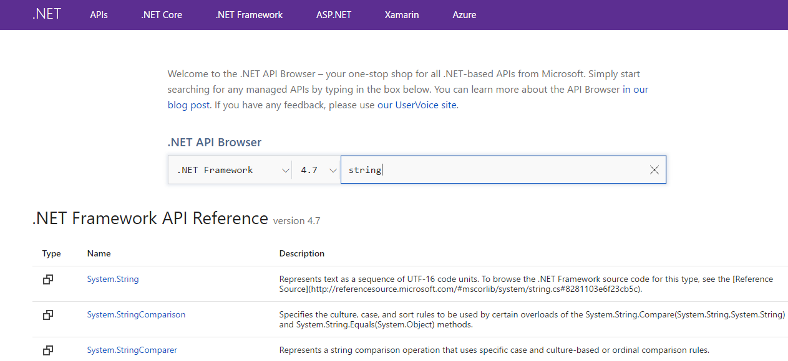
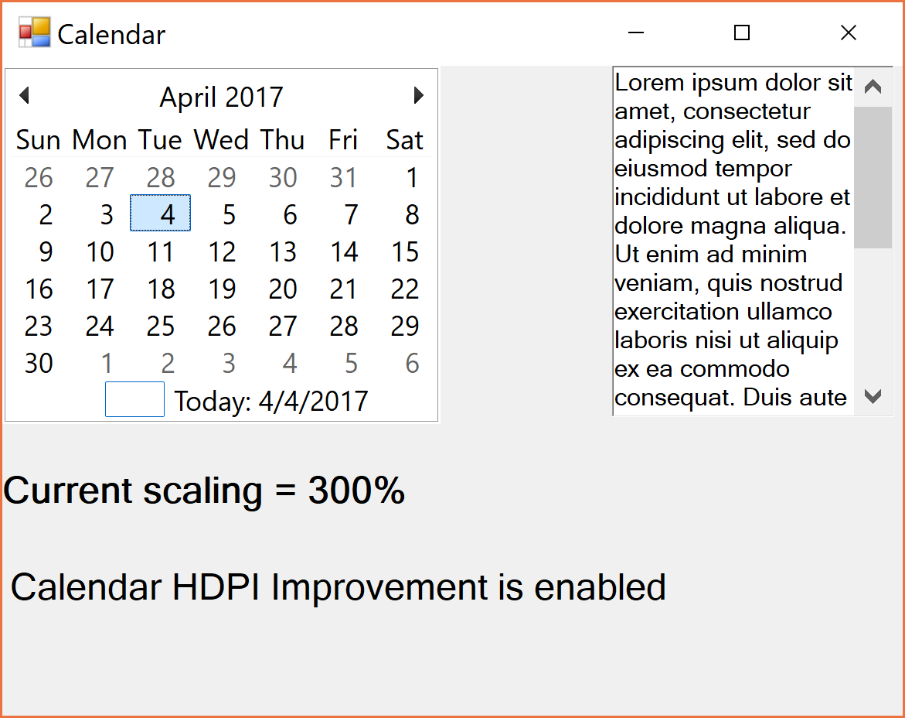
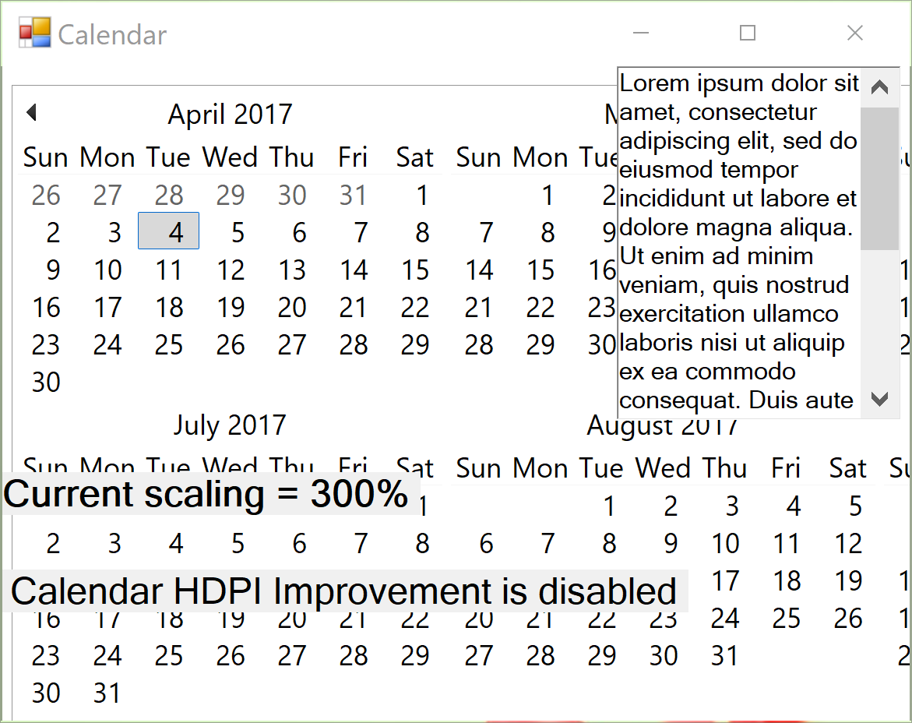
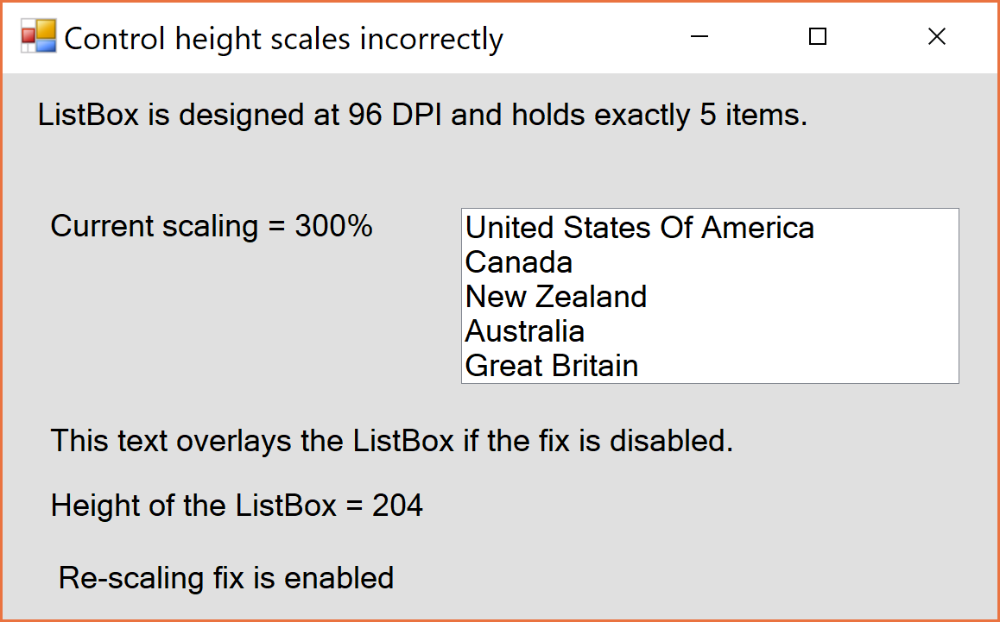
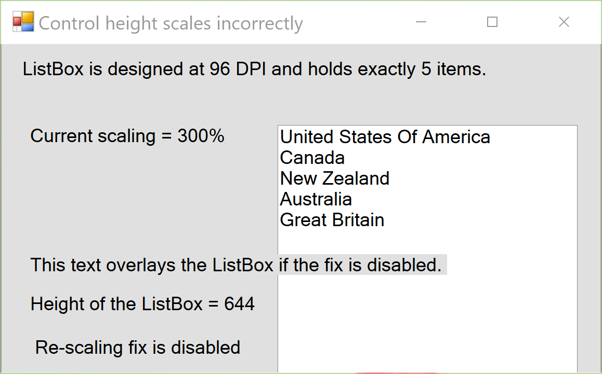
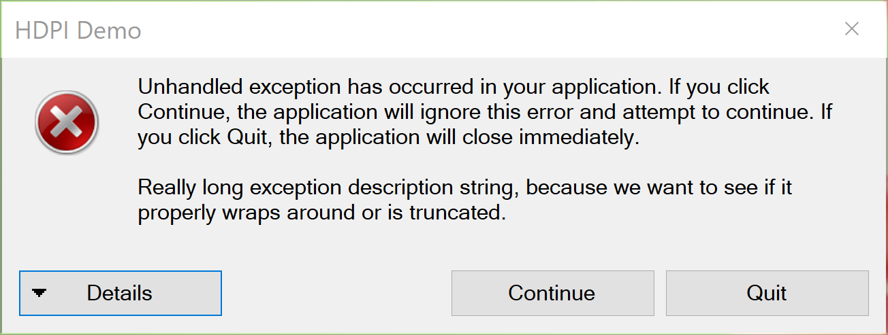
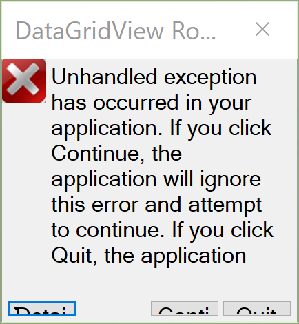
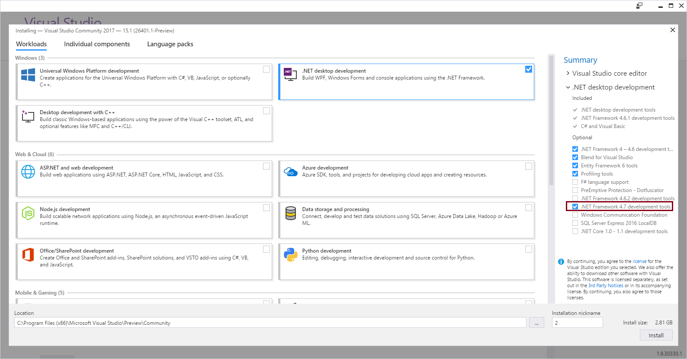

# Announcing the .NET Framework 4.7

Today, we are announcing the release of the .NET Framework 4.7. It's included in the [Windows 10 Creators Update](https://blogs.windows.com/windowsexperience/2017/03/29/windows-10-creators-update-coming-april-11-surface-expands-markets). We've added support for targeting the .NET Framework 4.7 in [Visual Studio 2017](https://blogs.msdn.microsoft.com/visualstudio/), also updated today. The .NET Framework 4.7 will be released for additional Windows versions soon. We'll make an announcement when we have the final date.

The [.NET Framework 4.7](https://msdn.microsoft.com/library/ms171868.aspx) includes improvements in several areas:

- High DPI support for Windows Forms applications on Windows 10
- Touch support for WPF applications on Windows 10
- Enhanced cryptography support
- Performance and reliability improvements

You can see the complete list of improvements and the API diff in the [.NET Framework 4.7 release notes](https://github.com/Microsoft/dotnet/tree/master/releases/net47/README.md).

To get started, upgrade to Windows 10 Creators Update and then install the update to Visual Studio 2017.

## .NET Framework Documentation

We are also launching a set of big improvements for the .NET Framework docs, today. The [.NET Framework docs](https://docs.microsoft.com/dotnet/articles/framework) are now available on [docs.microsoft.com](https://docs.microsoft.com). The docs look much better and easier to read and navigate. We also have a lot of navigation and readability improvements planned for later this year. The [.NET Framework docs on MSDN](https://msdn.microsoft.com/library/ff361664.aspx) will start redirecting to the new docs.microsoft.com pages later this year. Some documents and table of contents updates will be occuring over the next few days as we complete this large documentation migration project.

The docs are also now open source on GitHub @ [dotnet/docs](https://github.com/dotnet/docs/), too! Updating and improving the docs will now be easier for everyone, including for the .NET writing and engineering teams at Microsoft. This is the same experience we have for .NET Core docs.

We are also releasing a new experience for searching for .NET APIs. You can now search and filter .NET APIs, for .NET Core, .NET Framework, .NET Standard and Xamarin all in one place. UWP APIs are still coming. Check out the [.NET API Browser](https://docs.microsoft.com/dotnet), also shown below.



## High DPI for Windows Forms

This release includes a big set of High DPI improvements for Windows Forms DPI Aware applications. Higher DPI displays have become more common, for laptops and desktop machines. It is important that your applications look great on newer hardware. See the team walking you through [Windows Forms High DPI Improvements](https://channel9.msdn.com/Blogs/dotnet/Introducing-Windows-Forms-HDPI-Improvements-in-NET-Framework-47 ) on Channel9.

The goal of these improvements is to ensure that your Windows Forms apps:

- Layout correctly at higher DPI.
- Use high-resolution icons and glyphs.
- Respond to changes in DPI, for example, when moving an application across monitors.

Rendering challenges start at around 150% scaling factor and become much more obvious above 200. The new updates make your apps look better by default and enable you to participate in DPI changes so that you can make your custom controls look great, too.

The changes in .NET Framework 4.7 are a first investment in High DPI for Windows Forms. We intend to make Windows Forms more High DPI friendly in future releases. The current changes do not cover every single control and provide a good experience up to 300% scaling factor. Please help us prioritize additional investments in the comments and at [microsoft/dotnet issue #xx](https://github.com/microsoft/dotnet/issues).

These changes rely on [High DPI Improvements in the Windows 10 Creators Update](https://blogs.windows.com/buildingapps/2017/04/04/high-dpi-scaling-improvements-desktop-applications-windows-10-creators-update), also released today. See [High DPI Improvements for Desktop App Developers in the Windows 10 Creators Update](https://channel9.msdn.com/events/Windows/Windows-Developer-Day-Creators-Update/High-DPI-Improvements-for-Desktop-Developers) (a video) if you prefer to watch someone explains the what's new. 
You may want to follow and reach out to [@WindowsUI on twitter](https://twitter.com/WindowsUI).

### Improvements for System DPI aware Applications

We’ve fixed layout issues with several of the controls: calendar, exception dialog box, checked list box, menu tool strip and anchor layout. You need to [opt-into these changes](https://msdn.microsoft.com/library/mt492756.aspx), either as a group or fine-tune the set that you want to enable, giving you control over which HDPI improvements are applied to your application.

#### Calendar Control

The calendar control has been updated to be System DPI Aware, showing only one month. This is the new behavior, as you can see in the example below at 300% scaling.



You can see the existing behavior below at 300% scaling.



#### ListBox

The ListBox control has been updated to be System DPI Aware, with the desired control height, as you can see in the example below. This is the new behavior, as you can see in the example below at 300% scaling.



You can see the existing behavior below at 300% scaling.



#### Exception Message box

The exception message box has been updated to be System DPI Aware, with the correct layout, as you can see in the example below. This is the new behavior, as you can see in the example below at 300% scaling.



You can see the existing behavior below at 300% scaling.



### Dynamic DPI Scenarios

We’ve also added support for dynamic DPI scenarios, which enables Windows Forms applications to respond to DPI changes after being launched. This can happen when the application window is moved to a display that has a different scale factor, if the current monitors scale factor is changed, you connect an external monitor to a laptop (docking or projecting). 

We’ve exposed three new events to support dynamic DPI senarios: 

- Control.OnDpiChangedBeforeParent
- Control.OnDpiChangedAfterParent
- Form.DPIChanged

### Ecosystem

We've recently been talking to control providers (for example, Telerik, and Grape City) so that they update their controls to support High DPI. Please do reach out to your control providers to tell them which Windows Forms (and WPF) controls you want updated to support High DPI. If you are a  control provider (commercial or free) and want to chat, please reach out at dotnet@microsoft.com. 

You might be wondering about WPF. WPF is inherently [High DPI aware](https://msdn.microsoft.com/library/windows/desktop/dd464646.aspx) and compatible because it is based on [vector graphics](https://en.wikipedia.org/wiki/Vector_graphics). Windows Forms is based on [raster graphics](https://en.wikipedia.org/wiki/Raster_graphics). WPF implemented a per-monitor experience in the .NET Framework 4.6.2, based on improvements in the Windows 10 Anniversary Update.

### Quick Lesson in Resolution, DPI, PPI and Scaling

Higher resolution doesn't necessarily mean high DPI. It's typically scaling that results in higher DPI scenarios. I have a desktop machine with a single 1080P screen that is set to 100% scaling. I won't notice any of the feature discussed here. I also have a laptop with a higher resolution screen that is scaled to 300% to make it look really good. I'll definitely notice the high DPI features on that machine. If I hookup my 1080P screen to my laptop, then I'll experience the PerMonitorV2 support when I move my Windows Forms applications between screens.

Let's look at some actual examples. The [Surface Pro 4 and Surface Book 2](https://www.microsoft.com/en-us/surface/devices/compare-devices) have 267 PPI displays, which are likely scaled by default. The [Dell 43" P4317Q](http://accessories.us.dell.com/sna/productdetail.aspx?c=us&cs=04&l=en&sku=210-AHSQ) has a 104PPI at its native 4k resolution, which is likely not scaled by default. An 85" 4k TV will have a PPI value of half that. If you scale the Dell 43" monitor to 200%, then you will have a High DPI visual experience.

Note: DPI and PPI are measurements that takes into account screen resolution, screen size and scaling. You can use them interchangeably.

You can try scaling your monitor temporarily with [Magnifier](https://support.microsoft.com/help/11542/windows-use-magnifier). It is a great test tool for High DPI.

### Take advantage of High DPI

You need to target the .NET Framework 4.7 to take advantage of these improvements. Use the following app.config file to try out the new High DPI support. Notice that the `sku` attribute is set to `.NETFramework,Version=v4.7` and the `DpiAwareness` key is to set `PerMonitorV2`.

``` xml
<?xml version="1.0" encoding="utf-8" ?>
<configuration>
    <startup> 
        <supportedRuntime version="v4.0" sku=".NETFramework,Version=v4.7" />
    </startup>
    <System.Windows.Forms.ApplicationConfigurationSection>
        <add key="DpiAwareness" value="PerMonitorV2"/>
  </System.Windows.Forms.ApplicationConfigurationSection>
</configuration>
```

You must also include a Windows app manifest with your app that declares that it is a Windows 10 application. The new Windows Forms System DPI Aware and PerMonitorV2 DPI Aware features will not work without it. See the required application manifest fragment below. A full manifest can be found in this System DPI Aware sample.

``` xml
  <compatibility xmlns="urn:schemas-microsoft-com:compatibility.v1">
    <application>
      <!-- Windows 10 -->
      <supportedOS Id="{8e0f7a12-bfb3-4fe8-b9a5-48fd50a15a9a}" />
    </application>
  </compatibility>
```

Please see [Windows Forms Configuration](https://msdn.microsoft.com/library/mt492940.aspx) to learn about how to configure each of the Windows Forms controls individually if you need more fine-grained control.

You must target and (re)compile your application with .NET Framework 4.7, not just run on it. Applications that run on the .NET Framework 4.7 but target .NET Framework 4.5 or 4.6, for example, will not get the new improvements. Updating an the app.config file of an existing application will not work (re-compilation is necessary).

## WPF Touch/Stylus support for Windows 10

WPF now integrates with the touch and stylus/ink support in Windows 10. The Windows 10 touch implementation is more modern and mitigates customer feedback that we've received with the current Windows Ink Services Platform (WISP) component that WPF relies on for touch data. You can opt into the new Windows touch services with the .NET Framework 4.7. The WISP component remains the default.

The new touch implementation has the following benefits over the WISP component:

- **More reliable** - The new implementation is the same one used by UWP, a touch-first platform. We've heard feedback that WISP has intermittent touch responsiveness issues. The new implementation resolves these.
- **More capable** - Works well with popups and dialogs. We've heard feedback that WISP doesn't work well with popup UI.
- **Compatible** - Basic touch interaction and support should be almost indistinguishable from WISP.

There are some scenarios that don't yet work well with the new implementation and would make staying with WISP the best choice.

- Real-time inking does not function. Inking/StylusPlugins will still work, but can stutter.
- Applications using the Manipulation engine may experience different behavior
- Promotions of touch to mouse will behave slightly differently to the WISP stack.

Our future work should address all of these issues and provide touch support that is completely compatible with the WISP component. Our goal is to provide a more modern touch experience that continues to improve with each new release of Windows 10.

You can opt-into the new touch implementation with the following app.config entry.

``` xml
<configuration>
    <runtime>
        <AppContextSwitchOverrides value="Switch.System.Windows.Input.Stylus.EnablePointerSupport=true"/>
    </runtime>
</configuration>
```

## ClickOnce

The ClickOnce Team made a set of improvements in the .NET Framework 4.7.

### Hardware Security Module Support

You can now sign ClickOnce manifest files with a [Hardware Security Module (HSM)](https://en.wikipedia.org/wiki/Hardware_security_module) in the [Manifest Generation and Editing Tool (Mage.exe)](https://msdn.microsoft.com/library/acz3y3te.aspx). This improvement was the second most requested feature for ClickOnce! HSMs make certificate mangement more secure and easier, since both the certificate and signing occur within secure hardware.

There are two ways to sign your application with an HSM module via Mage. The first can be done via command-line. We've added two new options:

` -CryptoProvider <name> -csp`
`-KeyContainer <name> -kc`

The `CryptoProvider` and `KeyContainer` options are required if the certificate specified by the `CertFile` option does not contain a private key. The `CryptoProvider` option specifies the name of the cryptographic service provider (CSP) that contains the private key container. The `KeyContainer` option specifies he key container that contains the name of the private key.

We have also added a new `Verify` command, which will verify that the manifest has been signed correctly. It takes a manifest file as it's parameter:

`-Verify <manifest_file_name> -ver`

The second way is to sign it via the Mage GUI, which collects the require information before signing:


### Store Corruption Recovery

ClickOnce will now detect if the ClickOnce application store has become corrupted. In the event of  store corruption, ClickOnce will automatically attempt to clean-up and re-install broken applications for users. Developers or admins do not need to do anything to enable this new behavior.

## API-level Improvements

There are several API-level improvements included in this release, described below.

### TLS Version now matches Windows

Network security is increasingly important, particularly for HTTPS. We've had requests for .NET to match the Windows defaults for TLS version. This makes machines easier to manage. You opt into this behavior by targeting .NET Framework 4.7.

HttpClient, HttpWebRequest and WebClient clients all implement this behavior.

For WCF, [MessageSecurity](https://msdn.microsoft.com/library/system.servicemodel.aspx) and [TransportSecurity](https://msdn.microsoft.com/library/ms729700.aspx) classes were also updated to support TLS 1.1 and 1.2. We've heard requests for these classes to also match OS defaults. Please tell us if you would like that behavior.

### More reliable Azure SQL Database Connections

TCP is now the default protocol to connect to Azure SQL Database. This change significantly improves connection reliability.

### Cryptography

The .NET Framework 4.7 has enhanced the functionality available with Elliptic Curve Cryptography (ECC). ImportParameters(ECParameters) methods were added to the ECDsa and ECDiffieHellman classes to allow for an object to represent an already-established key. An ExportParameters(bool) method was also added for exporting the key using explicit curve parameters. 

The .NET Framework 4.7 also adds support for additional curves (including the Brainpool curve suite), and has added predefined definitions for ease-of-creation via the new ECDsa.Create(ECCurve) and ECDiffieHellman.Create(ECCurve) factory methods. 

This functionality is provided by system libraries, and so some of the new features will only work on Windows 10.

You can see an example of [.NET Framework 4.7 Crypography improvements](https://gist.github.com/richlander/5a182899895a87a296c21ada97f7a54e) to try out the changes yourself.

### Breaking Changes


## Building .NET Framework 4.7 apps with Visual Studio 2017

You can start building .NET Framework 4.7 apps once you have the Windows 10 Creators Update and the Visual Studio 2017 update installed. You need to select the .NET Framework 4.7 development tools as part of updating Visual Studio 2017, as you can see highlighted in the example below.



## Windows Version Support

The .NET Framework 4.7 is available for Windows 10 Creators Update today. We expect to release it for earlier versions of Windows pretty soon. We'll make an announcement when we have the final date.

The following Windows versions will be supported (same as .NET Framework 4.6.2):

- **Client:** Windows 10 Creators Update (RS2), Windows 10 Anniversary Update (RS1), Windows 8.1, Windows 7 SP1
- **Server:** Windows Server 2016, Windows Server 2012 R2, Windows Server 2012, Windows Server 2008 R2 SP1 

A .NET Framework 4.7 targeting pack will be released at the same time for use with earlier versions of Visual Studio.

## Closing

The improvements in the .NET Framework take advantage of new Windows 10 client features and make general improvements that for all Windows versions. Please do tell us what you think of these improvements.

Please try out the .NET Framework 4.7 on Windows 10 Creators Update, using the latest update to Visual Studio 2017. We'll make the new version available for other Windows versions soon.

