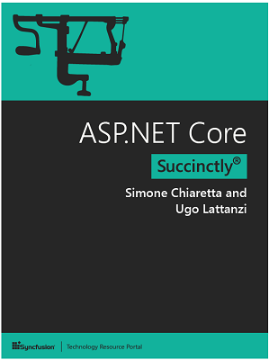

The week in .NET - Happy Birthday .NET with Chris Sells, free ASP.NET Core book
===============================================================================

Previous posts:

* [Happy birthday .NET with Robin Cole, TinyORM, 911 Operator](https://blogs.msdn.microsoft.com/dotnet/2017/04/18/the-week-in-net-happy-birthday-net-with-robin-cole-tinyorm-911-operator/)
* [.NET Framework 4.7, reference documentation, On .NET on modular ASP.NET, Happy birthday .NET with Immo Landwerth, JustAssembly](https://blogs.msdn.microsoft.com/dotnet/2017/04/11/the-week-in-net-net-framework-4-7-reference-documentation-on-net-on-modular-asp-net-happy-birthday-net-with-immo-landwerth-justassembly/)
* [On .NET on SonarLint and SonarQube, Happy birthday .NET with Dan Fernandez, nopCommerce, Steve Gordon](https://blogs.msdn.microsoft.com/dotnet/2017/04/04/the-week-in-net-on-net-on-sonarlint-and-sonarqube-happy-birthday-net-with-dan-fernandez-nopcommerce-steve-gordon/)

Happy birthday .NET with Chris Sells
------------------------------------

In February we threw a big .NET birthday bash with Microsoft Alumni and product teams. We caught up with Chris Sells who is currently a Product Manager at Google, and before that a Program Manager at Microsoft. Chris has been part of the .NET developer community since the beginning and he tells us a few great stories in this fun interview.

<iframe src="https://channel9.msdn.com/Blogs/funkyonex/Happy-Birthday-NET-with-Chris-Sells/player" width="960" height="540" allowFullScreen frameBorder="0"></iframe>

Book of the week: ASP.NET Core succinctly, by Simone Chiaretta and Ugo Lattenzi
-------------------------------------------------------------------------------

In [ASP.NET Core Succinctly](http://codeclimber.net.nz/archive/2017/04/20/free-ebook-on-aspnet-core-is-available-for-download/), seasoned authors Simone Chiaretta and Ugo Lattanzi update you on all the advances provided by Microsoft’s landmark framework. By learning the foundations of the library and understanding the new versions of ASP.NET MVC and Web API, you’ll be equipped with everything you need to build .NET web applications on Windows, Mac, and Linux.

You can [get the book now, for free!](http://codeclimber.net.nz/archive/2017/04/20/free-ebook-on-aspnet-core-is-available-for-download/)

Meetup of the week: Productivity in Visual Studio 2017 with GitHub, .NET Core, and Docker in San Francisco, CA
--------------------------------------------------------------------------------------------------------------

The [Bay .NET user group](https://www.meetup.com/BayNET/) has a two-part [meeting on Thursday, April 27 at 6:30PM](https://www.meetup.com/BayNET/events/238661353/) featuring excellent speakers: [Sara Ford](https://twitter.com/saraford) will talk about the GitHub extension for Visual Studio 2017, and [Beth Massi](https://twitter.com/bethmassi) will tall you all about .NET Core, Docker, and microservices.

.NET
----

* [Announcing SignalR 2.2.2 (Preview 1)](https://blogs.msdn.microsoft.com/webdev/2017/04/13/announcing-signalr-2-2-2-preview-1/) by Jon Galloway.
* [High-performance .NET by example: Filtering bot traffic](https://alexandrnikitin.github.io/blog/high-performance-dotnet-by-example/) by Alexandr Nikitin.
* [I was wrong, reflecting on the .NET design choices](https://ayende.com/blog/177921/i-was-wrong-reflecting-on-the-net-design-choices) by Ayende Rahien.
* [The Definitive Serialization Performance Guide](https://aloiskraus.wordpress.com/2017/04/23/the-definitive-serialization-performance-guide/) by Alois Kraus.
* [Covariant and Contravariant Casting is 3x Slower than Dynamic](https://www.danielcrabtree.com/blog/214/covariant-and-contravariant-casting-is-3x-slower-than-dynamic), and [Better Benchmarking with Additive and Multiplicative Baselines](https://www.danielcrabtree.com/blog/234/better-benchmarking-with-additive-and-multiplicative-baselines) by Daniel Crabtree.
* [Creating custom build configurations for the .NET Core project format](https://www.pedrolamas.com/2017/04/24/creating-custom-build-configurations-for-the-dotnet-core-project-format/) by Pedro Lamas.
* [Stop overusing interfaces](http://blog.hovland.xyz/2017-04-22-stop-overusing-interfaces/) by Tor Hovland.
* [BatMap - The Mapper we deserve, not the one we need](https://github.com/DogusTeknoloji/BatMap) by Doğuş Teknoloji.
* [Registering an Application to a URI Scheme using .NET](https://www.meziantou.net/2017/04/18/registering-an-application-to-a-uri-scheme-using-net) by Gérald Barré.
* [Multiple Platform Targeting in Visual Studio 2017](http://dontcodetired.com/blog/post/Multiple-Platform-Targeting-in-Visual-Studio-2017) by Jason Roberts.

ASP.NET
-------

* [ASP.NET Core 12 samples](http://piotrgankiewicz.com/2017/04/17/asp-net-core-12-samples/) by Piotr Gankiewicz.
* [Removing the MVC Razor dependencies from the Web API template in ASP.NET Core](https://andrewlock.net/removing-the-mvc-razor-dependencies-from-the-web-api-template-in-asp-net-core/) by Andrew Lock.
* [Creating a basic Web API template using dotnet new custom templates](https://andrewlock.net/creating-a-basic-web-api-template-using-dotnet-new-custom-templates/) by Andrew Lock.
* [Fluent Validation Rules with ASP.NET Core](http://cecilphillip.com/fluent-validation-rules-with-asp-net-core/) by Cecil Phillip.
* [ASP.NET Core Lazy Command Pattern](http://rehansaeed.com/asp-net-core-lazy-command-pattern/) by Muhammad Rehan Saeed.
* [Configuring ASP.NET Core middleware](https://devblog.dymel.pl/2017/04/20/configuring-asp-net-core-middleware/) by Michał Dymel.
* [Hosting a .NET Core 2 Web API on the Raspberry Pi 3](https://jeremylindsayni.wordpress.com/2017/04/22/hosting-a-net-core-2-web-api-instance-on-the-raspberry-pi-3/) by Jeremy Lindsay.
* [ASP.NET Core Dependency Injection Understands Unbound Generics](http://odetocode.com/blogs/scott/archive/2017/04/21/asp-net-core-dependency-injection-understands-unbound-generics.aspx) by K. Scott Allen.
* [ASP.NET Core Middleware Components are Singletons](http://odetocode.com/blogs/scott/archive/2017/04/19/asp-net-core-middleware-components-are-singletons.aspx) by K. Scott Allen.
* [Cache Dependency in ASP.NET Core](http://www.hishambinateya.com/cache-dependency-in-asp.net-core) by Hisham Bin Ateya.
* [ASP.NET Core Health Checks](https://al-hardy.blog/2017/04/17/asp-net-core-health-checking/) by Allan Hardy.
* [Using Storyteller with ASP.Net Core Systems](https://jeremydmiller.com/2017/04/18/using-storyteller-with-asp-net-core-systems/) by Jeremy D. Miller.
* [Domain Command Patterns - Validation](https://jimmybogard.com/domain-command-patterns-validation/) by Jimmy Bogard.
* [Dependency Injection in the ASP.NET Core Middleware](https://devblog.dymel.pl/2017/04/18/dependency-injection-in-asp-net-core-middlewares/) by Michał Dymel.
* [Areas in ASP.NET Core](https://www.codeproject.com/Articles/1182253/Areas-in-ASP-NET-Core) by Gaston Verelst.

C#
--

* [C# 7 ValueTuple types and their limitations](http://josephwoodward.co.uk/2017/04/csharp-7-valuetuple-types-and-their-limitations) by Joseph Woodward.
* [What is NullReferenceException? Object reference not set to an instance of an object](https://stackify.com/nullreferenceexception-object-reference-not-set/) by Matt Watson.
* [Void-Free Style in C# 7.0](https://programming.lansky.name/void-free-style/) by Lukáš Lánský.
* [A tricky bit of code](https://ayende.com/blog/177889/a-tricky-bit-of-code?Key=cf4f6f86-90ca-495c-bb4f-b686c17f8055) by Ayende Rahien.

Xamarin
-------

* [Xamarin Stable Release: 15.1 Hotfix iOS Simulator v1.0.2](https://releases.xamarin.com/stable-release-15-1-hotfix-ios-simulator-v1-0-2/) by Bri Brothers.
* [Xamarin Alpha Release: 15.2 Alpha Preview 3](https://releases.xamarin.com/alpha-release-15-2-alpha-preview-3/) by Bri Brothers.
* [Preview: Bringing macOS to Xamarin.Forms](https://blog.xamarin.com/preview-bringing-macos-to-xamarin-forms/) by David Ortinau.
* [Go from Sketch to Rapid Prototype and Manufacturing with Blank Slate’s Xamarin-Based Zotebook](https://blog.xamarin.com/go-sketch-rapid-prototype-manufacturing-blank-slates-xamarin-based-zotebook/) by Lacey Butler.
* [Guest Post: Adding a Calendar to Your Xamarin.Forms Apps with the Telerik Calendar](https://blog.xamarin.com/adding-calendar-xamarin-forms-apps-telerik-calendar/) by Sam Basu.
* [Requesting Reviews with iOS 10.3’s SKStoreReviewController](https://blog.xamarin.com/requesting-reviews-ios-10-3s-skstorereviewcontroller/) by James Montemagno.
* [Important OnPlatform Changes in Xamarin.Forms](http://motzcod.es/post/159684940967/important-onplatform-changes-xamarin-forms) by James Montemagno.
* [Snack Pack 10: Planet Xamarin - Community Blog Feed](https://channel9.msdn.com/Shows/XamarinShow/Snack-Pack-10-Planet-Xamarin-Community-Blog-Feed) by The Xamarin Show.
* [Xamarin.Tips – Removing the Bottom Border of Your iOS Navigation Bars](https://alexdunn.org/2017/04/14/xamarin-tips-removing-the-bottom-border-of-your-ios-navigation-bars/) by Alex Dunn.
* [Xamarin.Tips – Android Bar Background Images in Xamarin.Forms](https://alexdunn.org/2017/04/18/xamarin-tips-android-bar-background-images-in-xamarin-forms/) by Alex Dunn.
* [Xamarin.Tips – MVVM Light Set Expressions Explained](https://alexdunn.org/2017/04/18/xamarin-tips-mvvm-light-set-expressions-explained/) by Alex Dunn.
* [Xamarin.Tips – Fixing the Highlighting Drop In Your Xamarin.Forms Projects](https://alexdunn.org/2017/04/20/xamarin-tips-fixing-the-highlighting-drop-in-your-xamarin-forms-projects/) by Alex Dunn.
* [Xamarin.Controls – Android ArcLayout](https://alexdunn.org/2017/04/19/xamarin-controls-android-arclayout/) by Alex Dunn.
* [Xamarin.Forms: Consuming Rest Webservice - JSON Parsing (C# - Xaml)](http://bsubramanyamraju.blogspot.com/2017/04/xamarinforms-consuming-rest-webserivce_17.html) by Subramanyam Raju.
* [Xamarin.Forms: Consuming Rest Webservice - XML Parsing (C# - Xaml)](http://bsubramanyamraju.blogspot.com/2017/04/xamarinforms-consuming-rest-webserivce.html) by Subramanyam Raju.
* [Xamarin Forms - Change a ListView's Selected Item Colour](http://blog.wislon.io/posts/2017/04/11/xamforms-listview-selected-colour) by John Wilson.
* [Building a hybrid app with Xamarin.Forms](https://blog.verslu.is/xamarin-forms/building-a-hybrid-app-with-xamarin-forms/) by Gerald Versluis.
* [Hybrid Xamarin.Forms Applications](https://jfarrell.net/2017/04/14/hybrid-xamarin-forms-applications/) by Jason Farrell.
* [Multiple Platform Targeting in Visual Studio 2017](http://dontcodetired.com/blog/post/Multiple-Platform-Targeting-in-Visual-Studio-2017) by Jason Roberts.
* [Share Dialog with Xamarin Forms](https://xamarinhelp.com/share-dialog-xamarin-forms/) by Adam Pedley.
* [Six Disastrous Mistakes for Cross-Platform Mobile Projects](http://www.leerichardson.com/2017/04/six-disastrous-mistakes-for-cross.html) by Lee Richardson.

Azure
-----

* [Azure Functions Tools Roadmap](https://blogs.msdn.microsoft.com/webdev/2017/04/14/azure-functions-tools-roadmap/) by Andrew B Hall.
* [Detecting faces on photos using Microsoft Cognitive Services](http://gunnarpeipman.com/2017/04/face-detection/) by Gunnar Peipman.

UWP
----

* [Windows Developers at Microsoft Build 2017](https://blogs.windows.com/buildingapps/2017/04/19/windows-developers-microsoft-build-2017/) by Windows Apps Team.
* [Building a Telepresence App with HoloLens and Kinect](https://blogs.windows.com/buildingapps/2017/04/18/building-telepresence-app-hololens-kinect/) by Windows Apps Team.
* [Windows Developer Awards: Honoring Windows Devs at Microsoft Build 2017](http://blogs.windows.com/buildingapps/2017/04/21/windows-developer-awards-honoring-windows-devs-microsoft-build-2017/) By Windows Apps Team.
* [Just released – Windows developer evaluation virtual machines – April 2017 build](http://blogs.windows.com/buildingapps/2017/04/20/just-released-windows-developer-evaluation-virtual-machines-april-2017-build/) By Clint Rutkas.

Data
----

* [Using Entity Framework Core in-memory database for unit testing](http://gunnarpeipman.com/2017/04/aspnet-core-ef-inmemory/) by Gunnar Peipman.

And this is it for this week!

Contribute to the week in .NET
------------------------------

As always, this weekly post couldn't exist without community contributions, and I'd like to thank all those who sent links and tips. The F# section is provided by [Phillip Carter](https://twitter.com/_cartermp), the gaming section by [Stacey Haffner](https://twitter.com/yecats131), the Xamarin section by [Dan Rigby](https://twitter.com/DanRigby), and the UWP section by [Michael Crump](http://twitter.com/mbcrump).

You can participate too. Did you write a great blog post, or just read one? Do you want everyone to know about an amazing new contribution or a useful library? Did you make or play a great game built on .NET?
We'd love to hear from you, and feature your contributions on future posts:

* Send an email to beleroy at Microsoft,
* [Comment on this gist](https://gist.github.com/bleroy/5087eec51c8f7fc76c8dfac6587ce8bb)
* Leave us a pointer in the comments section below.
* [Send Stacey (@yecats131) tips on Twitter about .NET games](https://twitter.com/yecats131).

This week's post (and future posts) also contains news I first read on [The ASP.NET Community Standup](https://blogs.msdn.microsoft.com/webdev/tag/communitystandup/), on [Weekly Xamarin](http://weeklyxamarin.com/), on [F# weekly](https://sergeytihon.wordpress.com/category/f-weekly/), and on [The Morning Brew](http://themorningbrew.net/).
