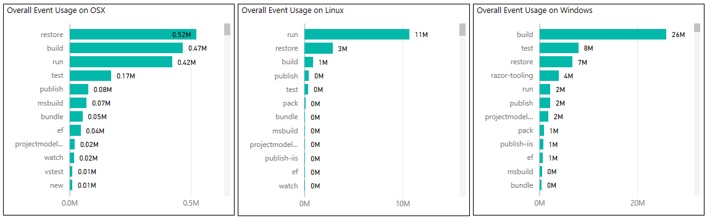
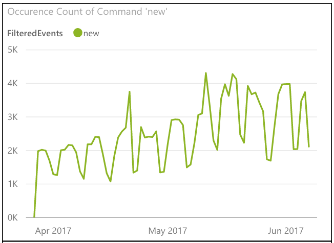
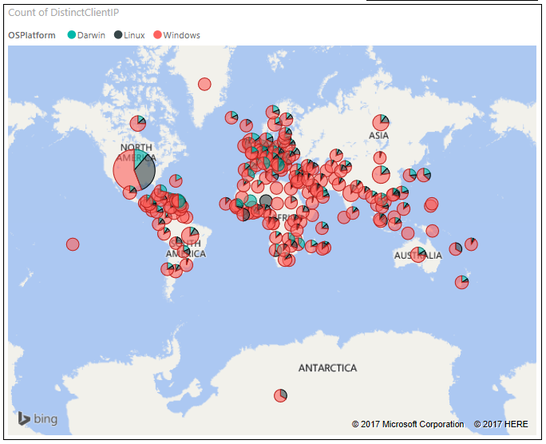
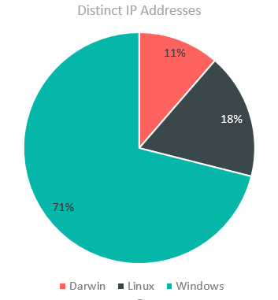
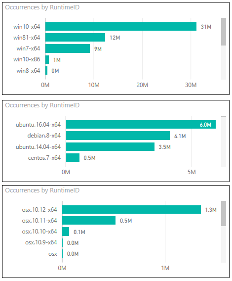

## .NET Core Tools Telemetry

The .NET Core tools include a [telemetry feature](https://docs.microsoft.com/en-us/dotnet/articles/core/tools/telemetry)  to help the .NET team to understand how the tools are being used so they can improve them.

The telemetry feature collects the following pieces of data:
 - The command being used (for example, `build`, `restore`)
 - The `ExitCode` of the command
 - For test projects, the test runner being used
 - The timestamp of invocation
 - The framework used
 - Whether runtime IDs are present in the `runtimes` node
 - The CLI version being used

As described in the documentation, you're able to opt-out telemetry collection by setting the `DOTNET_CLI_TELEMETRY_OPTOUT` variable.
 
The data collected is anonymous, and we've promised that the it would be published in an aggregated form for use by both Microsoft and community engineers under the Creative Commons Attribution License.

## First Release of the Raw Data

Today, we're making that anonymous data available in CSV format:
* [April 2016](https://dotnetcoredata.blob.core.windows.net/dotnetclidata/CLI_2016-04-01.csv)
* [May 2016](https://dotnetcoredata.blob.core.windows.net/dotnetclidata/CLI_2016-05-01.csv)
* [June 2016](https://dotnetcoredata.blob.core.windows.net/dotnetclidata/CLI_2016-06-01.csv)
* [July 2016](https://dotnetcoredata.blob.core.windows.net/dotnetclidata/CLI_2016-07-01.csv)
* [August 2016](https://dotnetcoredata.blob.core.windows.net/dotnetclidata/CLI_2016-08-01.csv)
* [September 2016](https://dotnetcoredata.blob.core.windows.net/dotnetclidata/CLI_2016-09-01.csv)
* [October 2016](https://dotnetcoredata.blob.core.windows.net/dotnetclidata/CLI_2016-10-01.csv)
* [November 2016](https://dotnetcoredata.blob.core.windows.net/dotnetclidata/CLI_2016-11-01.csv)
* [December 2016](https://dotnetcoredata.blob.core.windows.net/dotnetclidata/CLI_2016-12-01.csv)
* [January 2017](https://dotnetcoredata.blob.core.windows.net/dotnetclidata/CLI_2017-01-01.csv)
* [February 2017](https://dotnetcoredata.blob.core.windows.net/dotnetclidata/CLI_2017-02-01.csv)
 
 > Note: The above data runs through February 2017. There's some time-consuming processing and verification in place to make sure that we're not releasing any personally identifiable information. We're working on that process optimized and getting current data released right at the beginning of each month going forward.
 
 ## Data Insights
 
As you'd hope, there's a ton of useful information in these logs. The development team is using the usage trends to prioritize features, drill in on common issues, etc.

In addition to product development insights, the data reveals a lot of interesting trends. Let's take a look at historical data (since we started collecting in April 2016):

### Command Variations by Operating System

There are some revealing differences in command usage between operating systems. We can see that `build` is by far the leading command on Windows, `run` on Linux, and `restore` on OSX. I'd interpret this to say that we're seeing a lot of application development on Windows, maybe more "kicking the tires" scaffolding applications on OSX using Yeoman, while Linux is primarily being used to host applications.

### Weekly Trends

You can see that there's an obvious cycle that follows the work week. Looking closer, it's clear that the `build` and `restore` commands drop off quite a bit on the weekend, while the `run` command doesn't quite as much.

### Geographic Distributions

It's interesting to take a look at the geographic variations in client operating system usage. Most have a mix, but you can see that some areas run predominantly on a single operating system.

### Overall Operating System Distribution

Given .NET's roots, it's not surprising to see a pretty large Windows following. It's exciting to see some pretty substantial Linux and Darwin (OSX) usage as well. Keep in mind that these are distinct IP's here, so we could in some cases be seeing multiple Docker instances running under a single Linux IP, for instance.

### Operating System Version Distribution

It looks like we're seeing .NET Core running mostly on the newest operating system versions at this point. I think that makes sense, since .NET Core has historically attracted the early adopter crowd who are also mostly likely to be jumping on the newest operating system releases.

## More to Come

This is a beginning, and a first effort. We will continue to make this data available to you in a timely manner, and we're going to look into making it easy for you to visualize the kinds of trends we're seeing. But we don't want to hold things up, so we're starting by providing you data in raw format.
