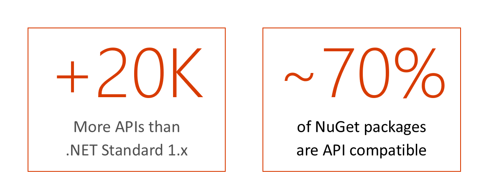
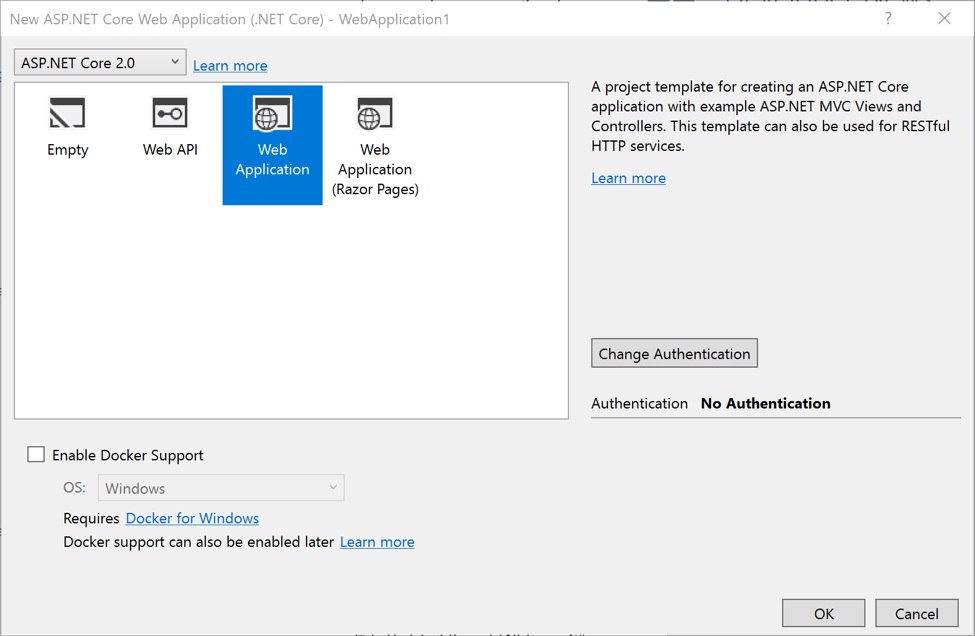
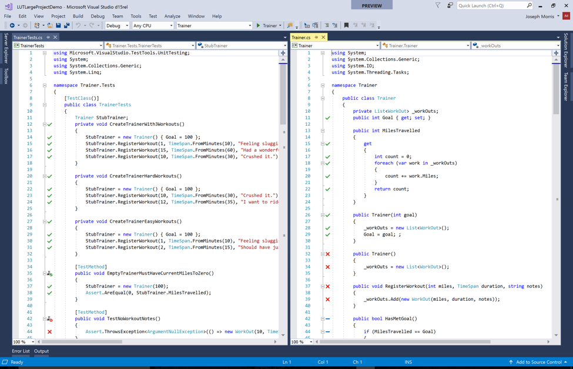
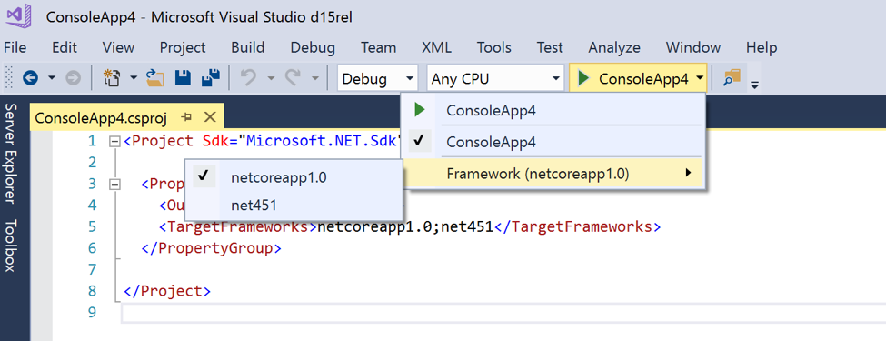

# Announcing .NET Core 2.0 Preview 1

Today, we are announcing .NET Core 2.0 Preview 1. It is the first public release of .NET Core 2.0. We have great improvements that we want to share and that we would love to get your feedback on. You can develop .NET Core 2.0 apps with [Visual Studio 2017 Preview 15.3](https://blogs.msdn.microsoft.com/visualstudio/2017/05/10/update-to-visual-studio-2017-and-next-preview/), [Visual Studio for Mac](https://blogs.msdn.microsoft.com/visualstudio/2017/05/10/visual-studio-for-mac-now-generally-available/) or [VS Code](https://marketplace.visualstudio.com/items?itemName=ms-vscode.csharp).

[ASP.NET Core 2.0 Preview 1](https://blogs.msdn.microsoft.com/webdev/) is also releasing today and takes advantage of the improvements in .NET Core 2.0 and Visual Studio 2017.

You can download and get started with .NET Core 2.0 Preview 1 right now, on Windows, Linux and macOS:

- [.NET Core 2.0 Preview 1][NETCore20-Preview1-SDK]
- [Visual Studio 2017 Preview 15.3 for Windows][VS2017153-Win]
- [Visual Studio for Mac][VS2017153-Mac]
- [Visual Studio Code](https://marketplace.visualstudio.com/items?itemName=ms-vscode.csharp)

You can see complete details of the release in the [.NET Core 2.0 Preview 1 release notes](https://github.com/dotnet/core/blob/master/release-notes/2.0/2.0.0-preview1.md). Known issues and workarounds are included in the releases notes. Please check them out, particularly if you are using Visual Studio for Mac or VS Code.

To [everyone that helped with the release](), thank you very much. We couldn't have gotten to this spot with you and we'll continue to need your help as we work together towards .NET Core 2.0 RTM.

## Improvements with .NET Core 2.0

We have made many improvements as part of the .NET Core 2.0 Preview 1 release. The improvements are the result of the vision for .NET Core 2.0: **Enable you to use more of your code in more places**.

### Enabling you to use more of your code 

Developers we have talked to want more APIs and to make it easier to use existing .NET Framework code. We've also heard many requests to use more .NET languages.

The following improvements are included in .NET Core 2.0 Preview 1: 

- Massive API increase (>100%) relative to .NET Core 1.x.
- Support for [.NET Standard 2.0](https://github.com/dotnet/standard).
- Support for referencing .NET Framework libraries and NuGet packages.
- Support for Visual Basic.

### Enabling you to use your code on more Linux platforms

.NET Core 2.0 treats Linux as a single operating system, much like it does with Windows and macOS. We've tested the new .NET Core 2.0 Linux builds on many Linyx distributions and it works. Please tell us if the Linux build doesn't work well on your favorite Linux distro. With .NET Core 1.x, you had to target each Linux distro separately and you had to download a .NET Core build per distro. 

The following improvements are included in .NET Core 2.0 Preview 1: 

- You can use the Linux .NET Core SDK and Runtime builds for most Linux distros.
- You can build apps that target Linux as a single operating system.

### Making it easier to use .NET Core

And of course, we've made changes to make your life easier using .NET Core.

The following improvements are included in .NET Core 2.0 Preview 1: 

- API docs for [.NET Core 2.0](https://docs.microsoft.com/en-us/dotnet/api/?view=netcore-2.0) and [.NET Standard 2.0](https://docs.microsoft.com/en-us/dotnet/api/?view=netstandard-2.0).
- OpenSSL is no longer used on macOS - .NET Core uses the Apple crypto libraries.
- Live Unit Testing support for .NET Core.

## .NET Standard 2.0

[.NET Standard][netstandard-docs] allows sharing code, binaries and skills across all flavors of
.NET, including .NET Framework, .NET Core, Xamarin, Unity, and UWP.



Here is what's new with .NET Standard 2.0:

* **Has a much bigger API surface**. It's extended to cover the intersection between
  .NET Framework and Xamarin. This also makes .NET Core 2.0 much bigger as it
  implements .NET Standard 2.0. The total number of APIs added to .NET Standard
  is ~20,000.

* **Can reference existing .NET Framework libraries**. The best thing is:
  no recompile required, so this includes existing NuGet packages. Of course,
  this will only work if the consumed libraries use APIs that exist in .NET
  Standard. However, our extensive API surface results in 70% of all NuGet
  packages to be API compatible with .NET Standard 2.0.

<iframe width="560" height="315" src="https://www.youtube.com/embed/HyfDG4mjBPk" frameborder="0" allowfullscreen></iframe>

## Visual Studio 2017 Improvements

The following improvements have been made in Visual Studio 2017 Preview 15.3. Some of these experiences also apply to Visual Studio for Mac.

Visual Studio 2017 continues to use .NET Core 1.x by default. You need to install the .NET Core SDK 2.0 Preview 1 to get .NET Core 2.0 support.

### Using the .NET Core 2.0 SDK

Visual Studio uses the .NET Core SDK when it is installed. It supports all of the following actions:

- Open, build and run your existing .NET Core 1.x projects. 
- Re-target your .NET Core 1.x projects to 2.0 and then build and run on .NET Core 2.0. 
- Create new .NET Core 2.0 projects

You can re-target your existing .NET Core 1.x projects to 2.0 using the following instructions:

- Navigate to the Project > Properties > Target framework selection menu
- Set the value to `.NET Core 2.0`


You can also change the target framework manually using the following instructions:

- Invoke ‘Edit .csproj’ gesture in IDE to open .csproj file 
- Hand edit <TargetFramework> element from ‘1.x’ to ‘2.0’
   ```xml
  	<PropertyGroup>
    		<TargetFramework>netcoreapp2.0</TargetFramework>
    </PropertyGroup>
   ```
### Creating ASP.NET Core 2.0 Projects

You can create new ASP.NET Core 2.0 projects in much the same way as you did with .NET Core 1.x. Simply select ASP.NET Core 2.0 in the dialog, as you can seen in the following screenshot.



### Visual Basic is now Supported

Visual Basic is now a supported programming language choice to create .NET Core projects. Using Visual Basic you can create .NET Core console applications, and .NET Core and .NET Standard class libraries. 

### Live Unit Testing support for .NET Core

[Live Unit Testing](https://blogs.msdn.microsoft.com/visualstudio/2017/03/09/live-unit-testing-in-visual-studio-2017-enterprise/) is a brand-new feature we introduced in Visual Studio 2017. However, at the time of release it did not support .NET Core, ASP.NET Core and .NET Standard projects. Not anymore! With this release, you can reap the benefits of Live Unit Testing in .NET Core as well - get unit test coverage and pass/fail feedback, live in the code editor as you type code.



### Better support for targeting multiple Target Frameworks

When you are building your project for multiple target frameworks, now you can use the TFM picker in Debug/Run to pick the TFM to run



### Visual Studio support for side-by-side .NET Core SDKs

When we released Visual Studio 2017, the IDE and .NET Core SDK were very tightly coupled - meaning you had to install an updated version of Visual Studio whenever we came up with an updated version of .NET Core SDK. You just couldn’t install a newer version of the SDK and have the corresponding tooling light up in Visual Studio. This slowed us from releasing SDK fixes fast enough. Well not anymore! The .NET Core SDK is now fully separate (i.e. the tasks and targets which Sdk="Microsoft.NET.Sdk" resolves to) from Visual Studio. The .NET Core SDK is now the delivery mechanism to bring in the tasks and targets that light up corresponding tooling paths in Visual Studio for .NET Core. You can now used new .NET Core versions with Visual Studio without getting Visual Studio updates first.

## Closing

Thanks for checking out .NET Core 2.0 Preview 1. It's the first public release for .NET Core 2.0. Please share your feedback with the release and the new features, either in blog comments or on [dotnet/core #623](https://github.com/dotnet/core/issues/623) on GitHub.

Please check out the following resources to learn more:

- [.NET Core 2.0 Release Notes](https://github.com/dotnet/core/tree/master/release-notes/2.0/README.md)
- [.NET Core Docs](https://docs.microsoft.com/dotnet/articles/core/)
- [.NET Core API Docs](https://docs.microsoft.com/dotnet/api/?view=netcore-2.0)
- [.NET Core 2.0 Docker images](https://hub.docker.com/r/microsoft/dotnet/)

[VS2017153-Win]: https://www.visualstudio.com/vs/preview
[VS2017153-Mac]: https://www.visualstudio.com/vs/visual-studio-mac
[NETCore20-Preview1-SDK]: https://www.microsoft.com/net/core/preview
[netstandard-docs]: https://docs.microsoft.com/en-us/dotnet/articles/standard/library
