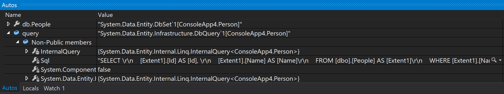

# Announcing EF 6.2 beta 1
Earlier this month, [we announced a preview of Entity Framework Core 2.0](https://blogs.msdn.microsoft.com/dotnet/2017/05/12/announcing-ef-core-2-0-preview-1/), the lightweight, extensible and cross-platform version of EF for .NET Core and .NET Framework. Today we are making the 6.2 beta 1 version of the Entity Framework runtime and the corresponding Visual Studio tooling available. EF 6.2 is a new iteration of Microsoft's more traditional object/relational mapper for .NET Framework.

## Upgrading applications to the EF 6.2 beta 1 runtime

As is usual, this prerelease version of the EF 6 runtime is [available in NuGet](https://www.nuget.org/packages/EntityFramework/6.2.0-beta1). While in Visual Studio, you can install or update the EF package in an application either by using the "Manage NuGet Packages" window (make sure the "Include prerelease" option is checked) or NuGet commands in the "Package Manager Console". E.g. to update to the beta package in an existing project:

```
PM> Update-Package EntityFramework -Version 6.2.0-beta1 -Pre
```

To install the beta package in a new project:

```
PM> Install-Package EntityFramework -Version 6.2.0-beta1 -Pre
```

## Upgrading the EF tools in Visual Studio

You can obtain [the installer](http://www.microsoft.com/downloads/details.aspx?FamilyID=9c0eb1b0-6760-4c2e-a7e5-d15be1fd0194) from the Microsoft download center. You only need to download and install the files corresponding to the versions of Visual Studio you have. Visual Studio 2012, 2013 and 2015 are supported. **Note that at this time we are not offering a beta version of the EF tools for Visual Studio 2017.** The latter requires using a different mechanism to distribute updates to components like the EF tools, and we are planning to make the update available at a later date. Most of the code of the EF tools is shared across Visual Studio versions, so testing on any version will help validate the quality of the beta. If you only have Visual Studio 2017 installed, you will still be able to upgrade your applications to use the 6.2 beta 1 version of the EF runtime while you keep using the EF tools that came included in your version of Visual Studio.

### Downgrading the EF tools in Visual Studio

When you install this beta, it will replace the tools that were included in Visual Studio or any previous versions installed. If you run into any problems using this beta, you may want to revert back to the tooling that was included with Visual Studio. You can do so by following these steps:

1.  Using Add/Remove Programs, uninstall Entity Framework Tools for Visual Studio
2.  Repair your Visual Studio install

## What is new in EF 6.2 beta 1

While most of the focus of the EF team is in adding new features and improvements to [EF Core](https://docs.microsoft.com/en-us/ef/core/index), we plan to keep fixing important bugs, implementing small improvements, and accepting community contributions into the EF 6 codebase. Thanks largely to the efforts of our community of open source contributors, EF 6.2 beta 1 contains numerous changes. The full list of improvements in this release (including bug fixes in the upcoming PowerTools release) can be seen at [this GitHub query](https://github.com/aspnet/EntityFramework6/issues?utf8=%E2%9C%93&q=is%3Aissue%20is%3Aclosed%20milestone%3A6.2.0%20label%3Aclosed-fixed%20-label%3Aarea-test%20-label%3Aarea-docs%20-label%3Atype-cleanup). Among them, it is worth mentioning:

### _Reduce start up time by loading finished code first models from a persistent cache [#275](https://github.com/aspnet/EntityFramework6/issues/275)_

You can enable this feature by including code like this in your applications:

TO-DO: insert https://gist.github.com/divega/790d94247f43f4d598961db59c4071de

### _Fluent API to define indexes [#274](https://github.com/aspnet/EntityFramework6/issues/274)_

The main addition is the `HasIndex()` method, which can be used like this:

TO-DO: insert https://gist.github.com/divega/7cdf6b54310f2f142142c2a5e31186a0

### _EF tools Update Model issue when provider reports nullable keys [#243](https://github.com/aspnet/EntityFramework6/issues/243)_

In some database reverse engineering scenarios, certain providers can incorrectly indicate that primary key columns are nullable. EF tools will no longer report this as an error but will instead ignore the incorrect nullability.

### _Add DbFunctions.Like() to enable writing LINQ queries that translate to LIKE in SQL [#241](https://github.com/aspnet/EntityFramework6/issues/241)_

Usage is as follows:

TO-DO: insert https://gist.github.com/divega/e55da2831e6a5448622c36aafc997e62

### _Migrate.exe should support -script option [#240](https://github.com/aspnet/EntityFramework6/issues/240)_

Enables generating SQL scripts for migrations using the command line tools.

### _Updating large models from database can make sp_executesql fail with too many parameters [#185](https://github.com/aspnet/EntityFramework6/issues/185)_

This is a long standing issue for working with large models against SQL Server. See ["Call to action for provider writers"](#call-to-action-for-provider-writers) bellow for more information.

### _EF6 does not work with primary key from sequence [#165](https://github.com/aspnet/EntityFramework6/issues/165)_

A flag can now be used at runtime to change how EF retrieves values generated on inserts against SQL Serer to use a mechanism that is compatible with sequences:

TO-DO: insert https://gist.github.com/divega/31a15d492283ab34e6631ab6686f6705

### _Update error numbers for SQL Azure Execution Strategy [#83](https://github.com/aspnet/EntityFramework6/issues/83)_

We have incorporated additional errors to the list of transient errors that can be recovered based on customer feedback and new data on Azure SQL Database.

### _Retrying queries or SQL commands fails with "The SqlParameter is already contained by another SqlParameterCollection" [#81](https://github.com/aspnet/EntityFramework6/issues/81)_

The issue affected several APIs when used with retrying execution strategies.

### _Evaluation of DbQuery.ToString() frequently times out in the debugger [#73](https://github.com/aspnet/EntityFramework6/issues/73)_

Based on a recommendation of the Debugger team, we added a new `Sql` property that is used when LINQ queries are examined in debugging windows such as Autos, Locals or Watch. The `ToString()` method can still be used to obtain the SQL but the debugger won't use it.
[](ef6.2-issue73-autos.png)

## Call to action for provider writers

We suspect some of the existing EF providers could be negatively impacted by a fix included in our tooling in this release, and we are asking for help from provider writers to validate this hypothesis. The fix addresses a long standing problem with schema discovery queries used in the "Update model from database" feature of the EF tools. When using the feature against a database with a large number of objects, the schema discovery queries can contain large numbers of parameters. SQL Server in particular has a limit of 2100 parameters per query, and the way the queries and the parameters are generated can cause any model with more than 300 objects to fail. This GitHub issue describes the problem in more detail: _Updating large models from database can make sp_executesql fail with too many parameters [#185](https://github.com/aspnet/EntityFramework6/issues/185)_.

### What changed

[The fix](https://github.com/aspnet/EntityFramework6/pull/193), based on an idea originally [proposed and implemented](https://github.com/aspnet/EntityFramework6/pull/41) by [@bengutt](https://github.com/bengutt), significantly reduces the number of parameters required by schema discovery queries by reusing parameter objects for each distinct value. E.g. a query that would have previously employed hundreds of parameters with the schema name `dbo` will now only contain one parameter with the value `dbo` and hundreds of references to this parameter in the query. The fix was implemented in shared code that is used across all providers and for all current and previous versions of EF, and we think it can potentially benefit other providers besides SQL Server. Therefore we would like to apply the new behavior to all providers if possible. However, if we confirm it is a breaking change for some providers, we may end up having to treat SQL Server as a special case.

### How can providers be affected

Any provider that leverages EF query capabilities to implement schema discovery, e.g. by supplying its own SSDL and MSL model files over the database schema should only benefit or be unaffected by the reduction in the number of parameters. We are aware however that some providers implement schema discovery by matching patterns in the schema discovery queries and then translating those patterns into calls to their native schema discovery API calls. Such providers need to implement some logic to match query parameters to filters in the query. Depending on how this latter piece is implemented, it might break if the number or ordering of parameters is changed as it is with this fix.

### How to report if your provider is broken by the fix

If your provider is broken, please add a comment on the GitHub issue _Call to action for provider writers: test compatibility with schema discovery queries in EF Tools 6.2 [#195](https://github.com/aspnet/EntityFramework6/issues/195)_.

## What is next after beta 1

There a few for things we plan to do in the short term on the EF 6 area:

*   We are looking at releasing a refresh of the EF 6 PowerTools with Visual Studio 2017 compatibility.
*   Once we gather and analyze customer feedback on this beta, we will decide if we need another preview release or whether we should set the dates for the final 6.2 release.
*   As mentioned before, we will be releasing EF 6.2 tools for Visual Studio 2017 at a later date.

## Thank you!

We would like to take the chance to thank the members of the .NET development community who contributed to this release, in particular those who made code contributions (in alphabetical order, by they GitHub aliases): [@axelheer](https://github.com/axelheer), [@bengutt](https://github.com/bengutt), [@brandondahler](https://github.com/brandondahler), [@ErikEJ](https://github.com/ErikEJ), [@jcchalte](https://github.com/jcchalte), [@j-Edge](https://github.com/j-Edge), [@julielerman](https://github.com/julielerman), [@montanehamilton](https://github.com/montanehamilton), [@Sebazzz](https://github.com/Sebazzz), and more!
