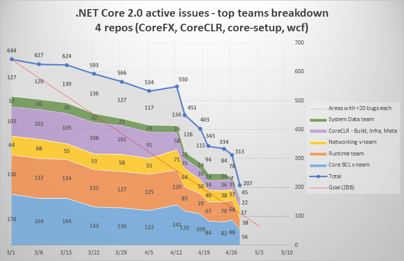

The week in .NET - .NEt Core 2.0 status, On .NET with Don Schenck on Red Hat, Fable
===================================================================================================

Previous posts:

* [Happy Birthday .NET with Chris Sells, free ASP.NET Core book, We are the Dwarves](https://blogs.msdn.microsoft.com/dotnet/2017/04/25/the-week-in-net-happy-birthday-net-with-chris-sells-free-asp-net-core-book-we-are-the-dwarves/)
* [Happy birthday .NET with Robin Cole, TinyORM, 911 Operator](https://blogs.msdn.microsoft.com/dotnet/2017/04/18/the-week-in-net-happy-birthday-net-with-robin-cole-tinyorm-911-operator/)
* [.NET Framework 4.7, reference documentation, On .NET on modular ASP.NET, Happy birthday .NET with Immo Landwerth, JustAssembly](https://blogs.msdn.microsoft.com/dotnet/2017/04/11/the-week-in-net-net-framework-4-7-reference-documentation-on-net-on-modular-asp-net-happy-birthday-net-with-immo-landwerth-justassembly/)

.NET Core 2.0 status
--------------------

Our work on .NET Core 2.0 is progressing nicely, aiming for zero active bugs for mid-May.

On .NET: Don Schenck on Red Hat
-------------------------------

Last week, Don Schenck from [Red Hat](https://www.redhat.com/en) was on the show to talk about [.NET on RHEL](https://access.redhat.com/documentation/en-us/net_core/1.1/html/getting_started_guide/).

<iframe src="https://channel9.msdn.com/Shows/On-NET/Don-Schenck-Red-Hat/player" width="960" height="540" allowFullScreen frameBorder="0"></iframe>

This week, we'll speak with [Alfonso García-Caro](https://twitter.com/alfonsogcnunez) about [Fable](http://fable.io/), the fabulous F# to JavaScript compiler.

Project of the week: Fable
--------------------------

[Fable](http://fable.io/) is an awesome project written by [Alfonso García-Caro](https://twitter.com/alfonsogcnunez) that compiles F# into (good) JavaScript.

<iframe width="853" height="480" src="https://www.youtube.com/embed/iP-50fj06Eo" frameborder="0" allowfullscreen></iframe>

Alfonso will be our guest on [On .NET](https://channel9.msdn.com/Shows/On-NET) on Thursday if you want to learn more.

Meetup of the week: Cross-platform mobile application development using Xamarin and Azure in Charlotte, NC
----------------------------------------------------------------------------------------------------------

The [Modern Devs Charlotte](https://www.meetup.com/ModernDevsCLT/) group hosts [a meeting tonight at 6:00PM in Charlotte, NC](https://www.meetup.com/ModernDevsCLT/events/238321563/) on cross-platform mobile application development using Xamarin and Azure.

.NET
----

* [Contributing to .NET for Dummies](http://rion.io/2017/04/28/contributing-to-net-for-dummies/) by Rion Williams.
* [A Visual Lexicon of LINQ](https://www.simple-talk.com/dotnet/net-development/visual-lexicon-linq/) by Michael Sorens.
* [Making string validation faster by not using a regular expression](https://blog.maartenballiauw.be/post/2017/04/24/making-string-validation-faster-no-regular-expressions.html) by Maarten Balliauw.
* [What’s New in Peachpie 0.7.0](http://www.peachpie.io/2017/04/peachpie-0-7-0.html) by Benjamin Fistein.
* [Using PInvoke with .NET Core 2 and Windows 10 IoT Core on the Raspberry Pi 3](https://jeremylindsayni.wordpress.com/2017/05/01/using-pinvoke-with-net-core-2-and-windows-10-iot-core-on-the-raspberry-pi-3/) by Jeremy Lindsay.
* [Controlling GPIO pins using a .NET Core 2 WebAPI on a Raspberry Pi, using Windows 10 or Ubuntu](https://jeremylindsayni.wordpress.com/2017/05/01/controlling-gpio-pins-using-a-net-core-2-webapi-on-a-raspberry-pi-using-windows-10-or-ubuntu/) by Jeremy Lindsay.
* [Packaging a self-contained .NET Core app for Windows Installer](https://nblumhardt.com/2017/04/netcore-msi/) by Nicholas Blumhardt.
* [Thread pool starvation? Just add another thread](https://ayende.com/blog/177953/thread-pool-starvation-just-add-another-thread) by Ayende Rahien.

ASP.NET
-------

* [ASP.NET Core Logging with Azure App Service and Serilog](https://blogs.msdn.microsoft.com/webdev/2017/04/26/asp-net-core-logging/) by Mike Rousos.
* [The MVP Show Learns about ASP.NET, Identity Server, and Heidelberg](https://blogs.msdn.microsoft.com/webdev/2017/04/26/the-mvp-show-learns-about-asp-net-identity-server-and-heidelberg/) by Jeffrey T. Fritz and Seth Juarez.
* [Reconfiguring CORS policy in ASP.NET Core at runtime](https://www.tpeczek.com/2017/04/reconfiguring-cors-policy-in-aspnet.html) by Tomasz Pęczek.
* [Publishing an ASP.NET Core website to a Linux host](https://www.meziantou.net/2017/04/25/publishing-an-asp-net-core-website-to-a-linux-host) by Gérald Barré.
* [ASP.NET Core Sample Image Resizing Service](http://sikorsky.pro/en/blog/aspnet-core-image-resizing-service) by Dmitry Sikorsky.
* [Using ImageSharp to resize images in ASP.NET Core - a comparison with CoreCompat.System.Drawing](https://andrewlock.net/using-imagesharp-to-resize-images-in-asp-net-core-a-comparison-with-corecompat-system-drawing/) by Andrew Lock.
* [Dependency Injection Conventions with ASP.NET Core 1.1 and Autofac](http://cecilphillip.com/di-conventions-with-aspnetcore/) by Cecil Phillip.
* [Leveraging Dependency Injection in ASP.NET Core](https://codewala.net/2017/02/09/leveraging-dependency-injection-asp-net-core/) by Brij Bhushan Mishra.
* [Extending Tag Helpers in ASP.NET Core Applications](http://rion.io/2017/04/27/extending-tag-helpers-in-asp-net-core-applications/) by Rion Williams.
* [General CSS path transform for ASP.NET bundling](http://gunnarpeipman.com/2017/04/css-path-transform/) by Gunnar Peipman.
* [Using Custom Environments in ASP.NET Core](https://blogs.msdn.microsoft.com/mvpawardprogram/2017/04/25/custom-environ-asp-net-core/) by Dave White.
* [Improvements to Model Binding in ASP.NET Core](https://www.simple-talk.com/dotnet/asp-net/improved-model-binding-asp-net-core/) by Dino Esposito.
* [Client IP in the ASP.NET Core behind a reverse proxy](https://devblog.dymel.pl/2017/04/25/aspnetcore-reverse-proxy-client-ip/) by Michał Dymel.
* [ASP.NET Configuration Options Will Understand Arrays](http://odetocode.com/blogs/scott/archive/2017/04/24/asp-net-configuration-options-will-understand-arrays.aspx) by K. Scott Allen.
* [A Stupid Bug and a Plea for Help](https://www.exceptionnotfound.net/a-stupid-bug-and-a-plea-for-help/) by Matthew Jones.

C#
--

* [Spans and ref part 1 : ref](http://blog.marcgravell.com/2017/04/spans-and-ref-part-1-ref.html) and [part 2 : spans](http://blog.marcgravell.com/2017/04/spans-and-ref-part-2-spans.html) by Marc Gravell.
* [Surprise! Creating an instance of an open generic type](https://codeblog.jonskeet.uk/2017/04/26/surprise-creating-an-instance-of-an-open-generic-type/) by Jon Skeet.
* [Common Multithreading Mistakes in C# - IV: Everything Else](http://benbowen.blog/post/cmmics_iv/) by Ben Bowen.
* [TDDing into a Fibonacci Sequence in C#](https://jeremybytes.blogspot.co.uk/2017/04/tdding-into-fibonacci-sequence-in-c.html) by Jeremy Clark.
* [C# Futures: Relaxed Overrides](https://www.infoq.com/news/2017/04/CSharp-covariant-return) by Jonathan Allen.
* [C# Futures: Read-Only Local Variables](https://www.infoq.com/news/2017/04/CSharp-Readonly-Locals) by Jonathan Allen.

F#
--

* [JetBrains' Rider supports F#](https://blog.jetbrains.com/dotnet/2017/04/27/rider-eap-21-f-support-bundled-tfs-plugin/)
* [What’s New in Visual Studio 2017 for F# For Developers](https://www.linkedin.com/learning/what-s-new-in-visual-studio-2017-for-f-for-developers), by Kit Eason
* [From Dependency injection to dependency rejection](https://www.youtube.com/watch?v=cxs7oLGrxQ4&feature=youtu.be), by Mark Seemann
* [reF#ACTORing using F# and actor model](http://www.channel64.net/2017/04/refactoring-using-f-and-actor-model.html), by Vagif Abilov
* [F# Tutorial](http://www.codechannels.com/video/derekbanas/fsharp/f-tutorial/), by Derek Banas
* [Taming Cloud Complexity with F# DSLs](https://www.youtube.com/watch?v=_g4am_bLJUs), by Yan Cui
* [Visualizing Olympic Medals with F# and Fable](https://www.youtube.com/watch?v=M9xk7KkSY1A), by Tomas Petricek
* [Serverless F# with Azure Functions: fsibot goes nano-services](https://www.youtube.com/watch?v=t916ikik6W0), by Mathias Brandewinder

New F# language Suggestions:

* [Allow easier access to properties common to all cases in Discriminated Union](https://github.com/fsharp/fslang-suggestions/issues/564)
* [Make Units of Measure available to more types](https://github.com/fsharp/fslang-suggestions/issues/563)
* [Native Number Support and Improvements](https://github.com/fsharp/fslang-suggestions/issues/562)
* [Allow `use` bindings in class scope with primary constructor](https://github.com/fsharp/fslang-suggestions/issues/561)

There is much, much more content available this week in [F# Weekly](https://sergeytihon.wordpress.com/category/f-weekly/).  If you want to see more F# awesomeness, please check it out!

Xamarin
-------

* [Stable Release: Xamarin Workbooks](https://releases.xamarin.com/stable-release-xamarin-workbooks-inspector-1-2-2/) by Bri Brothers.
* [Beta Release: Xamarin 15.2 Preview 1](https://releases.xamarin.com/beta-release-15-2-preview-1/) by Bri Brothers.
* [Podcast: Building Up to Build](https://blog.xamarin.com/podcast-building-build/) by Pierce Boggan.
* [Implementing Push Notifications in Your Android Apps](https://blog.xamarin.com/implementing-push-notifications-android-apps/) by Mark McLemore.
* [Visual Studio 2017 for the Mobile Developer](https://blog.xamarin.com/visual-studio-loves-mobile-developers/) by Mayur Tendulkar.
* [Using Xamarin Forms with .NET Standard – VS 2017 Edition](https://oren.codes/2017/04/23/using-xamarin-forms-with-net-standard-vs-2017-edition/) by Oren Novotny.
* [Mobile Games using Xamarin Forms and Azure Service Fabric with Jon Peppers](http://www.dotnetrocks.com/default.aspx?ShowNum=1435) by .NET Rocks!.
* [Choosing CPU Architecture and SDK Version](https://xamarinhelp.com/choosing-cpu-architecture-sdk-version/) by Adam Pedley.
* [Xamarin Forms FastRenderers for Android](https://xamarinhelp.com/xamarin-forms-fastrenderers-android/) by Adam Pedley.
* [Xamarin DevOps](https://mobileprogrammerblog.wordpress.com/2017/04/26/xamarin-devops/) by Daniel Krzyczkowski.
* [Episode 22: Kimono Designer for SkiaSharp with Kevin Mullins](https://channel9.msdn.com/Shows/XamarinShow/Episode-22-Kimono-Designer-for-SkiaSharp) by The Xamarin Show.
* [Rearchitecting Visual Studio 2017](https://channel9.msdn.com/Shows/Visual-Studio-Toolbox/Rearchitecting-Visual-Studio-2017) by Visual Studio Toolbox.
* [Xamarin.Controls – Xamarin.Forms FloatingActionButton (including iOS!)](https://alexdunn.org/2017/04/26/xamarin-controls-xamarin-forms-floatingactionbutton-including-ios/) by Alex Dunn.
* [Custom Fonts in Xamarin.Forms](https://codemilltech.com/fantastic-fonts-in-xamarin-forms/) by Matthew Soucoup.

Azure
-----

* [Azure Management Libraries for .NET generally available now](https://azure.microsoft.com/en-us/blog/azure-management-libraries-for-net-generally-available-now/) by Asir Selvasingh.
* [New Azure Media Services quickstart template for Orchard CMS Video Portal integration](http://southworks.com/blog/2017/03/31/new-azure-media-services-quickstart-template-for-orchard-cms-video-portal-integration/) by Mariano Converti.
* [Haskell Functions on Azure Functions](http://blog.hovland.xyz/2017-04-30-haskell-functions-on-azure-functions) by Tor Hovland.
* [Extending Azure AD B2C with Custom Application Permissions](http://web-matters.blogspot.co.uk/2017/05/extending-azure-ad-b2c-permissions.html) by Andy Butland.
* [Automatically build and deploy ASP.NET Core projects to Azure App Services](https://blogs.msdn.microsoft.com/visualstudio/2017/04/25/automatically-build-and-deploy-asp-net-core-projects-to-azure-app-services/) by Ahmed Metwally.

UWP
----

* [Master the Master-Detail Pattern](https://blogs.windows.com/buildingapps/2017/05/01/master-master-detail-pattern/) By Windows Apps Team.
* [#Hololens - Alternative fix to the TapToPlace and WorldAnchor issue (until official #HoloToolkit release)](https://elbruno.com/2017/04/26/hololens-solucion-al-problema-con-taptoplace-agregando-validacion-de-planos-hasta-que-holotoolkit-sea-compatible/).
* [#Hololens - #SpatialMapping, tutorial search for simple surfaces (1×1 floor tile)](https://elbruno.com/2017/04/25/hololens-spatialmapping-tutorial-search-for-simple-surfaces-1x1-floor-tile/).
* [3 reasons to use the MVVM pattern](http://www.mrlacey.com/2017/04/3-reasons-to-use-mvvm-pattern.html).

Data
----

* [Step by step: Couchbase Lite with .Net Core](https://carlos.mendible.com/2017/04/29/step-by-step-couchbase-lite-with-net-core/) by Carlos Mendible.
* [Writing a time series database with Voron](https://ayende.com/blog/177955/writing-a-time-series-database-with-voron) by Ayende Rahien.

And this is it for this week!

Contribute to the week in .NET
------------------------------

As always, this weekly post couldn't exist without community contributions, and I'd like to thank all those who sent links and tips. The F# section is provided by [Phillip Carter](https://twitter.com/_cartermp), the gaming section by [Stacey Haffner](https://twitter.com/yecats131), the Xamarin section by [Dan Rigby](https://twitter.com/DanRigby), and the UWP section by [Michael Crump](http://twitter.com/mbcrump).

You can participate too. Did you write a great blog post, or just read one? Do you want everyone to know about an amazing new contribution or a useful library? Did you make or play a great game built on .NET?
We'd love to hear from you, and feature your contributions on future posts:

* Send an email to beleroy at Microsoft,
* [Comment on this gist](https://gist.github.com/bleroy/6aa2d26d6360c40834348f08c257d8bb)
* Leave us a pointer in the comments section below.
* [Send Stacey (@yecats131) tips on Twitter about .NET games](https://twitter.com/yecats131).

This week's post (and future posts) also contains news I first read on [The ASP.NET Community Standup](https://blogs.msdn.microsoft.com/webdev/tag/communitystandup/), on [Weekly Xamarin](http://weeklyxamarin.com/), on [F# weekly](https://sergeytihon.wordpress.com/category/f-weekly/), and on [The Morning Brew](http://themorningbrew.net/).
