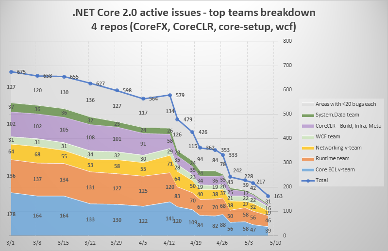
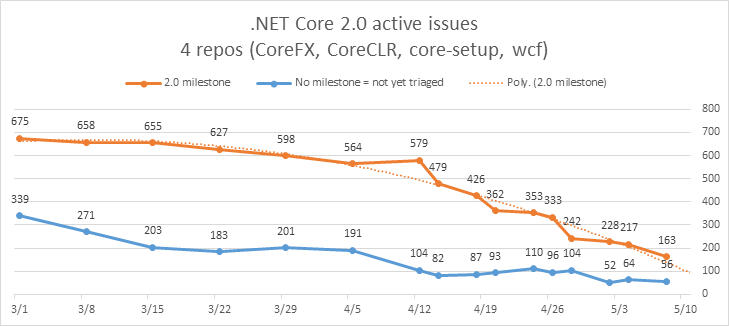

The week in .NET - Microsoft Build 2017, .NET Core 2.0 status, Happy birthday .NET with Eilon Lipton, On .NET with Alfonso García-Caro on Fable, Stanford CoreNLP
========================================================================================================================

Previous posts:

* [.NET Architecture, .NET Core 2.0 status, Happy Birthday .NET with Matt Gertz, On .NET with Don Schenck on Red Hat, Fable](https://blogs.msdn.microsoft.com/dotnet/2017/05/02/the-week-in-net-net-core-2-0-status-happy-birthday-net-with-matt-gertz-on-net-with-don-schenck-on-red-hat-fable/)
* [Happy Birthday .NET with Chris Sells, free ASP.NET Core book, We are the Dwarves](https://blogs.msdn.microsoft.com/dotnet/2017/04/25/the-week-in-net-happy-birthday-net-with-chris-sells-free-asp-net-core-book-we-are-the-dwarves/)
* [Happy birthday .NET with Robin Cole, TinyORM, 911 Operator](https://blogs.msdn.microsoft.com/dotnet/2017/04/18/the-week-in-net-happy-birthday-net-with-robin-cole-tinyorm-911-operator/)

Microsoft Build 2017
--------------------

The [Microsoft Build 2017](https://build.microsoft.com/) conference starts tomorrow in Seattle! You can [watch the conference live](https://channel9.msdn.com/?wt.mc_id=build_hp) starting at 8:00AM Pacific Time and get the scoop.

.NET Core 2.0 status
--------------------

Only a few days to go before we reach zero bugs. Great progress has been made, but we are still 163 bugs away from zero.





Happy birthday .NET with Eilon Lipton
-------------------------------------

In February we took a camera crew to the Microsoft Alumni Network's big .NET 15th birthday bash and caught up with team members past and present. In this interview we chat with Eilon Lipton who's been a developer at Microsoft since 2002 working mostly on the ASP.NET web stack. He chats about his masterpiece, the update panel (eeeek!), and some of the other great moments in .NET and his career.

<iframe src="https://channel9.msdn.com/Blogs/funkyonex/Happy-Birthday-NET-with-Eilon-Lipton/player" width="960" height="540" allowFullScreen frameBorder="0"></iframe>

On .NET: Alfonso García-Caro on Fable
-------------------------------------

Last week, we spoke with <a href="https://twitter.com/alfonsogcnunez">Alfonso García-Caro</a> about <a href="http://fable.io/">Fable</a>, the fabulous F# to JavaScript compiler.

<iframe src="https://channel9.msdn.com/Shows/On-NET/Alfonso-Garca-Caro-Fable/player" width="960" height="540" allowFullScreen frameBorder="0"></iframe>

Package of the week: Stanford CoreNLP
-------------------------------------

[Stanford CoreNLP](https://stanfordnlp.github.io/CoreNLP/index.html) is a fascinating natural language processing library with a nice [.NET version, Stanford.NLP.NET](http://sergey-tihon.github.io/Stanford.NLP.NET//samples/CoreNLP.Simple.html).

```fsharp
open edu.stanford.nlp.simple

// Create a document. No computation is done yet.
let doc : Document = new Document("add your text here! It can contain multiple sentences.");
let sentences = doc.sentences().toArray()
for sentObj in sentences do  // Will iterate over two sentences
    let sent : Sentence = sentObj :?> Sentence
    // We're only asking for words -- no need to load any models yet
    Console.WriteLine("The second word of the sentence '{0}' is {1}", sent, sent.word(1));
    // When we ask for the lemma, it will load and run the part of speech tagger
    Console.WriteLine("The third lemma of the sentence '{0}' is {1}", sent, sent.lemma(2));
    // When we ask for the parse, it will load and run the parser
    Console.WriteLine("The parse of the sentence '{0}' is {1}", sent, sent.parse());
```

```
The second word of the sentence 'add your text here!' is your
The third lemma of the sentence 'add your text here!' is text
The parse of the sentence 'add your text here!' is (ROOT (S (VP (VB add) (NP (PRP$ your) (NN text)) (ADVP (RB here))) (. !)))
The second word of the sentence 'It can contain multiple sentences.' is can
The third lemma of the sentence 'It can contain multiple sentences.' is contain
The parse of the sentence 'It can contain multiple sentences.' is (ROOT (S (NP (PRP It)) (VP (MD can) (VP (VB contain) (NP (JJ multiple) (NNS sentences)))) (. .)))
```

Meetup of the week: Kafka for .NET in Morrisville, NC
-----------------------------------------------------

The [Triangle .NET User Group](https://www.meetup.com/TRINUG/) holds [a meeting on Wednesday at 5:30PM in Morrisville, NC](https://www.meetup.com/TRINUG/events/239527286/) where you'll learn about Kafka, Apache's distributed publish-subscribe messaging system.

## .NET

* [Announcing the .NET Framework 4.7 General Availability](https://blogs.msdn.microsoft.com/dotnet/2017/05/02/announcing-the-net-framework-4-7-general-availability/) by Rich Lander.
* [Arrays and the CLR - a Very Special Relationship](http://mattwarren.org/2017/05/08/Arrays-and-the-CLR-a-Very-Special-Relationship/) by Matt Warren.
* [ClrMD Part 3 – Dealing with static and instance fields to list timers](http://labs.criteo.com/2017/05/clrmd-part-3-dealing-static-instance-fields-list-timers/) by Christophe Nasarre and Kevin Gosse.
* [Use a XBox Controller to control your Angular2 App](http://lostindetails.com/blog/post/Use-a-XBox-Controller-to-control-your-Angular2-app) by Martin Kramer.
* [Testing .NET Core with NUnit in Visual Studio 2017](http://www.alteridem.net/2017/05/04/test-net-core-nunit-vs2017/) by Rob Prouse.
* [Who needs Visual Studio? A look at using .NET Core on Linux](http://www.postsharp.net/blog/post/webinar-recording-dotnetcore-on-linux) by Iveta Moldavcuk .
* [Debugging .NET core with SOS everywhere](https://blogs.msdn.microsoft.com/premier_developer/2017/05/02/debugging-net-core-with-sos-everywhere/) by Pam Lahoud.
* [Step by step: Kafka Pub/Sub with Docker and .Net Core](https://carlos.mendible.com/2017/05/08/step-by-step-kafka-pub-sub-with-docker-and-net-core/) by Carlos Mendible.
* [How to Write a Sophisticated SPA: TodoMVC using C#](https://hackernoon.com/how-to-write-a-sophisticated-spa-todomvc-using-c-df81ea50f4e0) by Muigai Mwaura.
* [Using .NET Core 2 to read from an I2C device connected to a Raspberry Pi 3 with Ubuntu 16.04](https://jeremylindsayni.wordpress.com/2017/05/08/using-net-core-2-to-read-from-an-i2c-device-connected-to-a-raspberry-pi-3-with-ubuntu-16-04/) by Jeremy Lindsay.
* [Domain Command Patterns - Handlers](https://jimmybogard.com/domain-command-patterns-handlers/) by Jimmy Bogard.
* [Fiddler And LINQ](https://textslashplain.com/2017/05/03/fiddler-and-linq/) by Eric Lawrence.
* [Maximizing Throughput - The Overhead of 1 Million Tasks](https://www.danielcrabtree.com/blog/248/maximizing-throughput-the-overhead-of-1-million-tasks) by Daniel Crabtree.

## ASP.NET

* [Extending RestSharp to Handle Timeouts in ASP.NET MVC](https://www.exceptionnotfound.net/extending-restsharp-to-handle-timeouts-in-asp-net-mvc/) by Matthew Jones.
* [Starting a http file server from the file explorer using .NET Core](https://www.meziantou.net/2017/05/02/starting-a-http-file-server-from-the-file-explorer-using-net-core) by Gérald Barré.
* [ASP.NET Core – API versioning by convention](https://tpodolak.com/blog/2017/05/04/asp-net-core-api-versioning-convention/) by TPodolak.
* [IIS and ASP.NET Core Rewrite Rules for Static Files and Html 5 Routing](https://weblog.west-wind.com/posts/2017/Apr/27/IIS-and-ASPNET-Core-Rewrite-Rules-for-AspNetCoreModule) by Rick Strahl.
* [Large JSON Array Streaming in ASP.NET Web API](https://www.codeproject.com/Articles/1180464/Large-JSON-Array-Streaming-in-ASP-NET-Web-API) by Robert Vandenberg Huang.
* [Create API with ASP.NET Core (Day 1): Getting Started and ASP.NET Core Request Pipeline](https://www.codeproject.com/Articles/1184870/Create-API-with-ASP-NET-Core-Day-Getting-Started-a) by Akhil Mittal.
* [Installing ASP.NET Core Docker For Windows](https://www.codeproject.com/Articles/1185904/Installing-ASP-NET-Core-Docker-For-Windows) by Sibeesh Passion.
* [Login & Authentication for your ASP.NET Core Web API – The Big Picture](https://jonhilton.net/2017/05/03/login-authentication-asp-net-core-web-api-big-picture/) by Jon Hilton.
* [Using Angular in an ASP.NET Core View with Webpack](https://damienbod.com/2017/05/02/using-angular-in-an-asp-net-core-view-with-webpack/) by damienbod.
* [Secure ASP.NET Core MVC with Angular using IdentityServer4 OpenID Connect Hybrid Flow](https://damienbod.com/2017/05/06/secure-asp-net-core-mvc-with-angular-using-identityserver4-openid-connect-hybrid-flow/) by damienbod.
* [Plugins for ASP.NET Core Middleware](https://devblog.dymel.pl/2017/05/03/aspnetcore-middleware-plugins/) by Michal Dymel.
* [Publish And Deploy ASP.NET Core MVC On IIS](http://www.c-sharpcorner.com/article/publish-and-deploy-asp-net-core-mvc-on-iis/) by Jignesh Trivedi.
* [Using ImageSharp to resize images in ASP.NET Core - Part 2](https://andrewlock.net/using-imagesharp-to-resize-images-in-asp-net-core-part-2/) by Andrew Lock.
* [Registering Open Generics in ASPNET Core Dependency Injection](http://ardalis.com/registering-open-generics-in-aspnet-core-dependency-injection) by Steve Smith.
* [When Should You Upgrade to ASP.NET Core?](http://ardalis.com/when-should-you-upgrade-to-asp-net-core) by Steve Smith.
* [Self Descriptive HTTP API in ASP.NET Core: Object as Resource](https://codeopinion.com/self-descriptive-http-api-in-asp-net-core-object-as-resource/) by Derek Comartin.
* [Adding WebApi & OAuth Authentication to an Existing Project](https://blogs.msdn.microsoft.com/mvpawardprogram/2017/05/02/adding-webapi-oauth-auth/) by Mitchell Sellers.
* [ASP.NET Core Anatomy (Part 4) – Invoking the MVC MiddlewareDissecting and understanding the internals of ASP.NET Core](https://www.stevejgordon.co.uk/invoking-mvc-middleware-asp-net-core-anatomy-part-4) by Steve Gordon.

## C#

* [Just Another .NET AOP Framework: NConcern](https://www.codeproject.com/Tips/1185797/Just-Another-NET-AOP-Framework-NConcern) by Jung Hyun, Nam.
* [Practical C# Videos – Tuples and Is Expression](http://www.andreaangella.com/2017/05/csharp-videos-tuples-is-expression/) by Andrea Angella.
* [The curious case of async, await, and IDisposable](http://thebillwagner.com/Blog/Item/2017-05-03-ThecuriouscaseofasyncawaitandIDisposable) by Bill Wagner.
* [De-virtualization in CoreCLR: Part I](https://ayende.com/blog/177986/de-virtualization-in-coreclr-part-i) by Ayende Rahien.
* [De-virtualization in CoreCLR: Part II](https://ayende.com/blog/177987/de-virtualization-in-coreclr-part-ii?Key=abe080c5-2d7d-4352-84e1-3da60103f3d6) by Ayende Rahien.
* [.NET Core with csproj](https://csharp.christiannagel.com/2017/05/05/dotnetcore/) by Christian Nagel.

## F#

* [F# Survey 2017](https://docs.google.com/forms/d/e/1FAIpQLSeZ1EJe1pfztiUudIclcMU1lV-vXCUlGqECPQMZxFD6Q0zGoA/viewform) by the F# community.
* [Tooling for Your .NET Projects](http://www.codemag.com/article/1705051), by Rachel Reese
* [ON.NET - Alfonso García-Caro – Fable](https://channel9.msdn.com/Shows/On-NET/Alfonso-Garca-Caro-Fable)
* [Calling F# Code in a C# Project](http://connelhooley.uk/blog/2017/04/30/f-sharp-to-c-sharp), by Connel Hooley
* [Scratching a 7-Year Itch](https://pblasucci.wordpress.com/2017/05/02/seven-year-itch/), by Paulmichael Blasucci
* [Higher Kindended Types in F# Part IV – Signature Annotations](https://robkuz.github.io/HKTs-in-fsharp-part-IV-Signature-Annotations/), by Robert Kuzelj

New F# RFCs:

* [F# RFC FS-1032 – Support for F# in the dotnet sdk](https://github.com/fsharp/fslang-design/blob/master/RFCs/FS-1032-fsharp-in-dotnet-sdk.md)
* [F# RFC FS-1033 – Extend String module](https://github.com/fsharp/fslang-design/blob/master/RFCs/FS-1033-extend-string-module.md)

There is more content available this week in [F# Weekly](https://sergeytihon.wordpress.com/category/f-weekly/).  If you want to see more F# awesomeness, please check it out!

## Xamarin

* [Xamarin Beta Release: 15.2 Preview 2](https://releases.xamarin.com/beta-release-15-2-preview-2/) by Luis Aguilera.
* [Pre-release: Xamarin.Forms 2.3.5.235-pre2](https://releases.xamarin.com/pre-release-xamarin-forms-2-3-5-235-pre2/) by David Ortinau.
* [Xamarin University Guest Lecture Recordings Now Free for Everyone!](https://blog.xamarin.com/xamarin-university-guest-lecture-recordings-now-free-everyone/) by Mark Smith.
* [Making Your Xamarin.Forms Apps Accessible](https://blog.xamarin.com/accessbility-xamarin-forms/) by Paul DiPietro.
* [Shopbox Uses C# to Empower Small Business Owners with the Point of Sale System of the Future](https://blog.xamarin.com/shopbox-uses-c-empower-small-business-owners-pos-system-future/) by Lacey Butler.
* [Welcome the New Xamarin MVPs!](https://blog.xamarin.com/welcome-new-xamarin-mvps/) by Jayme Singleton.
* [Xamarin Events Blossoming in May](https://blog.xamarin.com/xamarin-events-blossoming-may/) by Jayme Singleton.
* [Developing Enterprise Apps using Xamarin.Forms](https://blog.xamarin.com/developing-enterprise-apps-using-xamarin-forms/) by David Britch.
* [Snack Pack 11: Understanding Android API Level Settings](https://channel9.msdn.com/Shows/XamarinShow/Snack-Pack-11-Understanding-Android-API-Level-Settings) by The Xamarin Show.
* [Moving towards MvvmCross 5.0](https://www.mvvmcross.com/mvvmcross/2016/12/14/MovingtowardsMvvmCross5.html) by MvvmCross.
* [Create a Backend for Xamarin.Forms using Azure Mobile App's Easy Tables](https://mindofai.github.io/Create-a-Backend-for-Xamarin.Forms-using-Azure-Mobile-App-Service/) by Bryan Anthony Garcia.
* [Fantastic Fonts in Xamarin.Forms](https://codemilltech.com/fantastic-fonts-in-xamarin-forms/) by Matthew Soucoup.
* [Things I Think Are Cool: JSON Copy in Xamarin Studio](https://codemilltech.com/things-i-think-are-cool-p/) by Matthew Soucoup.
* [Xamarin.Tips – Creating a Material Design Button in iOS](https://alexdunn.org/2017/05/02/xamarin-tips-creating-a-material-design-button-in-ios/) by Alex Dunn.
* [Xamarin.Tips – Making Your iOS Frame Shadows More Material](https://alexdunn.org/2017/05/01/xamarin-tips-making-your-ios-frame-shadows-more-material/) by Alex Dunn.
* [Xamarin.Tips – Bringing Material Design Fonts to iOS](https://alexdunn.org/2017/05/03/xamarin-tips-bringing-material-design-fonts-to-ios/) by Alex Dunn.
* [Xamarin.Tips – Overriding Android Button Shadows/Elevation](https://alexdunn.org/2017/05/04/xamarin-tips-overriding-android-button-shadowselevation/) by Alex Dunn.
* [Xamarin forms – custom ListView separator without BoxView](http://depblog.weblogs.us/2017/04/29/xamarin-forms-custom-listview-separator-without-boxview/) by Glenn Versweyveld.
* [Get more reviews for your Xamarin.Forms app with iOS 10.3](https://blog.verslu.is/xamarin/xamarin-forms-xamarin/get-more-reviews-for-your-xamarin-forms-app-with-ios-10-3/) by Gerald Versluis.
* [Xamarin Forms For Windows Developers: Tips, Tricks And Lessons Learned, Part 1](http://www.wintellect.com/devcenter/speterson/xamarin-forms-for-windows-developers-tips-tricks-and-lessons-learned-part-1) by Scott Peterson.
* [Xamarin Forms For Windows Developers: Tips, Tricks And Lessons Learned, Part 2](http://www.wintellect.com/devcenter/speterson/xamarin-forms-for-windows-developers-tips-tricks-and-lessons-learned-part-2) by Scott Peterson.
* [Solving Real-World Problems with Xamarin.Forms](http://developer.telerik.com/products/ui-for-xamarin/solving-real-world-problems-with-xamarin-forms/) by Sam Basu.
* [Android emulator crashes as soon as it starts](http://www.devprotocol.com/android-emulator-crashes-as-soon-as-it-starts/) by Jan Tourlamain.

## Azure

* [Filtering Application Insights](http://blog.ramondeklein.nl/2017/05/05/filtering-application-insights/) by Ramon de Klein.
* [Build a Serverless MBaaS with Azure Functions](https://shellmonger.com/2017/05/03/build-a-serverless-mbaas-with-azure-functions/) by Adrian Hall.

## UWP

* [Make App Promotions Work: Acquire & Re-engage the Right Set of Users](https://blogs.windows.com/buildingapps/2017/05/01/make-app-promotions-work-acquire-re-engage-right-set-users/) By Kiran Bangalore
* [Master the Master-Detail Pattern](https://blogs.windows.com/buildingapps/2017/05/01/master-master-detail-pattern/) By Windows Apps Team
* [Hitchhiking the HoloToolkit-Unity, Leg 14-More with Spatial Understanding](https://mtaulty.com/2017/05/03/hitchhiking-the-holotoolkit-unity-leg-14-more-with-spatial-understanding/) by Mike Taulty
* [CultureInfo changes in UWP - Part 2](https://www.pedrolamas.com/2017/05/03/cultureinfo-changes-in-uwp-part-2/) by Pedro Lamas

## Data

* [What is Micro ORM?](http://gunnarpeipman.com/2017/05/micro-orm/) by Gunnar Peipman.

And this is it for this week!

Contribute to the week in .NET
------------------------------

As always, this weekly post couldn't exist without community contributions, and I'd like to thank all those who sent links and tips. The F# section is provided by [Phillip Carter](https://twitter.com/_cartermp), the gaming section by [Stacey Haffner](https://twitter.com/yecats131), the Xamarin section by [Dan Rigby](https://twitter.com/DanRigby), and the UWP section by [Michael Crump](http://twitter.com/mbcrump).

You can participate too. Did you write a great blog post, or just read one? Do you want everyone to know about an amazing new contribution or a useful library? Did you make or play a great game built on .NET?
We'd love to hear from you, and feature your contributions on future posts:

* Send an email to beleroy at Microsoft,
* [Comment on this gist](https://gist.github.com/bleroy/f5b49a6f813ca6abce92d0da7bc9c63f)
* Leave us a pointer in the comments section below.
* [Send Stacey (@yecats131) tips on Twitter about .NET games](https://twitter.com/yecats131).

This week's post (and future posts) also contains news I first read on [The ASP.NET Community Standup](https://blogs.msdn.microsoft.com/webdev/tag/communitystandup/), on [Weekly Xamarin](http://weeklyxamarin.com/), on [F# weekly](https://sergeytihon.wordpress.com/category/f-weekly/), and on [The Morning Brew](http://themorningbrew.net/).
