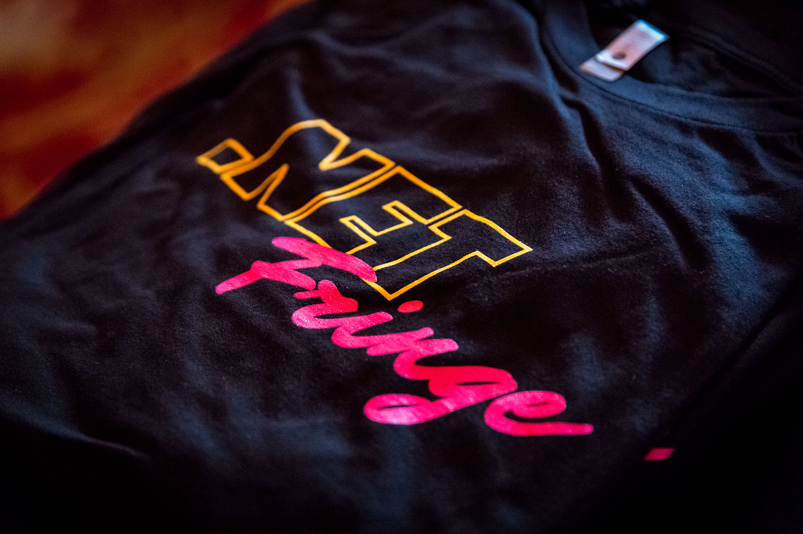
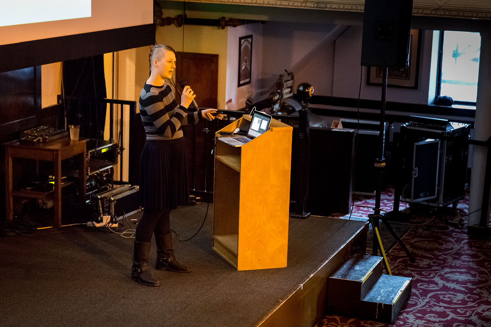
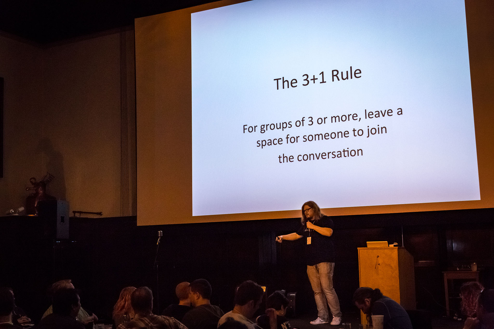
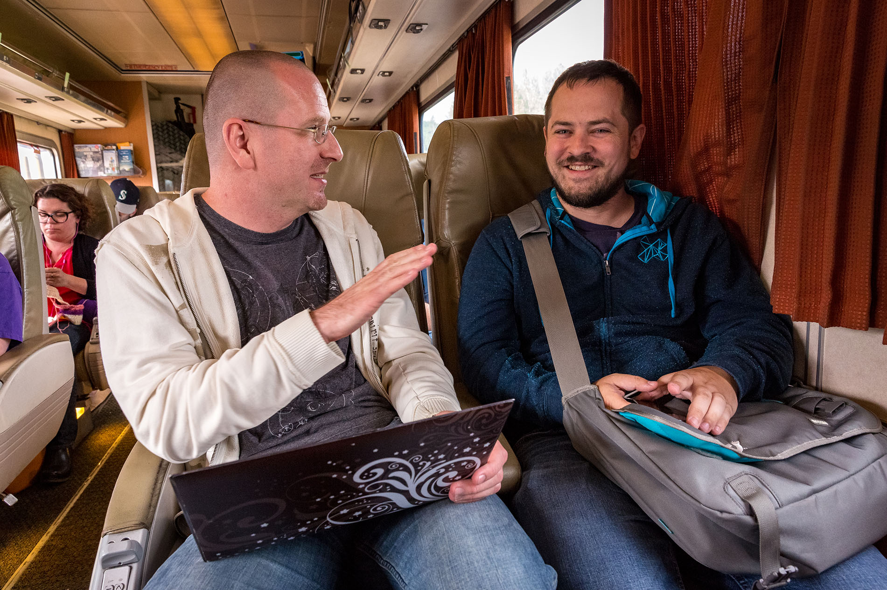

# .NET Fringe: A Great Role Model for Community Oriented Conferences

A few of us just went to a smaller .NET conference in Portland, called [.NET
Fringe](http://dotnetfringe.org). For me, it was the third time I attended .NET
Fringe. I've realized that this conference has gained a special place in my
heart, so thought it would be worthwhile writing up why that is.

My goal isn't to convince you to attend .NET Fringe in particular, but to
outline what makes it special and what you should seek out when choosing
conferences to attend to or speak at. And if you're a conference organizer, I
hope I can motivate you to take a look at .NET Fringe and see it as a role
model.



## What are *you* looking for?

It's important to realize that different styles of conferences are good at
different things:

* **Blockbuster movie-style**. Larger conferences (like Build, Google IO, or
  WWDC) are great for learning how a particular company sees the future and what
  technology it provides to get you there. These conferences often provide deep
  dives for specific technologies, allowing you to strengthen your understanding
  while also giving you a broader picture of their stack. I like to think of
  these as *blockbuster movies* because they focus on broadcasting a particular
  message to the mainstream, which makes you mostly a consumer.

* **Boardgame-style**. Smaller conferences are often very good at networking
  between attendees and speakers. And depending on the diversity of the talks
  they can also do an amazing job at inspiring you. They often involve
  activities beyond the talks, such as "mingling", round tables, and lightning
  talks. As an attendee, you're not just a consumer, you're also an active
  participant in providing content for other attendees. That's why I like to
  think of these conferences as *boardgames* -- the players are part of the
  experience.

I don't want to promote one style or the other here. The number one thing that I
hear from customers is that it's becoming harder and harder to keep up-to-date
with what's going on. Blockbuster conferences are really good at providing a
time efficient way to gain a picture of the landscape, while the smaller
conferences allow you to exchange with others how to apply that knowledge to
your particular situation.

And let's not forget that the tech itself is only part of the challenge we're
facing as developers, architects, team leads and product owners. We also have to
deal with managing projects, leading people, balancing family & work, and
handling stress & burn out. Those topics are usually not addressed by the
blockbuster conferences at all.

## What makes .NET Fringe special?

The organizers of .NET Fringe have made it a key point that diversity isn't just
a keyword. They go out of their way to seek out diverse speakers, from all sorts
of skills & backgrounds. And that's a very good thing in my opinion. At
Microsoft, [we believe that diversity is a key ingredient of innovation][blog-diversity].
Based on my personal experience at Microsoft I can say that a good chunk of the
skills I gained is a direct result of the diverse culture we have on my team.
Exposing yourself to people with different opinions is not only refreshing, it
makes sure you don't get too comfortable in the way things are, which is vitally
important considering the number one invariant in our industry is change.



While .NET Fringe is (obviously) focused on the .NET stack, the topics aren't
exclusively about .NET. Some of the talks were much broader, for instance one
talk was about linguistics and how particular grammar and language constructs
have a profound and lasting impact on they way we think and they way we become
biased to particular patterns. Another talk was motivating the audience to
become polyengineers, which means an engineer of many technologies, to avoid
being replaced by automatism.

I also quite like the format of the sessions: There were no long talks. Full
sessions were 30 minutes, and they were often separated by lightning talks,
which are only 5 minutes long. The cool thing about lightning talks is that you
can sign up for them during the conference. It's a great way to get your feet
wet on talking at conferences. As an attendee, I really enjoy the mix because it
avoids the typical conference fatigue after watching multiple 60 minute
sessions. And the lack of traditional Q&A is easily offset by the fact the
conference is small and attendees just talk to the speaker afterwards.

On top of that, the organizers provided guided mingling, encouraging the
attendees to talk to each other during breaks. While we often celebrate the
extroverted speakers and hero developers, most of us are quite shy when it comes
to interacting with people we've never met. Being constantly reminded that we
all have these fears is helping form a welcoming and family-like atmosphere
where meeting new people is incredibly easy and pleasant.



The socializing component was helped tremendously by having the conference
venue, hotels, and restaurants and bars for the parties all within walking
distance. This ensures that attendees are never far from each other and groups
can form that retain the social momentum from the conference well into personal
time.

A very unique thing about .NET Fringe is the Geek Train: is an organized train
ride from Seattle to Portland. So the socializing doesn't start at the
conference, it starts during travel to the conference.



One downside of smaller conferences is that speakers are often not too inclined
to spend their time preparing a talk because they can only reach a small
audience. This is the first time the organizers of .NET Fringe have had live-
broadcasting of the conference to YouTube. Of course each talk is also recorded
and [available separately][playlist]. As a speaker, this ensures you'll get the
reach your talk deserves.

But as a speaker myself I wasn't too concerned about reach. Personally, I gained
a lot from the discussions I had with other attendees. This also includes a
passionate round table discussion on abuse in open source projects and what we
can do as maintainers and contributors to avoid burning out maintainers and
helping more people to be successful first time contributors.

## Highlighted Talks

Picking favorites is always hard and fundamentally unfair. But here is my fully
biased set of talks that I encourage you check out from .NET Fringe:

**Full Talks (30 min)**

* [Sergey Bykov - Orleans: Rails for the Cloud](https://www.youtube.com/watch?v=tsolQ4pKM6U&amp;index=33&amp;list=PLwZVRWVJepJtK6UZD-m2VLU2k2V-O5OrG)
* [Sean Killeen - Casting a Wider .NET: OSS Maturity in the .NET Community](https://www.youtube.com/watch?v=jFDXNGFvcYg&amp;index=1&amp;list=PLwZVRWVJepJtK6UZD-m2VLU2k2V-O5OrG)
* [Immo Landwerth - .NET Standard for Library Authors](https://www.youtube.com/watch?v=Jnll5Owpwms&amp;index=22&amp;list=PLwZVRWVJepJtK6UZD-m2VLU2k2V-O5OrG)
* [Mikayla Hutchinson - Mono: Today and Tomorrow](https://www.youtube.com/watch?v=uxzS-grpN4c&amp;index=17&amp;list=PLwZVRWVJepJtK6UZD-m2VLU2k2V-O5OrG)
* [Karel Zikmund - Challenges of Managing CoreFX Repo](https://www.youtube.com/watch?v=Kcm0ns1pzm0&amp;index=38&amp;list=PLwZVRWVJepJtK6UZD-m2VLU2k2V-O5OrG)
* [Alistair Champan - Using Docker to supercharge .NET development on Linux](https://www.youtube.com/watch?v=D5i-CkOD7UY&amp;index=16&amp;list=PLwZVRWVJepJtK6UZD-m2VLU2k2V-O5OrG)

**Lightning Talks (5 min)**

* [Daniel Plaisted - Handbell Hero](https://www.youtube.com/watch?v=YgMFz7MDAJs&amp;index=6&amp;list=PLwZVRWVJepJtK6UZD-m2VLU2k2V-O5OrG)
* [Scott Hanselman - .NET CLI](https://www.youtube.com/watch?v=zi9FrF6x75k&amp;index=36&amp;list=PLwZVRWVJepJtK6UZD-m2VLU2k2V-O5OrG)
* [Phillip Carter - Microsoft Docs](https://www.youtube.com/watch?v=K-e1DDk65Sg&amp;index=23&amp;list=PLwZVRWVJepJtK6UZD-m2VLU2k2V-O5OrG)
* [John Galloway - .NET Foundation](https://www.youtube.com/watch?v=W-fqEOqiK78&amp;index=20&amp;list=PLwZVRWVJepJtK6UZD-m2VLU2k2V-O5OrG)
* [Sumaya Block - Jewelbots](https://www.youtube.com/watch?v=zLWwaUKCEoc&amp;index=5&amp;list=PLwZVRWVJepJtK6UZD-m2VLU2k2V-O5OrG)
* [James Montemagno - Embedinator 4000](https://www.youtube.com/watch?v=Z1RvpXZYj4g&amp;index=7&amp;list=PLwZVRWVJepJtK6UZD-m2VLU2k2V-O5OrG)

Like what you see there? Great. Then check out the full playlist with all the
talks:

```html
<iframe width="560" height="315" src="https://www.youtube.com/embed/videoseries?list=PLwZVRWVJepJtK6UZD-m2VLU2k2V-O5OrG" frameborder="0" allowfullscreen></iframe>
```

## Summary

You can easily get an impression of what I saw at .NET Fringe by browsing the
pictures I took:

```html
<iframe width="760px" height="500px" src="https://sway.com/s/25nZwS9owey0lFjh/embed" frameborder="0" marginwidth="0" marginheight="0" scrolling="no" style="border: none; max-width:100%; max-height:100vh" allowfullscreen webkitallowfullscreen mozallowfullscreen msallowfullscreen></iframe>
```

My goal isn't to advocate that all of you should attend .NET Fringe. In fact,
part of the charm of this conference is that it doesn't have thousands of
attendees but a group that is big enough to provide a diverse perspective while
still feeling like a community.

But I do want to encourage you to seek out conferences *like* .NET Fringe. And
if you're a conference organizer, I hope this post motivated you to take a
closer look at .NET Fringe -- it's absolutely worth emulating.

[playlist]: https://www.youtube.com/playlist?list=PLwZVRWVJepJtK6UZD-m2VLU2k2V-O5OrG
[blog-diversity]: https://blogs.microsoft.com/on-the-issues/2016/11/09/moving-forward-together-thoughts-us-election/#sm.018hgb2r16dkdkr10ov1etbpckmkq
