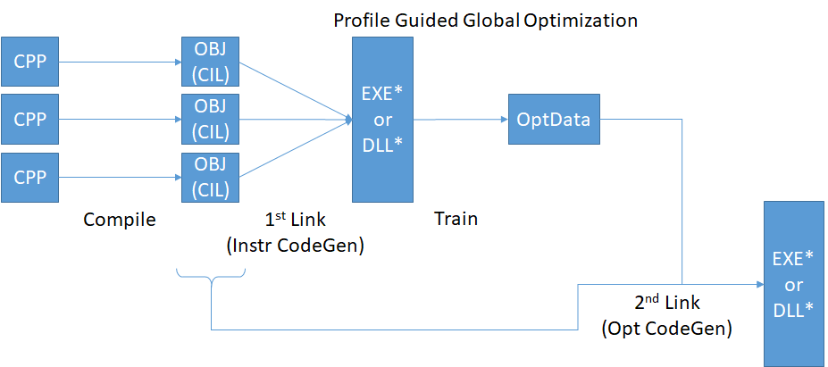
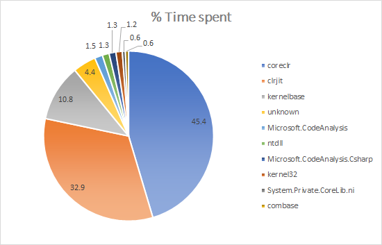
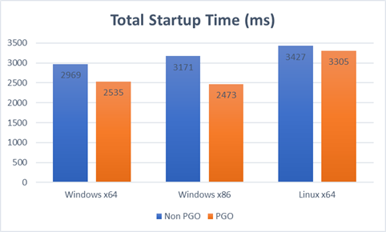

.NET Core 2.0 introduces many new optimizations that will make your code even faster. [A lot of work has been done in the base class library to improve performance](https://blogs.msdn.microsoft.com/dotnet/2017/06/07/performance-improvements-in-net-core/), but in this post, we'd like to talk about a specific category of optimization: profile-guided optimization (or PGO, pronounced "pogo").

## What is profile-guided optimization?

PGO is the usage of runtime profile data to optimize code compilation. By relying on runtime data, PGO can focus optimization work on those code paths that are most frequently used. Of course, the choice of the applications used for profiling matters, as it will determine what will get optimized. The further an application diverges from what was used to profile, the less likely it is to benefit from the optimizations.

In this release, we have applied those optimizations to the native parts of the runtime, based on profiling data from typical .NET applications.

In a future release, we are planning on applying similar optimizations to the managed components of the .NET Core stack. In the case of just-in-time compiled environments such as .NET, it's also possible to recompile code on-the-fly to optimize an application while it's running. In this case, the cost of optimizing must be smaller than what it ends up saving for the application, in order for the feature to be beneficial.

## PGO in .NET Core 2

We've been using PGO on .NET Framework on Windows for many years. On Windows x64, [we had already experimented with this technique in .NET Core 1.1](https://blogs.msdn.microsoft.com/dotnet/2016/11/16/announcing-net-core-1-1/). With .NET Core 2.0, we're bringing the same optimizations to Windows x86 and Linux x64.

In order to determine what components to focus on, we measured what native DLLs applications were spending the most time running during startup. We observed that more than 3/4 of startup time was spent in only two DLLs:  `coreclr.dll` (`libcoreclr.so` on Linux) and `clrjit.dll` (`libclrjit.so` on Linux).

The case of the jitter is particularly interesting. In previous releases, we had two different jitters: JIT32, and [RyuJIT](https://blogs.msdn.microsoft.com/dotnet/2013/09/30/ryujit-the-next-generation-jit-compiler-for-net/). JIT32 is the historic jitter that we used in .NET Framework, and that has seen years of optimization. It's generally faster on Win32 but the code it's producing is not as good and as fast as RyuJIT's. With 2.0, we have standardized on RyuJIT on all architectures and platforms. RuyJIT is still slower, but PGO allowed us to mitigate that performance price, and bring it close to JIT32 performance. The quality of the jitted code is what truly justifies it, however: in some cases, such as SIMD, the code quality is so much higher that its performance beats what JIT32 was producing by factors of several hundreds.

On Linux, our goal is to bring parity of performance, but the fragmentation of the ecosystem makes PGO a much harder task than on Windows. The compiler tool chains are different from distro to distro, and even different versions of a tool such as LLVM can cause significant degradation in our ability to apply PGO. We want .NET to be able to target all those platforms, but we also want the versions that we ship to be all optimized equally well. It will of course always be possible for third parties to build .NET on platforms where all optimizations are not possible.

A simplifying factor on Linux is that we are now building a unique "Linux" version of .NET, that we are then packaging into native installers and tarballs. This made it possible to apply the PGO optimizations to all the distributions that consume those common bits with reduced complexity.

Side-by-side with PGO, we're also deploying link-time optimization (LTO, corresponding to [the `-flto` clang switch](http://llvm.org/docs/LinkTimeOptimization.html)). This applies optimizations at the level of the entire linked binaries rather than module by module. We were already doing this on Windows in previous versions, and our measurements of the performance impact justified applying it to more platforms. Interestingly, we found that on Linux, LTO on its own doesn't significantly affect the results, but together with PGO, the benefits are nearly doubled from PGO on its own.

## Results

The following results show total startup times defined as time to main plus first request measured on a representative ASP.NET Core application after a warm-up iteration. Times are in milliseconds (lower is better).

### Windows x64 results

App Startup   | .NET Core 2.0 non-PGO | .NET Core 2.0 PGO | PGO improvement
------------- | --------------------: | ----------------: | --------------:
Time to Main  | 647                   | 537               | 17%
First Request | 2322                  | 1998              | 14%
Total Startup | 2969                  | 2535              | 15%

### Windows x86 results

App Startup   | .NET Core 2.0 non-PGO | .NET Core 2.0 PGO | PGO improvement
------------- | --------------------: | ----------------: | --------------:
Time to Main  | 679                   | 550               | 19%
First Request | 2492                  | 1923              | 23%
Total Startup | 3171                  | 2473              | 22%

### Linux x64 results

App Startup   | .NET Core 2.0 non-PGO | .NET Core 2.0 PGO | PGO improvement
------------- | --------------------: | ----------------: | --------------:
Time to Main  | 1421                  | 1394              | 2%
First Request | 2006                  | 1910              | 5%
Total Startup | 3427                  | 3305              | 4%

The Linux numbers leave room for improvement in future versions: the time to main is higher than it is on Windows, and the PGO wins are less important overall.

## How to profile and optimize your own application?

The tools employed to get PGO on the native parts of the .NET stack are of course not specific to .NET, and are available for anyone to apply to their own code, or to a custom build of .NET:

* [Visual C++ 2017 PGO on Windows](https://docs.microsoft.com/en-us/cpp/build/reference/profile-guided-optimizations)
* [Clang / LLVM 3.6 PGO on Linux](http://releases.llvm.org/3.6.2/tools/docs/UsersManual.html#profiling-with-instrumentation)
 
The Cmake script used to apply these optimizations on the Core CLR is also available [on GitHub](https://github.com/dotnet/coreclr/blob/master/pgosupport.cmake).

## Conclusion

.NET Core 2.0 is an important performance release of [an already very fast platform](https://www.techempower.com/benchmarks/#section=data-r14&hw=ph&test=plaintext). We're committed to continuing on that trend, and to making .NET the fastest general purpose development environment. PGO is an integral part of this, and an important tool that is going to significantly improve the performance of your .NET Core applications.