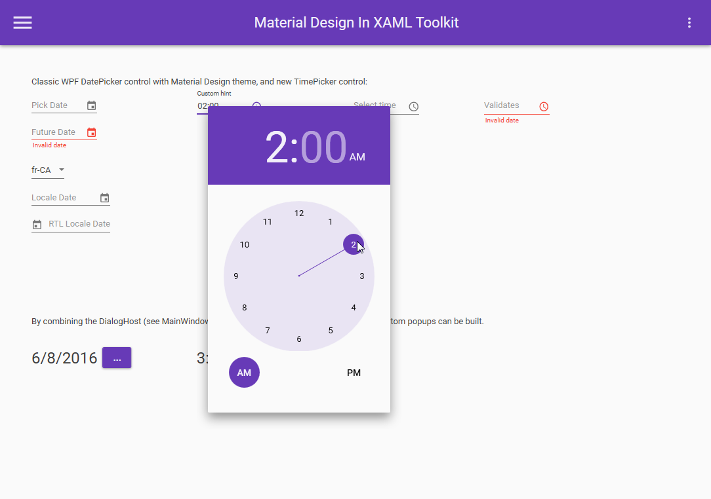

---
title: 'The week in .NET - Material Design in XAML Toolkit
keywords: Week in .NET, community, .NET
weblogName: .NET Blog
---
Previous posts:

* [.NET Architecture: Microservices & Containers, On .NET with Omer Raviv on OzCode, Sprache](https://blogs.msdn.microsoft.com/dotnet/2017/06/20/the-week-in-net-net-architecture-microservices-containers-on-net-with-omer-raviv-on-ozcode-sprache/)
* [On .NET with Mattias Karlsson on Cake, Topshelf](https://blogs.msdn.microsoft.com/dotnet/2017/06/14/the-week-in-net-on-net-with-mattias-karlsson-on-cake-topshelf/)
* [On .NET with Brett Morrison, DateTime Extensions](https://blogs.msdn.microsoft.com/dotnet/2017/06/06/the-week-in-net-on-net-with-brett-morrison-datetime-extensions/)
 

## Package of the week: Material Design In XAML Toolkit

The [Material Design In XAML Toolkit](https://github.com/ButchersBoy/MaterialDesignInXamlToolkit) theme and control library implements Google's Material Design language in XAML, for all major WPF Framework controls. It also adds new controls to support controls specific to Material Design, such as multi-action buttons and cards.

* [Material Design In XAML Toolkit on GitHub](https://github.com/ButchersBoy/MaterialDesignInXamlToolkit)
* [The Material Design in XAML Toolkit web site](http://materialdesigninxaml.net/)

## Meetup of the week: Decomposing a monolith into Microservices with the Open Web Interface for .NET in New York, NY

How do you build a microservice? What technologies does the .NET realm offer for us? And what if you don't want to deploy each service independently? In this talk, Dennis Doomen will show you some of the pros and cons of microservices and how you can leverage OWIN and .NET to move your monolith into a bright new future.

Please join [the New York ALT.NET Software Development Group](https://www.meetup.com/nyaltnet/) on [Wednesday, June 28, 2017
at 6:30 PM](https://www.meetup.com/nyaltnet/events/238898573/).

## .NET

* [Multi-Targeting and Porting a .NET Library to .NET Core 2.0](https://weblog.west-wind.com/posts/2017/Jun/22/MultiTargeting-and-Porting-a-NET-Library-to-NET-Core-20) by Rick Strahl.
* [Measuring your code’s performance during development with BenchmarkDotNet – Part #1: Getting started](https://jeremylindsayni.wordpress.com/2017/06/22/measure-your-codes-performance-during-development-with-benchmarkdotnet-and-net-core/) by Jeremy Lindsay.
* [Measuring your code’s performance during development with BenchmarkDotNet – Part #2: methods with parameters](https://jeremylindsayni.wordpress.com/2017/06/25/measure-code-performance-during-development-with-benchmarkdotnet-part-2-methods-with-data-transfer-object-parameters/) by Jeremy Lindsay.
* [Hands on with Visual Studio for Mac](https://blogs.msdn.microsoft.com/visualstudio/2017/06/22/hands-on-with-visual-studio-for-mac/) by Craig Dunn.
* [Parallel state in AWS Step Functions using .Net Core](http://vgaltes.com/serverless/step-functions-parallel-state/) by Vicenç García Altés.
* [AWS Step Functions using .Net Core](http://vgaltes.com/serverless/step-functions-using-net-core/) by Vicenç García Altés.
* [Mocking in .NET Core Tests with Moq](http://dontcodetired.com/blog/post/Mocking-in-NET-Core-Tests-with-Moq) by Jason Roberts.
* [Supporting .NET Standard and .NET 3.5](http://markheath.net/post/supporting-net-standard-and-net-35) by Mark Heath.
* [Create Bot for Microsoft Graph with DevOps 1: Unit Testing Bot Framework application](https://blogs.msdn.microsoft.com/kenakamu/2017/06/20/devops-with-bot-framework-chat-for-business-application-1-en/) by Kenichiro Nakamura.
* [Create Bot for Microsoft Graph with DevOps 2: Get your appointment from Microsoft Graph and OAuth 2.0 with AuthBot](https://blogs.msdn.microsoft.com/kenakamu/2017/06/21/devops-with-bot-framework-chat-for-business-application-2-en/) by Kenichiro Nakamura.
* [Create Bot for Microsoft Graph with DevOps 3: Unit Testing with Moq, AutoFac and Fakes](https://blogs.msdn.microsoft.com/kenakamu/2017/06/22/devops-with-bot-framework-chat-for-business-application-3-en/) by Kenichiro Nakamura.
* [Create Bot for Microsoft Graph with DevOps 4: Continuous Integration – Build Definition](https://blogs.msdn.microsoft.com/kenakamu/2017/06/23/devops-with-bot-framework-chat-for-business-application-4-en/) by Kenichiro Nakamura.
* [Create Bot for Microsoft Graph with DevOps 5: Function Test](https://blogs.msdn.microsoft.com/kenakamu/2017/06/26/devops-with-bot-framework-chat-for-business-application-5-en/) by Kenichiro Nakamura.
* [Installing .Net Core 2 on a Raspberry Pi](https://www.youtube.com/watch?v=vPOS8eDtbzY&feature=youtu.be) by Guy, Robot.

## ASP.NET

* [Creating Custom Tag Helper Components with Jass Bagga](https://channel9.msdn.com/Shows/Code-Conversations/Creating-Custom-Tag-Helper-Components-with-Jass-Bagga) by Jass Bagga & Maria Naggaga.
* [Cookie authentication in ASP.NET Core 2 without ASP.NET Identity](https://www.meziantou.net/2017/06/22/cookie-authentication-in-asp-net-core-2-without-asp-net-identity) by Gérald Barré.
* [Docker Blog Series Part 2 – Build & Deploy ASP.NET Core based Docker Container on Service Fabric](https://blogs.msdn.microsoft.com/monub/2017/05/28/docker-blog-series-part-2-build-deploy-asp-net-core-docker-image-on-service-fabric/) by Monu Bambroo.
* [Claims augmentation with OWIN but outside of Startup code](https://blogs.msdn.microsoft.com/mrochon/2017/06/23/claims-augmentation-post-token/) by SailingRock.
* [IStartup vs IHostingStartup](http://www.hishambinateya.com/istartup-vs-ihostingstartup) by Hisham Bin Ateya.
* [Four ways to dispose IDisposables in ASP.NET Core](https://andrewlock.net/four-ways-to-dispose-idisposables-in-asp-net-core/) by Andrew Lock.
* [Testing ASP.NET Core MVC Controllers: Getting Started](http://dontcodetired.com/blog/post/Testing-ASPNET-Core-MVC-Controllers-Getting-Started) by Jason Roberts.
* [ASP.NET vs ASP.NET Core](http://thienn.com/aspnet-vs-aspnetcore/) by Thien Nguyen.
* [ASP.NET Core (.csproj) Embedded Resources](https://codeopinion.com/asp-net-core-csproj-embedded-resources/) by Derek Comartin.
* [A Note on Owin Hosted Services](https://www.codeproject.com/Articles/1192390/A-Note-on-Owin-Hosted-Services) by Dr. Song Li.
* [Angular CLI With .NET Core](https://dustinewers.com/angular-cli-with-net-core/) by Dustin Ewers.
* [Visual Studio 2017 and Swagger: Building and Documenting Web APIs](https://www.simple-talk.com/dotnet/net-development/visual-studio-2017-swagger-building-documenting-web-apis/) by Dennes Torres.
* [Docker for .NET Developers (Part 5) Exploring ASP.NET Runtime Docker Images](https://www.stevejgordon.co.uk/docker-for-dotnet-developers-part-5) by Steve Gordon.
* [Using IActionConstraints in ASP.NET Core MVC](https://www.strathweb.com/2017/06/using-iactionconstraints-in-asp-net-core-mvc/) by Filip W.
* [WebSocket subprotocol negotiation in ASP.NET Core](https://www.tpeczek.com/2017/06/websocket-subprotocol-negotiation-in.html) by Tomasz Pęczek.

## C#

* [Understanding & Profiling C# Async Await Tasks](https://stackify.com/csharp-async-await-task-performance/) by Matt Watson.
* [Abolishing Switch-Case Statement and Pattern Matching in C# 7.0](https://rubikscode.net/2017/06/18/abolishing-switch-case-and-pattern-matching-in-c-7-0/) by rubikscode.

## F#

* [Getting started with Fable](http://fable.io/pages/getting-started.html) by Alfonso Garcia-Caro.
* [Writing Concurrent Programs Using F# Mailbox Processors](http://www.codemag.com/article/1707051) by Rachel Reese.
* [Literate programming in F-Sharp using org-mode](https://blog.hoetzel.info/post/literate-programming-in-fsharp/) by Jürgen Hötzel.
* [F# Fake.Build for Dependable Build Process](https://www.hasaltaiar.com.au/fsharp-fake-build-for-dependable-build-process-dddbynight/) by Has AlTaiar.
* [F# on Azure Functions](https://channel9.msdn.com/events/NDC/NDC-Oslo-2017/C9L12) by Channel 9 with Nikolai Andersen.
* [Exploring data and API’s with F# type providers](https://jvaneyck.wordpress.com/) by Jo Van Eyck‏.

There is more content available this week in [F# Weekly](https://sergeytihon.wordpress.com/category/f-weekly/). If you want to see more F# awesomeness, please check it out!

## Xamarin

* [Snack Pack 13: Source Control in Visual Studio for Mac](https://channel9.msdn.com/Shows/XamarinShow/Snack-Pack-13-Source-Control-in-Visual-Studio-for-Mac) by The Xamarin Show.
* [MFractor - A ReSharper for Xamarin.Forms(!?!)](https://codemilltech.com/mfractor-top-ten-features/) by Matthew Soucoup.
* [Things I Think Are Cool: Realm](https://codemilltech.com/things-i-think-are-cool-realm/) by Matthew Soucoup.
* [Xamarin Beta Release: 15.3 Preview 2](https://releases.xamarin.com/beta-release-15-3-preview-2/) by Bri Brothers.
* [Embeddinator-4000 0.2](https://releases.xamarin.com/embeddinator-4000-0-2/) by Bri Brothers.
* [Track Your Fitness with a Fitbit and Xamarin](https://visualstudiomagazine.com/articles/2017/05/01/fitbit-and-xamarin.aspx) by Wallace McClure.
* [Why Xamarin.Forms Embedding Matters](http://motzcod.es/post/162052911902/why-xamarinforms-embedding-matters) by James Montemagno.
* [Yet Another Podcast #172 – James Montemagno on Embedding](http://jesseliberty.com/2017/06/20/yet-another-podcast-172-james-montemagno-on-embedding/) by Jesse Liberty.
* [Building Xamarin.Forms Apps with .NET Standard](https://blog.xamarin.com/building-xamarin-forms-apps-net-standard/) by Pierce Boggan.
* [Easy iOS App Provisioning with Fastlane and Visual Studio for Mac](https://blog.xamarin.com/easy-ios-app-provisioning-fastlane-visual-studio-mac/) by Pierce Boggan.
* [Minnesota Twins Hits a Home Run with Cloud-Powered Scouting Apps](https://blog.xamarin.com/minnesota-twins-hits-home-run-cloud-powered-scouting-apps/) by Lacey Butler.
* [Add Push Notifications to iOS Apps with Azure Notification Hubs](https://blog.xamarin.com/push-notifications-ios-azure-notification-hubs/) by Adam Hartley.
* [Xamarin.Tip – Fixing the VS for Mac Xamarin.Forms Template Android Issues](https://alexdunn.org/2017/06/21/xamarin-tip-fixing-the-vs-for-mac-xamarin-forms-template-android-issues/) by Alex Dunn.
* [Xamarin.Basics – Ad Hoc iOS Builds, Part 1: Certificates and Profiles](https://alexdunn.org/2017/06/22/xamarin-basics-ad-hoc-ios-builds-part-1-certificates-and-profiles/) by Alex Dunn.
* [MasterDetailPage Navigation Menu in Xamarin Forms](https://xamarinhelp.com/masterdetailpage-navigation-menu-xamarin-forms/) by Adam Pedley.
* [Lottie Animations Step by Step in Xamarin Forms](https://xamgirl.com/lottie-animations-step-by-step-in-xamarin-forms/) by Charlin Agramonte.

## Azure

* [Step by step: .NET Core and Azure Cosmos DB](https://carlos.mendible.com/2017/06/25/step-by-step-net-core-and-azure-cosmos-db/) by Carlos Mendible.
* [Create and manage Windows VMs in Azure using C#](https://docs.microsoft.com/en-us/azure/virtual-machines/windows/csharp) by Docs Team.
* [Creating A Function App And Integrating With Azure Logic Apps](http://www.c-sharpcorner.com/article/create-a-function-app-and/) by Vidyadharran G.
* [Azure via C# – Creating Azure Tables in C#](http://www.andreaangella.com/2017/06/azure-via-csharp-creating-azure-tables/) by Andrea Angella.
* [Calling the Azure AD Graph API in a web application](https://azure.microsoft.com/en-us/resources/samples/active-directory-dotnet-graphapi-web/) by Jean-Marc Prieur.
* [Sample - Customer Reviews App with Cognitive Services (Azure Functions tools for Visual Studio 2017)](https://azure.microsoft.com/en-us/resources/samples/functions-customer-reviews/) by Thiago Almeida.
* [ASP.NET Core with Entity Framework Core SqlException: cannot openserver](https://blogs.msdn.microsoft.com/benjaminperkins/2017/06/21/asp-net-core-with-entity-framework-core-sqlexception-cannot-openserver/) by Benjamin Perkins.
* [Building recommendation engine for .NET applications using Azure Machine Learning](https://blogs.msdn.microsoft.com/dotnet/2017/06/26/dot-net-recommendation-system-for-net-applications-using-azure-machine-learning/) by Ankit Asthana.

## UWP

* [Sweet UI made possible and easy with Windows.UI and the Windows 10 Creators Update](https://blogs.windows.com/buildingapps/2017/06/22/sweet-ui-made-possible-easy-windows-ui-windows-10-creators-update/) by Windows UI Team.
* [Windows Template Studio 1.1 released!](https://blogs.windows.com/buildingapps/2017/06/22/windows-template-studio-1-1-released/#P7A1lBd4xUPWSi6A.97) by Clint Rutkas.
* [Smooth as Butter Animations in the Visual Layer with the Windows 10 Creators Update](https://blogs.windows.com/buildingapps/2017/06/23/smooth-butter-animations-visual-layer-windows-10-creators-update/) by Windows UI Team.

## Data

* [Make It Easier for the DBA: Give SQL Connections the Application’s Name!](https://www.bengribaudo.com/blog/2017/06/23/3657/give-sql-connections-the-applications-name) by Ben Gribaudo.
* [Entity Framework Core: Naming Convention](https://www.meziantou.net/2017/06/26/entity-framework-core-naming-convention) by Gérald Barré.
* [Mapping Complex Types to/from the DB with PetaPoco](http://blogs.lessthandot.com/index.php/desktopdev/mstech/csharp/mapping-complex-types-tofrom-the-db-with-petapoco/) by Eli Weinstock-Herman.

## Game development

* [Getting Started with Duality – Part 2](https://channel9.msdn.com/Shows/dotGAME/Getting-Started-with-Duality--Part-2) by Stacey Haffner.
* [Toggle Vive’s front facing camera and “Tron Mode” at run time](https://blogs.unity3d.com/2017/06/16/codesnippets-toggle-vives-front-facing-camera-and-tron-mode-at-run-time/) by Dioselin Gonzalez.
* [TDD in Unity - Heart Based Health System - Part 1](https://www.youtube.com/watch?v=R1aO4Tmw3zA&feature=youtu.be) by Infallible Code.
* [Sharing Code with a PCL in MonoGame](http://pingzing.github.io/sharing-code-with-a-pcl-in-monogame.html) by Neil McAlister.
* [Hex Map 18 - Units](http://catlikecoding.com/unity/tutorials/hex-map/part-18/) by Catlike Coding.
* [Souls-like Part 2 Third Person Controller - Unity Tutorial (Advanced)](https://youtu.be/e9l2wxkYg2E) by C Sharp Accent Tutorials.
* [[Unity 5.6] Tutorial: How to create a Maze Generator - part 2](https://youtu.be/QNNBKxBFKD0) by Gamad.

And this is it for this week!

## Contribute to the week in .NET

As always, this weekly post couldn't exist without community contributions, and I'd like to thank all those who sent links and tips. The F# section is provided by [Phillip Carter](https://twitter.com/_cartermp), the gaming section by [Stacey Haffner](https://twitter.com/yecats131), the Xamarin section by [Dan Rigby](https://twitter.com/DanRigby), and the Azure and UWP section by [Michael Crump](http://twitter.com/mbcrump).

You can participate too. Did you write a great blog post, or just read one? Do you want everyone to know about an amazing new contribution or a useful library? Did you make or play a great game built on .NET?
We'd love to hear from you, and feature your contributions on future posts. Please [add your posts](https://weekindotnet.azurewebsites.net), it takes only a second.

We pick the articles based on the following criteria: the posts must be about .NET, they must have been published this week, and they must be original contents. Publication in Week in .NET is not an endorsement from Microsoft or the authors of this post.

This week's post (and future posts) also contains news I first read on [The ASP.NET Community Standup](https://blogs.msdn.microsoft.com/webdev/tag/communitystandup/), on [Weekly Xamarin](http://weeklyxamarin.com/), on [F# weekly](https://sergeytihon.wordpress.com/category/f-weekly/), and on [The Morning Brew](http://themorningbrew.net/).