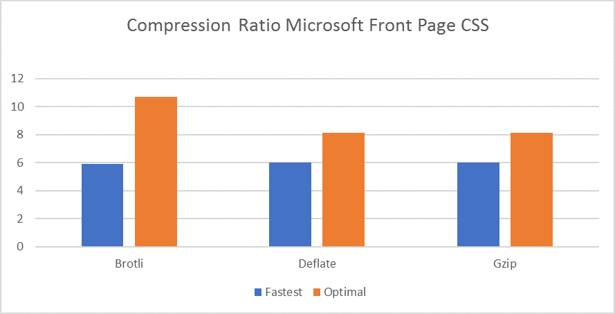
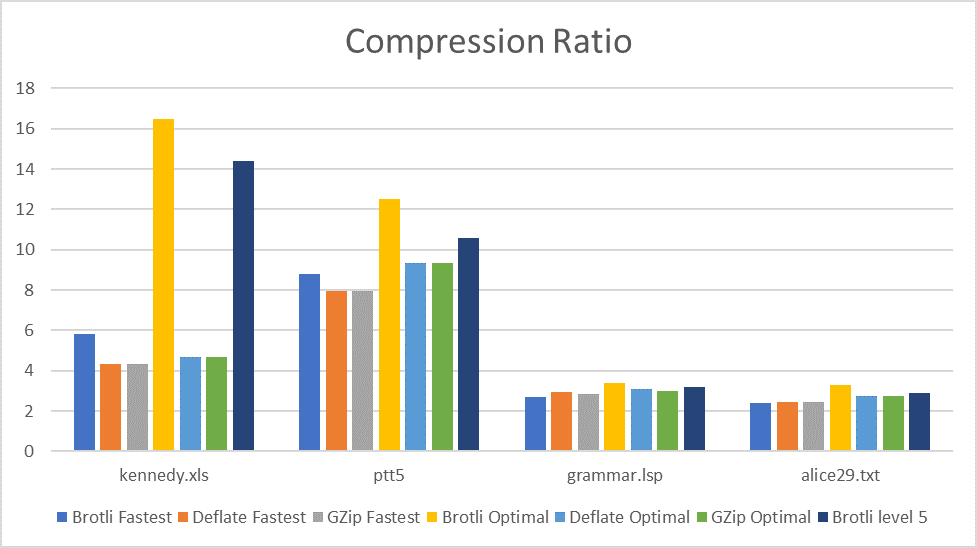
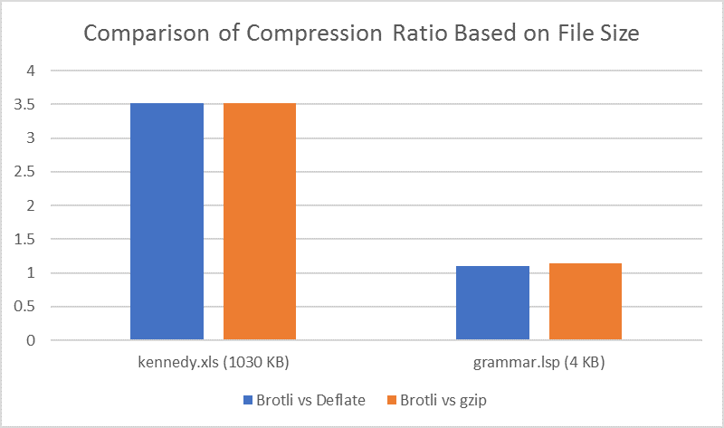
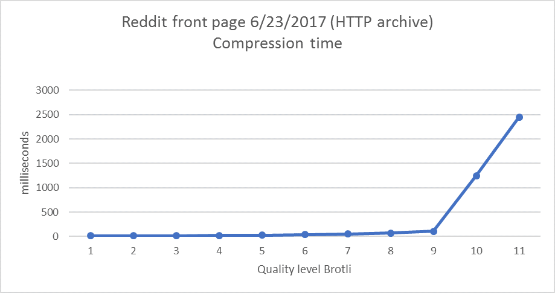
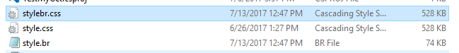
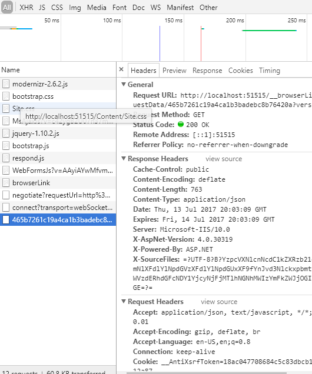

# Broadly about Brotli compression algorithm.  

Modern web pages can often be made up of dozens of megabytes of HTML,
CSS, and JavaScript, and that's before accounting for images, videos, or
other large file content, which all makes for hefty downloads. Such
loads are why pages are transferred in compressed formats; they
significantly reduce the time required between a website visitor
requesting a web page and that page appearing fully loaded on the screen
and ready for use. \[1\]

Brotli is a new, open source compression algorithm developed by two
Google engineers and released in 2015. It’s designed for text
compression and provides a 20%-30% reduction in size compared to gzip.
Its encoding speed is generally slower than gzip (depends on quality
setting) while its decoding speed is on par with gzip. The smaller
compressed size allows for better space utilization and faster page
loads. We hope that this format will be supported by all browsers soon,
as the smaller compressed size would give additional benefits to mobile
users, such as lower data transfer fees and reduced battery use. \[2\]

Now Brotli is available to use in .NET applications and your ASP.NET
site can be faster in 14-30%.

Let’s compare it with existing .NET compression algorithms: Deflate and
gzip.

Fast navigation:

- [Compression Ratio Results](#compression-ratio)

- [Compression Time Results](#compression-time)

- [Decompression Time Results](#decompression-time)

- [Brotli Library Usage Code Sample](#usage)

- [Conclusion](#conclusion)

- [Bonus](#bonus-metric)

If you want to access NuGet package: [Brotli .NET pre-release](https://dotnet.myget.org/feed/dotnet-corefxlab/package/nuget/System.IO.Compression.Brotli)

Compression ratio
=================

Web Files
---------

As they are mostly use in web applications, let's compare compression
ratio for web files.



We can see that Brotli compression ratio is better on Optimal level and
the same on fastest. Let’s compare more data.


As we can see from the graph above, even at quality level 5, Brotli
compression ratio is higher than the optimal quality level of gzip and
Deflate. One more feature is that you can choose any of 11 levels of
Brotli aside from the standard Optimal, Fastest and NoCompression
levels. You can do it in 2 ways: use the Brotli class or send the
necessary quality to the BrotliStream constructor.

We will see in the next section that Brotli can still be used for files
other than web files.

Canterbury Corpus
-----------------

A popular set of files for testing compression algorithms is the
[Canterbury
Corpus](http://www.corpus.canterbury.ac.nz/descriptions/#cantrbry).

|    File           |    Abbrev    |    Category             |    Size        |
|-------------------|--------------|-------------------------|----------------|
|     [alice29.txt](http://corpus.canterbury.ac.nz/descriptions/cantrbry/text.html)    |    text      |    English text         |     152089     |
|    [grammar.lsp](http://corpus.canterbury.ac.nz/descriptions/cantrbry/list.html)   |    list      |    LISP source          |     3721       |
|    [kennedy.xls](http://corpus.canterbury.ac.nz/descriptions/cantrbry/Excl.html)     |    Excl      |    Excel Spreadsheet    |     1029744    |
|    [ptt5](http://corpus.canterbury.ac.nz/descriptions/cantrbry/fax.html)          |    fax       |    CCITT test set       |     513216     |





Looking at the data, it’s clear that Brotli fares better for larger
files.



Compression time
================

The graph below highlights the difference between the compression times
between various compression libraries. A large file (around 4 MB) was
used to measure the compression time.


We can see that on Fastest level, Brotli works faster, but what about
Optimal level?


We see that the best compression ratio takes a lot of time. Does it mean
that Brotli is appropriate only for static files? Partly yes, but as it
was mentioned above, Brotli algorithm is better than gzip/deflate
optimal even at level 5 (where Brotli starts to use the context
modelling, which is one of the more advanced features of the format).

Comparing Brotli compression levels
-----------------------------------



As we can see on this chart, Brotli can easily be used for dynamic data
and as Content-Encoding type in ASP.NET.

Decompression time
==================

Of course, you can compress static files once and in this case
compression time doesn’t matter as much as ratio. Perhaps the most
important performance dimension for internet formats is decompression
speed. Clients should be able to decompress quickly, even with limited
resources such as on browsers and mobile devices. Again, we choose a 4
MB file for testing.


We see that Brotli is very similar to Deflate in decompression speed.
Decompression speed for small files is comparable across all algorithms.

Usage
=====

Firstly, let’s write a simple file compress/decompress.
```C#
class Program
{
    static void CompressToFile(byte\[\] bytes, string outFile)
    {
        using (FileStream outStream = File.Create(outFile))
        {
            BrotliStream brotliStream = new BrotliStream(outStream,
            CompressionMode.Compress, true, bytes.Length, CompressionLevel.Fastest);
            brotliStream.Write(bytes, 0, bytes.Length);
            brotliStream.Dispose();
        }
    }
    
    static void DecompressToFile(string inFile, string outFile)
    {
        FileStream input = File.Open(inFile, FileMode.Open);
        FileStream fileOut = File.Open(outFile, FileMode.OpenOrCreate);
        using (BrotliStream decompressBrotli = new BrotliStream(input, CompressionMode.Decompress))
        {
            decompressBrotli.CopyTo(fileOut);
        }
        fileOut.Dispose();
    }
    
    static void Main(string[] args)
    {
        string testFile = "style.css";
        string minFile = "style.br";
        string outFile = "stylebr.css";
        byte[] data = File.ReadAllBytes(testFile);
        CompressToFile(data, minFile);
        DecompressToFile(minFile, outFile);
    }
}
```

As we can see, the css file gets compressed to 1/7^th^ of its original
size. Therefore, if you have Brotli encoding enabled, your website will
load faster.


==================================================================

But how to use encoding in ASP.NET applications for dynamic files?

Let’s create a default ASP.NET web-site and open Global.asax file.
You’ll see something like this:


Some files don’t have Content-Encoding attribute. We can add deflate or
gzip Content-Encoding with the simple method.

```C#
protected void Application_PostAcquireRequestState(object sender, EventArgs e)
{
    var app = Context.ApplicationInstance;
    String acceptEncodings = app.Request.Headers.Get("Accept-Encoding");
    if (!String.IsNullOrEmpty(acceptEncodings))
    {
        System.IO.Stream baseStream = app.Response.Filter;
        acceptEncodings = acceptEncodings.ToLower();
        if (acceptEncodings.Contains("deflate"))
        {
            app.Response.Filter = new
            System.IO.Compression.DeflateStream(baseStream, System.IO.Compression.CompressionMode.Compress);
            app.Response.AppendHeader("Content-Encoding", "deflate");
        }
        else if (acceptEncodings.Contains("gzip"))
        {
            app.Response.Filter = new System.IO.Compression.GZipStream(baseStream, System.IO.Compression.CompressionMode.Compress);
            app.Response.AppendHeader("Content-Encoding", "gzip");
        }
    }
}
```


And if you install a pre-release Brotli package(link here), you can set
filter = BrotliStream and also configure what compression level you
want.

Just update your method to:
```C#
protected void Application_PostAcquireRequestState(object sender, EventArgs e)
{
    var app = Context.ApplicationInstance;
    String acceptEncodings = app.Request.Headers.Get("Accept-Encoding");
    if (!String.IsNullOrEmpty(acceptEncodings))
    {
        System.IO.Stream baseStream = app.Response.Filter;
        acceptEncodings = acceptEncodings.ToLower();
        if (acceptencodings.contains("br") || acceptencodings.contains("brotli"))
        {
            app.Response.Filter = new brotli.brotlistream(basestream,System.IO.Compression.CompressionMode.Compress);
            app.Response.Appendheader("content-encoding", "br");
        }
        else if (acceptEncodings.Contains("deflate"))
        {
            app.Response.Filter = new
            System.IO.Compression.DeflateStream(baseStream, System.IO.Compression.CompressionMode.Compress);
            app.Response.AppendHeader("Content-Encoding", "deflate");
        }
        else if (acceptEncodings.Contains("gzip"))
        {
        app.Response.Filter = new System.IO.Compression.GZipStream(baseStream, System.IO.Compression.CompressionMode.Compress);
        app.Response.AppendHeader("Content-Encoding", "gzip");
        }
    }
}
```

Also, you can use Brotli in ASP.NET Web Applications using custom
compression provider visit [Response Compression
Middleware](https://docs.microsoft.com/en-us/aspnet/core/performance/response-compression)
for details.

Conclusion
==========

Hence, we can conclude that Brotli is mostly nice for clients, with
decompression performance comparable to gzip while significantly
improving the compression ratio. These are powerful properties for
serving static content such as fonts and html pages. Thus, if you use
gzip or deflate as encoding for you web site or have never used encoding
you should try Brotli, especially if you upload a lot of static files to
client.

Bonus metric
============

When the Brotli compression algorithm was released in 2015, the
television series Silicon Valley was popular, and characters used
Weissman score to measure performance of their compression algorithm.
The Weissman score is an efficiency metric for lossless compression
applications, which was developed for fictional use. So, let’s try to
calculate it for Brotli. Let use gzip as standard compressor and Brotli
as scored compressor.

The formula is:


Where ‘r’ is the compression ratio, T is the time required to compress
and the overlined ones are the same metrics for a standard compressor. Alpha
is a scaling constant. We will use 1 as the scaling constant.


May be Brotli is the real Pied Piper?

Try it out!
===========

Be the first to try and optimize your ASP.NET site with Brotli and let
us know what you think. The alpha release of
System.IO.Compression.Brotli is available on [MyGet](<https://dotnet.myget.org/feed/dotnet-corefxlab/package/nuget/System.IO.Compression.Brotli>) and add
`<add key="dotnet.myget.org dotnet-corefxlab" value="https://dotnet.myget.org/F/dotnet-corefxlab/" />` to NuGet.config file.
Please let us know what you think by leaving a comment on this post or
by contacting us via the (contact page).

References
==========

1\. <https://opensource.com/article/17/1/brotli-compression-algorithm>

2\. <https://engineering.linkedin.com/blog/2017/05/boosting-site-speed-using-brotli-compression>
 linkedin using brotli experience

3\. <https://github.com/dotnet/corefxlab/blob/master/src/System.IO.Compression.Brotli/README.md> .NET Brotli README

4\. <https://github.com/google/brotli>  Google Brotli repo
