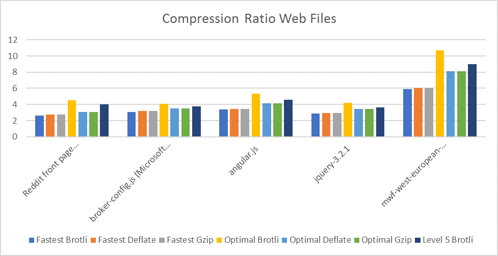
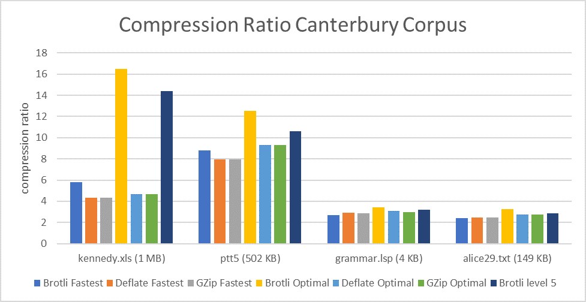
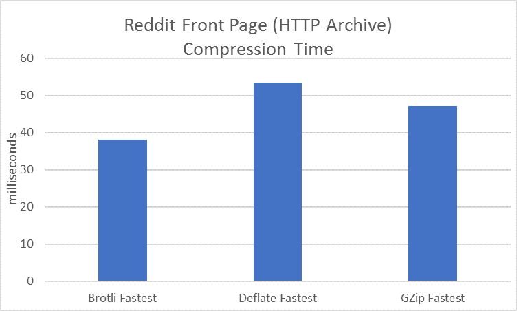
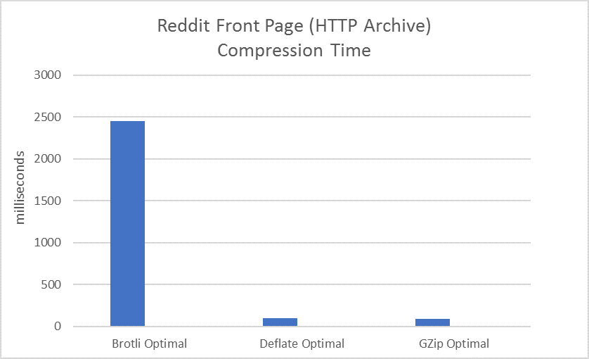
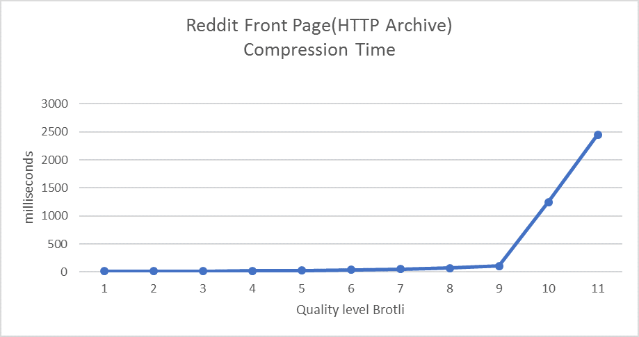
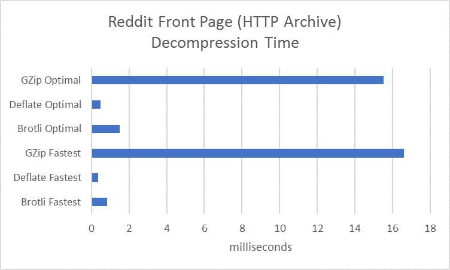
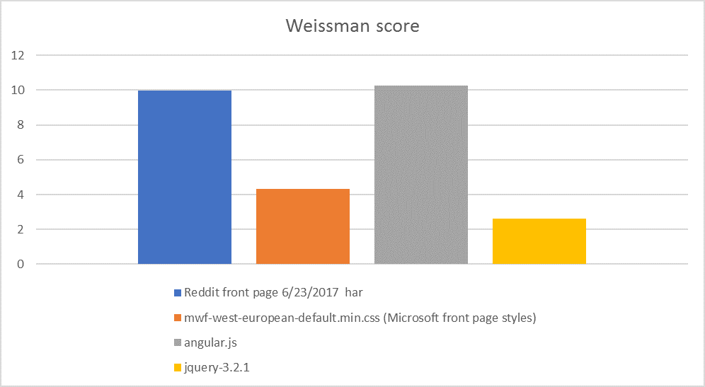
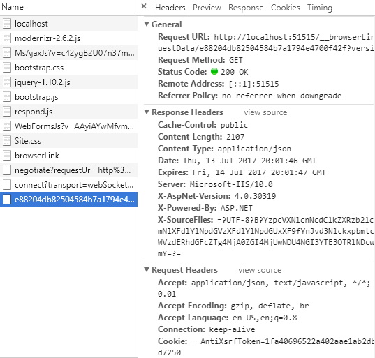
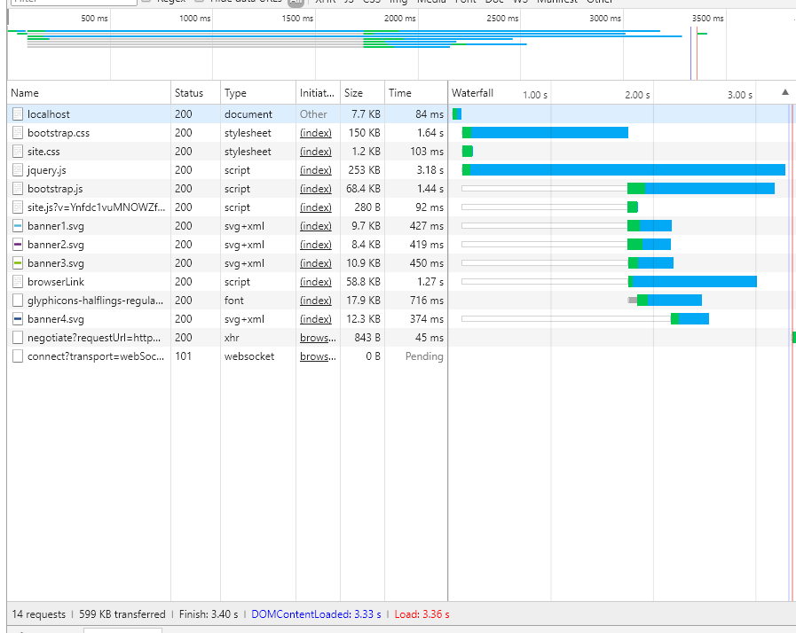
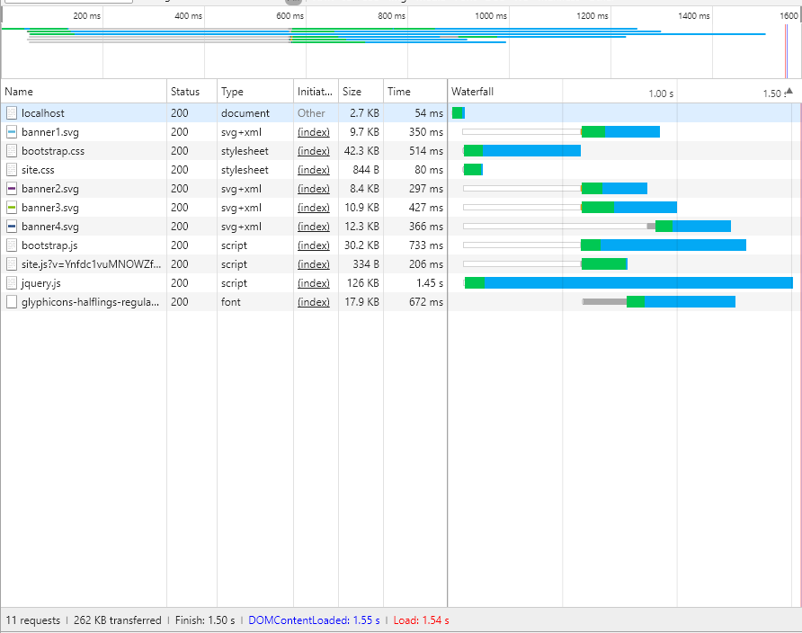

# Brotli Compression Algorithm Preview and Why You Should Use It.

*This post was written by our software developer intern Denys
Tsomenko([Vedin](https://github.com/Vedin)), who worked on
System.IO.Compression.Brotli library during his internship.*

Modern web-pages are getting larger and larger with huge CSS, HTML and
JavaScript files. But the Internet connection isn't always good and pages can
load slowly. Web pages often also contain other materials such as images,
videos, etc. One solution to make user experience better is reduce load time.
File compression can help with it. Currently, ASP.NET developers have two
compression methods available to use in their web-applications: Deflate and gzip
(default). What is really important for compression algorithm? There is a trade
off between compression time and compression ratio. Size reduction is often a
trade off between time spent and achieved reduction and that different
algorithms can perform quite differently. Brotli corresponds both.  Brotli
compression algorithm was developed and released by two Google engineers in
2015. Now it is supported by the most popular browsers Google Chrome, Mozilla
Firefox, Opera, and Microsoft Edge. Therefore, we decided to add Brotli as a new
compression algorithm. [Read below](#how-good-is-brotli) to get a real power of
Brotli.

In this time Brotli available as pre-release NuGet package: [Brotli .NET pre-
release](https://dotnet.myget.org/feed/dotnet-
corefxlab/package/nuget/System.IO.Compression.Brotli). And you can [try it
](#try-it-out!) right now!

## How good is Brotli?

The quality and usability of every compression algorithm depends on 3 main
factors: [Compression Ratio](#compression-ratio) is the main value for these
algorithms, because we want to reduce size as many as it possible. But if it
works too slowly it makes no gain for us, so other important metrics are
[Compression Time](#compression-time) and [Decompression Time](#decompression-
time). Let's compare them with existing .NET compression libraries Deflate and
gzip.

### Compression Ratio

We will calculate compression ratio using formula : `Compession Ratio =
Unocmpressed Size / Compressed Size`. So higher results is better.

#### Web Files

See a [Usage](#usage) to know how to compress files.

As they are mostly use in web applications, let's compare compression
ratio for web files.


We can see that Brotli compression ratio is better on Optimal(maximum possible
compression ration) [CompressionLevel](https://msdn.microsoft.com/en-
us/library/system.io.compression.compressionlevel(v=vs.110).aspx) and the same
on fastest(the minimum compression time). Let’s compare more data. First three
columns show us size reduction on the Fastest level, next three on the Optimal
and the last on the middle level of Brotli.



As we can see from the graph above, even at quality level 5, Brotli
compression ratio is higher than the optimal quality level of gzip and
Deflate. One more feature is that you can choose any of 11 levels of
Brotli aside from the standard `Optimal`, `Fastest` and `NoCompression`
levels. You can do it in 2 ways: use the Brotli class or send the
necessary quality to the BrotliStream constructor:

```C#
BrotliStream brotliLevel5 = new BrotliStream(baseStream, CompressionMode.Compress, leaveOpen, bufferSize, (CompressionLevel)5);
```

We will see in the next section that Brotli also provides size reductions
outside the realm of web.

#### Canterbury Corpus

A popular set of files for testing compression algorithms is the [Canterbury
Corpus](http://www.corpus.canterbury.ac.nz/descriptions/#cantrbry). "The files
were chosen because their results on existing compression algorithms are
"typical", and so it is hoped this will also be true for new methods.""

| File                                                                         | Name   | Category          | Size (bytes) |
|:-----------------------------------------------------------------------------|:-------|:------------------|-------------:|
|[alice29.txt](http://corpus.canterbury.ac.nz/descriptions/cantrbry/text.html) | text   | English text      |      152,089 |
|[grammar.lsp](http://corpus.canterbury.ac.nz/descriptions/cantrbry/list.html) | list   | LISP source       |        3,721 |
|[kennedy.xls](http://corpus.canterbury.ac.nz/descriptions/cantrbry/Excl.html) | Excl   | Excel Spreadsheet |    1,029,744 |
|[ptt5](http://corpus.canterbury.ac.nz/descriptions/cantrbry/fax.html)         | fax    | CCITT test set    |      513,216 |



Looking at the data, it’s clear that Brotli fares better for larger files. This
chart shows in how many times brotli compressed files is smaller than Deflate
and gzip files.


As we mentioned above another important characteristic of compression algorithms
is execution time. Let's check it!

### Compression Time

If an algorithm compresses data too slow, you will not get any performance
improvements for dynamic files compression, which are often used in web sites.
The graph below highlights the difference between the compression times between
various compression libraries. A large file (around 4 MB) was used to measure
the compression time. Lower is better.



We can see that on Fastest level, Brotli works faster, but what about
Optimal level?



We see that the best compression ratio takes a lot of time. Does it mean
that Brotli is appropriate only for static files? Partly yes, but as it
was mentioned above, Brotli algorithm is better than gzip/deflate
optimal even at level 5.

#### Comparing Brotli Compression Levels

This chart shows execution time for compress a same file on different levels.



Setting a higher quality results in higher compression ratio, but it increases
compute time. So you can choose a level that best fits your scenario. As we can
see on this chart, Brotli can easily be used for dynamic data and as Content-
Encoding type in ASP.NET.

But what about execution time in client? Clients should be able to decompress
files quickly, even with limited resources such as on browsers and mobile
devices.

### Decompression Time

Of course, you can compress static files once and in this case compression time
doesn’t matter as much as ratio. Perhaps the most important performance
dimension for internet formats is decompression speed.  Again, we choose a 4 MB
file for testing.



We see that Brotli much faster than GZip and much closers to the performance of
Deflate. Decompression speed for small files is comparable across all
algorithms.

### Bonus Metric

When the Brotli compression algorithm was released in 2015, the television
series Silicon Valley was popular, and characters used [Weissman
score](https://en.wikipedia.org/wiki/Weissman_score) to measure performance of
their compression algorithm. The Weissman score is an efficiency metric for
lossless compression applications, which was developed for fictional use. So,
let’s try to calculate it for Brotli. Let use gzip as standard compressor and
Brotli as scored compressor. We will use 1 as the scaling constant. For every
particular file scored compressor(here Brotli) is better than standard(here
gzip) based on compression ratio and time if Weissman score greater than 1.



## Try It Out!

If you want to try Brotli now:

1. Download the package from [MyGet](<https://dotnet.myget.org/feed/dotnet-
   corefxlab/package/nuget/System.IO.Compression.Brotli>)
2. Create a NuGet.config file next to the .csproj (or use existing) and add
3. Add this line `<add key="dotnet.myget.org dotnet-corefxlab" value="https://dotnet.myget.org/F/dotnet-corefxlab/" />` to NuGet.config file.

### Usage

And we can a simple file compress method.

```C#
static void Compress(string inFile, string outFile)
{
    byte[] data = File.ReadAllBytes(inFile);
    using (FileStream fileOut = File.Create(outFile))
    {
        using (BrotliStream compressor = new BrotliStream(fileOut, CompressionMode.Compress))
        {
            compressor.Write(data, i, chunkSize);
            compressor.Dispose();
        }
    }
}
```

Decompress file method.

```C#
static void DecompressToFile(string inFile, string outFile)
{
    FileStream input = File.Open(inFile, FileMode.Open);
    using (FileStream fileOut = File.Open(outFile, FileMode.OpenOrCreate))
    {
        using (BrotliStream decompressBrotli = new BrotliStream(input, CompressionMode.Decompress))
        {
            decompressBrotli.CopyTo(fileOut);
        }
    }
}
```

As we can see, in this particular example, the css file gets compressed to
1/7^th^ of its original size (changed from 528KB to 74KB). Now let's see how we
can leverage Brotli from an ASP.NET application.

Let’s create a default ASP.NET web-site using .NET Framework and run it using
browser developer tools. You’ll see something like this:



Some files don’t have Content-Encoding attribute. We can add deflate or gzip
Content-Encoding with the simple method in Global.asax file.

```C#
protected void Application_PostAcquireRequestState(object sender, EventArgs e)
{
    var app = Context.ApplicationInstance;
    String acceptEncodings = app.Request.Headers.Get("Accept-Encoding");
    if (!String.IsNullOrEmpty(acceptEncodings))
    {
        System.IO.Stream baseStream = app.Response.Filter;
        acceptEncodings = acceptEncodings.ToLower();
        if (acceptEncodings.Contains("deflate"))
        {
            app.Response.Filter = new System.IO.Compression.DeflateStream(baseStream, System.IO.Compression.CompressionMode.Compress);
            app.Response.AppendHeader("Content-Encoding", "deflate");
        }
        else if (acceptEncodings.Contains("gzip"))
        {
            app.Response.Filter = new System.IO.Compression.GZipStream(baseStream, System.IO.Compression.CompressionMode.Compress);
            app.Response.AppendHeader("Content-Encoding", "gzip");
        }
    }
}
```


And if you install a pre-release Brotli package(link here), you can set
`app.Response.Filter = BrotliStream` and also configure what compression level
you want (as in example bellow).

Just update your method to:

```C#
protected void Application_PostAcquireRequestState(object sender, EventArgs e)
{
    var app = Context.ApplicationInstance;
    String acceptEncodings = app.Request.Headers.Get("Accept-Encoding");
    if (!String.IsNullOrEmpty(acceptEncodings))
    {
        System.IO.Stream baseStream = app.Response.Filter;
        acceptEncodings = acceptEncodings.ToLower();

        // This code needs to be added (to the previous example) to use Brotli

        if (acceptEncodings.Contains("br"))
        {
            app.Response.Filter = new BrotliStream(baseStream,System.IO.Compression.CompressionMode.Compress);
            app.Response.AppendHeader("content-encoding", "br");
        }

        //end

        else if (acceptEncodings.Contains("deflate"))
        {
            app.Response.Filter = new System.IO.Compression.DeflateStream(baseStream, System.IO.Compression.CompressionMode.Compress);
            app.Response.AppendHeader("Content-Encoding", "deflate");
        }
        else if (acceptEncodings.Contains("gzip"))
        {
        app.Response.Filter = new System.IO.Compression.GZipStream(baseStream, System.IO.Compression.CompressionMode.Compress);
        app.Response.AppendHeader("Content-Encoding", "gzip");
        }
    }
}
```

Also, you can use Brotli in ASP.NET Web Applications using custom compression
provider. Visit [Response Compression Middleware](https://docs.microsoft.com/en-
us/aspnet/core/performance/response-compression) for details.

Let's compare a download page results with Good 3G connection.

1. Create a default ASP.NET Core Application. 
2. Run it, open developer tools and choose Good3G in Network Tab
    For clearer results also click on Disable cashe
3. Results without Brotli compression 
4. Add a custom `BrotliCompressionProvider` using `BrotliStream` with Fastest level
5. Step 2
6. Results with Brotli 

As we can see page runs more than 2 times faster with Brotli.

The simplest configuration for Brotli stream contains only 2 parameters:

1. Base Stream
2. [CompressionMode](https://msdn.microsoft.com/en-us/library/system.io.compression.compressionmode(v=vs.110).aspx)

But you can configure it based of what you need. It's allowed to set:

Both for Compress and Decompress mode:

1. BufferSize for stream
2. Leave open parameter

Only for compress mode:

1. [Compression level](https://msdn.microsoft.com/en-
   us/library/system.io.compression.compressionlevel(v=vs.110).aspx)
2. Window size for Brotli algorithm

Is it not enough for your web site? Use the Brotli Compress/Decompress static
methods! Go to [Readme](https://github.com/dotnet/corefxlab/blob/master/src/Syst
em.IO.Compression.Brotli/README.md) for details.

# Summary

Hence, we can conclude that Brotli is mostly beneficial for clients, with
decompression performance comparable to gzip while significantly improving the
compression ratio. These are powerful properties for serving static content such
as fonts and html pages. Thus, if you use gzip or deflate as compression for you
web site or have never used compression you should try Brotli, especially if you
upload a lot of static files to client. A preview version of the Brotli
compression library is available for you to try. You can use it in any .NET
applications and we expect that your ASP.NET web sites will load faster by
14-30%. Please give us feedback to make Brotli more usable and efficient.

Be the first to try and optimize your ASP.NET site with Brotli and let us know
what you think. The alpha release of System.IO.Compression.Brotli is available
on [MyGet](<https://dotnet.myget.org/feed/dotnet-
corefxlab/package/nuget/System.IO.Compression.Brotli>).

Please let us know what you think by leaving a comment on this post or by
contacting us via the (contact page).