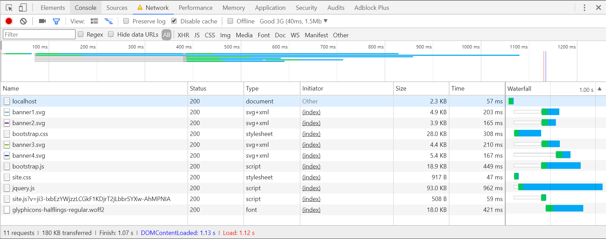
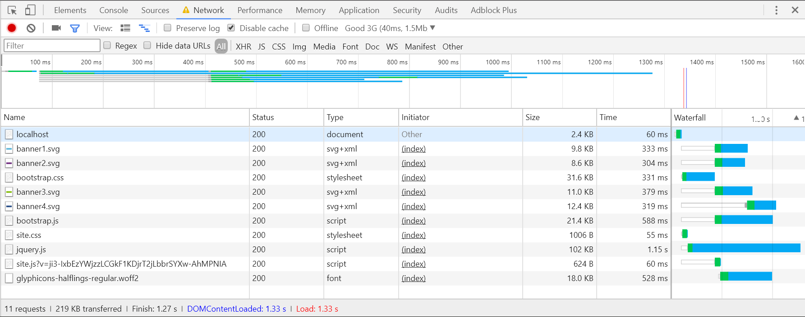

# Introducing Support for Brotli Compression

*This post was written by our software developer intern **[Denys
Tsomenko](https://github.com/Vedin)**, who worked on a Brotli compression
library during his internship.*

Modern web-pages are getting larger and larger with huge CSS, HTML and
JavaScript files. But the Internet connection isn't always good and pages can
load slowly. Web pages also often contain other materials such as images and
videos. Reducing load time can have a profound impact on the user experience.
Compression can help with that.

Currently, ASP.NET developers have two compression methods available to use in
their web applications: [Deflate](https://en.wikipedia.org/wiki/Deflate) and
[gzip](https://en.wikipedia.org/wiki/Gzip). But there is a trade off between
compression time and size reduction. Different algorithms can perform quite
differently. In 2015, two engineers at Google designed a new compression
algorithm called [Brotli](https://en.wikipedia.org/wiki/Brotli) that can have a
better compression without spending more time. Brotli is already supported by
the most browsers such as Google Chrome, Mozilla Firefox, Opera, and Microsoft
Edge.

In this post, we'll take a look at how Brotli performs and showcase our early
alpha preview for it.

## How good is Brotli?

The quality of every compression algorithm depends on three main factors:

1. **[Compression Ratio](#compression-ratio)** is the main value for these
   algorithms, because we generally want to reduce size as much as possible.

2. **[Compression Time](#compression-time)** is important because it describes
   how much the compressor has to spend. It's especially important for web
   servers where CPU time tends to be precious.

3. **[Decompression Time](#decompression-time)** is important because it
   controls how much time the consumer has to spend for reading compressed data.
   Again, this can also impact server CPU load as servers are frequently clients
   in micro-service architectures.

We'll use these metrics to compare Brotli with the compression algorithms we
already support, namely [Deflate](https://en.wikipedia.org/wiki/Deflate) and
[gzip](https://en.wikipedia.org/wiki/Gzip).

### Compression Ratio

*Compression ratio* indicates how much a compression algorithm can reduce the
size and is computed as follows:

```
Compression Ratio := Uncompressed Size / Compressed Size
```

So the higher the number, the better the algorithm is at compressing data. To
judge how well Brotli does here, we'll look at various different data sets.

Compression algorithms usually allow for tuning how much time the algorithm will
spend to compress the data. In .NET, we expose this via the
[CompressionLevel](https://msdn.microsoft.com/en-us/library/system.io.compression.compressionlevel(v=vs.110).aspx)
enumeration. To make numbers comparable, we use the extremes, which are
`Fastest`, which means we let the algorithm compress as fast as possible, with
`Optimal`, which means we let the algorithm spend as much time as it wants.

Let's start by looking at a typical file format that occurs in web development:
CSS. For our particular sample, we can see that Brotli compression ratio is
better on `Optimal` and about the same on `Fastest`:


We can also see that this pattern isn't unique to this one sample by extending
the set to also include some HTML and JavaScript samples:


The first three columns show size reduction with `Fastest`, the next three with
`Optimal` and the last one with a middle quality level for Brotli. As you can
see in the graph above, even at middle quality level, Brotli compression ratio
is higher than the optimal quality level of both gzip and Deflate.

To assess whether Brotli can also provide savings outside of the realm of web
files, let's take a look at the
[Canterbury Corpus](http://www.corpus.canterbury.ac.nz/descriptions/#cantrbry),
which is popular set of files for testing compression algorithms:

> The files were chosen because their results on existing compression algorithms
> are "typical", and so it is hoped this will also be true for new methods.
> -- [Canterbury Corpus](http://www.corpus.canterbury.ac.nz/descriptions/#cantrbry)

Specifically, we'll look at these files:

| File                                                                         | Contents          | Size (bytes) |
|:-----------------------------------------------------------------------------|:------------------|-------------:|
|[alice29.txt](http://corpus.canterbury.ac.nz/descriptions/cantrbry/text.html) | English text      |      152,089 |
|[grammar.lsp](http://corpus.canterbury.ac.nz/descriptions/cantrbry/list.html) | LISP source       |        3,721 |
|[kennedy.xls](http://corpus.canterbury.ac.nz/descriptions/cantrbry/Excl.html) | Excel Spreadsheet |    1,029,744 |
|[ptt5](http://corpus.canterbury.ac.nz/descriptions/cantrbry/fax.html)         | CCITT test set    |      513,216 |

Looking at the data, it's clear that Brotli is particular great for larger
files, but even for smaller files Brotli is either on par or slightly better
than Deflate and gzip:


### Compression Time

As explained in the introduction, compression is particular interesting for web
scenarios to reduce load times. However, if the compression algorithm takes too
long, than those savings are immediately lost again. Thus, it's also important
to compare how fast an algorithm can compress.

The graph below highlights the difference in compression times between Brotli,
Deflate, and gzip. We used a larger file (around 4 MB) to measure the
compression time. Since we measure time, lower is better.

When using `Fastest`, Brotli is faster than both Deflate and gzip:


However, when set to `Optimal`, Brotli takes a lot more time:


So this tells us that the time Brotli spends can significantly differ depending
on the quality level. To understand where the sweet spot it, let's just focus on
Brotli and how the time changes based on the compression levels that Brotli
supports, which is a range from 1 to 11. Using a level above 7 means you'll have
to accept orders of magnitude differences in compression time, so for cases
where time is important, you should probably use lower values. However, as we've
seen earlier, even at level 5, Brotli compresses quite well.


### Decompression Time

For static files, you might not care about compression time as you only have to
do it once. However, in virtually all scenarios the client will have to
decompress on every request, which makes decompression speed quite important.

Choosing the same 4 MB file for testing we get the following results:


As you can see, Brotli is again much faster than gzip and quite close to the
performance of Deflate (it's worth pointing out that for smaller files,
decompression speed is comparable across all algorithms).

### Bonus Metric: The Weissman Score

When the Brotli compression algorithm was released in 2015, the TV show
[Silicon Valley](https://en.wikipedia.org/wiki/Silicon_Valley_(TV_series))
was popular, and characters used the
[Weissman score](https://en.wikipedia.org/wiki/Weissman_score)
to measure the performance of their compression algorithm. While the Weissman
score was developed for fictional use on that show, it's quite useful because it
provides a handy efficiency metric.

So let's calculate it for Brotli: we'll use gzip as the baseline and Brotli as
the comparison. The algorithm considers both, compression ratio and time spent.
A score of less than 1 means that gzip is better while a score greater than 1
indicates Brotli fares better. As you can see, for every file we tested Brotli
is better than gzip based on this metric:


## Try It Out!

Today, .NET support for Brotli compression is available as an alpha-quality
preview. You can find the source code in our [CoreFxLab repository](https://github.com/dotnet/corefxlab/tree/master/src/System.IO.Compression.Brotli).

If you want to give it a try, follow these steps:

1. **Create a new project**. Brotli compression is available for .NET Standard
   1.4, so either a .NET Framework or a .NET Core application will work.
2. **Register our MyGet feed with the preview builds**. Please note that you
   shouldn't register this feed globally as it might result in bringing in
   preview packages into your production projects. Instead, register this feed
   only for the projects you want to use preview bits in. You can can do that by
   creating a file called `nuget.config` and putting it next to your solution
   file:
    ```xml
    <!-- nuget.config -->
    <configuration>
        <packageSources>
            <add key="dotnet.myget.org dotnet-corefxlab" value="https://dotnet.myget.org/F/dotnet-corefxlab/" />
        </packageSources>
    </configuration>
    ```
3. Install the
   [System.IO.Compression.Brotli](https://dotnet.myget.org/feed/dotnet-corefxlab/package/nuget/System.IO.Compression.Brotli)
   package. Make sure you check **Include prerelease** in the NuGet package
   manager UI.

With this setup, let's take a look at the source you'd write when compressing
and decompressing with Brotli. Similar to the existing compression, we offer a
`BrotliStream` that allows you to compress and decompress data via streams.

For compression, this would look as follows:

```C#
void Compress(string inputFileName, string outputFileName)
{
    using (FileStream input = File.OpenRead(inputFileName))
    using (FileStream output = File.Create(outputFileName))
    using (BrotliStream compressor = new BrotliStream(output, CompressionMode.Compress))
    {
        input.CopyTo(compressor);
    }
}
```

Decompression works analogously except that you pass in
`CompressionMode.Decompress` to the constructor:

```C#
void Decompress(string inputFileName, string outputFileName)
{
    using (FileStream input = File.OpenRead(inputFileName))
    using (FileStream output = File.Create(outputFileName))
    using (BrotliStream decompressor = new BrotliStream(input, CompressionMode.Decompress))
    {
        decompressor.CopyTo(output);
    }
}
```

As mentioned earlier, Brotli supports 11 levels of compression quality aside
from the standard `Optimal`, `Fastest` and `NoCompression` levels. You can pass
in the level to the constructor by casting the desired level directly to
`CompressionLevel`, like this:

```C#
BrotliStream brotli = new BrotliStream(baseStream,
                                       CompressionMode.Compress,
                                       leaveOpen,
                                       bufferSize,
                                       (CompressionLevel)5); // Use level 5
```

Now let's see how we can start using Brotli for response compression in an ASP.NET
Core application. We'll do that by extending the
[Response Compression middle-ware](https://docs.microsoft.com/en-us/aspnet/core/performance/response-compression).

Start by creating a web application. I've used ASP.NET Core 2.0 with the MVC
template.

Create a new a file called `BrotliCompressionProvider`:

```C#
public class BrotliCompressionProvider : ICompressionProvider
{
    public string EncodingName => "br";

    public bool SupportsFlush => true;

    public Stream CreateStream(Stream outputStream)
    {
        return new BrotliStream(outputStream, CompressionMode.Compress);
    }
}
```

Open the file `Startup.cs` and modify `ConfigureServices` to add the Brotli compression provider:

```C#
services.AddResponseCompression(options =>
{
    options.Providers.Add<BrotliCompressionProvider>();
    options.MimeTypes = ResponseCompressionDefaults.MimeTypes.Concat(new[] { "image/svg+xml" });
});
```

To enable automatic response compression, you also need to modify `Configure` by
adding this line:

```C#
app.UseResponseCompression();
```

To see it in action, launch the app in your favorite browser (I'm using Google
Chrome here). To make things more interesting, I'm simulating a typical 3G
connection via the F12 developer tools:


Results with Brotli:



Results without Brotli:



As you can see, we reduced the data from 219 KB to 180KB (~18%) and the page
load time from 1.33s to 1.12s (~16%).

# Summary

Brotli is a relatively new compression algorithm. It's quite beneficial for web
clients, with decompression performance comparable to gzip while significantly
improving the compression ratio. These are powerful properties for serving
static content such as fonts and html pages. Thus, if you currently use gzip or
Deflate as compression for your web site (or have never used compression) you
should give Brotli a try.

An early alpha preview version of the Brotli compression library is available
for you today. You can use the preview in both .NET Framework and .NET Core
applications. In typical sites we've seen faster load times between 14% to 30%,
but your mileage will vary.

Please give us feedback to make Brotli more usable and efficient! Let us know
what you think by leaving a comment here or by filing an issue in the
[CoreFxLab repository](https://github.com/dotnet/corefxlab/issues/new).