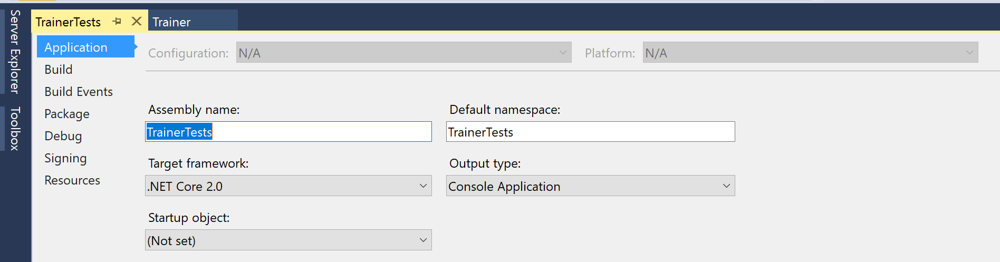
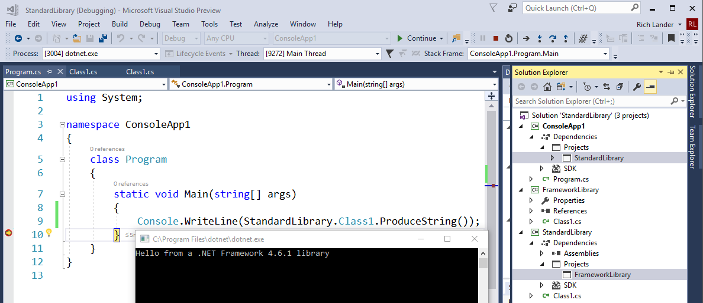
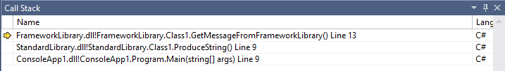

# Announcing .NET Core 2.0

.NET Core 2.0 is available today as a final release. You can start developing with it at the command line, in your favorite text editor, in Visual Studio 2017 15.3, Visual Studio Code or Visual Studio for Mac. It is ready for production workloads, on your own hardware or your favorite cloud, like [Microsoft Azure](https://docs.microsoft.com/dotnet/azure/).

* [Downloads](https://github.com/dotnet/core/blob/master/release-notes)
* [Release Notes](https://github.com/dotnet/core/blob/master/release-notes/2.0/2.0.0.md)
* [Known Issues](https://github.com/dotnet/core/blob/master/release-notes)
* [Documentation](https://docs.microsoft.com/dotnet/core/)
* [Tutorials](https://docs.microsoft.com/dotnet/core/tutorials/)
* [Samples](https://github.com/dotnet/dotnet-docker-samples/blob/master/README.md)

.NET Core 2.0 includes major [improvements](https://github.com/dotnet/announcements/issues?q=is%3Aissue+is%3Aopen+label%3A%22.NET+Core+2.0%22) that make .NET Core easier to use and much more capable as a platform. The following ones are the biggest ones and others are described in the body of this post.

### Runtime

* Implements [.NET Standard 2.0](https://github.com/dotnet/announcements/issues/24)
* 6 new [platforms supported](https://github.com/dotnet/core/blob/master/release-notes/2.0/2.0-supported-os.md), including Debian Stretch, SUSE Linux Enterprise Server 12 SP2, and macOS High Sierra.

### SDK

* [`dotnet restore` is now an implicit command](https://github.com/dotnet/announcements/issues/23).
* .NET Core and .NET Standard projects can reference .NET Framework NuGet packages and projects.

### Visual Studio

* Visual Studio support for .NET Core 2.0
* Live Unit Testing supports .NET Core.

For Visual Studio users: You need to update to the latest versions of Visual Studio to use .NET Core 2.0.

* [Visual Studio 2017 15.3+](https://www.visualstudio.com/vs/)
* [Visual Studio for Mac](https://www.visualstudio.com/vs/visual-studio-mac)
* [Visual Studio Code -- C# Extension](https://code.visualstudio.com/docs/other/dotnet)

### Thanks!

I want to express gratitude for [all the direct contributions that we received for .NET Core 2.0](https://github.com/dotnet/core/blob/master/release-notes/2.0/2.0-contributors.md). Thanks! Some of the most prolific contributors for .NET Core 2.0 are from companies investing in .NET Core, other than Microsoft. Thanks to [Samsung](https://developer.tizen.org/development/tizen-.net-preview/introduction) and Qualcomm for your contributions to .NET Core.

The .NET Core team shipped two .NET Core 2.0 previews ([preview 1],(https://blogs.msdn.microsoft.com/dotnet/2017/05/10/announcing-net-core-2-0-preview-1/) and [preview 2](https://blogs.msdn.microsoft.com/dotnet/2017/06/28/announcing-net-core-2-0-preview-2/))leading up to today's release. Thanks to everyone who tried out those releases and gave us feedback.

## Using .NET Core 2.0

You can get started with .NET Core 2.0 in just a few minutes, on Windows macOS or Linux.

You first need to install the [.NET Core SDK 2.0](https://www.microsoft.com/net/download/core).

You can create .NET Core 2.0 apps on the command line or in [Visual Studio](https://www.visualstudio.com/).

Creating new projects is easy. There are templates you can use in Visual Studio 2017. You can also create new application at the command line with `dotnet new`, as you can see in the following example.

```console
C:\samples>dotnet new console -o console-app
C:\samples>cd console-app
C:\samples\console-app>dotnet run
Hello World!
```

You can also upgrade an existing application to .NET Core 2.0. In Visual Studio, you can change the target framework of an application to .NET Core 2.0.



If you are working with [Visual Studio Code](https://code.visualstudio.com/) or another text editor, you will need to update the target framework to `netcoreapp2.0`.

```xml
 <PropertyGroup>
      <TargetFramework>netcoreapp2.0</TargetFramework>
 </PropertyGroup>
```

You can read more in-depth instructions in the [Migrating from ASP.NET Core 1.x to ASP.NET Core 2.0](https://docs.microsoft.com/en-us/aspnet/core/migration/1x-to-2x/1x-to-2x) document.

## .NET Core Runtime Improvements

The .NET Core Runtime 2.0 has the following improvements.

### .NET Core 2.0 Implements .NET Standard 2.0

The [.NET Standard 2.0](https://github.com/dotnet/announcements/issues/24) spec has been finalized at the same time as .NET Core 2.0.

We have more than doubled the set of available APIs in .NET Standard from **13k** in .NET Standard 1.6 to **32k** in .NET Standard 2.0. Most of the added APIs are .NET Framework APIs. These additions make it much easier to port existing code to .NET Standard, and, by extension, to any .NET implementation of .NET Standard, such as .NET Core 2.0 and the upcoming version of UWP.

.NET Core 2.0 implements the .NET Standard 2.0 spec: all **32k** APIs that the spec defines.

You can see a [diff between .NET Core 2.0 and .NET Standard 2.0](https://github.com/dotnet/standard/blob/master/docs/comparisons/netstandard2.0_vs_netcoreapp2.0/README.md) to understand the set of APIs that .NET Core 2.0 provides beyond the set required by the .NET Standard 2.0 spec.

### Much easier to target Linux as a single operating system

.NET Core 2.0 treats Linux as a single operating system. There is now a single Linux build (per chip architecture) that works on all Linux distros that we've tested. Our support so far is specific to [glibc](https://www.gnu.org/software/libc/)-based distros and more specifically Debian and Red Hat based Linux distros.

There are other Linux distros that we would like to support, like those that use [musl](https://www.musl-libc.org/), such as [Alpine](https://www.alpinelinux.org/). Alpine will be supported in a later release.

Please tell us if the .NET Core 2.0 Linux build doesn’t work well on your favorite Linux distro.

While not nearly as critical, similar improvements have been made for Windows and macOS. You can now publish for the following "runtimes".

* `linux-x64`, `linux-arm`
* `win-x64`, `win-x86`
* `osx-x64`

### Performance Improvements

There are many performance improvements in .NET Core 2.0. The team published a few posts describing the improvements to the .NET Core Runtime in detail.

* [Performance Improvements in .NET Core](https://blogs.msdn.microsoft.com/dotnet/2017/06/07/performance-improvements-in-net-core/)
* [Performance Improvements in RyuJIT in .NET Core and .NET Framework](https://blogs.msdn.microsoft.com/dotnet/2017/06/29/performance-improvements-in-ryujit-in-net-core-and-net-framework/)
* [Profile-guided optimization in .NET Core 2.0](https://blogs.msdn.microsoft.com/dotnet/2017/07/20/profile-guided-optimization-in-net-core-2-0/)

## .NET Core SDK Improvements

The .NET Core SDK 2.0 has the following improvements.

### dotnet restore is implicit for commands that require it

The `dotnet restore` command has been a required set of keystrokes with .NET Core to date. The command installs required project dependencies and some other tasks. It's easy to forget to type it and the error messages that tell you that you need to type it are not always helpful. It is now implicitly called on your behalf for commands like `run`, `build` and `publish`.

The following example workflow demonstates the absense of a required `dotnet restore` command:

```console
C:\Users\rich>dotnet new mvc -o mvcapp
The template "ASP.NET Core Web App (Model-View-Controller)" was created successfully.
This template contains technologies from parties other than Microsoft, see https://aka.ms/template-3pn for details.

Processing post-creation actions...
Running 'dotnet restore' on mvcapp\mvcapp.csproj...
  Restoring packages for C:\Users\rich\mvcapp\mvcapp.csproj...
  Restore completed in 32.3 ms for C:\Users\rich\mvcapp\mvcapp.csproj.
  Generating MSBuild file C:\Users\rich\mvcapp\obj\mvcapp.csproj.nuget.g.props.
  Generating MSBuild file C:\Users\rich\mvcapp\obj\mvcapp.csproj.nuget.g.targets.
  Restore completed in 2.26 sec for C:\Users\rich\mvcapp\mvcapp.csproj.
Restore succeeded.

C:\Users\rich>cd mvcapp

C:\Users\rich\mvcapp>dotnet run
Hosting environment: Production
Content root path: C:\Users\rich\mvcapp
Now listening on: http://localhost:5000
Application started. Press Ctrl+C to shut down.
Application is shutting down...
```

### Reference .NET Framework libraries from .NET Standard

You can now reference .NET Framework libraries from .NET Standard libraries using Visual Studio 2017 15.3. this scenario is more nuanced than is typical. It can be thought of as a feature that helps you migrate .NET Framework code to .NET Standard or .NET Core over time (start with binaries and then move to source). It is also useful in the case that the source code is no longer accessible or is lost for a .NET Framework library, enabling it to be still be used in new scenarios.

We expect that this feature will be used most commonly from .NET Standard libraries. It also works for .NET Core apps and libraries. They can depend on .NET Framework libraries, too.

The supported scenario is referencing a .NET Framework library that happens to only use types within the .NET Standard API set. Also, it is only supported for libraries that target .NET Framework 4.6.1 or earlier (even .NET Framework 1.0 is fine). If the .NET Framework library you reference relies on WPF, the library will not work (or at least not in all cases). You can use libraries that depend on additional APIs,but not for the codepaths you use. In that case, you will need to invest singificantly in testing.

You can see this feature in use in the following images.



The call stack for this app makes the dependency from .NET Core to .NET Standard to .NET Framework more obvious.



### .NET Standard NuGet Packages no longer have required dependencies

.NET Standard NuGet packages no longer have any required dependencies if they target .NET Standard 2.0 or later. The .NET Standard dependency is now provided by the .NET Core SDK. It isn't necessary as a NuGet artifact.

The following is an example nuspec (recipe for a NuGet package) targeting .NET Standard 2.0.

```xml
<?xml version="1.0" encoding="utf-8"?>
<package xmlns="http://schemas.microsoft.com/packaging/2012/06/nuspec.xsd">
    <metadata>
        <id>ClassLibrary1</id>
        <version>1.0.0</version>
        <authors>ClassLibrary1</authors>
        <owners>ClassLibrary1</owners>
        <requireLicenseAcceptance>false</requireLicenseAcceptance>
        <description>Package Description</description>
        <dependencies>
            <group targetFramework=".NETStandard2.0" />
        </dependencies>
    </metadata>
</package>
```

The following is an example nuspec (recipe for a NuGet package) targeting .NET Standard 1.4.

```xml
<?xml version="1.0" encoding="utf-8"?>
<package xmlns="http://schemas.microsoft.com/packaging/2012/06/nuspec.xsd">
    <metadata>
        <id>ClassLibrary1</id>
        <version>1.0.0</version>
        <authors>ClassLibrary1</authors>
        <owners>ClassLibrary1</owners>
        <requireLicenseAcceptance>false</requireLicenseAcceptance>
        <description>Package Description</description>
        <dependencies>
            <group targetFramework=".NETStandard1.4">
                <dependency id="NETStandard.Library" version="1.6.1" exclude="Build,Analyzers" />
            </group>
        </dependencies>
    </metadata>
</package>
```

* Visual Studio can target new .NET Core SDK versions you install.
* F# and Visual Basic are supported (in addition to C#).
* .NET Core and .NET Standard meta-package references no longer needed.

## Platform Support

Text here.

## Support and Lifecycle

Text here.

## Closing

Text here.