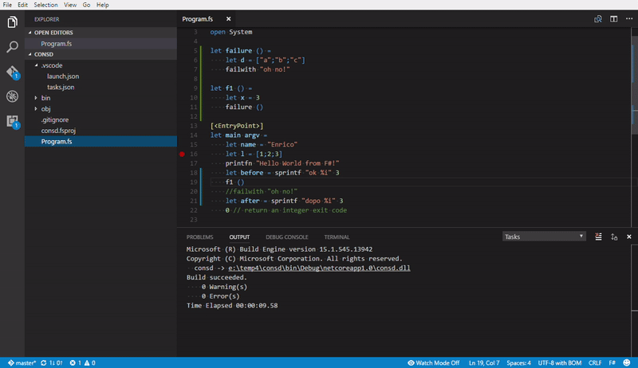

# F# and .NET Core Roadmap Update

As we approach the release of .NET Core 2.0 RTW we wanted to take some time to talk about how F# fits into the .NET Core ecosystem.

## .NET Core: current status

F# has been supported on .NET Core 1.0 and .NET Core 1.1 since their releases.  Once the compiler was in a stable preview, [Enrico Sada](https://github.com/enricosada) from the F# community worked with us to add support in the newly-crated .NET CLI, the .NET Core SDK once the CLI was changed, and templates.  The rest of the F# open source community has also embraced .NET Core , porting many libraries and tools.  The most impressive of which is [Fable](http://fable.io/), which allows you to use the entire JavaScript ecosystem to write F# code that runs in the browser!

Since the releases of .NET Core 1.0 and .NET Core 1.1, our primary focus for F# and .NET Core has been in [Portable PDB](https://github.com/dotnet/core/blob/master/Documentation/diagnostics/portable_pdb.md) generation and .NET Core 2.0 support.  The former is now shipped, and enables debugging on .NET Core today.

## F# and .NET Core 2.0

As many of you are aware, .NET Core 2.0 2.0 is in preview.  Our top priority up until this point has been to ensure the quality of F# when targeting .NET Core 2.0.

This is the first release of F# on .NET Core that can be built from source as a part of the .NET Core SDK and the .NET Core CLI.  This is a requirement for F# to ship on RedHat Enterprise Linux, and also meets the expectations of many linux developers.

Starting with the release of .NET Core 2.0 Preview 3, all of the changes we have made for F# support in .NET Core 2.0 will be in-box with the .NET Core SDK and .NET Core CLI.  Additionally, we have backported in-box support for F# running on .NET Core 1.0.4 and .NET Core 1.1 in the version of the .NET Core SDK that will ship with Visual Studio 2017 Update 3.  We're also working with the maintainers of highly-used open source projects to ensure they work well on .NET Core 2.0.  

## The best way to use F# and .NET Core today

The best way to use F# and .NET Core today is in Visual Studio Code with the [Ionide-FSharp extension](https://marketplace.visualstudio.com/items?itemName=Ionide.Ionide-fsharp).  This should come as no surprise to F# developers already using .NET Core today.  Ionide supports many things, including project scaffolding, IntelliSense, and debugging.



There are only three dependencies required to create, build, run, and debug F# applications on .NET Core today:

1. Install [Visual Studio Code](https://code.visualstudio.com/).
2. Install the [Ionide-FSharp extension](https://marketplace.visualstudio.com/items?itemName=Ionide.Ionide-fsharp).
3. Install the [C# extension](https://marketplace.visualstudio.com/items?itemName=ms-vscode.csharp) (this is needed for the .NET Core debugger, which ships only in the C# plugin)

Once you have configured your application for debugging, just like with C#, you can use F# in Visual Studio Code to do nearly anything you want with F# and .NET Core!

## Visual Studio tooling support

For long time .NET developers, a common question is "when will Visual Studio support F# .NET Core projects".  We're working hard to get this functionality ready, but unfortunately, we're not quite happy enough with the quality in the 15.3 update to announce that it's supported. While Visual Studio 2017 Update 3 is able to open the new F# .NET Core projects, build, and debug them, IntelliSense does not yet work correctly.

All .NET Core projects now share a common simplified project format that you've hopefully seen by now. This means that we share a common core component of the IDE referred to as the Common Project System (CPS). This dependency will enable us to develop at a much greater pace, rather than maintaining the large and specialized code base designed specifically for F# projects. Unfortunately, CPS does not yet support file ordering in the tree view of the Visual Studio UI.  We knew that this would prevent ordering files in the Visual Studio UI, but we did not know that this limitation also extended to the pieces of the project system which send files to our language service.  This is the part of our tooling which powers IntelliSense, that our language service isn't able to correctly reflect a project's F# code, resulting in false negative error reporting and a lack of IntelliSense in certain cases.  Our work in offering stable support for .NET Core 2.0 took us beyond the window that we were able to fix this issue in CPS for the 2017 15.3 release.  There was also no way to devise a workaround in a timely fashion.  Given this, we are not considering .NET Core SDK-based projects support for F# in Visual Studio 2017 just yet.

## F# Interactive and Type Providers

.NET Core introduces a different model for how assemblies are laid out on disk and loaded by a process such as F# Interactive.  This model breaks `#r` in F# Interactive.  Rather than add workarounds in F# Interactive, we are going to move forward with a plan to use a package manager to resolve assemblies and change the way that you use `#r` from here on out.  

Our goal is to move you away from specifying assemblies on disk and towards referencing a package by name and optional version.  That may look like this:

```fsharp
#r "nuget: Newtonsoft.Json" // Using NuGet
#r "paket: Newtonstoft.Json >= 9.1.0" // Using paket
```

We're still working out [the design and default behavior](https://github.com/fsharp/fslang-design/issues/167).  It will be backwards-compatible, but we're using .NET Core as a precedent to move towards this new way to reference things in F# scripting and F# Interactive.

Erasing Type Providers work with [this workaround](https://github.com/Microsoft/visualfsharp/issues/3303) today.  In the near future, the workaround won't be necessary.

Generative Type Providers are still unsupported and have no workaround.  They depend on APIs which are not yet available on .NET Core.

## Conclusion

F# is stable on .NET Core, there is a great tooling experience with Visual Studio Code, and much of the F# open source ecosystem is already running on .NET Core today.  Although the entire developer experience isn't complete yet, each of the important remaining parts - Visual Studio support, F# Interactive, and Type Providers - have a way forward and are being worked on.  We're really excited about the forthcoming release of .NET Core 2.0, and we look forward to seeing more and more people use F# and .NET Core in the future.