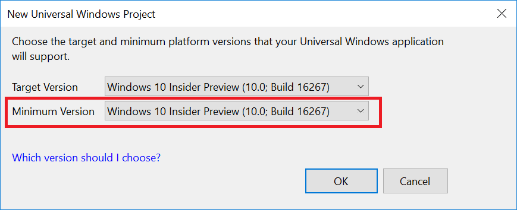

# UWP & .NET Standard 2.0: A preview is now available!

Today, we [released the first Preview of Visual Studio 2017 version 15.4][vspost].
This includes an update to UWP that supports .NET Standard 2.0. In this post,
I'll outline what this means for UWP development with .NET.

## Prerequisites

In order to use .NET Standard 2.0 in UWP, you need to target Fall Creators
Update (FCU) as the minimum version of UWP. That's because .NET Standard 2.0
contains many APIs that require FCU to make them work in the context of the UWP execution environment, specifically AppContainer.

## What's new with .NET Standard 2.0?

.NET Standard is a specification of APIs that all .NET implementations have to
implement. UWP is now adding support for .NET Standard 2.0.

The key advantage of [.NET Standard 2.0][nspost] is that it makes .NET
implementations of .NET Standard become much more similar to .NET Framework.
With .NET Standard 2.0, [about 20,000 more APIs][ns20] become available compared
to .NET Standard 1.6. The vast majority of them are existing .NET Framework
APIs, which includes missing reflection APIs, non-generic collections,
`DataSet`, binary serialization, XML Schema, and many more. For a full list, take a look at the [diff between .NET Standard 2.0 and .NET Standard 1.6][ns20].

This makes it much easier to port existing .NET Framework code to UWP. This
includes both, copy & pasting existing code, but also extends to referencing
existing .NET Framework binaries, via the compatibility mode.

For more details, check out my [blog post on .NET Standard 2.0][nspost].

<iframe width="800" height="600" src="https://www.youtube.com/embed/HyfDG4mjBPk?list=PLRAdsfhKI4OWx321A_pr-7HhRNk7wOLLY" frameborder="0" allowfullscreen></iframe>

## Summary

[Visual Studio 2017 version 15.4 Preview 1][vspost] adds support for .NET Standard 2.0 in UWP projects
that require Fall Creators Update (FCU). Please give it a spin and tell us what you think!

[vspost]: https://blogs.msdn.microsoft.com/visualstudio/2017/08/25/visual-studio-2017-version-15-4-preview/
[nspost]: https://blogs.msdn.microsoft.com/dotnet/2017/08/14/announcing-net-standard-2-0/
[ns20]: https://github.com/dotnet/standard/blob/master/docs/versions/netstandard2.0.md
