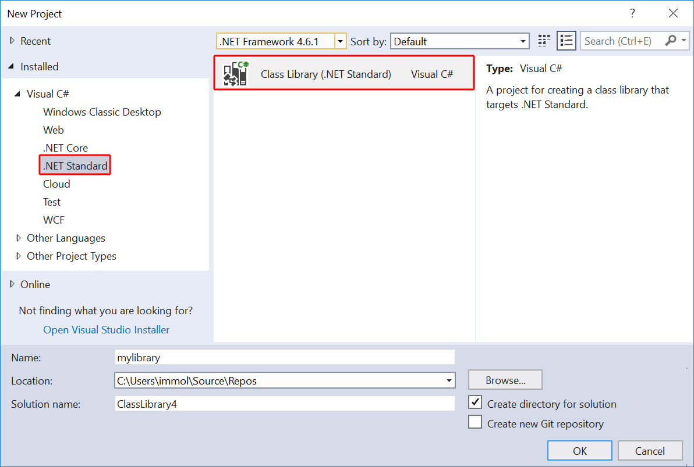
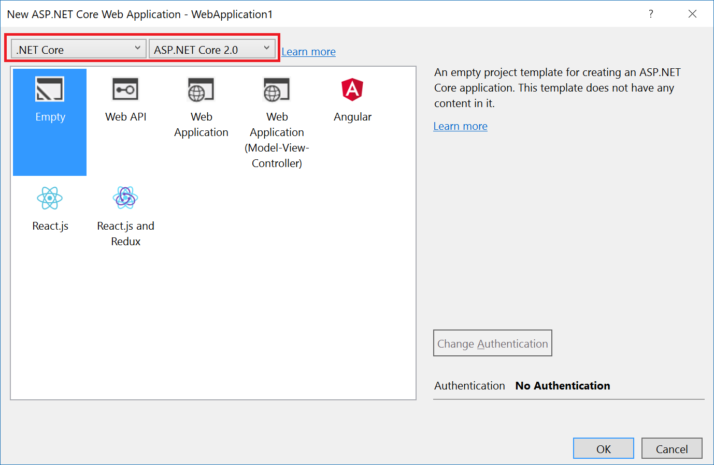
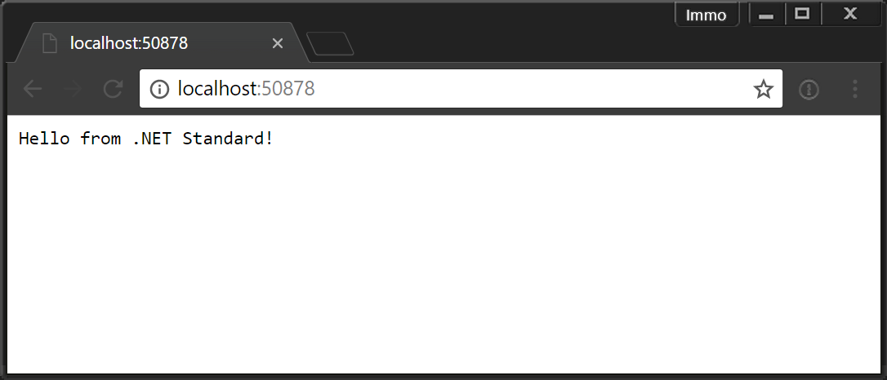
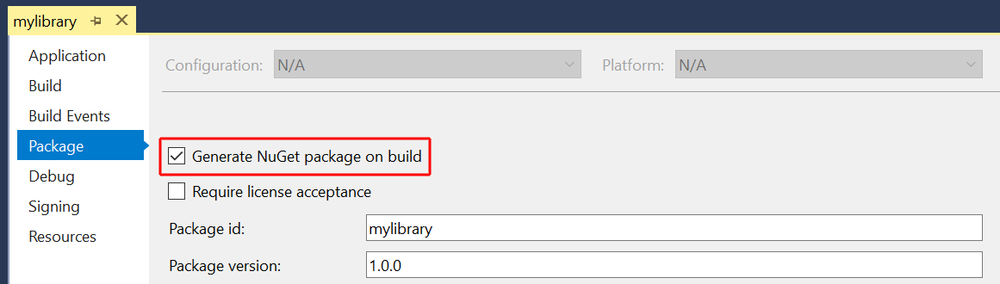
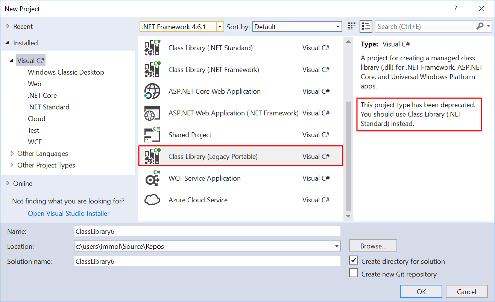

# Announcing .NET Standard 2.0

The [.NET Standard 2.0 specification][ns20] is
now complete. It is supported in [.NET Core 2.0][netcore20-post],
in the [.NET Framework 4.6.1 and later versions][netfx],
and in Visual Studio. You can start using .NET Standard 2.0 today.

## For the impatient: TL;DR

* **.NET Standard is for sharing code**. .NET Standard is a set of APIs that all
  .NET implementations must provide to conform to the standard. This unifies the
  .NET implementations and prevents future fragmentation. It replaces Portable
  Class Libraries (PCLs) as the tool for building .NET libraries that work
  everywhere.
* **Much bigger API Surface**: We have more than doubled the set of available APIs
  from **13k** in [.NET Standard 1.6][ns16]
  to **32k** in [.NET Standard 2.0][ns20].
  Most of them are existing .NET Framework APIs. These additions make it much
  easier to port existing code to .NET Standard, and, by extension, to any .NET
  implementation of .NET Standard, such as .NET Core 2.0 and the upcoming
  version of UWP.
* **.NET Framework compatibility mode**: The vast majority of NuGet packages are
  currently still targeting .NET Framework. Many projects are currently blocked
  from moving to .NET Standard because not all their dependencies are targeting
  .NET Standard yet. That's why we added a compatibility mode that allows .NET
  Standard projects to reference .NET Framework libraries. While this may not
  work in all cases (for instance, if the .NET Framework binaries use WPF) we
  found that 
  [70% of all NuGet packages on nuget.org are API compatible][nsnuget]
  with .NET Standard 2.0. So in practice it unblocks many projects.
* **Broad platform support**. .NET Standard 2.0 is [supported on the following platforms][nsversions]:
    - .NET Framework 4.6.1
    - .NET Core 2.0
    - Mono 5.4
    - Xamarin.iOS 10.14
    - Xamarin.Mac 3.8
    - Xamarin.Android 7.5
    - Upcoming version of UWP (expected to ship later this year)

## Creating a .NET Standard library

Let's see .NET Standard 2.0 in action by creating a new project. You can do this
in Visual Studio by invoking **File** | **New Project**. Choose **Class Library
(.NET Standard)** from the **.NET Standard** category:



From the command-line, you can use `dotnet new` to create a new library (which
by default is targeting .NET Standard):

```
$ dotnet new lib -o mylibrary
```

To make this library a bit more interesting. Edit the file `Class1.cs` as
follows:

```C#
using System;

namespace mylibrary
{
    public class Class1
    {
        public static string GetMessage() => "Hello from .NET Standard!";
    }
}
```

## Consuming a .NET Standard library

Before we can consume the library, we need to create a project. Let's create an
empty ASP.NET Core application. In Visual Studio, create a new project and
choose **ASP.NET Core Web Application** from the **.NET Core** category. Then
choose **Empty** and make sure **ASP.NET Core 2** is selected:



From the command-line, you can simply use `dotnet new` again:

```
$ dotnet new web -o aspnetcore
```

Consuming a .NET Standard library works the same as any other library project:
you simply reference it. In Visual Studio, right-click your web project and
click on **Add** | **Reference...**. Then choose **mylibrary** from the
**Projects** tab.

From the command-line, you can use `dotnet add`:

```
$ dotnet add reference ../mylibrary/mylibrary.csproj
```

Now edit the file `Startup.cs` and change the invocation of the `Run` method as
follows:

```C#
app.Run(async (context) =>
{
    var message = mylibrary.Class1.GetMessage();
    await context.Response.WriteAsync(message);
});
```

To start the web application, you can simply press **F5** in Visual Studio. On
the command-line, use `dotnet run`:

```
$ dotnet run
Now listening on: http://localhost:50878
Application started. Press Ctrl+C to shut down.
```

To see the web site, open a browser and navigate to the printed URL:



Congratulations! Your .NET Standard 2.0 library is now running on .NET Core. You
can also use it from the .NET Framework or a Xamarin app and the experience
would be very similar.

## Reusing an existing .NET Framework library

Now let's add a reference to a NuGet package that doesn't target .NET Standard yet,
[Huitian.PowerCollections](https://www.nuget.org/packages/Huitian.PowerCollections).
In Visual Studio, right-click the **mylibrary** project and choose **Manage NuGet Packages**.
Then select **Browse** and search for **Huitian.PowerCollections**. Click on
**Install**.

As a command-line user, you can achieve the same by using `dotnet add package`:

```
$ dotnet add package Huitian.PowerCollections
```

The following warning is displayed after you installed the package:

> NU1701: Package 'Huitian.PowerCollections 1.0.0' was restored using
> '.NETFramework,Version=v4.6.1' instead of the project target framework
> '.NETStandard,Version=v2.0'. This package may not be fully compatible with
> your project.

This warning not only appears when installing the package, but every time you
build. This ensures you don't accidentally overlook it.

The reason for the warning is that NuGet has no way of knowing whether the .NET
Framework library will actually work. For example, it might depend on Windows
Forms. To make sure you don't waste your time troubleshooting something that
cannot work, NuGet lets you know that you're potentially going off the rails. Of
course, warnings you have to overlook are annoying. Thus, we recommend that you
test your application/library and if you find everything is working as expected,
you can suppress the warning.

If you're using the command-line, edit your project file and add the `NoWarn`
attribute on the `PackageReference` that you want to suppress the warning for.
The value for the attribute is a comma separated list of all the warning IDs. In
our case it's only a single one, namely `NU1701`:

```xml
<ItemGroup>
  <PackageReference Include="Huitian.PowerCollections" Version="1.0.0" NoWarn="NU1701" />
</ItemGroup>
```

In Visual Studio, right-click the package reference you want to suppress the
warning for in **Solution Explorer** and select **Properties**. Set the
**NoWarn** property to `NU1701` as in the following example.


Building the project will now show zero warnings. Notice that the suppression
isn't global but specific to each package reference. This ensures that just
using one library through the compatibility mode doesn't result in a free ride
for all future references. So if you install another library that needs the
compatibility mode, you'll get the warning again and you'll need to suppress it
for that package too.

## Producing a NuGet package

When your library is ready, you can produce a NuGet package for it and publish
it (I'm assuming that's our goal). To do this in Visual Studio, right-click your
project and select **Properties**. On the **Package** tab, check the box for
**Generate NuGet package on build**:



If you're using the command-line, edit the project file and add the
`GeneratePackageOnBuild` property with a value of `true`:

```xml
<PropertyGroup>
  <TargetFramework>netstandard2.0</TargetFramework>
  <GeneratePackageOnBuild>true</GeneratePackageOnBuild>
</PropertyGroup>
```

When you rebuild your project, you'll also find a NuGet package in the output
directory.

## What about Portable Class Libraries?

If you're sharing code between different .NET implementations today, you're
probably aware of Portable Class Libraries (PCLs). With the release of .NET
Standard 2.0, we're now officially deprecating PCLs and you should move your
projects to .NET Standard:




## Summary

.NET Standard 2.0 has doubled the APIs since .NET Standard 1.x, which means it's
now much easier to port existing code from .NET Framework to .NET Standard. It
also adds a compatibility mode for referencing existing .NET Framework binaries
from .NET Standard. This allows you to get started although not all of your
dependencies have ported to .NET Standard yet.

Virtually all .NET implementations have support for .NET Standard 2.0, including
.NET Framework, .NET Core, and Xamarin. UWP support will come later this year.
All these implementations benefit from the added APIs and the compatibility
mode, especially .NET Core and UWP, which used to have a much more constrained
API set.

**Are you building applications?** Then, we recommend that you convert your
business logic and UI-independent code to .NET Standard. This ensures no matter
where your business needs to go -- desktop, mobile, or cloud -- your code can
come across for the ride.
    
**Are you building NuGet packages**? Then move to .NET Standard 2.0. You get a
lot of APIs without compromising on reach. And your consumers will love it too!

Let us know what you think in the comments below.

[ns16]: https://github.com/dotnet/standard/blob/master/docs/versions/netstandard1.6.md
[ns20]: https://github.com/dotnet/standard/blob/master/docs/versions/netstandard2.0.md
[nsversions]: https://github.com/dotnet/standard/blob/master/docs/versions.md
[nsnuget]: https://www.youtube.com/watch?v=iIlQer4LEac
[netfx]: https://github.com/Microsoft/dotnet/blob/master/releases/README.md
[netcore20-post]: https://blogs.msdn.microsoft.com/dotnet/2017/08/14/announcing-net-core-2-0/