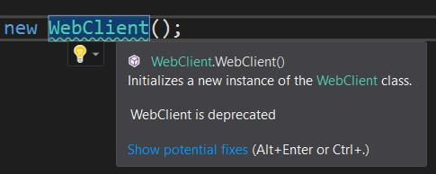
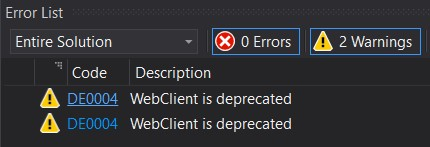

# Introducing API Analyzer

Have you ever wondered which APIs are deprecated and which should you use instead? Or have you ever used an API and then found out it didn't work on Mac or Linux? Have that ever happened to you too late when a major part of your code is already implemented and refactoring turns into a living hell? All those problems can be avoided now with the new [API Analyzer](https://www.nuget.org/packages/Microsoft.DotNet.Analyzers.Compatibility/), which allows you to get live feedback on API usage and warns about potential compatibility issues and calls to deprecated APIs.

# TL;DR You can now have a virtual API expert!
API Analyzer is a Roslyn analyzer that comes as [NuGet package](https://www.nuget.org/packages/Microsoft.DotNet.Analyzers.Compatibility/). After referencing it in your project, it automatically starts monitoring your code and squiggles problematic API usage. You can get suggestions on possible fixes by clicking on the light bulb, which also includes the ability suppress the warnings. Think of the API Analyzer as an expert that is looking over your shoulder and gives you feedback as you code.

 !

Here is a demo of API Analyzer in action:

<iframe width="560" height="315" src="https://www.youtube.com/embed/eeBEahYXGd0?rel=0&amp;showinfo=0" frameborder="0" allowfullscreen></iframe>

The Portability Analyzer is useful in assessing the compatibility of APIs with different platforms and in detecting calls to deprecated APIs. Let's begin with discovering deprecated APIs.

## Discovering deprecated APIs
The .NET Framework is a large product that is getting constantly upgraded to better serve customers needs, implement innovative approaches, and fix issues. So it's natural to deprecate some APIs and replace them with new ones. For example, we have build three versions of the .NET Framework networking stack. The latest version, `HttpClient`, is intended to replace `WebClient` and `HttpWebRequest`. As a developer, how do I know that I should use `HttpClient` instead of `WebClient`? There is a documentation, but we usually look in documentation only after we face some problems, when code is already implemented with an old API and refactoring is annoying. So it is very beneficial to be prompted that you're using a deprecated API at its first appearance in you code.

Similarly, a developer who comes from Java background where he was using `ArrayList` finds an `ArrayList` class in .NET and uses it in his code. Only later would he find out that `ArrayList` is deprecated, and `List<T>` is recommended. Being advised which API to use right away would be a great learning experience.

That is exactly what the API Analyzer does: it immediately prompts you by recommending an alternative API and provides you with detailed information about each call to a deprecated API. The Error List window immediately gives you warnings with a unique ID per deprecated API (in our example `DE004`). By clicking on it, you will go to a webpage with detailed information about why the API was deprecated and how alternative APIs should be used.



In some cases, such as when you can't break your customers or refactoring a large legacy code base would be too expensive, you need to keep the existing API. In these cases, we recommend that you suppress the specific warnings. It can be easily done by right clicking on the highlighted member and selecting **Quick Actions and Refactorings**. Here you will get two suppression options: locally (in source) or globally (in a suppression file). We encourage developers to use global suppression, since if you have decided that it is ok to use some deprecated API, it should be ok to use it everywhere in your project.

## Discovering cross-platform issues
Because we’re a cross platform stack, some APIs don’t work on all the platforms. There are also types that are present on all platforms, but some members are not supported by each platform. A good example is `Console.WindowWidth`, which works on Windows but not on Linux and macOS. If your app were to run on Linux or maxOS, a call to `Console.WindowWidth` would throw a `PlatformNotSupportedException`. API Analyzer will notify you that the API is not supported, which will help you to address the problem right away while you're still editing the code. Even if you are targeting only one platform at this moment, your business goals might change in the future and you will have to spend a lot of time going through your code figuring out if there are any cross-platform problems. In contrast, API Analyzer will highlight all the problematic parts right away.

The experience of analyzer handling cross-platform issues is very similar to deprecation, you'll see a squiggle, diagnostic ID in Error List window and will be able to suppress warning by right click and choosing "Quick Actions and Refactorings". Unlike deprecation cases where you have two options: either keep using deprecated member and suppress warnings or not use it at all, here if you are developing your code only for certain platform you can suppress all warnings for all other  platforms you don't plan to run your code on. To do so you just need to edit your project file and add a property `PlatformCompatIgnore` that lists all platforms to be ignored:
```
<PropertyGroup>
    <PlatformCompatIgnore>Linux;MacOSX</PlatformCompatIgnore>
</PropertyGroup>
```
If your code targets multiple platforms and you want to take advantage of an API not supported on some of them, you can guard that part of the code with an `if`-statement:

```CSharp
if (RuntimeInformation.IsOSPlatform(OSPlatform.Windows))
{
     var w = Console.WindowWidth;
     // More code
}
```

In the future, we are considering automatically generating this guarding code when you right-click on an API that is not cross-platform.

You can also conditionally compile per target framework/operating system, but you currently need to do that manually.

## Supported diagnostics
Right now the analyzer handles the following cases:
* Usage of a .NET Standard API that will throw `PlatformNoSupportedException` (PC001)
* Usage of a .NET Standard API that isn't available on the .NET Framework 4.6.1 (PC002)
* Usage of a native API that doesn’t exist in UWP (PC003)
* Usage of an API that is marked as deprecated (DEXXXX)

## CI machine
All these diagnostics are available not only in the IDE, but also on the command line as part of building your project, which includes the CI server.

## Configuration
It is up to a user to decide how the diagnostics should be treated: as warnings, errors, suggestions, or to be turned off. For example as an architect you can decide that compatibility issues are errors, some deprecation are warnings and some are only suggestions. You can configure this separately by diagnostic ID and by project. To do so in your project tree -> Dependencies -> Analyzers -> Microsoft.DotNet.Analyzers.Compatibility, right click on the diagnostic ID and Set Rule Set Severity and pick a desired option. 

## Summary
Compatibility Analyzer helps developers to be prompted right away if they are about to use a deprecated or non cross-platform functionality. Being notified so fast eliminates a need of refactoring the code in future and results in a better quality applications. 

We are still working on this analyzer and would appreciate any feedback. What did we do well? What did we do badly? Is the Analyzer useful at all? Is there anything you'd like us to add to the Analyzer? Please try [it](https://www.nuget.org/packages/Microsoft.DotNet.Analyzers.Compatibility/) out and leave your feedback [here](https://github.com/dotnet/platform-compat/issues/new).