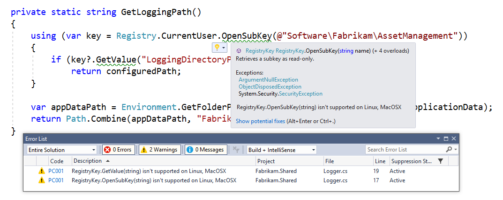

# Announcing the Windows Compatibility Pack for .NET Core

Porting existing code to .NET Core used to be quite hard because the available
API set was very small. In .NET Core 2.0, we already made this much easier,
thanks to [.NET Standard 2.0][ns20]. Today, we're happy to announce that we made
it even easier with the [Windows Compatibility Pack][nuget], which provides
access to an additional 20,000 APIs via a single NuGet package.

## Who is this package for?

This package is meant for developers that port existing .NET Framework code to
.NET Core. But before you port, you should understand what you want to
accomplish with the migration. Just porting to .NET Core because it's a new .NET
implementation isn't a good enough reason (unless you're a True Fan).

.NET Core is optimized for building highly scalable web applications, running
on Windows or Linux. If you're building Windows desktop applications then .NET
Framework is still the best choice for you.

```html
<div style="text-align: center; width: 100%;"><iframe
src="https://channel9.msdn.com/Events/Connect/2017/T123/player"
width="560" height="315"
frameborder="0" allowfullscreen></iframe></div>
```

## Using the Windows Compatibility Pack

We highly recommend that you plan your migrations as a series of steps instead
of assuming you can port the existing code base all at once. If your goal is to
migrate an ASP.NET MVC application running on a local Windows server to an
ASP.NET Core application running on Linux in Azure, I'd recommend you perform
these steps:

1. Migrate to ASP.NET Core (while staying on .NET Framework)
2. Migrate to .NET Core (while staying on Windows)
3. Migrate to Linux
4. Migrate to Azure

The order of steps might vary, depending on your business goals and what value
you need to realize first (for example, you might port to Azure as first). The
primary point is that you perform one step at a time to ensure your application
stays operational along the way. This reduces the complexity and churn you have
to reason about at once. It also allows you to learn more about your code base
and adjust your plans as you discover issues.

The [Porting to .NET Core from .NET Framework][porting-docs] documentation
provides more details on the recommended process and which tools you can use.

Before bringing existing .NET Framework code to a .NET Core project, I recommend
you first add the Windows Compatibly Pack by installing the NuGet package
[Microsoft.Windows.Compatibility][nuget]. This maximizes the amount of APIs you
have at your disposal.

Below a table of the components the Windows Compatibly Pack contains. Some of
these technologies are not yet available in the preview but will come in a
subsequent update.

| Component                                  | Status    | Windows-Only | Component                                  | Status    | Windows-Only |
|:-------------------------------------------|:----------|:-------------|:-------------------------------------------|:----------|:-------------|
| Microsoft.Win32.Registry                   | Available | Yes          | System.Management                          | Coming    | Yes          |
| Microsoft.Win32.Registry.AccessControl     | Available | Yes          | System.Runtime.Caching                     | Coming    |              |
| System.CodeDom                             | Available |              | System.Security.AccessControl              | Available | Yes          |
| System.ComponentModel.Composition          | Coming    |              | System.Security.Cryptography.Cng           | Available | Yes          |
| System.Configuration.ConfigurationManager  | Available |              | System.Security.Cryptography.Pkcs          | Available | Yes          |
| System.Data.DatasetExtensions              | Coming    |              | System.Security.Cryptography.ProtectedData | Available | Yes          |
| System.Data.Odbc                           | Coming    |              | System.Security.Cryptography.Xml           | Available | Yes          |
| System.Data.SqlClient                      | Available |              | System.Security.Permissions                | Available |              |
| System.Diagnostics.EventLog                | Coming    | Yes          | System.Security.Principal.Windows          | Available | Yes          |
| System.Diagnostics.PerformanceCounter      | Coming    | Yes          | System.ServiceModel.Duplex                 | Available |              |
| System.DirectoryServices                   | Coming    | Yes          | System.ServiceModel.Http                   | Available |              |
| System.DirectoryServices.AccountManagement | Coming    | Yes          | System.ServiceModel.NetTcp                 | Available |              |
| System.DirectoryServices.Protocols         | Coming    |              | System.ServiceModel.Primitives             | Available |              |
| System.Drawing                             | Coming    |              | System.ServiceModel.Security               | Available |              |
| System.Drawing.Common                      | Available |              | System.ServiceModel.Syndication            | Coming    |              |
| System.IO.FileSystem.AccessControl         | Available | Yes          | System.ServiceProcess.ServiceBase          | Coming    | Yes          |
| System.IO.Packaging                        | Available |              | System.ServiceProcess.ServiceController    | Available | Yes          |
| System.IO.Pipes.AccessControl              | Available | Yes          | System.Text.Encoding.CodePages             | Available | Yes          |
| System.IO.Ports                            | Available | Yes          | System.Threading.AccessControl             | Available | Yes          |

## Handling Windows-only APIs

If you plan to run your .NET Core application on Windows only, then you don't
have to worry about whether an API is cross-platform or not. However, if you
plan to migrate your application to Linux you probably you need to take the
platform support into account.

As you can see in the table above, about half of the components in the Windows
Compatibility Pack are Windows-only, the other half works on any platform. Your
code can always assume all the APIs *exists* across all platform, but they *may
throw* `PlatformNotSupportedException` if they are Windows-only. Being able to
rely on the API being there allows you write code that calls Windows-only API
after doing a platform check at runtime, rather than having to use conditional
compilation using `#if`:

```csharp
private static string GetLoggingPath()
{
    // Verify the code is running on Windows.
    if (RuntimeInformation.IsOSPlatform(OSPlatform.Windows))
    {
        using (var key = Registry.CurrentUser.OpenSubKey(@"Software\Fabrikam\AssetManagement"))
        {
            if (key?.GetValue("LoggingDirectoryPath") is string configuredPath)
                return configuredPath;
        }
    }

    // This is either not running on Windows or no logging path was configured,
    // so just use the path for non-roaming user-specific data files.
    var appDataPath = Environment.GetFolderPath(Environment.SpecialFolder.LocalApplicationData);
    return Path.Combine(appDataPath, "Fabrikam", "AssetManagement", "Logging");
}
```

You might wonder how you're supposed to know which APIs are Windows-only. The
obvious answer is documentation, but that's not very convenient. This is one of
the reasons why we introduced [API Analyzer][api-analyzer] earlier. It's a
Roslyn-based analyzer that will flag usages of Windows-only APIs when you're
targeting .NET Core and .NET Standard. For the sample above, this looks as
follows:



You have three options to deal with Windows-only API usages:

* **Remove**. Sometimes you might get away with simply deleting the code as you
  don't plan to migrate certain features to the .NET Core-based version of your
  application.

* **Replace**. Usually, you'll want to preserve the general feature so you might
  have to replace the technology with one that is cross-platform. For example,
  instead of saving configuration state in the registry, you'd use text-based
  configuration files you can read from all platforms.

* **Guard**. In some cases, you may want to call the Windows-only API when
  you're running on Windows and simply do nothing (or call a Linux specific API)
  when you run on Linux.

In the example above, the code is already written in such a way that it provides
a default configuration when the setting isn't found in the registry, so the
easiest solution is to guard the call to registry APIs behind a platform check.
We recommend to use `RuntimeInformation.IsOSPlatform()` for platform checks.

The Windows Compatibility Pack is designed as a meta package, meaning it doesn't
directly contain any libraries but references other packages. This allows you to
quickly bring in all the technologies without having to hunt down various
packages. But as your port progresses, you may find it useful to reference
individual packages instead. This allows you to remove dependencies and ensure
newly written code in that project doesn't take a dependency on it again.

## Summary

When you port existing code from .NET Framework to .NET Core, install the new
[Windows Compatibility Pack][nuget]. It provides access to additional 20,000
APIs, compared to what was available in .NET Core. This includes drawing,
EventLog, WMI, Performance Counters, and Windows Services.

If you plan to make your code cross-platform, use the new [API Analyzer][api-analyzer]
to ensure you don't accidentally depend on Windows-only APIs.

But remember that the .NET Framework is still the best choice for building
desktop applications as well Web Form-based web applications. If you're
happy on .NET Framework, there is also no reason to port to .NET Core.

Let us know what you think!

[ns20]: https://blogs.msdn.microsoft.com/dotnet/2017/08/14/announcing-net-standard-2-0/
[nuget]: https://www.nuget.org/packages/Microsoft.Windows.Compatibility
[api-analyzer]: https://blogs.msdn.microsoft.com/dotnet/2017/10/31/introducing-api-analyzer/
[porting-docs]: https://docs.microsoft.com/en-us/dotnet/core/porting/