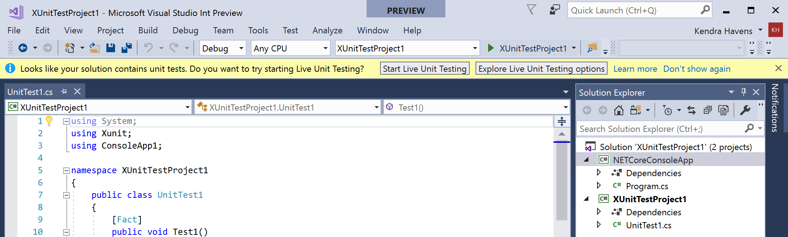
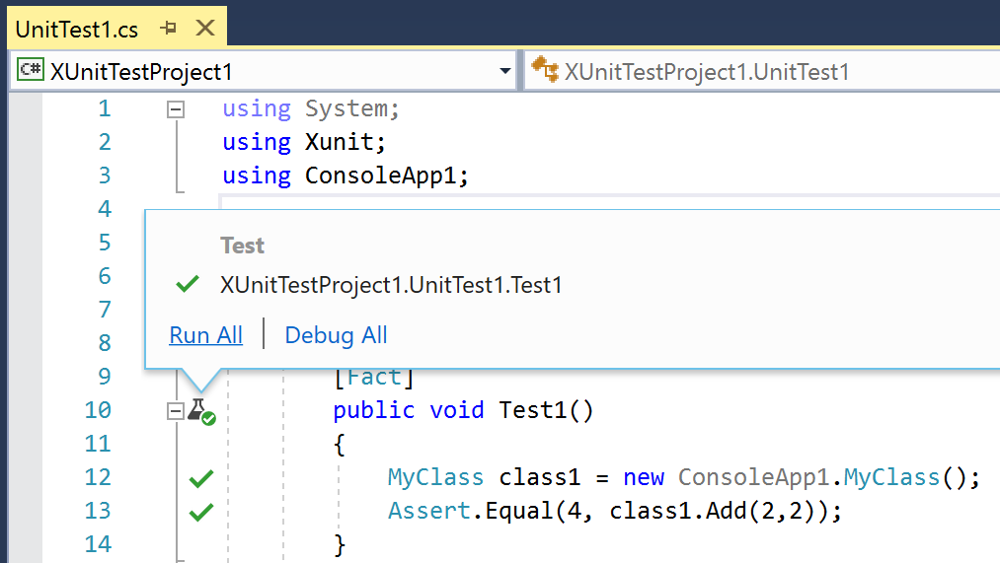
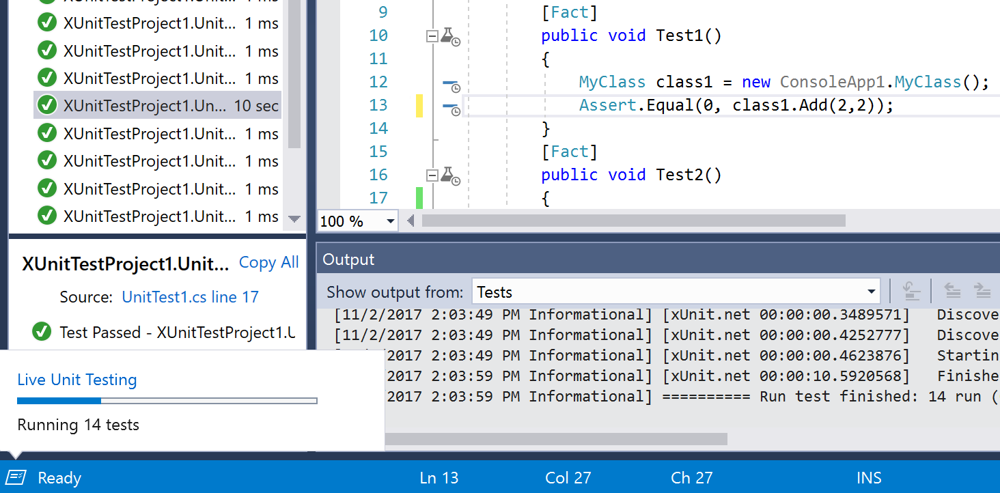
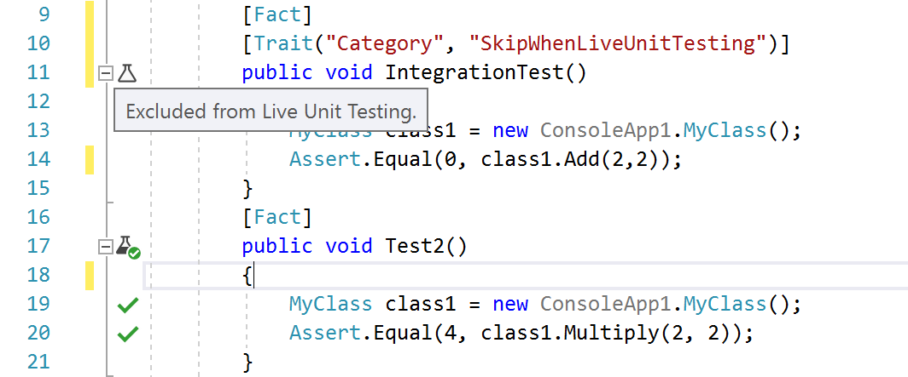
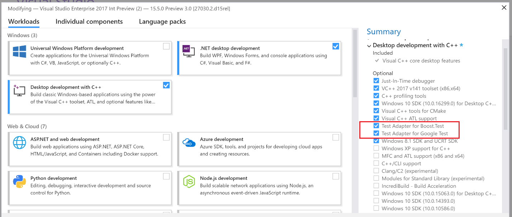
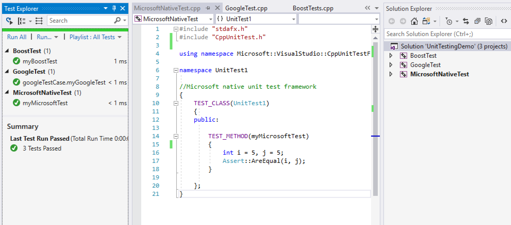
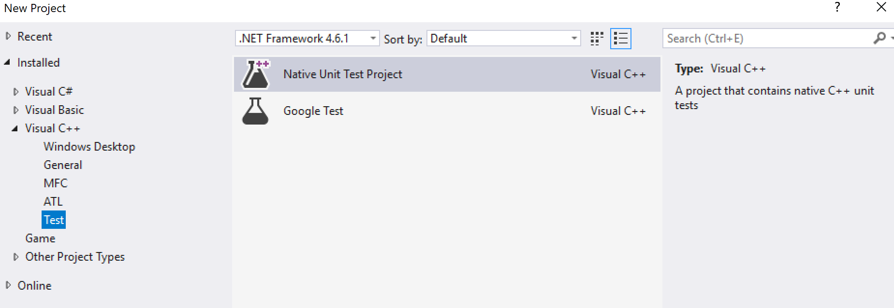

# Test Experience Improvements

There have been several significant improvements to the test experience that range across Visual Studio and Visual Studio Team Services. These efforts involved frameworks and tooling for both .NET and C++, but all had a common goal: make testing with our developer tools a great experience.

### Side-by-side Performance Comparison
These improvements are best shown in a side-by-side comparison of Visual Studio 2017 15.4 and Visual Studio 2017 15.5 Preview 2 with the [Real Time Test Discovery feature flag turned on](https://go.microsoft.com/fwlink/?linkid=862824).

[ComparisonVideo](https://microsoft-my.sharepoint.com/:v:/p/kehavens/ET4m7a5JojlJszM0H33unsIBaNGU1utfGq9oUBOh2JOGsA?e=4314dc2fd82f49948c2688768861f0c0) 

### Wow! How did you get that performance?!
The performance improvements are thanks to work in a few different areas, namely, Test Platform and Test Adapter improvements and a new feature called Real Time Test Discovery.

### Test Platform and Test Adapter Improvements
Each of the top testing frameworks have made great accomplishments that make the whole experience better. In Visual Studio 2017, unit test projects reference the MSTest Version 2 test framework by default. MSTest v2 has experienced great adoption reaching 1.8 million downloads before even becoming the default option in MSTest projects. xUnit 2.3.0 has gone RTM bringing great performance improvements. NUnit has also markedly improved performance.

In the table below, you can see the before and after times of the most popular test frameworks and the percentage improvement per test runner. These were timed using benchmark solutions of 10,000 tests. You can find the links the the solutions in the table.

*Before = VS 15.2*

*After = VS 15.5 Preview 2 + NUnit Adapter v3.9.0, published on 11 Oct 2017 + xUnit v2.3.1 published on 27 Oct 2017 + MSTest v1.2.0 published on 11 Oct 2017.*

*Test Discovery performance improvements include the gains due to the new Source Information Provider implementation. This is presently shipped behind a feature flag,. The intent is to make that the default from 15.5 Preview 4.*

**We have identified the potential causes of the regression in MSTest V2 test discovery, and are working on it.*

Much of this was a collaborative effort of developers contributing to the open source test frameworks NUnit, xUnit, and MSTest. Often working on the other side of the world from each other. Luckily, we can share the good vibes on social media.

### Real Time Test Discovery
Real time test discovery is a new Visual Studio feature that uses a Roslyn analyzer to discover tests and populate the test explorer in real time without requiring you to build your project. This feature has been introduced in Visual Studio 2017 15.5 Preview 2 behind a feature flag. Learn how to turn it on in the [Real Time Test Discovery blog post](https://go.microsoft.com/fwlink/?linkid=862824). This not only makes test discovery significantly faster, it also keeps the test explorer in sync with code changes such as adding or removing tests. Since real time discovery is powered by the Roslyn compiler, it is only available for C# and Visual Basic projects.

### Live Unit Testing Improvements
[Live Unit Testing](https://docs.microsoft.com/en-us/visualstudio/test/live-unit-testing) is a feature introduced in Visual Studio 2017 Enterprise that automatically runs any impacted unit tests in the background and presents the results and code coverage live in the editor. It now supports more of your projects including projects targeting .NET Core (starting in Visual Studio 2017 15.3) as well as MSTest v1. Users with projects eligible for Live Unit Testing will now be prompted to switch it on with a gold bar appearing at the top of Visual Studio. Don't worry, you can select not to show it again or to learn more if you aren't sure Live Unit Testing is right for you.

We have also introduced a few usability enhancements including test icons appearing next to test method heads in the code editor when Live Unit Test icons are on. This addition was requested to help the test method head stand out from the other glyphs in the margin. Clicking on Live Unit Testing icons now pops out a menu where you can run or debug that test. 

Visual Studio also has a new feature called the Task Center Notification. If you're curious what processes Live Unit Testing is currently executing, you can investigate by clicking on the Task Center. This is particularly helpful when one of your tests is taking longer to give results. The Task Center Notification will tell you if Live Unit Testing is discovering, building, or executing your test.

Live Unit Testing is now easier to configure with the addition of a **Tools > Options** page. This page will let you automatically pause Live Unit Testing if, for example, you need to save battery life when you're on the go. You can also make sure Live Unit Testing skips some tests by adding a [skip category](https://docs.microsoft.com/en-us/visualstudio/test/live-unit-testing#including-and-excluding-test-projects-and-test-methods). For a short period of focused development, you can include a specific set of tests by right-clicking on the solution, project, or class in the Solution Explorer and select **Live Unit Testing > Include (or Exclude)**. This will only run Live Unit Testing on those tests. You can also include and exclude individual tests by right-clicking on them in the code editor. 

### C++ Testing Improvements

We’ve improved the C++ unit testing experience by adding built-in support for more unit testing frameworks. In addition to [Microsoft's native testing framework](https://blogs.msdn.microsoft.com/vcblog/2017/04/19/cpp-testing-in-visual-studio/), Visual Studio now includes support for [Google Test](https://blogs.msdn.microsoft.com/vcblog/2017/10/24/unit-testing-test-adapter-for-google-test-goes-in-box/) and [Boost.Test](https://blogs.msdn.microsoft.com/vcblog/2017/11/02/unit-testing-test-adapter-for-boost-test-goes-in-box/). New installations of Visual Studio will acquire Google Test and Boost.Test support by default, but if you're upgrading from a previous version you'll need to manually add these adapters via **Visual Studio Installer**.

Whether you prefer the Microsoft, Google Test, or Boost.Test framework, you can immediately use all of Visual Studio’s testing tools to write, discover, and run your unit tests. In the next image, we see all the tests from the three frameworks were discovered and run via the Test Explorer Window.

To quickly add a Microsoft Native Test or Google Test project to your Solution, just choose the desired template in the New Project Wizard.

### Share Your Feedback
As always, we welcome your thoughts and concerns. Please [Install Visual Studio 2017](https://www.visualstudio.com/downloads/) today, exercise your favorite workloads, and tell us what you think.

For issues, let us know via the [Report a Problem](https://aka.ms/vs-rap) tool in Visual Studio. You’ll be able to track your issues in the [Visual Studio Developer Community](https://developercommunity.visualstudio.com/) where you can ask questions and find answers. You can also engage with us and other Visual Studio developers through our new [Gitter community](https://gitter.im/Microsoft/VisualStudio) (requires GitHub account).