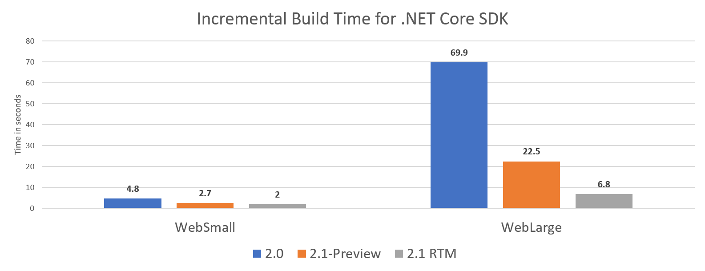

# .NET Core 2.1 Roadmap

The .NET team has been working on the .NET Core 2.1 release for the last several months on GitHub. We know that many of you have been using [.NET Core 2.0](https://blogs.msdn.microsoft.com/dotnet/2017/08/14/announcing-net-core-2-0/) since it shipped in August of last year and want to know what is coming next. The team has done enough work now that we know the overall shape of the next release. Like past releases, the .NET community has contributed many important improvements. Thanks so much!

We have been thinking of .NET Core 2.1 as a feedback-oriented release after the more foundational .NET Core 2.0 release. The following improvements are based on some of the most common feedback.

* **[CLI]** Build-time performance improvements.
* **[CLI]** Global tools; replaces CliReferenceTool.
* **[CoreCLR]** Minor-version roll-forward.
* **[CoreCLR]** No-copy array slicing with Span&lt;T&gt;.
* **[CoreFX]** HttpClient performance improvements.
* **[CoreFX]** Windows Compatibility Pack.
* **[ASP.NET]** SignalR is available for .NET Core.
* **[ASP.NET]** HTTPS is on by default for ASP.NET.
* **[EF]** Basic lazy loading support.
* **[EF]** Support for Azure Cosmos DB.

This post will focus on CoreCLR, CoreFX and CLI improvements. Please see [ASP.NET Core 2.1 Roadmap](https://blogs.msdn.microsoft.com/webdev/) and [EF Core 2.1 Roadmap](https://blogs.msdn.microsoft.com/dotnet/) for more information on ASP.NET Core and EF Core.

Thanks to everyone that has used [.NET Core 2.0](https://blogs.msdn.microsoft.com/dotnet/2017/08/14/announcing-net-core-2-0/). There are now over half a million active users of .NET Core 2.0 across Windows, macOS and Linux. Product usage is growing fast and we expect that the .NET Core 2.1 improvements will only increase that.

## Build-time Performance

Build-time performance is much improved in .NET Core 2.1, particularly for incremental build. These improvements apply to both `dotnet build` on the commandline and to builds in Visual Studio.  We've made improvements in the CLI tools and in MSBuild in order to make the tools deliver a much faster experience.

The following chart provides concrete numbers on the improvements that you can expect from the new release. You can see two different workloads with numbers for .NET Core 2.0, the upcoming .NET Core 2.1 preview and where we expect to land for .NET Core RTW.



## .NET Core Global Tools

.NET Core will include a new deployment and extensibility mechanism for tools. This new experience is very similar to and was inspired by [Node global tools](https://docs.npmjs.com/getting-started/installing-npm-packages-globally). We are re-using the same syntax and much of the experience.

.NET Core tools are .NET Core console apps that are packaged and acquired as NuGet packages. By default, these tools are framework-dependent applications and include all of their NuGet dependencies. This means that a given global tool will run on any operating system or chip architecture by default. You might need an existing tool on a new version of Linux. As long as .NET Core works there, you should be able to run the tool.

At present, .NET Core Tools only support global install. We're working on various forms of local install, too. The current working syntax looks like the following:

```console
dotnet tool install -g awesome-tool
awesome-tool
```

Yes, once you install a tool (in this case, `awesome-tool`), you can then use it directly. You don't need to type `dotnet awesome-tool` but can just type `awesome-tool`, and the tool will run. You can close terminal sessions, switch drives in the terminal, or reboot your machine and the command will still be there.

We expect a whole new ecosystem of tools to establish itself for .NET. Some of these tools will be  specific to .NET Core development and many of them will be quite general in nature. The tools are deployed to NuGet feeds. By default, the `dotnet tool install` command looks for tools on NuGet.org.

## Span&lt;T&gt;, Memory&lt;T&gt; and friends

We are on the verge of introducing a new set of types for using arrays and other types of memory that is much more efficient. Today, if you want to pass the first 1000 elements of a 10,000 element array, you need to make a copy of those 1000 elements and pass that copy to your caller. That operation is expensive in both time and space. The new Span&lt;T&gt; type enables you to provide a virtual view of that array without the time or space cost. It's also a struct, which means that there is no allocation cost either.

Jared Parsons gives a great introduction in his Channel 9 video [C# 7.2: Understanding Span](https://channel9.msdn.com/Events/Connect/2017/T125). Stephen Toub goes into even more detail in [C# - All About Span: Exploring a New .NET Mainstay](https://msdn.microsoft.com/en-us/magazine/mt814808.aspx).

Span&lt;T&gt; and related types offer a uniform representation of memory from a multitude of different sources, such as arrays, stack allocation and native code. With its slicing capabilities, it obviates the need for expensive copying and allocation in many scenarios, such as string manipulation, buffer management, etc, and provides a safe alternative to unsafe code. We expect usage of these types to start off in performance critical scenarios, but then transition to replacing arrays as the primary way of managing large blocks of data in .NET.

In terms of usage, you can create a Span&lt;T&gt; from an array:

```csharp
var arr = new byte[10];
Span<byte> bytes = arr; // Implicit cast from T[] to Span<T>
```

From there, you can easily and efficiently create a span to represent/point to just a subset of this array, utilizing an overload of the span’s Slice method. From there you can index into the resulting span to write and read data in the relevant portion of the original array:

```csharp
Span<byte> slicedBytes = bytes.Slice(start: 5, length: 2);
slicedBytes[0] = 42;
slicedBytes[1] = 43;
Assert.Equal(42, slicedBytes[0]);
Assert.Equal(43, slicedBytes[1]);
Assert.Equal(arr[5], slicedBytes[0]);
Assert.Equal(arr[6], slicedBytes[1]);
slicedBytes[2] = 44; // Throws IndexOutOfRangeException
bytes[2] = 45; // OK
Assert.Equal(arr[2], bytes[2]);
Assert.Equal(45, arr[2]);
```

## HttpClient Performance

Outgoing network requests are a critical part of application performance for microservices and other types of applications. .NET Core 2.1 includes a new HttpClient handler that is a rewritten for high performance. We've heard from some early adopters that the new handler has greatly improved their applications.

We are also shipping a new IHttpClientFactory feature that provides circuit breaker and other services for HttpClient calls. This new feature builds on top of this new HttpClient handler. You can learn more about IHttpClientFactory in the [ASP.NET Core 2.1 Roadmap](http://foo.com) post.

## Minor Version Roll-forward

You will now be able to run .NET Core applications on later runtime versions, within the same major version range. For example, you will be able to run .NET Core 2.0 applications on .NET Core 2.1 or .NET Core 2.1 applications on .NET Core 2.5 (if we ever ship such a version). The roll-forward behavior is for minor versions only. For example, a .NET Core 2.x application will never roll forward to .NET Core 3.0 or later.

If the expected .NET Core version is available, it will be used. The roll-forward behavior is only relevant if the expected .NET Core version is not available in a given environment.

## Windows Compatibility Pack

When you port existing code from the .NET Framework to .NET Core, you can use the [new Windows Compatibility Pack](https://blogs.msdn.microsoft.com/dotnet/2017/11/16/announcing-the-windows-compatibility-pack-for-net-core/). It provides access to an additional 20,000 APIs, compared to what is available in .NET Core. This includes System.Drawing, EventLog, WMI, Performance Counters, and Windows Services.

If you plan to make your code cross-platform, use the new [API Analyzer](https://blogs.msdn.microsoft.com/dotnet/2017/10/31/introducing-api-analyzer/) to ensure you don’t accidentally depend on Windows-only APIs.

## Availability

We intend to start shipping .NET Core 2.1 previews on a monthly basis starting this month, leading to a final release in the first half of 2018.

Again, thanks to everyone that has installed and used .NET Core 2.0. We've heard great feedback from many developers on their experience so far. We're hoping that these .NET Core 2.1 improvements make .NET Core development easier and make your apps run faster while using less memory. Preview builds will be available soon!
