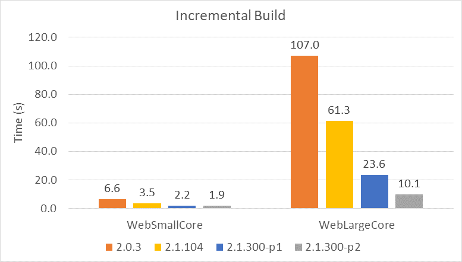

# Announcing .NET Core 2.1 Preview 2

Today, we are announcing .NET Core 2.1 Preview 2. The release is now ready for broad testing, as we get closer to a final build within the next two to three months. We'd appreciate any feedback that you have.

[ASP.NET Core 2.1 Preview 2](https://blogs.msdn.microsoft.com/webdev/) and [Entity Framework 2.1 Preview 2](https://blogs.msdn.microsoft.com/dotnet/2018/04/11/announcing-entity-framework-core-2-1-preview-2) are also releasing today.

You can download and get started with .NET Core 2.1 Preview 2, on Windows, macOS, and Linux:

* [.NET Core 2.1 Preview 2 SDK](https://www.microsoft.com/net/download/dotnet-core/sdk-2.1.300-preview2) (includes the runtime)
* [.NET Core 2.1 Preview 2 Runtime](https://www.microsoft.com/net/download/dotnet-core/runtime-2.1.0-preview2)

You can see complete details of the release in the [.NET Core 2.1 Preview 2 release notes](https://github.com/dotnet/core/blob/master/release-notes/2.1/README.md). Known issues and workarounds are included in the releases notes.

You can develop .NET Core 2.1 apps with [Visual Studio 2017 15.7 Preview 1](https://www.visualstudio.com/vs/preview/) or later, or Visual Studio Code. We expect that Visual Studio for Mac support will be added by .NET Core 2.1 RTM.

Thank you very much! We couldn’t have gotten to this spot without you, and we’ll continue to need your help as we work together towards .NET Core 2.1 RTM.

## Build Performance Improvements

Build-time performance is greatly improved in .NET Core 2.1, particularly for incremental builds. These improvements apply to both `dotnet build` on the command line and to builds in Visual Studio.  We've made improvements in the CLI and in MSBuild in order to make the tools deliver a much faster experience.

The following image shows the improvements that we've made since .NET Core 2.0. We have  focused on large projects.



These improvements are from many changes including the following ones:

* [Speed up package asset resolution](https://github.com/dotnet/sdk/pull/1857)
* [Speed up incremental package asset resolution](https://github.com/dotnet/sdk/pull/2020)
* [MSBuild Node Reuse](https://github.com/Microsoft/msbuild/pull/3106)
* [MSBuild ResolveAssemblyReferences cache](https://github.com/Microsoft/msbuild/pull/2792)

We're happy to look at your project if you don't see significant improvements from using .NET Core 2.1 Preview 2.

### Long-running SDK build servers

We added long-running servers to the .NET Core SDK to improve the performance of common development operations. The servers are just additional processes that run for longer than a single `dotnet build` invocation. Some of these are ports from the .NET Framework and others are new. 

The following SDK build servers have been added:

* VBCSCompiler
* MSBuild worker processes
* Razor server

The primary benefit of these servers is that they skip the need to JIT compile large blocks of code on every `dotnet build` invocation. They auto-terminate after a period of time.

You can manually terminate the build server processes via the following command:

```console
dotnet buildserver shutdown
```

This command can be used in CI scripts in order to terminate worker processes after builds are completed. You can also run builds with `dotnet build -nodeReuse:false` to prevent MSBuild worker processes from being created.

## New SDK Commands

The following tools have been added to the SDK:

* `dotnet watch`
* `dotnet dev-certs`
* `dotnet user-secrets`
* `dotnet sql-cache`
* `dotnet ef`

We found that these tools were so popular that having to add them to individual projects didn't seem like the right design, so we made them part of the SDK.

These tools were previously [DotNetCliToolReference tools](https://docs.microsoft.com/en-us/dotnet/core/tools/extensibility). They are no longer delivered that way. You can delete the `DotNetCliToolReference` entries in your project file when you adopt .NET Core 2.1.

## Global Tools

.NET Core now has a new deployment and extensibility story for tools. This new experience is inspired by [npm global tools](https://docs.npmjs.com/getting-started/installing-npm-packages-globally)

With Preview 2, the syntax for global tools has changed, as you can see in the following example:

```console
dotnet tool install -g dotnetsay
dotnetsay
```

```html
<script src="https://gist.github.com/richlander/645d8c7863de6faea00ab5f20782bec4.js"></script>
```

You can try out .NET Core Global Tools for yourself (after you've installed .NET Core 2.1 Preview 2) with a sample tool called [dotnetsay](https://www.nuget.org/packages/dotnetsay/).

### New Tools Arguments

All tools operations now use the `dotnet tool` command. The following new functionality has been added in Preview 2:

* `dotnet tool install` -- installs a tool
* `dotnet tool update` -- uninstalls and reinstalls a tool, effectively updating it
* `dotnet tool uninstall` -- uninstalls a tool
* `dotnet tool list` -- lists currently installed tools
* `--tool-path` -- specifies a specific location to (un)install and list tools, per invocation

## Preview releases and Roll-forward

.NET Core Applications, starting with 2.0, roll forward to minor versions. You can learn more about that behavior in the [.NET Core 2.1 Preview 1 post](https://blogs.msdn.microsoft.com/dotnet/2018/02/27/announcing-net-core-2-1-preview-1/).

However, .NET Core has the opposite behavior for previews. Applications, including global tools, do not roll forward from one preview to another or from preview to RTM. This means that you need to publish new versions of Global Tools to support later previews and for RTM.

The policy for previews is a bit controversial. The premise behind it is that we may make breaking changes between a given preview and the final RTM build. This policy enables us to do that while minimizing breakage in the ecosystem. There is also the likely case that software built for previews was not tested with RTM builds, however, this rationale is less compelling.

This policy has been in place since the start of the .NET Core project. Global Tools makes it a bit more challenging. We'd appreciate your feedback and insight on it.

## Sockets Performance and SocketsHttpHandler

We made major improvements to sockets in .NET Core 2.1. Sockets are the basis of both outgoing and incoming networking communication. The higher-level networking APIs in .NET Core 2.1, including HttpClient and Kestrel, are now based on .NET [sockets](https://docs.microsoft.com/dotnet/api/system.net.sockets.socket). In earlier versions, these higher-level APIs were based on native networking implementations.

We built a new from-the-ground-up managed [HttpMessageHandler](https://docs.microsoft.com/dotnet/api/system.net.http.httpmessagehandler) called [SocketsHttpHandler](https://github.com/dotnet/corefx/tree/master/src/System.Net.Http/src/System/Net/Http/SocketsHttpHandler). It's an implementation of HttpMessageHandler based on .NET sockets and [Span&lt;T&gt;](https://docs.microsoft.com/dotnet/api/system.span-1).

SocketsHttpHandler is now the default implementation for HttpClient. The biggest win of SocketsHttpHandler is performance. It is a lot faster than the existing implementation. There are other benefits, such as:

* Elimination of platform dependencies on [libcurl](https://curl.haxx.se/libcurl/) (for Linux and the [macOS](https://curl.haxx.se/download.html#MacOSX)) and [WinHTTP](https://msdn.microsoft.com/library/windows/desktop/aa382925.aspx) (for Windows) – simplifying both development, deployment, and servicing.
* Consistent behavior across platforms and platform/dependency versions.

You can use one of the following mechanisms to configure a process to use the older `HttpClientHandler`:

From code, use the `AppContext` class:

```csharp
AppContext.SetSwitch("System.Net.Http.UseSocketsHttpHandler", false);
```

The AppContext switch can also be set by config file.

The same can be achieved via the environment variable `DOTNET_SYSTEM_NET_HTTP_USESOCKETSHTTPHANDLER`. To opt out, set the value to either false or 0.

On Windows, you can choose to use `WinHttpHandler` or `SocketsHttpHandler` on a call-by-call basis. To do that, instantiate one of those types and then pass it to [HttpClient](https://docs.microsoft.com/dotnet/api/system.net.http.httpclient.-ctor) when you instantiate it.

On Linux and macOS, you can only configure HttpClient on a process-basis. On Linux, you need to deploy [libcurl](https://curl.haxx.se/libcurl/) yourself if you want to use the old HttpClient implementation. If you have .NET Core 2.0 working on your machine, then libcurl is already installed.

## Self-contained Application Servicing

`dotnet publish` now publishes [self-contained applications](https://docs.microsoft.com/dotnet/core/deploying/) with a serviced runtime version. When you publish a self-contained application with the new SDK, your application will include the latest serviced runtime version known by that SDK. When you upgrade to the latest SDK, you'll publish with the latest .NET Core runtime version. This applies for .NET Core 1.0 runtimes and later.

Self-contained publishing relies on runtime versions on NuGet.org. You do not need to have the serviced runtime on your machine.

Using the .NET Core 2.0 SDK, self-contained applications are published with .NET Core 2.0.0 Runtime unless a different version is specified via the `RuntimeFrameworkVersion` property. With this new behavior, you'll no longer need to set this property to select a higher runtime version for self-contained application. The easiest approach going forward is to always publish with the latest SDK.

## Docker

We are consolidating the set of Docker Hub repositories that we use for .NET Core and ASP.NET Core. We will use [microsoft/dotnet](https://hub.docker.com/r/microsoft/dotnet/) as our only .NET Core repository going forward. 

The publicly available statistics suggest that most users are already using the dotnet repo, as you can see via the following docker pull badges:

* microsoft/dotnet -> 
* microsoft/aspnetcore -> 
* microsoft/aspnetcore-build -> 

You can learn more about this change and how to adapt at [aspnet/announcements #298](https://github.com/aspnet/Announcements/issues/298).

We also added a set of environment variables to .NET Core docker images, for 2.0 and later. These environment variables enable more scenarios to work without additional configuration, such as [developing ASP.NET Core applications in a container](https://github.com/dotnet/dotnet-docker/blob/master/samples/aspnetapp/aspnet-docker-dev-in-container.md).

- To `sdk` images ([example](https://github.com/dotnet/dotnet-docker/blob/master/2.1/sdk/bionic/amd64/Dockerfile#L28))
   - `ASPNETCORE_URLS=http://+:80`
   - `DOTNET_RUNNING_IN_CONTAINER=true`
   - `DOTNET_USE_POLLING_FILE_WATCHER=true`
- To Linux `runtime-deps` images ([example](https://github.com/dotnet/dotnet-docker/blob/master/2.1/runtime-deps/alpine/amd64/Dockerfile#L19))
   - `ASPNETCORE_URLS=http://+:80`
   - `DOTNET_RUNNING_IN_CONTAINER=true`
- To Windows `runtime` images ([example](https://github.com/dotnet/dotnet-docker/blob/master/2.1/runtime/nanoserver-1709/amd64/Dockerfile#L33))
   - `ASPNETCORE_URLS=http://+:80`
   - `DOTNET_RUNNING_IN_CONTAINER=true`

Note: These environment variables will be added to the 2.0 images later this month.

## Supported Operating Systems and Chip Architectures

The biggest additions are supporting Ubuntu 18.04 and adding official ARM32 support.

We will [support the following operating system versions](https://github.com/dotnet/core/blob/master/os-lifecycle-policy.md) for .NET Core 2.1:

* Windows Client: 7, 8.1, 10 (1607+)
* Windows Server: 2008 R2 SP1+
* macOS: 10.12+
* RHEL: 7+
* Fedora: 26+
* openSUSE: 42.3+
* Debian: 8+
* Ubuntu: 14.04+
* SLES: 12+

Alpine support is still in preview.

We will support the following chip architectures:

* On Windows: x64 and x86
* On Linux: x64 and ARM32
* On macOS: x64

## Azure App Service and VSTS Deployment

ASP.NET Core 2.1 Previews will not be automatically deployed to Azure App Service. Instead, you can opt in to using .NET Core previews with just a little bit of configuration. See [Using ASP.NET Core Previews on Azure App Service](https://blogs.msdn.microsoft.com/webdev/2018/02/27/asp-net-core-2-1-0-preview1-using-asp-net-core-previews-on-azure-app-service/) for more information. 

Visual Studio Team Service support for .NET Core 2.1 will come closer to RTM.

## Key Improvements in .NET Core 2.1 Preview 1

There are some key improvements that are important to recap from Preview 1. For more details, take a look at the [.NET Core 2.1 Preview 1 Announcement](https://blogs.msdn.microsoft.com/dotnet/2018/02/27/announcing-net-core-2-1-preview-1/).

* Minor-version roll-forward
* Span&lt;T&gt; and Memory&lt;T&gt; and friends
* Windows Compatibility Pack

## Closing

Please test your existing applications with [.NET Core 2.1 Preview 2](https://www.microsoft.com/net/download/dotnet-core/sdk-2.1.300-preview2). Thanks in advance for trying it out. We need your feedback to take these new features across the finish line for the final 2.1 release.

.NET Core 2.1 is a big step forward from [.NET Core 2.0](https://blogs.msdn.microsoft.com/dotnet/2017/08/14/announcing-net-core-2-0/). We hope that you find multiple improvements that make you want to upgrade.

Once again, thanks to everyone that contributed to the release. We appreciate all of the issues and PRs that you've contributed that have helped make this preview release available.
