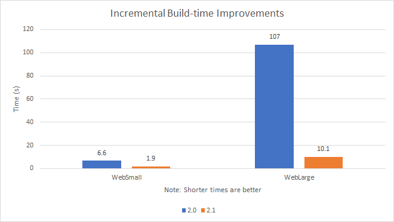

# Announcing .NET Core 2.1

We're excited to announce the release of .NET Core 2.1. It includes improvements to performance, to the runtime and tools. It also includes a new way to deploy tools as NuGet packages. We've added a new primitive type called [`Span&lt;T&gt;`](https://docs.microsoft.com/en-us/dotnet/api/system.span-1?view=netcore-2.1) that operates on data without allocations. There are many other new APIs, focused on cryptography, compression, and Windows compatibility. It is the first release to support Alpine Linux and ARM32 chips. You can start updating existing projects to target .NET Core 2.1 today. The release is compatible with .NET Core 2.0, making updating easy.

ASP.NET Core 2.1 and Entity Framework 2.1 are also releasing today.

You can download and get started with .NET Core 2.1, on Windows, macOS, and Linux:

* [.NET Core 2.1 SDK](https://www.microsoft.com/net/download/dotnet-core/sdk-2.1.300) (includes the runtime)
* [.NET Core 2.1 Runtime](https://www.microsoft.com/net/download/dotnet-core/runtime-2.1.0)

Docker images are available at [microsoft/dotnet](https://hub.docker.com/r/microsoft/dotnet/) for .NET Core and ASP.NET Core.

The Build 2018 conference was earlier this month. We had several in-depth presentations on .NET Core. Check out [Build 2018 sessions for .NET](https://channel9.msdn.com/Events/Build/2018?sort=rating&direction=asc&tag=.net&tag=.net%2Bcore&term=) on Channel9.

You can see complete details of the release in the .NET Core 2.1 release notes. Related instructions, known issues, and workarounds are included in releases notes. Please report any issues you find in the comments or at dotnet/core #1506

Thanks for everyone that contributed to .NET Core 2.1. You've helped make .NET Core a better product!

## Long-term Support

.NET Core 2.1 will be a [long-term support (LTS)](https://github.com/dotnet/core/blob/master/microsoft-support.md) release. This means that it is supported for three years. We recommend that you make .NET Core 2.1 your new standard for .NET Core development.

We intend to ship a small number of significant updates in the next 2-3 months and then officially call .NET Core 2.1 an LTS release. After that, updates will be targeted on security, reliability, and adding platform support (for example, Ubuntu 18.10). We recommend that you start adopting .NET Core 2.1 now. For applications in active development, there is no reason to hold off deploying .NET Core 2.1 into production. For applications that will not be actively developed after deployment, we recommend waiting to deploy until .NET Core 2.1 has been declared as LTS.

There are a few reasons to move to .NET Core 2.1:

* Long-term support.
* Superior performance and quality.
* New platform support, such as: Ubuntu 18.04, Alpine, ARM32.
* Much easier to manage platform dependencies in project files and with self-contained application publishing.

We had many requests to make .NET Core 2.0 an LTS release. In fact, that was our original plan. We opted to wait until we had resolved various challenges managing platform dependencies (the last point above). Platform dependency management was a significant problem with .NET Core 1.0 and has gotten progressively better with each release. For example, you will notice that the ASP.NET Core package references no longer include a version number with .NET Core 2.1.

## Platform Support

.NET Core 2.1 is [supported on the following operating systems](https://github.com/dotnet/core/blob/master/release-notes/2.1/2.1-supported-os.md):

* Windows Client: 7, 8.1, 10 (1607+)
* Windows Server: 2008 R2 SP1+
* macOS: 10.12+
* RHEL: 6+
* Fedora: 26+
* Ubuntu: 14.04+
* Debian: 8+
* SLES: 12+
* openSUSE: 42.3+
* Alpine: 3.7+

Note: The runtime ID for Alpine was previously alpine-3.6. There is now a [more generic runtime ID for Alpine and similar distros](https://github.com/dotnet/corefx/pull/29295/files), called linux-musl, to support any Linux distro that uses [musl libc](https://www.musl-libc.org/). All of the other runtime IDs assume [glibc](https://www.gnu.org/software/libc/).

Chip support follows:

* x64 on Windows, macOS, and Linux
* x86 on Windows
* ARM32 on Linux (Ubuntu 18.04+, Debian 9+)

Note: .NET Core 2.1 is supported on Raspberry Pi 2+. It isn’t supported on the Pi Zero or other devices that use an ARMv6 chip. .NET Core requires ARMv7 or ARMv8 chips, like the [ARM Cortex-A53](https://en.wikipedia.org/wiki/ARM_Cortex-A53).

## .NET Core Tools

.NET Core now has a new deployment and extensibility mechanism for tools. This new experience is very similar to and was inspired by [NPM global tools](https://docs.npmjs.com/getting-started/installing-npm-packages-globally). You can create your own global tools by looking at the [dotnetsay tools sample](https://github.com/dotnet/core/blob/master/samples/dotnetsay/README.md).

You can try the new tools experience with the [dotnetsay](https://www.nuget.org/packages/dotnetsay) tool with the following commands:

```console
dotnet tool install -g dotnetsay
dotnetsay
```

.NET Core tools are .NET Core console apps that are packaged and acquired as NuGet packages. By default, these tools are [framework-dependent applications](https://docs.microsoft.com/dotnet/core/deploying/) and include all of their NuGet dependencies. This means that .NET Core tools run on all .NET Core supported operating system and chip architecture by default, with one set of binaries. By default, the `dotnet tool install` command looks for tools on NuGet.org. You can use your own NuGet feeds instead.

At present, .NET Core Tools only support global install and require the -g argument to be installed. We’re working on various forms of local install, too, and plan to deliver that in a subsequent release.

We expect a whole new ecosystem of tools to establish itself for .NET. [@matemcmaster](https://github.com/natemcmaster) maintains a list of [dotnet tools](https://github.com/natemcmaster/dotnet-tools/blob/master/README.md). You might also check out his [dotnet-serve](https://www.nuget.org/packages/dotnet-serve/) tool.

The following existing [DotNetCliReferenceTool](https://docs.microsoft.com/en-us/dotnet/core/tools/extensibility) tools have been converted to in-box tools.

* `dotnet watch`
* `dotnet dev-certs`
* `dotnet user-secrets`
* `dotnet sql-cache`
* `dotnet ef`

Remove project references to these tools when you upgrade to .NET Core 2.1.

## `dotnet build` Performance Improvements

Improving the performance of the .NET Core build was perhaps the biggest focus of the release. It is  greatly improved in .NET Core 2.1, particularly for incremental builds. These improvements apply to both `dotnet build` on the command line and to builds in Visual Studio.

The following image shows the improvements that we’ve made, compared to .NET Core 2.0. We focused on large projects, as you can see from the image.



Note: `2.1` in the image refers to the `2.1.300` SDK version.

Note: These benchmarks were produced from projects at [mikeharder/dotnet-cli-perf](https://github.com/mikeharder/dotnet-cli-perf/tree/master/scenarios).

We added long-running servers to the .NET Core SDK to improve the performance of common development operations. The servers are additional processes that run for longer than a single dotnet build invocation. Some of these are ports from the .NET Framework and others are new.

The following SDK build servers have been added:

* VBCSCompiler
* MSBuild worker processes
* Razor server

The primary benefit of these servers is that they skip the need to JIT compile large blocks of code on every dotnet build invocation. They auto-terminate after a period of time. See release notes for more information on finer control of these build servers.

## Runtime Performance Improvements

See [Performance Improvements in .NET Core 2.1](https://blogs.msdn.microsoft.com/dotnet/2018/04/18/performance-improvements-in-net-core-2-1/) for an in-depth exploration of all the performance improvements in the release.

## Networking Performance Improvements

We built a new from-the-ground-up [HttpClientHandler](https://docs.microsoft.com/dotnet/api/system.net.http.httpclienthandler) called [SocketHttpHandler](https://github.com/dotnet/corefx/tree/master/src/System.Net.Http/src/System/Net/Http/SocketsHttpHandler)to improve networking performance. It’s a C# implementation of [HttpClient](https://docs.microsoft.com/dotnet/api/system.net.http.httpclient) based on [.NET sockets](https://docs.microsoft.com/dotnet/api/system.net.sockets) and [Span&lt;T&gt;](https://docs.microsoft.com/dotnet/api/system.span-1).

SocketsHttpHandler is now the default implementation for HttpClient. The biggest win of SocketsHttpHandler is performance. It is a lot faster than the existing implementation. It also eliminates platform-specific dependencies and enables consistent behavior across operating systems.

See the .NET Core 2.1 release notes for instructions on how to enable the older networking stack.

## Span&lt;T&gt;, Memory&lt;T&gt;, and friends

We are entering a new era of memory-efficient and high-performance computing with .NET, with the introduction of [Span&lt;T&gt;](https://docs.microsoft.com/dotnet/api/system.span-1) and related types. Today, if you want to pass the first 1000 elements of a 10,000 element array, you need to make a copy of those 1000 elements and pass that copy to your caller. That operation is expensive in both time and space. The new Span&lt;T&gt; type enables you to provide a virtual view of that array without the time or space cost. Span&lt;T&gt; is a struct, which means that you can enable complex pipelines of parsing or other computation without allocating. We are using this new type extensively in [corefx](https://github.com/dotnet/corefx) for this reason.

[Jared Parsons](https://twitter.com/jaredpar) gives a great introduction in his [Channel 9 video C# 7.2: Understanding Span](https://channel9.msdn.com/Events/Connect/2017/T125). Stephen Toub goes into even more detail in [C# – All About Span: Exploring a New .NET Mainstay](https://msdn.microsoft.com/en-us/magazine/mt814808.aspx).

In the most simple use case, you can cast an array to a Span&lt;T&gt;, as follows.

```csharp
var arr = new byte[10];
Span<byte> bytes = arr; // Implicit cast from T[] to Span<T>
```

Gist link:

```html
<script src="https://gist.github.com/richlander/437976687a545e96a8665d31561dee9d.js"></script>
```

You can [Slice](https://docs.microsoft.com/dotnet/api/system.span-1.slice?view=netcore-2.1#System_Span_1_Slice_System_Int32_) a [Span&lt;T&gt;](https://docs.microsoft.com/dotnet/api/system.span-1), as follows.

```csharp
// generating data for the example
int[] ints = new int[100];
for (var i = 0; i <ints.Length; i++)
{
    ints[i] = i;
}
// creating span of array
Span<int> spanInts = ints;
// slicing the span, which creates another (subset) span
Span<int> slicedInts = spanInts.Slice(start: 42, length: 2);
// demonstrating composition of the array and two spans
Console.WriteLine($"ints length: {ints.Length}");
Console.WriteLine($"spanInts length: {spanInts.Length}");
Console.WriteLine($"slicedInts length: {slicedInts.Length}");
Console.WriteLine("sliceInts contents");
for (var i = 0; i < slicedInts.Length; i++)
{
    Console.WriteLine(slicedInts[i]);
}
// performing tests to validate the span has the expected contents
if (slicedInts[0] != 42) Console.WriteLine("error");
if (slicedInts[1] != 43) Console.WriteLine("error");
slicedInts[0] = 21300;
if (slicedInts[0] != ints[42]) Console.WriteLine("error");
```

Gist link:

```html
<script src="https://gist.github.com/richlander/5ac5cb13067c7c43355221d3e5078227.js"></script>
```

This code produces the following output, as expected:

```console
ints length: 100
spanInts length: 100
slicedInts length: 2
slicedInts contents
42
43
slicedInts contents
21300
43
```

## Brotli Compression

[Brotli](https://en.wikipedia.org/wiki/Brotli) is a general-purpose lossless compression algorithm that compresses data comparable to the best currently available general-purpose compression methods. It is similar in speed to deflate but offers more dense compression. The specification of the Brotli Compressed Data Format is defined in [RFC 7932](https://www.ietf.org/rfc/rfc7932.txt). The Brotli encoding is supported by most web browsers, major web servers, and some CDNs (Content Delivery Networks). The .NET Core Brotli implementation is based around the c code provided by Google at [google/brotli](https://github.com/google/brotli). Thanks, Google!

[Brotli support](https://github.com/dotnet/corefx/issues/25785) has been added to .NET Core 2.1. Operations may be completed using either the stream-based [BrotliStream](https://docs.microsoft.com/dotnet/api/system.io.compression.brotlistream?view=netcore-2.1) or the high-performance span-based [BrotliEncoder](https://docs.microsoft.com/dotnet/api/system.io.compression.brotliencoder?view=netcore-2.1)/[BrotliDecoder](https://docs.microsoft.com/dotnet/api/system.io.compression.brotlidecoder?view=netcore-2.1) classes. You can see it used in the following example.

```csharp
public static Stream DecompressWithBrotli(Stream toDecompress)
{
    MemoryStream decompressedStream = new MemoryStream();
    using (BrotliStream decompressionStream = new BrotliStream(toDecompress, CompressionMode.Decompress, leaveOpen: true))
    {
        decompressionStream.CopyTo(decompressedStream);
    }
    decompressedStream.Position = 0;
    return decompressedStream;
}
```

Gist link:

## Windows Compatibility Pack

When you port existing code from the .NET Framework to .NET Core, you can use the [Windows Compatibility Pack](https://www.nuget.org/packages/Microsoft.Windows.Compatibility/). It provides access to an additional 20,000 APIs, compared to what is available in .NET Core. This includes System.Drawing, EventLog, WMI, Performance Counters, and Windows Services. See [Announcing the Windows Compatibility Pack for .NET Core](https://blogs.msdn.microsoft.com/dotnet/2017/11/16/announcing-the-windows-compatibility-pack-for-net-core/) for more information.

The following example demonstrates accessing the Windows registry with APIs provided by the Windows Compatibility Pack.

```csharp
private static string GetLoggingPath()
{
    // Verify the code is running on Windows.
    if (RuntimeInformation.IsOSPlatform(OSPlatform.Windows))
    {
        using (var key = Registry.CurrentUser.OpenSubKey(@"Software\Fabrikam\AssetManagement"))
        {
            if (key?.GetValue("LoggingDirectoryPath") is string configuredPath)
                return configuredPath;
        }
    }

    // This is either not running on Windows or no logging path was configured,
    // so just use the path for non-roaming user-specific data files.
    var appDataPath = Environment.GetFolderPath(Environment.SpecialFolder.LocalApplicationData);
    return Path.Combine(appDataPath, "Fabrikam", "AssetManagement", "Logging");
}
```

Gist link:

```html
<script src="https://gist.github.com/richlander/539442f699f7f45818ebe5839c66d17d.js"></script>
```

## Self-contained application publishing

dotnet publish now publishes [self-contained applications](https://docs.microsoft.com/dotnet/core/deploying/) with a serviced runtime version. When you publish a self-contained application with the new SDK, your application will include the latest serviced runtime version known by that SDK. When you upgrade to the latest SDK, you’ll publish with the latest .NET Core runtime version. This applies for .NET Core 1.0 runtimes and later.

Self-contained publishing relies on runtime versions on NuGet.org. You do not need to have the serviced runtime on your machine.

Using the .NET Core 2.0 SDK, self-contained applications are published with .NET Core 2.0.0 Runtime unless a different version is specified via the `RuntimeFrameworkVersion` property. With this new behavior, you’ll no longer need to set this property to select a higher runtime version for self-contained application. The easiest approach going forward is to always install and publish with the latest SDK.

## Docker

Docker images for .NET Core 2.1 are available at [microsoft/dotnet on Docker Hub](https://hub.docker.com/r/microsoft/dotnet/). We've made a few changes relative to .NET Core 2.0. We have consolidating the set of Docker Hub repositories that we use for .NET Core and ASP.NET Core. We will use [microsoft/dotnet](https://hub.docker.com/r/microsoft/dotnet/) as the only repository that we publish to for .NET Core 2.1 and later releases.

We added a set of environment variables to .NET Core images to make it easier to host ASP.NET Core sites at any .NET Core image layer and to enable `dotnet watch` in SDK container images without additional configuration.

[.NET Core Docker Samples](https://github.com/dotnet/dotnet-docker/blob/master/samples/README.md) have been moved to the [dotnet/dotnet-docker](https://github.com/dotnet/dotnet-docker) repo. The samples have been updated for .NET Core 2.1. New samples have been added, including [Hosting ASP.NET Core Images with Docker over HTTPS](https://github.com/dotnet/dotnet-docker/blob/master/samples/aspnetapp/aspnetcore-docker-https.md).

For more information, see [.NET Core 2.1 Docker Image Updates](https://gist.github.com/richlander/5fd934cd4bec29793861e2a6bfeef25b).

## .NET Core 2.1 and Compatibility

.NET Core 2.1 is a highly compatible release. .NET Core 2.0 applications will run on .NET Core 2.1 in absence of .NET Core 2.0 being installed. This roll-forward behavior only applies to minor releases. .NET Core 1.1 will not roll-forward to 2.0, nor will .NET Core 2.0 roll-forward to 3.0.

See the .NET Core 2.1 release notes for instructions on how to disable minor-version roll-forward.

If you built .NET Core 2.1 applications or tools with .NET Core 2.1 preview releases, they must be rebuilt with the final .NET Core 2.1 release. Preview releases do not roll-forward to final releases.

## Early Snap Installer Support

We have been working on bringing .NET Core to [Snap](https://snapcraft.io/) and are ready to hear what you think. Snaps, along with a few other technologies, are an emerging application installation and sandboxing technology that we think is intriguing. The Snap install works well on Debian-based systems and other distros such as Fedora are having challenges that we're working to run down. The following steps can be used if you would like to give this a try.

.NET Core 2.1 Runtime and SDK snaps are available:

- `sudo snap install dotnet-sdk --candidate --classic`
- `sudo snap install dotnet-runtime-21 --candidate`

Watch for future posts delving into what Snaps are about. In the meantime, we would love to hear your feedback.

## Closing

.NET Core 2.1 is a big step forward for the platform. We've significantly improved performance, added many APIs, and added a new way of deploying tools. We've also added support for new Linux distros and ARM32, another CPU type. This release expands the places you can use .NET Core and makes it much more efficient everywhere.

We expect .NET Core 2.1 to be available in Azure App Service later this week.

You can see the progress we made with the .NET Core 2.1 interim releases: [RC1](https://blogs.msdn.microsoft.com/dotnet/2018/05/07/announcing-net-core-2-1-rc-1/), [Preview 2](https://blogs.msdn.microsoft.com/dotnet/2018/04/11/announcing-net-core-2-1-preview-2/), [Preview 1](https://blogs.msdn.microsoft.com/dotnet/2018/02/27/announcing-net-core-2-1-preview-1/). Thanks again to everyone who contributed to the release. It helps a lot.
