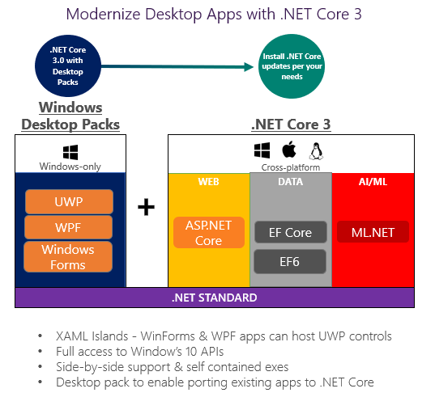

# .NET Core 3 and Support for Windows Desktop Applications

At [Microsoft Build Live](https://developer.microsoft.com/en-us/events/build) today, we are sharing a first look at our plans for .NET Core 3. The highlight of .NET Core 3 is support for Windows desktop applications, specifically Windows Forms, Windows Presentation Framework (WPF), and UWP XAML. You will be able to run new and existing Windows desktop applications on .NET Core and enjoy all the benefits that .NET Core has to offer.

We are planning on releasing a first preview of .NET Core 3 later this year and the final version in 2019. We will be looking for developers to partner with us, to give us feedback, and to release versions of your applications in the same timeframe as our releases. We think that .NET Core 3.0 will be one of the most exciting .NET releases we've ever released.

ASP.NET Core will continue to move forward in parallel and will have a release with .NET Core 3.0. Our commitment to web and cloud applications remains unchanged. At the same time, it's time to add Windows desktop applications as another supported workload for .NET Core. We have heard many requests for desktop applications with .NET Core and are now sharing our plan to deliver on that. Let's take a look at that.

## Benefits of .NET Core for Desktop

There are many benefits with .NET Core that are great for desktop apps. There are a few that are worth calling out explicitly:

* [Performance improvements](https://blogs.msdn.microsoft.com/dotnet/2018/04/18/performance-improvements-in-net-core-2-1/) and other runtime updates that will delight your users
* Super easy to use or test a new version of .NET Core for just one app on a machine
* Enables both machine-global and application-local deployment
* Support for the .NET Core CLI tools and SDK-style projects in Visual Studio

We're also announcing a set of improvements that we'll be adding to both .NET Core 3.0 and .NET Framework 4.8:

* Access to the full Windows 10 (AKA "WinRT") API.
* Ability to host UWP XAML controls in WPF and Windows Forms applications.
* Ability to host UWP browser and media controls, enabling modern browser and media content and standards.

## .NET Framework 4.8

We're also announcing our plans for .NET Framework 4.8. after shipping [.NET Framework 4.7.2](https://blogs.msdn.microsoft.com/dotnet/2018/04/30/announcing-the-net-framework-4-7-2/) only a week ago. We expect the next version to be 4.8 and for it to ship in about 12 months. Like the past few releases, the new release will include a set of targeted improvements, including the features you see listed above.

## Visualizing .NET Core 3

Let's take a look at .NET Core 3 in pictorial form.



Support for Windows desktop will be added as a set of "Windows Desktop Packs", which will only work on Windows. .NET Core isn't changing architecturally with this new version. We'll continue to offer a great cross-platform product, focused on the cloud. We have lots of improvements planned for those scenarios that we'll share later.

From a 1000-meter view, you can think of WPF as a rich layer over DirectX and Windows Forms as thinner layer over GDI Plus. WPF and Windows Forms do a great job of exposing and exercising much of the desktop application functionality in Windows. It's the C# code in Windows Forms and WPF that we'll include as a set of libraries with .NET Core 3. Windows functionality, like GDI Plus and DirectX, will remain in Windows.

We'll also be releasing a new version of .NET Standard at the same time. Naturally, all new .NET Standard APIs will be part of .NET Core 3.0. We have not yet added [Span&lt;T&gt;](https://msdn.microsoft.com/en-us/magazine/mt814808.aspx), for example, to the standard. We'll be doing that in the next version.

C#, F# and VB already work with .NET Core 2.0. You will be able to build desktop applications with any of those three languages with .NET Core 3.

## Side-by-side and App-local Deployment

The .NET Core deployment model is one the biggest benefits that Windows desktop developers will experience with .NET Core 3. In short, you can install .NET Core in pretty much any way you want. It comes with a lot of deployment flexibility.

The ability to globally install .NET Core provides much of the same central installation and servicing benefits of .NET Framework, while not requiring in-place updates.

When a new .NET Core version is released, you can update one app on a machine at a time without any concern for affecting other applications. New .NET Core versions are installed in new directories and are not used by existing applications.

For cases where the maximum isolation is required, you can deploy .NET Core with your application. We're working on new build tools that will bundle your app and .NET Core together as in a single executable.

We've had requests for deployment options like this for many years, but were never able to deliver those with the .NET Framework. The much more modular architecture used by .NET Core makes these flexible deployment options possible.

## Using .NET Core 3 for an Existing Desktop Application

For new desktop applications, we'll guide everyone to start with .NET Core 3. The more interesting question is what the experience will be like to move existing applications, particularly big ones, to .NET Core 3. We want the experience to be straightforward enough that moving to .NET Core 3 is an easy choice for you, for any application that is in active development. Applications that are not getting much investment and don't require much change should stay on .NET Framework 4.8.

Quick explanation of our plan:

* Desktop applications will need to target .NET Core 3 and recompile.
* Project files will need to be updated to target .NET Core 3.
* Dependencies will not need to retarget and recompile. There will be additional benefits if you update dependencies.

We intend to provide compatible APIs for desktop applications. We plan to make WPF and Windows Forms side-by-side capable, but otherwise as-is, and make them work on .NET Core. In fact, we have already done this with a number of our own apps and others we have access to.

We have a version of [Paint.NET](https://www.getpaint.net/screenshots.html) running in our lab. In fact, we didn't have access to Paint.NET source code. We got the existing Paint.NET binaries working on .NET Core. We didn't have a special build of WPF available, so we just used the WPF binaries in the .NET Framework directory on our lab machine. As an aside, this exercise uncovered an otherwise unknown bug in threading in .NET Core, which was fixed for .NET Core 2.1. Nice work, Paint.NET!

We haven't done any optimization yet, but we found that Paint.NET has faster startup on .NET Core. This was a nice surprise.

Similarly, EF6 will be updated to work on .NET Core 3.0, to provide a simple path forward for existing applications using EF6. But we don't plan to add any major new features to EF6. EF Core will be extended with new features and will remain the recommended data stack for all types of new applications. We will advise that you port to EF Core if you want to take advantage of the new features and improved performance.

There are many design decisions ahead, but the early signs are very good. We know that compatibility will be very important to everyone moving existing desktop applications to .NET Core 3. We will continue to test applications and add more functionality to .NET Core to support them. We will post about any APIs that are hard to support, so that we can get your feedback.

## Updating Project Files

With .NET Core projects, we adopted SDK-style projects. One of the key aspects of SDK-style projects is `PackageReference`, which is a newer way of referencing NuGet packages. PackageReference replaces packages.config. PackageReference also make it possible to reference a whole component area at once, not just a single assembly at a time.

The biggest experience improvements with SDK-style projects are:

* Much smaller and cleaner project files
* Much friendlier to source control (fewer changes and smaller diffs)
* Edit project files in Visual Studio without unloading
* NuGet is part of the build and responsive to changes like target framework update
* Supports multi-targeting

The first part of adopting .NET Core 3 for desktop projects will be migrating to SDK-style projects. There will be a migration experience in Visual Studio and available at the command line.

An example of an SDK-style project, for ASP.NET Core 2.1, follows. .NET Core 3 project files will look similar.

```xml
<Project Sdk="Microsoft.NET.Sdk.Web">

  <PropertyGroup>
    <TargetFramework>netcoreapp2.1</TargetFramework>
  </PropertyGroup>

  <ItemGroup>
    <PackageReference Include="Microsoft.AspNetCore.App" />
  </ItemGroup>

</Project>
```

```xml
<script src="https://gist.github.com/richlander/2b0fbe03739f1639ada58bfe69ae531b.js"></script>
```

## Controls, NuGet Packages, and Existing Assembly References

Desktop applications often have many dependencies, maybe from a control vendor, from NuGet or binaries that don't have source any more. It's not like all of that can be updated to .NET Core 3 quickly or maybe not even at all.

As stated above, we intend to support dependencies as-is. If you are at the Build conference, you will see Scott Hunter demo a .NET Core 3 desktop application that uses an existing 3rd-party control. We will continue testing scenarios like that to validate .NET Core 3 compatibility.

## Next Steps

We will start doing the following, largely in parallel:

* Test .NET Framework desktop application on .NET Core to determine what prevents them from working easily. We will often do this without access to source code.
* Enable you to easily and anonymously share dependency data with us so that we can collect broad aggregate data about applications, basically "crowd voting" on the shape of what .NET Core 3 should be.
* Publish early designs so that we can get early feedback from you.

We hope that you will work with us along the way to help us make .NET Core 3 a great release.

## Closing

We have been [asking for feedback on surveys](https://blogs.msdn.microsoft.com/dotnet/2018/04/20/help-us-plan-the-future-of-net/) recently. Thanks so much for filling those out. The response has been incredible, resulting in thousands of responses within the first day. With this last survey, we asked a subset of respondents over Skype for feedback on our plans for .NET Core 3 with (unknown to them) our Build conference slides. The response has been very positive. Based on everything we have read and heard, we believe that the .NET Core 3 feature set its characteristics are on the right track.

Todays news demonstrates a large investment and commitment in Windows desktop applications. You can expect two releases from us in 2019, .NET Core 3 and .NET Framework 4.8. A number of the features are shared between the two releases and some others are only available in .NET Core 3. We think the commonality and the differences provide a great set of choices for moving forward and modernizing your desktop applications.

It is an exciting time to be a .NET developer.
