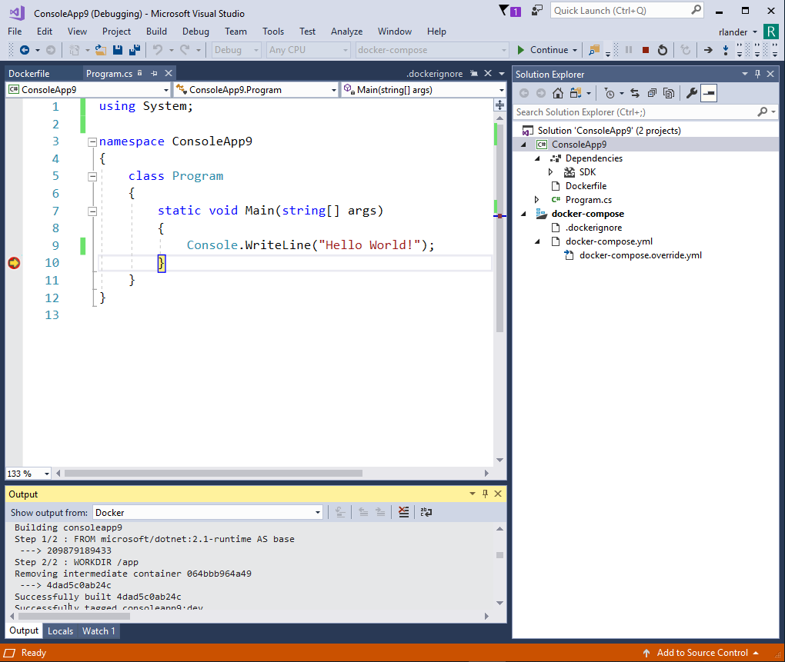

# Using .NET and Docker Together - 2018 Update

Docker and containers come up more and more in conversations that we have with .NET developers. It has become *the* way to deploy server applications for many people, due to its primary benefits of consistency and a light-weight alternative to virtual machines.

I posted about [Using .NET and Docker Together](https://blogs.msdn.microsoft.com/dotnet/2017/05/25/using-net-and-docker-together/) last year. Since then, we've enabled a set of Docker workflows with guidance and samples for .NET Core and .NET Framework, for development, CI/CD, and production. We also offer many more images for both Windows and Linux. If you haven't taken a look at Docker and .NET recently, now is a good time.

## Trying out Docker

We maintain samples repositories for both .NET Core and .NET Framework. With just a few commands at the command line, you can test out [Docker](https://www.docker.com/community-edition#/download) with these sample images.

The easiest (and supported on the most operating systems) is the .NET Core console app sample. All you need to do is type the following command:

```console
docker run --rm microsoft/dotnet-samples
```

There are other samples you can try, both console and ASP.NET:

* [.NET Core Docker Samples](https://github.com/dotnet/dotnet-docker/blob/master/samples/README.md)
* [.NET Framework Docker Samples](https://github.com/Microsoft/dotnet-framework-docker/blob/master/samples/README.md)

## How to Approach using Docker

Docker is flexible, enabling you to use it in lots of different ways. There are three major scenarios to consider when looking at adopting Docker:

* Building source code
* Testing binaries
* Running applications/services in production

You can adopt Docker for all of these roles or just a subset. From what we've seen, most developers start with the production scenario and then adopt more of Docker in their build infrastructure as they find it useful. This approach makes sense, since the choice to use Docker is usually centered around using it to run applications.

On the .NET Team, we've been making heavy use of Docker for both building code and testing. The value of a high-fidelity and instant-on computing environment is super high. There is no need to put off a product investigation on Debian, for example, when you can boot up the exact right environment in seconds.

The following sections show a mixture of .NET Core and .NET Framework examples for these three scenarios.

## Building container images with built binaries

The primary requirement for running Docker in production is containerizing your application. The simplest way to create an image within existing build infrastructure is to copy build artifacts into an image. The primary value with this model is consistency between environments, like staging and production. 

The following `Dockerfile` copies build assets from the current directory into a new image that is based on the [.NET Core Runtime image](https://hub.docker.com/r/microsoft/dotnet/) on Docker Hub.

```Dockerfile
FROM microsoft/dotnet:2.1-runtime
WORKDIR /app
COPY . .
ENTRYPOINT ["dotnet","app.dll"]
```

The following command creates a new image, called `app` using the Dockerfile above, assuming the command is run from the directory where the Dockerfile and app.dll are located:

```console
docker build --pull -t app .
```

The following command creates a running container based on the `app` image:

```console
docker run --rm app
```

Note: The [`--rm` argument](https://docs.docker.com/engine/reference/commandline/run) removes the container after it terminates. Preserving containers is only useful when you want to investigate why they behaved a certain (undesired) way. 

## Building container images with source

Docker makes it easy to build source for an application and produce a container image in one step. This is called [multi-stage build](https://docs.docker.com/develop/develop-images/multistage-build/). The value of building source within a container follows:

* Consistency between build and runtime/production.
* Potentially faster for incremental building than even your own build system, due to Docker layer caching.
* `docker build` doesn't rely on an external build to function (if you build from source within Docker).

The following `Dockerfile` copies source files from the current directory into a new image based on the [.NET Framework SDK](https://hub.docker.com/r/microsoft/dotnet-framework/) image on Docker Hub. The Dockerfile commands build the source with NuGet and MSBuild. The binaries are copied from the `build` stage into a new image based on the [.NET Framework Runtime](https://hub.docker.com/r/microsoft/dotnet-framework/) image. The build stage image is discarded. The selected image name is used only for the image generated from the last stage.

```Dockerfile
FROM microsoft/dotnet-framework:4.7.2-sdk AS build
WORKDIR /app

# copy csproj and restore as distinct layers
COPY *.sln .
COPY aspnetapp/*.csproj ./aspnetapp/
COPY aspnetapp/*.config ./aspnetapp/
RUN nuget restore

# copy everything else and build app
COPY aspnetapp/. ./aspnetapp/
WORKDIR /app/aspnetapp
RUN msbuild /p:Configuration=Release


# copy build artifacts into runtime image
FROM microsoft/aspnet:4.7.2 AS runtime
WORKDIR /inetpub/wwwroot
COPY --from=build /app/aspnetapp/. ./
```

The second section, above, is an example where Docker shines. Each command in Docker creates a distinct layer in your Docker image. If Docker finds that all the inputs for a given layer are unchanged, then it doesn't rebuild that layer for subsequent invocations of `docker build`. The second section copies msbuild assets, like project files, and then runs `nuget restore`. If the msbuild assets have not changed, then the RUN line that performs restore is skipped. That ends up being a large time savings. It also explains why the `Dockerfile` is written the way it is.

The following command creates a new image, called `aspnetapp` using the Dockerfile above, assuming the command is run from the directory where the Dockerfile and the source are located:

```console
docker build --pull -t aspnetapp .
```

The `--pull` parameter pulls new `microsoft/dotnet-framework` images, for example, if they exist on Docker Hub. This parameter takes maybe 1s longer (if no new images exist) on each `docker build` but keeps your environment up-to-date. In the long run, being up-to-date is incredible useful since it keeps your environment in sync with environments that don't have cached images.

The following command creates a container based on the `aspnetapp` image:

```console
docker run --rm -it -p 8000:80 aspnetapp
```

The `-p` parameter maps local host machine ports to Docker guest ports.

See the following examples for more detail on building source with Docker:

* [ASP.NET Docker (.NET Framework) Sample](https://github.com/Microsoft/dotnet-framework-docker/blob/master/samples/aspnetapp/README.md)
* [ASP.NET Core Docker Sample](https://github.com/dotnet/dotnet-docker/blob/master/samples/aspnetapp/README.md)

## Testing binaries with Docker

The testing scenario showcases the value of Docker since testing is more valuable when the test environment has high fidelity with target environments. Imagine you support your application on multiple operating systems or operating system versions. You can test your application in each of them within Docker. It is easy to do and incredibly valuable.

Up until now in this post, you've seen `Dockerfile` files with `RUN` commands that described required logic that is executed with `docker build` and the final result executed with `docker run`. Running tests via `docker build` is useful as a means of getting early feedback, primarily with pass/fail results printed to the console/terminal. This model works OK for testing but doesn't scale well for two reasons:

* `docker build` will fail if there are errors, which are inherent to testing.
* `docker build` doesn't allow volume mounting, which is required to collect test logs.

Testing with `docker run` is a great alternative, since it doesn't suffer from either of these two challenges. Testing with `docker build` is only useful if you want your build to fail if tests fail. The instructions in this document show you how to test with `docker run`.

The following `Dockerfile` in its normal use is similar to the `Dockerfile` for .NET Framework that you saw above. This one, however, includes something of a *trick* to enable testing. It includes a `testrunner` stage that is normally very close to a [no-op](https://en.wikipedia.org/wiki/NOP), but that is very useful for testing.

For testing, build an image to the `testrunner` stage, which will include all the content that has been built to that point. The resulting image is based on the .NET Core SDK image, which includes all of the .NET Core testing infrastructure. The *trick* in this `Dockerfile` is that the `testrunner` stage presents an alternative `ENTRYPOINT`, which calls `dotnet test` to kick off testing. If you run the Dockerfile all the way through (not targeting a specific stage), then this first `ENTRYPOINT` is replaced by the last one, which is the `ENTRYPOINT` for the application.

```Dockerfile
FROM microsoft/dotnet:2.1-sdk AS build
WORKDIR /app

# copy csproj and restore as distinct layers
COPY dotnetapp/*.csproj ./dotnetapp/
COPY utils/*.csproj ./utils/
WORKDIR /app/dotnetapp
RUN dotnet restore

# copy and publish app and libraries
WORKDIR /app/
COPY dotnetapp/. ./dotnetapp/
COPY utils/. ./utils/
WORKDIR /app/dotnetapp
RUN dotnet publish -c Release -o out


# optional stage - build to stage to run tests
FROM build AS testrunner
WORKDIR /app/tests
COPY tests/. .
ENTRYPOINT ["dotnet", "test", "--logger:trx"]


# copy build artifacts into runtime image
FROM microsoft/dotnet:2.1-runtime AS runtime
WORKDIR /app
COPY --from=build /app/dotnetapp/out ./
ENTRYPOINT ["dotnet", "dotnetapp.dll"]
```

The following command creates a new image, called `dotnetapp:test`, using the Dockerfile above and building only to and including the `testrunner` stage, assuming the command is run from the directory where the Dockerfile and the source are located:

```console
docker build --pull --target testrunner -t dotnetapp:test .
```

In order to collect test logs on your local machine, you need to use [volume mounting](https://docs.docker.com/storage/volumes/). In short, you can project a directory on your machine into the container as the same directory. Volume mounting is a great way to get content in or out of a container.

The following command creates a container based on the `dotnetapp:test` image. It volume mounts the `C:\app\TestResults` local directory into the `/app/tests/TestResults` in the app. The local directory must exist already and the `C` drive must be shared to Docker.

```console
docker run --rm -v C:\app\TestResults:/app/tests/TestResults dotnetapp:test
```

After running the command, you should see a `.trx` file in the `C:\app\TestResults` file.

The [Running .NET Core Unit Tests with Docker](https://github.com/dotnet/dotnet-docker/blob/master/samples/dotnetapp/dotnet-docker-unit-testing.md) shows you how to test in a container with more detail. It includes instructions for Windows, macOS, and Linux. It also includes a [script that manages the testing workflow](https://github.com/dotnet/dotnet-docker/blob/master/samples/dotnetapp/build.ps1) described in this section.

## Developing in a Container

The scenarios above are focused on producing or validating a container image. The use of Docker can be moved further upstream to development.

Visual Studio enables development in a container. You can add a Dockerfile to a .NET project, with either Windows or Linux containers. The experience is nearly seamless. It is hard to tell that you are using Docker at all, as you can see in the following image.



You can also develop in a container at the command line. The .NET Core SDK image includes a lot of functionality that you can use without bothering with creating a Dockerfile. In fact, you can run, build, or test your application only using the command line.

[Develop ASP.NET Core Applications in a Container](https://github.com/dotnet/dotnet-docker/blob/master/samples/aspnetapp/aspnet-docker-dev-in-container.md) explains how you can build and rebuild ASP.NET Core applications within Docker as you edit them on your local machine, from within Visual Studio Code, for example.

The following commandline hosts an ASP.NET Core application with `dotnet watch` on macOS or Linux. Everytime you edit and save the application on your local machine, it will be rebuilt within the container. I haven't tried doing that 1000 times in a row, but you probably can. This scenario relies on volume mounting, to project localy resident source code into a running container. As you can see, volume mounting is a powerful alternative to going through the effort of writing a `Dockerfile`.

```console
docker run --rm -it -p 8000:80 -v ~/git/aspnetapp:/app/ -w /app/aspnetapp microsoft/dotnet:2.1-sdk dotnet watch run
```

A similar set of instructions is available for [Developing .NET Core Applications in a Container](https://github.com/dotnet/dotnet-docker/blob/master/samples/dotnetapp/dotnet-docker-dev-in-container.md).

## ASP.NET Core and HTTPS

It is important to host web applications with HTTPS. In many cases, you will terminate HTTPS requests before they get to your ASP.NET Core site. In the case that ASP.NET Core needs to directly handle HTTPS traffic and you are running your site in a container, then you need a solution.

[Hosting ASP.NET Core Images with Docker over HTTPS](https://github.com/dotnet/dotnet-docker/blob/master/samples/aspnetapp/aspnetcore-docker-https.md) describes how to host our sample ASP.NET Core sample images with HTTPS. The model described is very similar to how you would host your own images with your own certificate.

The following commands can be used to run the ASP.NET Core sample images with a dev certificate on Windows with Linux containers:

```console
dotnet dev-certs https -ep %USERPROFILE%\.aspnet\https\aspnetapp.pfx -p crypticpassword
dotnet dev-certs https --trust
docker pull microsoft/dotnet-samples:aspnetapp
docker run --rm -it -p 8000:80 -p 8001:443 -e ASPNETCORE_URLS="https://+;http://+" -e ASPNETCORE_HTTPS_PORT=8001 -e ASPNETCORE_Kestrel__Certificates__Default__Password="crypticpassword" -e ASPNETCORE_Kestrel__Certificates__Default__Path=/https/aspnetapp.pfx -v %USERPROFILE%\.aspnet\https:/https/ microsoft/dotnet-samples:aspnetapp
```

The [Hosting ASP.NET Core Images with Docker over HTTPS](https://github.com/dotnet/dotnet-docker/blob/master/samples/aspnetapp/aspnetcore-docker-https.md) instructions can be used on Windows, macOS, and Linux.

## Closing

You can probably see that we're much farther along in our approach of using .NET and Docker together than our [initial 2017 post on the topic]([Using .NET and Docker Together](https://blogs.msdn.microsoft.com/dotnet/2017/05/25/using-net-and-docker-together/)). We're far from done everything that one can imagine with the container space, but have provided a much more complete foundation for you to use as you adopt Docker.

Tell us how you are using Docker and the improvements you would like to see, either with guidance and samples or with .NET itself. We'll continue to make improvements to make the container experience better.
