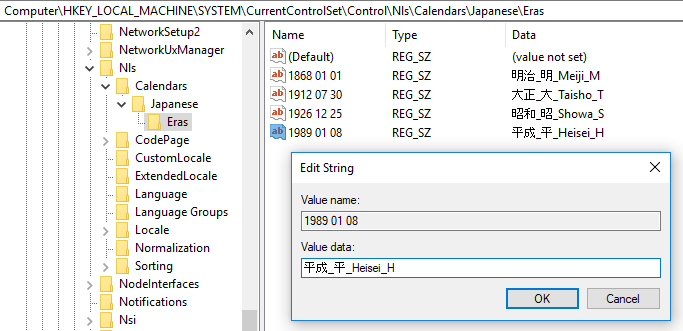

# Handling a new era in the Japanese calendar in .NET

Typically, calendar eras represent long time periods. In the Gregorian calendar, for example, the current era spans (as of this year) 2,018 years. In the Japanese calendar, however, a new era begins with the reign of a new emperor. On April 30, 2019, Emperor Akihito is expected to abdicate, which will bring to an end the Heisei era. On the following day, when his successor becomes emperor, a new era in the Japanese calendar will begin. It is the first transition from one era to another in the history of .NET, and the first change of eras in the Japanese calendar since Emperor Akihito's accession in January 1989.

## Calendars in .NET

.NET supports a number of calendar classes, all of which are derived from the base [Calendar class](https://docs.microsoft.com/dotnet/api/system.globalization.calendar). Calendars can be used in either of two ways in .NET. A *supported* calendar is a calendar that can be used by a specific culture and that defines the formatting of dates and times for that culture. One supported calendar is the *default* calendar of a particular culture; it is automatically used as that culture's calendar for culture-aware operations. *Standalone* calendars are used apart from a specific culture by calling members of that [Calendar class](https://docs.microsoft.com/dotnet/api/system.globalization.calendar) directly. All calendars can be used as standalone calendars. Not all calendars can be used as supported calendars, however.

Each [CultureInfo](https://docs.microsoft.com/dotnet/api/system.globalization.cultureinfo) object, which represents a particular culture, has a default calendar, defined by its [Calendar property](https://docs.microsoft.com/dotnet/api/system.globalization.cultureinfo.calendar). The [OptionalCalendars property](https://docs.microsoft.com/dotnet/api/system.globalization.cultureinfo.OptionalCalendars) defines the set of calendars supported by the culture. Any member of this collection can become the current calendar for the culture by assigning it to the [CultureInfo.DateTimeFormat.Calendar](https://docs.microsoft.com/dotnet/api/system.globalization.datetimeformatinfo.calendar) property.

Each calendar has a [minimum supported date](https://docs.microsoft.com/dotnet/api/system.globalization.calendar.minsupporteddatetime) and a [maximum supported date](https://docs.microsoft.com/dotnet/api/system.globalization.calendar.maxsupporteddatetime). The calendar classes also support eras, which divide the overall time interval supported by the calendar into two or more more periods. Most .NET calendars support a single era. The [DateTime constructors](https://docs.microsoft.com/dotnet/api/system.datetime.-ctor) that create a date using a specific calendar assume that that dates belong to the current era.  You can instantiate a date in an era other than the current era by calling an overload of the [Calendar.ToDateTime method](https://docs.microsoft.com/dotnet/api/system.globalization.calendar.todatetime?System_Globalization_Calendar_ToDateTime_System_Int32_System_Int32_System_Int32_System_Int32_System_Int32_System_Int32_System_Int32_System_Int32_).

## The JapaneseCalendar and JapaneseLunisolarCalendar classes

Two calendar classes, [JapaneseCalendar](https://docs.microsoft.com/dotnet/api/system.globalization.japanesecalendar) and [JapaneseLunisolarCalendar](https://docs.microsoft.com/dotnet/api/system.globalization.japaneselunisolarcalendar), are affected by the introduction of a new Japanese era. These calendars use the same months and days of the month as the Gregorian calendar. They differ in how they calculate years; the reign of a new emperor marks the beginning of a new era, which begins with year 1.

The [JapaneseCalendar](https://docs.microsoft.com/dotnet/api/system.globalization.japanesecalendar) and [JapaneseLunisolarCalendar](https://docs.microsoft.com/dotnet/api/system.globalization.japaneselunisolarcalendar) are the only two calendar classes in .NET that recognize more than one era. Neither is the default calendar of any culture. The JapaneseCalendar class is an optional calendar supported by the Japanese-Japan (ja-JP) culture and is used in some official and cultural contexts. The JapaneseLunisolarCalendar class is a standalone calendar; it cannot be the current calendar of any culture. That neither is the default calendar of the ja-JP culture minimizes the impact that results from the introduction of a new Japanese calendar era. The introduction of a new era in the Japanese calendar affects only:

- Culture-specific date and time operations with cultures that support the [JapaneseCalendar](https://docs.microsoft.com/dotnet/api/system.globalization.japanesecalendar), when the JapaneseCalendar is the current calendar for the culture.
- Calls to standalone [JapaneseCalendar](https://docs.microsoft.com/dotnet/api/system.globalization.japanesecalendar) and [JapaneseLunisolarCalendar](https://docs.microsoft.com/dotnet/api/system.globalization.japaneselunisolarcalendar) methods, such as [GetDaysInYear](https://docs.microsoft.com/dotnet/api/system.globalization.calendar.getdaysinyear), [IsLeapYear](https://docs.microsoft.com/dotnet/api/system.globalization.calendar.isleapyear), or [ToDateTime](https://docs.microsoft.com/dotnet/api/system.globalization.calendar.todatetime).
- Formatting using the ["g" or "gg" custom format specifier](https://docs.microsoft.com/dotnet/standard/base-types/custom-date-and-time-format-strings#gSpecifier).
- Year formatting with the Japanese calendar classes, which will change to provide special formatting for the first year of an era. For more information, see [The first year of an era](#the-first-year-of-an-era) later in this blog post.

Note that, with the exception of the "g" or "gg" custom format specifier, any unintended side effects from the change in Japanese eras occur only if you use a Japanese calendar class as a standalone calendar, or if you use the [JapaneseCalendar](https://docs.microsoft.com/dotnet/api/system.globalization.japanesecalendar) as the current calendar of the ja-JP culture.

## Testing era changes on Windows

The best way to determine whether your applications are affected by the new era is to test them in advance with the new era in place. This is possible for .NET Framework 4.x apps and for .NET Core apps on Windows systems, where era information for the Japanese calendars is stored as a set of REG_SZ values in the HKEY_LOCAL_MACHINE\\SYSTEM\\CurrentControlSet\\Control\\Nls\\Calendars\\Japanese\\Eras key of the system registry. For example, the following figure shows the definition of the Heisei era in the Japanese calendar.



You can use the Registry Editor (regedit.exe) to add a definition for the new era. The name defines the era start date, and its value defines the native era name, native abbreviated era name, English era name, and English abbreviated era name, as follows: 

Name: `yyyy mm dd`
Value: `<native-full>_<native-abbreviated>_<English-full>_<English-abbreviated>`

Since the new era name has not been announced, you can use question marks as a placeholder. For the native full and abbreviated name, you can use the FULLWIDTH QUESTION MARK (U+FF1F), and for the English full and abbreviated name, you can use the QUESTION MARK (U+003F).  For example:

```
[HKEY_LOCAL_MACHINE\SYSTEM\CurrentControlSet\Control\Nls\Calendars\Japanese\Eras]
"2019 05 01"="？？_？_??????_?"
```

You can use code like the following to identify instances in which the current string representation of a date and time in a Japanese calendar will differ from its string representation after the introduction of the new era:

```cs
using System;
using System.Globalization;

public class Example
{
    public static void Main()
    {
        var ciJapanese = new CultureInfo("ja-JP") {
            DateTimeFormat = { Calendar = new JapaneseCalendar() } };
 
        // Original user input date string. 
        string formattedString = "平成 32年2月1日 0:00:00";          

        // Parse the string to a DateTime object.
        DateTime dt = DateTime.Parse(formattedString, ciJapanese); 
 
        // Get the era name of the parsed DateTime object. 
        string roundTrippedString = dt.ToString("gg", ciJapanese);  
        // Check whether the date is formatted using a different era than the original formatted string.
        if (roundTrippedString.IndexOf("平成") < 0)
        {
            Console.WriteLine("Detected failure in round tripping ");
        } 
    }
}
```

Note that the new era will begin on May 1, 2019, and the Japanese government is expected to announce the official name of the new era on about April 1, 2019. A window of approximately one month leaves very little time to test, detect bugs, troubleshoot, and address bugs. It is important that applications be adequately tested well in advance of that date.

## .NET changes to support the new era

To ensure that the transition to a new Japanese calendar era is as seamless as possible, the following changes will be introduced in .NET before the formal introduction of the new Japanese calendar era. These changes will be released in the near future.

### Updating data sources

Currently, the way in which calendar era information is stored differs across .NET implementations:

- For .NET Framework 4.0 and later, as well as for .NET Core running on Windows, calendar era information is provided by the Windows operating system and retrieved from the system registry.

  An update to Windows will add the new era value to the registry once the era name and abbreviated era name are known. .NET on Windows will automatically reflect this update.

- For .NET Framework 3.5 on Windows, calendar era information is maintained as hard-coded data by the .NET Framework itself.

   An update to .NET Framework 3.5 will change its source for calendar data from private hard-coded data to the registry. Once this happens, .NET Framework 3.5 will automatically reflect the eras defined in the Windows registry.

- For .NET Core on non-Windows platforms, calendar information is provided by [International Components for Unicode](http://site.icu-project.org/) (ICU), an open source globalization library.

   ICU libraries will be updated once the era name and abbreviated era name are known.  
   Because they do not depend on ICU cultural data, applications that use the [globalization invariant mode](https://github.com/dotnet/corefx/blob/69410f591db752c5141e0deb8577d05f63c46e59/Documentation/architecture/globalization-invariant-mode.md) are not affected by this change.

Updates will be released as soon as possible after the new era name is announced.

### Relaxed era range checks

In the past, date and time methods that depend on calendar eras threw an [ArgumentOutOfRangeException](https://docs.microsoft/com/dotnet/api/system.argumentoutofrangeexception) when a date and time was outside the range of a specified era. The following example attempts to instantiate a date in the 65th year of the Showa era, which began on December 25, 1926 and ended on January 7, 1989. This date corresponds to January 9, 1990, which is outside the range of the Showa era in the JapaneseCalendar. As a result, an ArgumentOutOfRangeException results.

```csharp
using System;
using System.Globalization;

public class Example
{
   public static void Main()
   {
      var cal = new JapaneseCalendar();
      var dt = cal.ToDateTime(65, 1, 9, 15, 0, 0, 0, 3);
      Console.WriteLine(dt);
   }
}
// The output from the example includes the following:
// Unhandled Exception: System.ArgumentOutOfRangeException:
//    Valid values are between 1 and 64, inclusive.
//    Parameter name: year
```

To accommodate the era change, .NET by default will use relaxed range enforcement rules. A date in a particular era can "overflow" into the following era, and no exception is thrown. The following example instantiates a date in the third quarter of year 31 of the Heisei era, which is more than two months after the Heisei era has ended.  

```csharp
using System;
using System.Globalization;

public class Example
{
   public static void Main()
   {
      var cal = new JapaneseCalendar();
      var jaJP = new CultureInfo("ja-JP");
      jaJP.DateTimeFormat.Calendar = cal;

      var dat = cal.ToDateTime(31, 8, 18, 0, 0, 0, 0, 4);
      Console.WriteLine($"{dat:d}");

      CultureInfo.CurrentCulture = jaJP;

      Console.WriteLine($"{dat:g yyyy-MM-dd}");
   }
}  
// The example displays the following output:
//      8/18/2019
//      ?? 01-08-18
```

If this behavior is undesirable, you can restore strict era range checks as follows:

- **.NET Framework 4.6 or later**: You can set the following [AppContextSwitchOverrides element](https://docs.microsoft.com/dotnet/framework/configure-apps/file-schema/runtime/appcontextswitchoverrides-element) switch:

   ```xml
   <?xml version="1.0" encoding="utf-8"?>
   <configuration>
     <runtime>
       <AppContextSwitchOverrides value="Switch.System.Globalization.EnforceJapaneseEraYearRanges=true" />
     </runtime>
   </configuration>
   ```

- **.NET Framework 4.5.2 or earlier**: You can set the following registry value:

   |||
   |--|--|
   |Key | HKEY_LOCALMACHINE\SOFTWARE\Microsoft\.NETFramework\AppContext |
   | Name | Switch.System.Globalization.EnforceJapaneseEraYearRanges |
   | Type | REG_SZ |
   | Value | 1 |

- **.NET Core**: You can add the following to the .netcore.runtimeconfig.json config file:

```json
"runtimeOptions": {
   "configProperties": {
      "Switch.System.Globalization.EnforceJapaneseEraYearRanges": true
   }
}
```

### The first year of an era

Traditionally, the first year of a new Japanese calendar era is called Gannen (元年). For example, instead of Heisei 1, the first year of the Heisei era can be described as Heisei Gannen.

As part of its enhanced support for Japanese calendar eras, .NET will adopt this convention. However, parsing operations will successfully handle strings that include "1" or "Gannen" as the year component.

The following example displays a date in the first year of the Heisei era. The output from the example illustrates the difference between the current and future handling of the first year of an era by .NET. As the output from the example illustrates, the .NET formatting routine converts year 1 to Gannen only if the year is followed by the 年 symbol.

```cs
using System;
using System.Globalization;

public class Example
{
   public static void Main()
   {
      var dat = new DateTime(1989, 8, 18);
      var cal = new JapaneseCalendar();
      var jaJP = new CultureInfo("ja-JP");
      jaJP.DateTimeFormat.Calendar = cal;
      CultureInfo.CurrentCulture = jaJP;

      Console.WriteLine($"{dat:ggy'年'M'月'd'日'}");
   }
}
// If run under current .NET implementations: 平成1年8月18日
// If run after forthcoming updates: 平成元年8月18日
```

## Handling Japanese calendar eras effectively

The change in Japanese eras poses a number of issues. The following list addresses some of these and proposes workarounds.

### Specify an era when instantiating dates

You can instantiate a date using the date values of the Japanese calendar in any of three ways:

- By calling a [DateTime constructor](https://docs.microsoft.com/dotnet/api/system.datetime?constructors) that includes a parameter of type Calendar.
- By calling a [DateTimeOffset constructor](https://docs.microsoft.com/dotnet/api/system.datetime?constructors) that includes a parameter of type Calendar.
- By calling the [Calendar.ToDateTime method](https://docs.microsoft.com/dotnet/api/system.globalization.calendar.todatetime) of a specific calendar type.
  
The .NET calendar classes include a [CurrentEra](https://docs.microsoft.com/dotnet/api/system.globalization.calendar.currentera) property, which indicates the current (or default) era used in interpreting dates expressed in a specific calendar. Its value is the constant 0. It is an index into the [Eras](https://docs.microsoft.com/dotnet/api/system.globalization.calendar.eras) property, which orders eras in reverse chronological order. In other words, the most recent era is always the default era.

When eras can change unexpectedly, calling a date and time instantiation method that relies on the default era can produce an ambiguous date. In the next example, the call to the [JapaneseCalendar.ToDateTime method](https://docs.microsoft.com/dotnet/api/system.globalization.calendar.todatetime?System_Globalization_Calendar_ToDateTime_System_Int32_System_Int32_System_Int32_System_Int32_System_Int32_System_Int32_System_Int32_) that uses the default era returns different dates depending on whether or not the new era has been defined in the registry. Note that the output for this and the following example uses the [sortable date/time pattern](https://docs.microsoft.com/en-us/dotnet/standard/base-types/standard-date-and-time-format-strings#the-sortable-s-format-specifier).

```cs
using System;
using System.Globalization;

public class Example
{
   public static void Main()
   {
      var cal = new JapaneseCalendar();
      var dat = cal.ToDateTime(2, 1, 2, 0, 0, 0, 0);
      Console.WriteLine($"{dat:s}");
      dat = new DateTime(2, 1, 2, cal);
      Console.WriteLine($"{dat:s}");
   }
}
// Output with the Heisei era current:
//      1990-01-02T00:00:00
//      1990-01-02T00:00:00
// Output with the new era current:
//      2020-01-02T00:00:00
//      2020-01-02T00:00:00
```

You can do either of two things to avoid potential ambiguity:

- Call the [Calendar.ToDateTime overload](https://docs.microsoft.com/dotnet/api/system.globalization.calendar.todatetime?System_Globalization_Calendar_ToDateTime_System_Int32_System_Int32_System_Int32_System_Int32_System_Int32_System_Int32_System_Int32_System_Int32_) that specifies an era. This overload always produces an unambiguous date:

```csharp
using System;
using System.Globalization;

public class Example
{
   public static void Main()
   {
      var cal = new JapaneseCalendar();
      foreach (var era in cal.Eras)
         Console.WriteLine($"{cal.ToDateTime(2, 1, 2, 0, 0, 0, 0, era):s}");
   }
}
// The example displays the following output:
//      2020-01-02T00:00:00
//      1990-01-02T00:00:00
//      1927-01-02T00:00:00
//      1913-01-02T00:00:00
//      1869-01-02T00:00:00
```

- Instantiate dates in the Gregorian calendar. Use the Japanese calendar or the Japanese Lunisolar calendar only for the string representation of dates.

### Use relaxed era range checks

A basic problem of calendars that can add new eras is that you can't be certain that a future date will always belong to the current era. If strict range checking is enabled, future dates that are valid before an era change may become invalid after the era change. For this reason, leave relaxed era range checking on (the default value).

### Use the era in formatting and parsing operations

Because dates can be ambiguous, you should always format a date value with its era. This is the default behavior of the [standard date and time format strings](https://docs.microsoft.com/en-us/dotnet/standard/base-types/standard-date-and-time-format-strings). If you are using a [custom date and time format string](https://docs.microsoft.com/en-us/dotnet/standard/base-types/custom-date-and-time-format-strings), be sure to include the ["g" or "gg"](https://docs.microsoft.com/en-us/dotnet/standard/base-types/custom-date-and-time-format-strings#the-g-or-gg-custom-format-specifier) custom format specifier. Conventionally, the era precedes the other date components in the string representation of a Japanese calendar date.

For parsing operations, also ensure that an era is present unless you want all dates and times to default to the current era.

## See also

[The Japanese Calendar's Y2K Moment](https://blogs.msdn.microsoft.com/shawnste/2018/04/12/the-japanese-calendars-y2k-moment/)  
[Testing for New Japanese Era](https://blogs.msdn.microsoft.com/shawnste/2018/01/12/testing-for-new-japanese-era/)  
[Japanese calendar](https://en.wikipedia.org/wiki/Japanese_calendar)  
[Japanese era name](https://en.wikipedia.org/wiki/Japanese_era_name)  
[List of Japanese era names](https://en.wikipedia.org/wiki/List_of_Japanese_era_names)  
[Working with Calendars](https://docs.microsoft.com/en-us/dotnet/standard/datetime/working-with-calendars)  