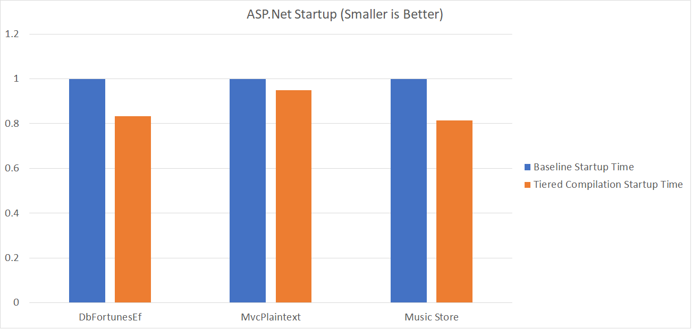
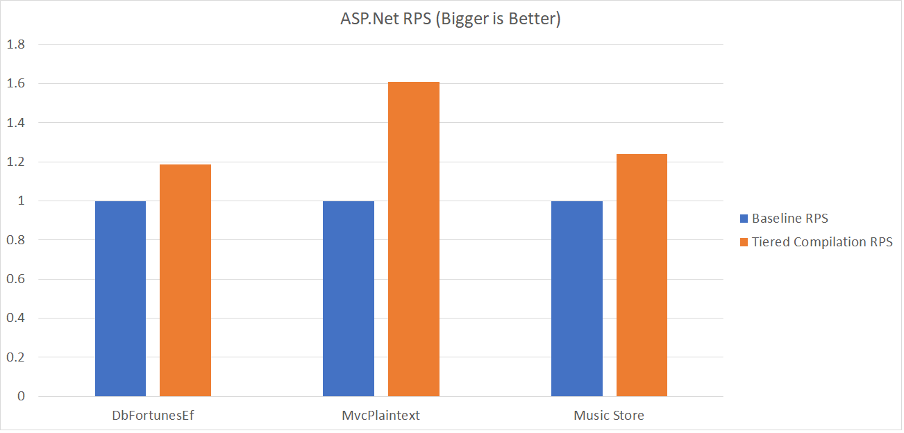
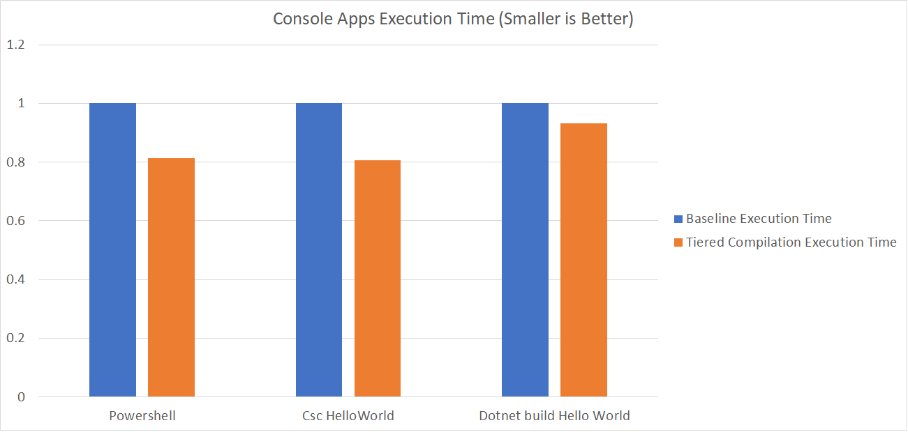

# Tiered Compilation Preview in .NET Core 2.1 #

_Date_ by [Noah Falk](https://github.com/noahfalk)

If you are a fan of .NET performance there has been a lot great news lately such as [Performance Improvements in .NET Core 2.1](https://blogs.msdn.microsoft.com/dotnet/2018/04/18/performance-improvements-in-net-core-2-1/) and [Announcing .NET Core 2.1](https://blogs.msdn.microsoft.com/dotnet/2018/05/30/announcing-net-core-2-1/), but we've got more. Tiered compilation is a significant new performance feature that we are making available as a preview for anyone to try out, starting in .NET Core 2.1. In many scenarios that we have tested, applications start faster and run faster at steady state. All it needs from you is a smidgen of curiosity, a project that runs on .NET Core 2.1, and a trivial change to your environment variables or project file to enable it. In the rest of this post we'll cover what it is, how you use it, and why it is the hidden gem of the 2.1 release!

## What is Tiered Compilation? ##

Since the beginnings of .NET Framework, every method in your code was typically compiled once. However there are tradeoffs to be made when deciding how to do that compilation that will affect the performance of your application. For example the JIT could do very aggressive optimization and get great steady-state performance, but optimizing code well is not a quick endeavor so your application would start very slowly. Alternately the JIT could use very simple compilation algorithms that run quickly so your application starts fast, but the code quality would be much worse and steady-state application throughput would suffer. .NET has always tried to take a balanced approach that would do a reasonable job at both startup and steady-state performance, but using a single compilation means compromise was required.

The Tiered Compilation feature changes the premise by allowing .NET to have multiple compilations for the same method that can be hot-swapped at runtime. This separates the decision making so that we can pick a technique that is best for startup, pick a second technique that is best for steady-state and then deliver great performance on both. In .NET Core 2.1 this is what Tiered Compilation aims to do for your application if you opt-in: 

  - **Faster application startup time** - When an application starts it waits for some MSIL code to JIT. Tiered compilation asks the JIT to generate the initial compilation very quickly, sacrificing code quality optimization if needed. Afterwards, if the method is called frequently, more optimized code is generated on a background thread and the initial code is replaced to preserve the application's steady state performance.

  - **Faster steady-state performance** - For a typical .NET Core application most of the framework code will load from pre-compiled ([ReadyToRun](https://github.com/dotnet/coreclr/blob/master/Documentation/botr/readytorun-overview.md)) images. This is great for startup, but the pre-compiled images have versioning constraints and CPU instruction constraints that prohibit some types of optimization. For any methods in these images that are called frequently Tiered Compilation requests the JIT to create optimized code on a background thread that will replace the pre-compiled version.

## Faster? How much faster? ##

Part of reason we are releasing this as a preview is to learn how it performs for your apps, but below are some examples we have tested it on. Although very scenario dependent, we hope these results are typical of what you will see on similar workloads and that the results will continue to improve as the feature matures. The baseline is .NET Core 2.1 RTM running in a default configuration and all the numbers are scaled so that baseline always measures 1.0. In this first group we've got a couple of Tech Empower tests and [Music Store](https://github.com/aspnet/musicstore), our frequent sample ASP.NET app. 





Although a few of our ASP.NET benchmarks benefited particularly well (MvcPlaintext RPS up over 60% - wow!), tiered compilation is in no way specific to ASP.NET. Here are some example .NET Core command line apps you might come across in daily development:



How will your apps fare? It is much easier to measure than to predict but we can offer a few broad rules of thumb.

1) The startup improvements apply primarily to reduced time jitting managed code. You can use tools such as [PerfView](https://github.com/Microsoft/perfview) to determine how much time your app spends doing this. In our testing time spent jitting would often decrease by about 35%.

2) The steady-state improvements apply primarily to applications that are CPU bound where some of the hot code is coming from the .NET or ASP.NET precompiled libraries. Profilers such as [PerfView](https://github.com/Microsoft/perfview) can help you determine if your app is in this category.

## Trying it out ##

A small disclaimer, the feature is still a preview. We've done a lot of testing on it but haven't enabled the feature by default because we want to gather feedback and continue to make adjustments. Turning it on might not make your app faster or you might run into other rough edges we've missed. We are here to help if you encounter issues and you can always disable it easily. You can turn this on in production if you like, but we strongly suggest testing it out beforehand.

There are several ways to opt-in, all of which have the same effect:

  - If you build the application yourself using .NET 2.1 SDK - Add the MSBuild property **\<TieredCompilation\>true<\\TieredCompilation\>** to the default property group in your project file. For example:

````
    <Project Sdk="Microsoft.NET.Sdk">
      <PropertyGroup>
        <OutputType>Exe</OutputType>
        <TargetFramework>netcoreapp2.1</TargetFramework>
        <TieredCompilation>true<\TieredCompilation>
      </PropertyGroup>
    </Project>
````

  - If you run an application that has already been built, edit runtimeconfig.json to add **System.Runtime.TieredCompilation=true** to the configProperties. For example:

````
    {
      "runtimeOptions": {
        "configProperties": {
          "System.Runtime.TieredCompilation": true
        }
      },
      "framework": {
        ...
      }
    }
````

  - If you run an application and don't want to modify any files, set the environment variable

````
 COMPlus_TieredCompilation=1
````

  For more details about trying it out and measuring performance, check out the [Tiered Compilation Demo](https://github.com/aspnet/JitBench/blob/tiered_compilation_demo/README.md)

## Getting Technical ##

Curious how it works? Fear not, understanding these internal details are not necessary to use tiered compilation and you can skip this section if you wish. At a glance the feature can be divided into four different parts: 
 - The JIT compiler which can be configured to generate assembly code of differing quality - Surprisingly to many people, this has not been the focus in the feature so far. Going back to almost the beginning of .NET the JIT supported a default compilation mode and a no optimization compilation mode that is used for debugging. The normal mode produces better code quality and takes longer to compile whereas 'no optimization' mode is the reverse. For Tiered Compilation we created new configuration names 'Tier0' and 'Tier1', but the code these configurations generate is largely identical to the 'no optimization' and 'normal' modes we generated all along. Most of the JIT changes so far have involved making the JIT generate code faster when 'Tier0' code is requested. We hope to continue improving Tier0 compilation speed in the future, as well as improve the code quality produced at Tier1.
 - The CodeVersionManager which keeps track of different compilations (versions) of code that exist for the same method - At its most basic this is a big in-memory dictionary that stores the mapping between .NET methods in your application and a list of different assembly implementations the runtime has at its disposal to execute the method. We use a few tricks to optimize this data structure but if you want to dig in on this aspect of the project [our very nice spec](https://github.com/dotnet/coreclr/blob/master/Documentation/design-docs/code-versioning.md) is available.
 - A mechanism to hot-swap at runtime between different assembly code compilations of the same method - When method A calls method B, the call lands on a jmp instruction. By adjusting the target of the jmp instruction the runtime can control which implementation of B is executed.
 - A policy that decides what code versions to create and when to switch between them - The runtime always creates Tier0 first which is either code loaded from a ReadyToRun image, or code jitted with minimal optimization. A call counter is used to determine which methods are run frequently and a timer is used to avoid the work of creating Tier1 too soon during startup. Once both the counter and timer are satisfied the method is queued and a background thread compiles the Tier1 version. For more details check out [the spec](https://github.com/dotnet/coreclr/blob/master/Documentation/design-docs/tiered-compilation.md).

## Where do we go from here? ##

Tiered Compilation creates a variety of possibilities we could continue to capitalize on well into the future. Historically our JIT has been constrained to investing in techniques relatively near the middle ground positions of speed and code quality that .NET has always needed. Now that the runtime can capitalize on more extreme tradeoff positions we've got the leeway and the incentive to push the boundaries, both to make compilation faster and to generate higher quality code. With runtime hot-swapping of code .NET could start doing more detailed profiling and then use the runtime feedback to do even better optimization (profile guided optimization). Such techniques can allow code generators to out-perform even the best static optimizers that don't have access to profile data. Or there are yet other options such as dynamic deoptimization for better diagnostics, collectible code to reduce memory usage, and hot patching for instrumentation or servicing. For now our most immediate goal remains a bit closer to the ground - make sure the functionality in the preview works well, respond to your feedback, and finish this first iteration of the work.


## Wrapping Up ##

We hope Tiered Compilation gives your applications the same great improvements as our benchmarks and we know there is even more untapped potential yet to come. Please [give it a try](https://github.com/aspnet/JitBench/blob/tiered_compilation_demo/README.md) and then [come visit on github](https://github.com/dotnet/coreclr/issues/4331) to give us your feedback, discuss, ask questions, and maybe even contribute some code of your own. Thanks!