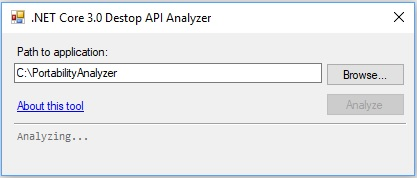
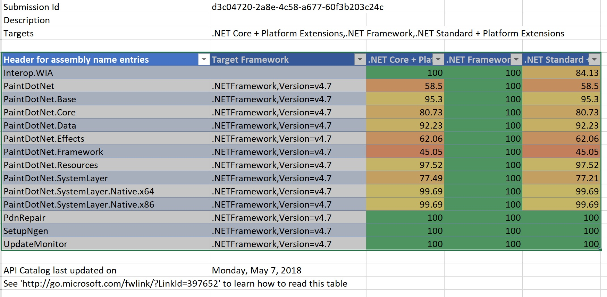

# Are your Windows Forms and WPF applications ready for .NET Core 3.0?
*By Olia Gavrysh*

[](https://github.com/OliaG/dotnet-apiport-ui/releases/download/1.0.0/PortabilityAnalyzer.zip) [**Download Portability Analyzer**](https://github.com/OliaG/dotnet-apiport-ui/releases/download/1.0.0/PortabilityAnalyzer.zip) **(2.37 MB)**  

At Build 2018 we [announced](https://blogs.msdn.microsoft.com/dotnet/2018/05/07/net-core-3-and-support-for-windows-desktop-applications/) that we are enabling Windows desktop applications (Windows Forms and Windows Presentation Framework (WPF)) with .NET Core 3.0. You will be able to run new and existing Windows desktop applications on .NET Core and enjoy all the benefits that .NET Core has to offer, such as application-local deployment and improved performance.

It is important that .NET Core 3.0 includes all the APIs that your applications depend on. We are releasing a Portability Analyzer that will report the set of APIs referenced in your apps that are not yet available in NET Core 3.0. This API list will be sent to Microsoft and will help us prioritize which APIs we should incorporate to the product before it ships.

Please [download](https://github.com/OliaG/dotnet-apiport-ui/releases/download/1.0.0/PortabilityAnalyzer.zip) and run the tool (*PortabilityAnalyzer.exe*) on your Windows Forms and WPF apps to see how ready your apps are for .NET Core 3.0 and to help us shape the .NET Core 3.0 API set.

## Introducing Portability Analyzer

The Portability Analyzer is an [open source tool](https://github.com/Microsoft/dotnet-apiport) that simplifies your porting experience by identifying APIs that are not portable among the various .NET Platforms. This tool has existed for a few years as a [console application](https://github.com/Microsoft/dotnet-apiport/blob/master/docs/Console/README.md) and a [Visual Studio extension](https://github.com/Microsoft/dotnet-apiport/blob/master/docs/VSExtension/README.md). We recently updated it with a Windows Forms UI, using an early build of .NET Core 3.0.  You can see what it looks like in the following image.



Running the tool will do two things:
1. Generate an Excel spreadsheet that will report the level of compatibility that your project has with .NET Core 3.0, including the specific APIs that are currently unsupported.
2. Send this same data to the .NET team at Microsoft so that we can determine which APIs are needed by the most people.

The data we are collecting is the same as what is in the spreadsheet. None of your source code or binaries will be sent from your machine to Microsoft.

In order for us to know which APIs our users need, we are asking you to run the tool which will help us to provide the best possible experience in porting your apps.  You, at the same time, will see how portable your apps are right now since the tool generates a list of APIs referenced in your assemblies, that might not be supported in .NET Core 3.0.

We will prioritize adding new APIs in .NET Core 3.0 based on information we collect. Please help us help you by making sure your application’s API requirements are represented in the data that we use for prioritization. Please run the Portability Analyzer to ensure that your application is counted.

## Using Portability Analyzer
Use the following instructions to run Portability Analyzer.
1.	Extract archive anywhere on your local disk.
2.	Run *PortabilityAnalyzer.exe*
3.	In the **Path to application** text box enter the directory path to your Windows Forms or WPF app (either by inserting a path string or clicking on **Browse** button and navigating to the folder).
4.	Click **Analyze** button.
5.	After the analysis is complete, a report of how portable your app is right now to .NET Core 3.0 will be saved to your disc. You can open it in Excel by clicking **Open Report** button.

Below is an example of the report you're getting after running the tool for the popular Paint.NET application:



> In your report you might have a tab "Missing Assemblies". It means that the analyzer could not find the source assemblies that are referenced in your application. It is better to resolve those conflicts. Make sure you are not forgetting to add resources or remove obsolete references.

## Using the console-based version

If you would like to run the analysis for many applications, you can either run them one by one as described above or you can use the console version of the Portability Analyzer.

> *Note that you will get one report per invocation of the ApiPort.exe tool. If you prefer to get one report per application, you can automate the invocation either using `for` in Batch or the `ForEach` mechanism in PowerShell.

To run the console app:

1. Download and unzip [Console Portability Analyzer](
https://github.com/Microsoft/dotnet-apiport/releases/download/2.5.0-alpha/ApiPort.zip).

2. From the command prompt run the following command specifying multiple directories, dlls, or executables:
    ```
    [PathToApiPort]\ApiPort\net461\win7-x64\ApiPort.exe analyze -f [Directory1] -f [Directory2] -f [Directory3]
    ```
    For example:
    ```
    C:\Downloads\ApiPort\net461\win7-x64\ApiPort.exe analyze -f first.dll -f second.dll -f third.dll
    ```

You can find the portability report saved as an Excel file (`.xlsx`) in your current directory.

## Using Portability Analyzer offline

Another option is to enable full offline access. We currently do not offer binaries for this, so in order to use the tool you'll need to build Portability Analyzer yourself from the source code that is available on [GitHub](https://github.com/Microsoft/dotnet-apiport). To do so, please follow these steps:

1. Clone the project: `git clone https://github.com/Microsoft/dotnet-apiport`
2. Compile using the `build.cmd` script as normal
3. If in Visual Studio, set the project `ApiPort.Offline` as the startup project, or if from command line, go to `bin\[Configuration]\ApiPort.Offline\net46\win7-x64` and run `ApiPort.exe` from this directory.
4. After using the tool, please [email](mailto:netcore3modernize@microsoft.com) us your reports so we can make sure the "voice" of your applications is heard.

## Summary
Please [download](https://github.com/OliaG/dotnet-apiport-ui/releases/download/1.0.0/PortabilityAnalyzer.zip) and use Portability Analyzer on your desktop applications. It will help you determine how compatible your apps are with .NET Core 3.0. This information will help us plan the 3.0 release with the goal of making it easy for you to adopt .NET Core 3.0 for desktop apps.

[](https://github.com/OliaG/dotnet-apiport-ui/releases/download/1.0.0/PortabilityAnalyzer.zip) [**Download Portability Analyzer**](https://github.com/OliaG/dotnet-apiport-ui/releases/download/1.0.0/PortabilityAnalyzer.zip) **(2.37 MB)** 

Thank you in advance for your help!