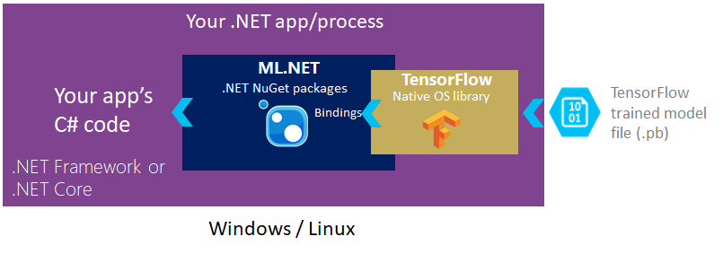
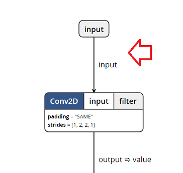
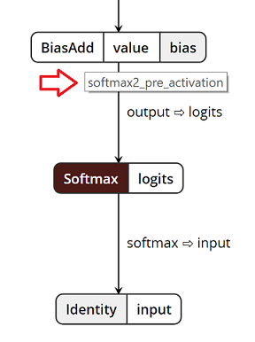

# Announcing ML.NET 0.5

It’s been a few months already since we [released ML.NET 0.1 at //Build 2018](https://blogs.msdn.microsoft.com/dotnet/2018/05/07/introducing-ml-net-cross-platform-proven-and-open-source-machine-learning-framework/), a cross-platform, open source machine learning framework for .NET developers. While we’re evolving through new preview releases, we are getting great feedback and would like to thank the community for your engagement as we continue to develop ML.NET together in the open. 

Today we are happy to announce the latest version: **ML.NET 0.5**. In this release we are adding **[TensorFlow](https://www.tensorflow.org/) model scoring** as a **transform** to ML.NET. This enables using an existing TensorFlow model within an ML.NET experiment. In this release we are also addressing a variety of issues and feedback we received from the community. We welcome feedback and contributions to the conversation: relevant issues can be found [here](https://github.com/dotnet/machinelearning/projects/4).

As part of the upcoming road in ML.NET, we really want your feedback on making ML.NET easier to use. We are working on a new ML.NET API which improves flexibility and ease of use. When the new API is ready and good enough, we plan to deprecate the current “pipeline” API. Because this will be a significant change we want to share our proposals for the multiple API options and comparisons at the end of this blog post and start an open discussion with you where you can provide your feedback and help shape the long-term API for ML.NET.

This blog post provides details about the following topics in ML.NET:

* [Added a TensorFlow model scoring transform (TensorFlowTransform) to ML.NET v0.5](http://TBD-Set-Local-URL)

* [New ML.NET API proposal exploration for you to provide feedback for upcoming versions](http://TBD-Set-Local-URL)


## Added a TensorFlow model scoring transform (TensorFlowTransform)

*[TensorFlow](https://www.tensorflow.org/)* is a popular deep learning and machine learning toolkit that enables training deep neural networks (and general numeric computations).

*Deep learning* is a subset of AI and machine learning that teaches programs to do what comes naturally to humans: learn by example.
Its main differenciator compared to traditional machine learning is that a deep learning model can learn to perform object detection and classification tasks directly from images, sound or text, or even deliver tasks such as speech recognition and language translation. In order to do so, deep learning models need to be trained by using large sets of labeled data and neural networks that contain multiple layers. For detailed generic information about it you can read this [article on Deep Learning](https://en.wikipedia.org/wiki/Deep_learning). 

With ML.NET 0.5 we are starting to add support for Deep Learning in ML.NET. Today we are introducing the first level of integration with TensorFlow in ML.NET through the new `TensorFlowTransform` which enables taking an existing TensorFlow model, either trained by you or downloaded from somewhere else, and get the scores from the model in ML.NET.

Being able to use this new Tensorflow scoring capability does not require you to have a working knowledge of internal details of TensorFlow. Longer term we will be working on making the experience for performing Deep Learning with ML.NET even easier.

The implementation of this transform is based on code from [TensorFlowSharp](https://github.com/migueldeicaza/TensorFlowSharp).

The ML.NET NuGet packages provide new functionality for scoring with existing trained TensorFlow models in your .NET Core or .NET Framework apps, as shown in the diagram:



The following code snippet shows how to use the TensorFlow transform in the ML.NET pipeline:

```cs

// ... Additional transformations in the pipeline code

pipeline.Add(new TensorFlowScorer()
{
    ModelFile = "model/tensorflow_inception_graph.pb",   // Example using the Inception v3 TensorFlow model
    InputColumns = new[] { "input" },                    // Name of input in the TensorFlow model
    OutputColumn = "softmax2_pre_activation"             // Name of output in the TensorFlow model
});

// ... Additional code specifying a learner and training process for the ML.NET model

```

The code example above uses the pre-trained TensorFlow model named *Inception v3*, that you can download from [here](https://storage.googleapis.com/download.tensorflow.org/models/inception5h.zip). The [Inception v3](https://cloud.google.com/tpu/docs/inception-v3-advanced) is a very popular image recognition model trained on the [ImageNet dataset](http://image-net.org) where the TensorFlow model tries to classify entire images into 1000 classes, like "Umbrella", "Jersey", and "Dishwasher".

The *Inception v3* model can be classified as a deep [convolutional neural network](https://colah.github.io/posts/2014-07-Conv-Nets-Modular/) and can achieve reasonable performance on hard visual recognition tasks, matching or exceeding human performance in some domains. The model/algorithm was developed by multiple researchers and based on the original paper: ["Rethinking the Inception Architecture for Computer Vision"](https://arxiv.org/abs/1512.00567) by Szegedy, et. al.

In next ML.NET releases, we will add functionality to enable identifying the expected inputs and outputs of TensorFlow models. For now, use the TensorFlow APIs or a tool like [Netron](https://github.com/lutzroeder/Netron) to explore the TensorFlow model.

If you open the previous sample TensorFlow model file (`tensorflow_inception_graph.pb`) with [Netron](https://github.com/lutzroeder/Netron) and explore the model's graph, you can see how it correlates the `InputColumn` with the node's `input` at the beginning of the graph:



And how the `OutputColumn` correlates with `softmax2_pre_activation` node's output almost at the end of the graph.



*Limitations:* We are currently in the process of updating the ML.NET APIs for improved flexibility, in order to use TensorFlow ML.NET story today there are a few limitations. For now (when using the "pipeline" API), these scores can only be used within a `LearningPipeline` as inputs (numeric vectors)  to a learner like a classifier learner. However, with the upcoming new ML.NET APIs, the scores from the TensorFlow model will be directly accessible, so you could simply score with the TensorFlow model without needing to add any additional learner (such as StochasticDualCoordinateAscentClassifier) and its related train process as it happens in this [sample](https://github.com/dotnet/machinelearning/blob/6ac380a4d3f44ee7b015461f74c4298b0ed5184b/test/Microsoft.ML.Tests/Scenarios/TensorflowTests.cs).

Take into account that the mentioned TensorFlow code examples using ML.NET are using the current "pipeline" API available in v0.5. Moving forward, the ML.NET API enabling to use TensorFlow will be slightly different and not based on the "pipeline". This is related to the next section of this blog post which focuses on the new upcoming API for ML.NET. 

Finally, we also want to highlight the fact that ML.NET is a framework where we are surfacing TensorFlow today, but in the future we *might* look into other integrations with additional Deep Learning libraries as well, such as [Torch](http://torch.ch/) and [CNTK](https://www.microsoft.com/en-us/cognitive-toolkit/). 

You can find [here](https://github.com/dotnet/machinelearning/blob/6ac380a4d3f44ee7b015461f74c4298b0ed5184b/test/Microsoft.ML.Tests/Scenarios/TensorflowTests.cs) an additional code example using the `TensorFlowTransform` with the existing `LearningPipeline` API.


## Explore the upcoming new ML.NET API and provide feedback

As mentioned at the begining of this blog post, we are really looking forward to get your feedback on the new ML.NET API we're creating while crafting ML.NET. This evolution in ML.NET offers more flexible capabilities than what the current "pipeline" API offers. The "pipeline" API will be deprecated when this new API is ready and good enough.  

### Design principles for this new ML.NET API

We are designing this new API based on the following principles:

- Uses parallel terminology with other well-known frameworks like Scikit-Learn, TensorFlow and Spark and we will try to be consistent in terms of naming and concepts so it is easier for developers to understand and learn ML.NET Core. 

- Keeps simple and concise ML scenarios such as simple train and predict.

- Allows advanced ML scenarios (which were not possible with the current "pipeline" API as explained in the next section). 

We have also explored API approaches like Fluent API, declarative, imperative etc.
For additional deeper discussion on principles and required scenarios, check out this [issue in GitHub](https://github.com/dotnet/machinelearning/issues/584).


### Why ML.NET is switching from the "pipeline" API to a new API?

As part of the process of crafting the preview versions (remember that ML.NET is still in early previews), we've been getting feedback about the "pipeline" API and discovered quite a few limitations we need to address by creating a more flexible API.

Specifically, the new ML.NET API adds the following capabilities which aren't possible with the current "pipeline" API: 

- **Strongly-typed API**: This new Strongly-typed API takes advantage of C# capabilities so errors can be discovered in compilation time along with improved Intellisense in the editors. 

- **Better flexibility:** This API provides a *decomposable train and predict* process, eliminating rigid and linear pipeline execution. With the new API, execute a certain code path and then fork the execution so multiple paths can re-use the initial common execution. For example, share a given transforms' execution and transformed data with multiple learners and trainers. 
This new API is based on concepts such as `Estimators`, `Transformes` and `DataView`, shown in the following code in this blog post. 

- **Improved usability:** Direct call to the APIs from your code, no more scaffolding or insolation layer creating an obscure separation between what the user/developer writes and the internal APIs. Entrypoints are no longer mandatory. 

- **Ability to simply score with TensorFlow models.** Thanks to the mentioned flexibility in the API, you can also simply load a TensorFlow model and score by using it without needing to add any additional learner and training process (such as adding an additional ), as explained in the previous "Limitations" topic within the TensorFlow section.

- **Better visibility of the transformed data:** You have better visibility of the data while applying transformers.

#### Comparison of strongly-typed API vs. "piepline" API

Another important comparison is related to the **Strongly Typed API** feature in the new API.
If you'd use the "pipeline" api you would have code like the following, where data columns are provided as strings, so if you write any typo (i.e. you wrote "Descrption" instead of "Description"), you will get a run-time exception:

```cs
pipeline.Add(new TextFeaturizer("Description", "Description"));       
```

However, when using the new ML.NET API, it is strongly typed, so if you write any typo, you will catch it in compilation time plus you can also take advatage of Intellisense in the editor.

```cs
var estimator = reader.MakeEstimator()
                .Append(row => (                    
                    description: row.description.FeaturizeText()))          
```

#### Details on decomposable train and predict API

The following code snippet shows how the transforms and training process of the "GitHub issues labeler" sample app can be implemented with the new API in ML.NET.

This is our current proposal and based on your feedback this API will probably evolve accordingly.

**New ML.NET API code example:**

```cs

        public static async Task BuildAndTrainModelToClassifyGithubIssues()
        {
            var env = new Environment(new SysRandom(0), verbose: true);

            string dataPath = "corefx-issues-train.tsv";

            // Create reader with specific schema. 
            // string :ID, string: Area, string:Title, string:Description
            var reader = TextLoader.CreateReader(env, ctx =>
                                          (area: ctx.LoadText(1),
                                            title: ctx.LoadText(2),
                                            description: ctx.LoadText(3),
                                            dataPath,
                                            useHeader: true));

            var estimator = reader.MakeEstimator()
                .Append(row => (
                    // Convert string label to key. 
                    label: row.area.Dictionarize(),
                    // Featurizes 'description'
                    description: row.description.FeaturizeText(),
                    // Featurizes 'title'
                    title: row.title.FeaturizeText()))
                .Append(row => (
                    // Concatenate the two features into a vector.
                    features: row.description.ConcatWith(r.title),
                    // Preserve the label
                    label: row.label))
                .Append(row => r.label.PredictSdcaMultiClass(row.features));

            // Read the data
            var data = reader.Read(dataPath);

            // Fit the data
            var model = estimator.Fit(data);

            string modelPath = "github-Model.zip";

            // Save the ML.NET model into a .ZIP file
            await model.WriteAsync(modelPath);
        }

        public static async Task PredictLableForGithubIssueAsync()
        {
            // Read model from an ML.NET .ZIP model file
            var model = await PredictionModel.ReadAsync(ModelPath);
            var predictor = model.MakePredictionFunction<IssueInput, IssuePrediction>();

            // This prediction will classify this particular issue in a type such as "EF and Database access"
            var prediction = predictor.PredictSdcaMultiClass(new IssueInput
                {
                    Title = "Sample issue related to Entity Framework", 
                    Description = "When using Entity Framework Core I'm experiencing database connection failures when running queries or transactions. Looks like it could be related to transient faults in network communication agains the Azure SQL Database..."
                });
        }

```

Compare with the following old "pipeline" API code snippet that lacks flexibility because the pipeline execution is not decomposable but linear:

**Old "pipeline" API code example:**

```cs
        public static async Task BuildAndTrainModelToClassifyGithubIssuesAsync()
        {
             // Create the pipeline
            var pipeline = new LearningPipeline();

            // Read the data
            pipeline.Add(new TextLoader(DataPath).CreateFrom<GitHubIssue>(useHeader: true));

            // Dictionarize the "Area" column
            pipeline.Add(new Dictionarizer(("Area", "Label")));

            // Featurize the "Title" column
            pipeline.Add(new TextFeaturizer("Title", "Title"));

            // Featurize the "Description" column
            pipeline.Add(new TextFeaturizer("Description", "Description"));
            
            // Concatenate the provided columns
            pipeline.Add(new ColumnConcatenator("Features", "Title", "Description"));

            // Set the algorithm/learner to use when training
            pipeline.Add(new StochasticDualCoordinateAscentClassifier());

            // Specify the column to predict when scoring
            pipeline.Add(new PredictedLabelColumnOriginalValueConverter() { PredictedLabelColumn = "PredictedLabel" });

            Console.WriteLine("=============== Training model ===============");

            // Train the model
            var model = pipeline.Train<GitHubIssue, GitHubIssuePrediction>();

            // Save the model to a .zip file
            await model.WriteAsync(ModelPath);

            Console.WriteLine("=============== End training ===============");
            Console.WriteLine("The model is saved to {0}", ModelPath);
        }

        public static async Task<string> PredictLabelForGitHubIssueAsync()
        {
            // Read model from an ML.NET .ZIP model file
            _model = await PredictionModel.ReadAsync<GitHubIssue, GitHubIssuePrediction>(ModelPath);
            
            // This prediction will classify this particular issue in a type such as "EF and Database access"
            var prediction = _model.Predict(new GitHubIssue
                {
                    Title = "Sample issue related to Entity Framework", 
                    Description = "When using Entity Framework Core I'm experiencing database connection failures when running queries or transactions. Looks like it could be related to transient faults in network communication agains the Azure SQL Database..."
                });

            return prediction.Area;
        }
```

The old "pipeline" API is a fully linear code path, so you can't decompose it in multiple pieces. 
For instance, the [BikeSharing ML.NET sample](https://github.com/dotnet/machinelearning-samples/blob/master/samples/csharp/examples/Regression_BikeSharingDemand/BikeSharingDemand/Program.cs) available at the machine-lenaring-samples repo is currently using the old "pipeline" API. It performs several data transforms to the original dataset and after that it trains and creates seven different ML.NET models based on seven different regression trainers/algorithms (such as FastTreeRegressor, FastTreeTweedieRegressor, StochasticDualCoordinateAscentRegressor, etc.) in order to compare the accuracy of each learner with the evaluators API, so you would decide which one works better for your problem. 

Since the data transformations to do are the same for all those models, you might want to re-use just the code execution related to transforms. However, because the pipeline only provides a single linear execution, when using the "pipeline" API you need to run the same data transformation steps for every model you create/train, as show in the following code coming from the *BikeSharing ML.NET sample*.

```cs
            var fastTreeModel = new ModelBuilder(trainingDataLocation, new FastTreeRegressor()).BuildAndTrain();
            var fastTreeMetrics = modelEvaluator.Evaluate(fastTreeModel, testDataLocation);
            PrintMetrics("Fast Tree", fastTreeMetrics);

            var fastForestModel = new ModelBuilder(trainingDataLocation, new FastForestRegressor()).BuildAndTrain();
            var fastForestMetrics = modelEvaluator.Evaluate(fastForestModel, testDataLocation);
            PrintMetrics("Fast Forest", fastForestMetrics);

            var poissonModel = new ModelBuilder(trainingDataLocation, new PoissonRegressor()).BuildAndTrain();
            var poissonMetrics = modelEvaluator.Evaluate(poissonModel, testDataLocation);
            PrintMetrics("Poisson", poissonMetrics);

            //Other learners/algorithms
            //...
```

Where the BuildAndTrain() method needs to have both, the data transforms plus the different algorithm per case, as shown in the following case:

```cs
        public PredictionModel<BikeSharingDemandSample, BikeSharingDemandPrediction> BuildAndTrain()
        {
            var pipeline = new LearningPipeline();
            pipeline.Add(new TextLoader(_trainingDataLocation).CreateFrom<BikeSharingDemandSample>(useHeader: true, separator: ','));
            pipeline.Add(new ColumnCopier(("Count", "Label")));
            pipeline.Add(new ColumnConcatenator("Features", 
                                                "Season", 
                                                "Year", 
                                                "Month", 
                                                "Hour", 
                                                "Weekday", 
                                                "Weather", 
                                                "Temperature", 
                                                "NormalizedTemperature",
                                                "Humidity",
                                                "Windspeed"));
            pipeline.Add(_algorythm);

            return pipeline.Train<BikeSharingDemandSample, BikeSharingDemandPrediction>();
        }            
```
With the old "pipeline" API, for every training using a different algorithm you need to run again the same process, performing the following steps again and again:
- Load dataset from file
- Make column transformations (concat, copy, or additional featurizers or dictionarizers, if needed)

But with the new ML.NET API based on `Estimators` and `DataView` you will be able to re-use parts of the execution, like in this case, re-using the data transforms execution as the base for multiple models using different algorithms.


For additional definitions of concepts in this new API, check this [discussion on Estimators, Transformers and Data](https://github.com/dotnet/machinelearning/issues/581) in the ML.NET GitHub repo.

Because this will be a significant change in ML.NET we want to share our proposals and start an open discussion with you where you can provide your feedback and help shape the long-term API for ML.NET.


## Provide your feedback on the new API


Want to get involved? Start by providing feedback at [this specially made place for gathering new API feedback]( http://aka.ms/newapifeedback), or in the blog post comments below!

## Get started!

f you haven’t already, get started with [ML.NET here](https://www.microsoft.com/net/learn/apps/machine-learning-and-ai/ml-dotnet/get-started/windows)!
 
Next, explore some other great resources:

  * Tutorials and resources at the [Microsoft Docs ML.NET Guide](https://docs.microsoft.com/en-us/dotnet/machine-learning/)
  * Code samples at the [machinelearning-samples GitHub repo](https://github.com/dotnet/machinelearning-samples)

We look forward to your feedback and welcome you to file issues with any suggestions or enhancements in the [ML.NET GitHub repo](https://github.com/dotnet/machinelearning).


*This blog was authored by Cesar de la Torre, Gal Oshri, John Alexander and Ankit Asthana*

Thanks,

The ML.NET Team


