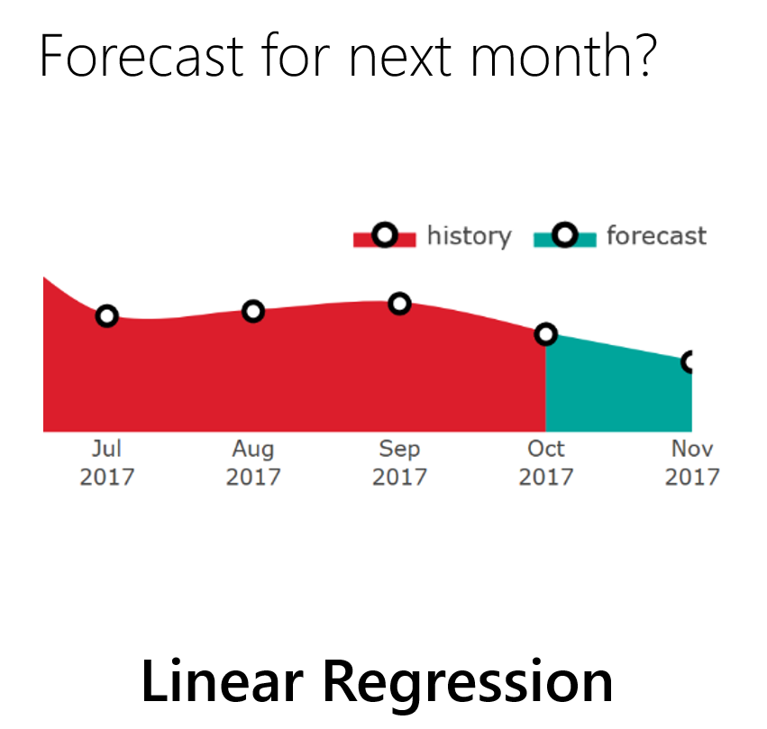

# Announcing ML.NET 0.5

It’s been a few months already since we [released ML.NET 0.1 at //Build 2018](https://blogs.msdn.microsoft.com/dotnet/2018/05/07/introducing-ml-net-cross-platform-proven-and-open-source-machine-learning-framework/), a cross-platform, open source machine learning framework for .NET developers. While we’re evolving through new preview releases, we are getting great feedback and would like to thank the community for your engagement as we continue to develop ML.NET together in the open. 

Today we are happy to announce the latest version: **ML.NET 0.5**. In this release we are adding **[TensorFlow](https://www.tensorflow.org/) model scoring** as a **transform** to ML.NET. This enables using an existing TensorFlow model within an ML.NET experiment. In this release we are also addressing a variety of issues and feedback we received from the community. We welcome feedback and contributions to the conversation: relevant issues can be found [here](https://github.com/dotnet/machinelearning/projects/4).

As part of the upcoming road in ML.NET, we really want your feedback on making ML.NET easier to use. We are working on a new API which improves flexibility and ease of use. When the new API is ready and good enough, we plan to deprecate the current “pipeline” API. Because this will be a significant change we want to share our proposals for the multiple API options and comparisons at the end of this blog post and start an open discussion with you where you can provide your feedback and help shape the long-term API for ML.NET.

This blog post provides details about the following topics:

* Added a TensorFlow model scoring transform (TensorFlowTransform)

* New API proposal exploration for you to provide feedback


## Added a TensorFlow model scoring transform (TensorFlowTransform)

[TensorFlow](https://www.tensorflow.org/) is a popular machine learning
      toolkit that enables training deep neural networks (and general numeric
      computations).

The `TensorFlowTransform` enables taking an existing TensorFlow model, either
      trained by you or downloaded from somewhere else, and get the scores
      from the model in ML.NET.

The implementation of this transform is based on code from [TensorFlowSharp](https://github.com/migueldeicaza/TensorFlowSharp).


In the following code snippet you can see how you can use the TensorFlow transform in the ML.NET pipeline:

```cs

// ... Additional transformations in the pipeline code

pipeline.Add(new TensorFlowScorer()
{
    ModelFile = "model/tensorflow_inception_graph.pb",   // Example using the Inception v3 TensorFlow model
    InputColumns = new[] { "input" },                    // Name of input in the TensorFlow model
    OutputColumn = "softmax2_pre_activation"             // Name of output in the TensorFlow model
});

// ... Additional code specifying a learner and training process for the ML.NET model

```

This example uses the pre-trained TensorFlow model named Inception v3, available [here](https://storage.googleapis.com/download.tensorflow.org/models/inception5h.zip). 

In next releases, we will add functionality in ML.NET to enable identifying the expected inputs and outputs of TensorFlow models. For now, you can use the TensorFlow APIs or a tool like [Netron](https://github.com/lutzroeder/Netron) to explore the TensorFlow model.

If you open the model with [Netron](https://github.com/lutzroeder/Netron) and explore the model's graph, you can see how it correlates the `InputColumn` with the node's `input` at the begining of the graph:


And how the `OutputColumn` correlates with `softmax2_pre_activation` node's output almost at the end of the graph.


For now, these scores (numeric vectors) can be used within a `LearningPipeline` as inputs to a learner like a classifier learner. However, with the upcoming ML.NET APIs, the scores from the TensorFlow model will be directly accessible, so you could simply score with the TensorFlow model without need to add any additional learner.

Additional deeper example code usage of the transform with the existing `LearningPipeline` API can be found [here](https://github.com/dotnet/machinelearning/blob/6ac380a4d3f44ee7b015461f74c4298b0ed5184b/test/Microsoft.ML.Tests/Scenarios/TensorflowTests.cs)


## New API proposal exploration for you to provide feedback

TBD


## Help shape ML.NET for your needs

If you haven’t already, try out ML.NET you can [get started here](https://www.microsoft.com/net/learn/apps/machine-learning-and-ai/ml-dotnet/get-started/windows).  We look forward to your feedback and welcome you to file issues with any suggestions or enhancements in the GitHub repo.

https://github.com/dotnet/machinelearning

This blog was authored by Cesar de la Torre, Gal Oshri, John Alexander and Ankit Asthana

Thanks,
ML.NET Team

---------------------------------------------------------

---------------------------------------------------------

---------------------------------------------------------

---------------------------------------------------------

---------------------------------------------------------

---------------------------------------------------------

---------------------------------------------------------

---------------------------------------------------------

---------------------------------------------------------

---------------------------------------------------------

---------------------------------------------------------

---------------------------------------------------------

---------------------------------------------------------

---------------------------------------------------------

---------------------------------------------------------

---------------------------------------------------------

---------------------------------------------------------

---------------------------------------------------------

---------------------------------------------------------

---------------------------------------------------------

---------------------------------------------------------

---------------------------------------------------------

---------------------------------------------------------

---------------------------------------------------------

---------------------------------------------------------


werty qwerty qwerty





```cs
using System;
using System.Globalization;

public class Example
{
    public static void Main()
    {

    }
}
```


## A call to action

xxxxxx:

- aaaaaa

- bbbbbb

- cccccc.

## See also

[xxxxxxx](https://bxxxxxxxxx/)  
[ssssssss](https://dddddddddd/)  
