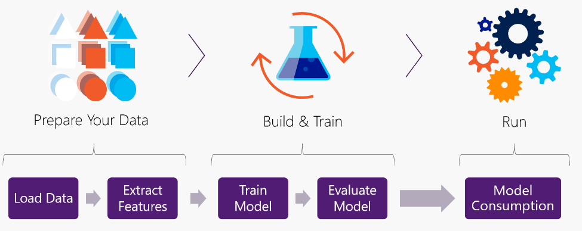
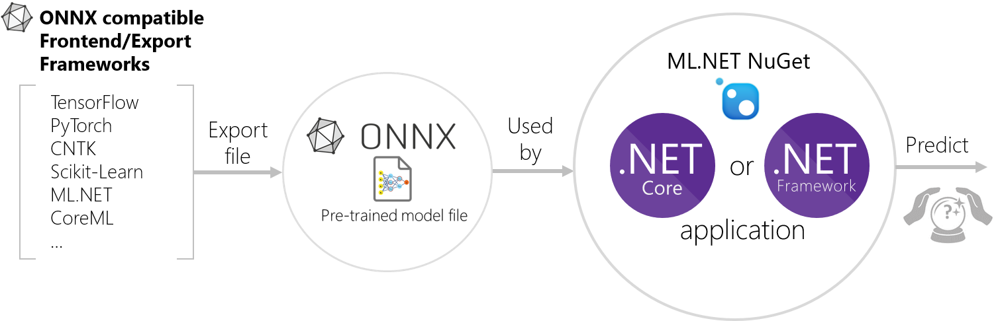

# Announcing ML.NET 0.6 (Machine Learning .NET)

Today we’re announcing our latest monthly release: **ML.NET 0.6**! ML.NET is a cross-platform, open source machine learning framework for .NET developers. We want to enable every .NET developer to train and use machine learning models in their applications and services.  If you haven’t tried ML.NET yet, here’s how you can [get started](https://dot.net/ml)!

The ML.NET 0.6 release delivers several new exciting enhancements:

* **New API for building and using machine learning models**
 
  Our main focus was releasing the first iteration of **new ML.NET APIs** for building and consuming models. These new, more flexible, APIs enable new tasks and code workflow that weren't possible with the previous `LearningPipeline` API. We are starting to deprecate the current `LearningPipeline` API. 
  
  This is a significant change intended to make machine learning easier and more powerful for you. We would love your feedback via an [open discussion on GitHub](https://github.com/dotnet/machinelearning/issues) to help shape the long term ML.NET API to maximize your productivity, flexibility and ease of use.

  Learn more about the [new ML.NET API](http://TBD-Set-Local-URL)

* **Ability to score pre-trained ONNX Models**
  
  Many scenarios like Image Classification, Speech to Text, and translation benefit from using predictions from deep learning models. In ML.NET 0.5 we added support for using TensorFlow models. Now in ML.NET 0.6 we've added support for getting predictions from [ONNX](https://onnx.ai/) models.  
  
  Learn more about [using ONNX models in ML.NET](http://TBD-Set-Local-URL)

 * **Significant performance improvements for model prediction, .NET type system consistency, and more**  
 
   We know that application performance is critical. In this release, we've increased getting model predictions performance 100x or more. 
   
   Additional enhancements include:
  
     * improvements to ML.NET TensorFlow scoring 
     * more consistency with the .NET type-system 
     * having a model deployment suitable for serverless workloads like Azure Functions

   Learn more about [performance improvements](http://TBD-Set-Local-URL), [enhanced TensorFlow support](http://TBD-Set-Local-URL) and [type-system improvements](http://TBD-Set-Local-URL).

Finally, we're looking forward to engaging with the open-source community in developing and growing support for machine learning in .NET further. We have already taken steps to integrate with [Infer.NET](https://www.microsoft.com/en-us/research/blog/the-microsoft-infer-net-machine-learning-framework-goes-open-source/), a project from Microsoft research which has just recently been released as open source project under the .NET Foundation. [Infer.NET](https://github.com/dotnet/infer) will extend ML.NET for statistical modelling and online learning and is available in the `Microsoft.ML.Probabilistic` namespace.  

The next sections explain in deeper details the announcements listed above.

## New API for building and consuming a Machine Learning model

While the existing LearningPipeline API released with ML.NET 0.1 was easy to get started with, there were [some limitations explained in our previous ML.NET blog post](https://blogs.msdn.microsoft.com/dotnet/2018/09/12/announcing-ml-net-0-5/#explore-the-upcoming-new-mlnet-api-and-provide-feedback). Moving forward the LearningPipeline API has been moved into the Microsoft.ML.Legacy namespace (e.g. [Sentiment Analysis based on Binary Classification with the LearningPipeline API](https://github.com/dotnet/machinelearning-samples/blob/master/samples/csharp/getting-started/BinaryClassification_SentimentAnalysis/Program.cs)).

The new API is designed to support a wider set of scenarios and closely follows ML principles and naming from other popular ML related frameworks like Apache Spark and Scikit-Learn. 

Let’s walkthrough an example to build a sentiment analysis model with the new APIs and introduce the new concepts along the way.

Building an ML Model involves the following high-level steps:



To go through these steps with ML.NET there are essentially five main concepts with the new API, let’s take a look with them through this example:

### Step 1: Load data 

#### Get started
When building a model with ML.NET you start by creating an ML Context or environment. This is comparable to using DbContext in Entity Framework, but of course, in a completely different domain. The environment provides a context for your ML job that can be used for exception tracking and logging. 

```cs
var env = new LocalEnvironment();
```

We are working on bringing this concept/naming closer to EF and other .NET frameworks.

#### Load your data
One of the most important things is, as always, your data! Load a Dataset into the ML pipeline to be used to train your model.

In ML.NET, data is similar to a SQL view. It is lazily evaluated, schematized, heterogenous. In this example, the sample dataset looks like this:

| Toxic  (Label) | Comment  (Text)                                      |
|----------------|------------------------------------------------------|
| 1              | ==RUDE== Dude, you are rude …                        |
| 1              | == OK! == IM GOING TO VANDALIZE …                    |
| 0              | I also found use of the word "humanists” confusing … |
| 0              | Oooooh thank you Mr. DietLime …                      |

To read in this data you will use a data reader which is an ML.NET component. The reader takes in the environment and requires you to define the schema of your data. In this case the first column (Toxic or Label) is of type Boolean (meaning also the prediction) and the second column (Comment or Text) is the feature of type text/string that we are going to use to predict the sentiment on.

```cs
var reader = new TextLoader(env,
                            new TextLoader.Arguments()
                            {
                                Separator = "tab",
                                HasHeader = true,
                                Column = new[]
                                {
                                    new TextLoader.Column("Label", DataKind.Bool, 0),
                                    new TextLoader.Column("Text", DataKind.Text, 1)
                                }
                            });

//Load training data
var trainingDataView = reader.Read(new MultiFileSource(TrainDataPath));
```

Your data schema consists of two columns:

 * A boolean column (Label) which is the sentiment (Toxic/Negative or NonToxic/Positive) and positioned as the first column. 
 * A text column (Text) which is a comment showing certain sentiment and is the feature we use to predict.

Note that this case, loading your training data from a file, is the easiest way to get started, but ML.NET also allows you to load data from databases or in-memory collections.

### Step 2: Extract features (transform your data)

Machine learning algorithms understand *featurized* data, so the next step is for us to transform our textual data into a format that our ML algorithms recognize. In order to do so we create an estimator of type `TextTransform` which featurizes the text converting it to numeric vectors, as shown in the following snippet:

```cs
var pipeline = new TextTransform(env, "Text", "Features");
```
An [Estimator](https://github.com/dotnet/machinelearning/blob/3cdd3c8b32705e91dcf46c429ee34196163af6da/docs/code/MlNetHighLevelConcepts.md#list-of-high-level-concepts) is an object that learns from data. A [transformer](https://github.com/dotnet/machinelearning/blob/3cdd3c8b32705e91dcf46c429ee34196163af6da/docs/code/MlNetHighLevelConcepts.md#list-of-high-level-concepts) is the result of this learning. A good example is training the model with `estimator.Fit()`, which learns on the training data and produces a machine learning model.

### Step 3: Train your model

#### Add a selected ML Learner (Algorithm) 

Now that our text has been *featurized*, the next step is to add a learner. In this case we will use the [LinearClassificationTrainer learner](https://docs.microsoft.com/en-us/dotnet/api/microsoft.ml.runtime.learners.linearclassificationtrainer?view=ml-dotnet).
For this step, you just need to append the learner to the estimators chain or flexible pipeline, while specifying what column is the feature and what column is the label or goal to predict, like in the following code:

```cs
var pipeline = new TextTransform(env, "Text", "Features")     
                    .Append(new LinearClassificationTrainer(env, "Features", "Label"));
```

The learner/trainer takes in the *featurized* `Text` (`Features`) and the `Label` as input parameters for learing from the historic data.

#### Train your model

Once the estimator has been defined, you train your model using the Fit() API while providing the already loaded training data. This returns a model which you can use for predictions.

```cs
var model = pipeline.Fit(trainingDataView);
```

### Step 4: Evaluate your trained model

Now that you've created and trained the model, evaluate it with a different dataset for quality assurance and validation with code similar to the following:

```cs
// Evaluate the model
//Load evaluation/test data
var testDataView = reader.Read(new MultiFileSource(TestDataPath));
var predictions = model.Transform(testDataView);
var binClassificationCtx = new BinaryClassificationContext(env);
var metrics = binClassificationCtx.Evaluate(predictions, "Label", 
                                                         "Score",
                                                         "Probability",
                                                         "PredictedLabel");

Console.WriteLine($"Model's Accuracy: {metrics.Accuracy:P2}");
```
 The code snippet implements the following:

* Loads the test dataset.
* Creates an additional context, since we are performing a binary classification ML task.
* Evaluates the model and create metrics.
* Shows the accuracy of the model from the metrics.

And now you have a trained and validated model for use in your applications and services.

### Step 5: Model Consumption	

 At this point you can predict with test/sample data by consuming the model you just created and trained.	

 The following code is a sample you would write in your "production" application when predicting something by scoring with the model:	

 ```cs	
// Create the prediction function 
var predictionFunct = model.MakePredictionFunction<SentimentIssue, SentimentPrediction>(env);

var resultprediction = predictionFunct.Predict(new SentimentIssue	
                                               {	
                                                  text = "This is a very rude movie"	
                                               });

Console.WriteLine($"Text: {sampleStatement.text} | Prediction: {(resultprediction.PredictionLabel ? "Negative" : "Positive")} sentiment");
```	

In that sample, you can guess that the prediction won't be positive because of the provided text.. ;)

You can find all the code of this sentiment analisys example [here](https://github.com/dotnet/machinelearning-samples/blob/features/samples-new-api/samples/csharp/getting-started/BinaryClassification_SentimentAnalysis/Program.cs).


## Ability to score pre-trained ONNX Models

[ONNX](http://onnx.ai/) is an open and iteroperable model format that enables using models trained in one framework (ie scikit-learn, TensorFlow, xgboost, etc) and use them in another (like ML.NET).

In ML.NET v0.3, we added the capability of [exporting ML.NET models to the ONNX-ML format](https://blogs.msdn.microsoft.com/dotnet/2018/07/09/announcing-ml-net-0-3/#onnx-section) so additional execution environments could run the model (such as *Windows ML*).

In this new v0.6 release, ML.NET can also use ONNX models to score/predict trained ONNX models which use the ONNX standard v1.2. We've enabled this using a new *transformer* and runtime for scoring ONNX models, as ilustrated below.



There are a large [variety of ONNX models](https://github.com/onnx/models) created and trained in [multiple frameworks](https://github.com/onnx/tutorials#onnx-tutorials) that can export models to ONNX format. Those models can be used for tasks like image classification, emotion recognition, and object detection.

The ONNX *transformer* in ML.NET enables providing some data to an existing ONNX model (such as the models above) and getting the score (prediction) from it.

The ONNX runtime in ML.NET currently supports only Windows on x64 CPU. Support for other platforms (Linux and macOS) are in the roadmap.

The way you use an ONNX model in your estimator is by simply adding it with this line of code similar to the following:

```cs
.Append(row => (row.name, softmaxout_1: row.data_0.ApplyOnnxModel(modelFile)));
```

Further example usage can be found [here](https://github.com/dotnet/machinelearning/blob/master/test/Microsoft.ML.OnnxTransformTest/OnnxTransformTests.cs#L186).

## Improvements to TensorFlow model scoring functionality

In this release, we've made it easier to use TensorFlow models in ML.NET. Using the [TensorFlow scoring transform](https://docs.microsoft.com/en-us/dotnet/api/microsoft.ml.transforms.tensorflowtransform?view=ml-dotnet) requires knowing which node of the model you want to retrieve results from, so we've added an API to discover the nodes in the TensorFlow model to help identify the input and output of a TensorFlow model. Example usage can be found [here](https://github.com/dotnet/machinelearning/blob/3cdd3c8b32705e91dcf46c429ee34196163af6da/src/Microsoft.ML.DnnAnalyzer/Microsoft.ML.DnnAnalyzer/DnnAnalyzer.cs).  

Additionally, previously in ML.NET 0.5 we only enabled using 'frozen' TensorFlow models. Now in ML.NET 0.6, TensorFlow models in the [saved model format](https://www.tensorflow.org/guide/saved_model#save_and_restore_models) can also be used.

## Performance improvements
In the ML.NET 0.6 release, we made several performance improvements in making single predictions from a trained model. The first improvement comes from moving from the legacy LearningPipeline API to the new Estimators API. The second improvement comes from optimizing the performance of PredictionFunction in the new API.

To learn about the details of the benchmark results, please see the [GitHub issue](https://github.com/dotnet/machinelearning/issues/1013#issuecomment-426117666) which covers this in detail.

- Predictions on Iris data: **3,272x speedup** (29x speedup with the `Estimators` API, with a further 112x speedup with improvements to `PredictionFunction`).
- Predictions on Sentiment data: **198x speedup** (22.8x speedup with the `Estimators` API, with a further 8.68x speedup with improvements to `PredictionFunction`). This model contains a text featurizer, so it is not surprising that we see a smaller gain.
- Predictions on Breast Cancer data: **6,541x speedup** (59.7x speedup with the `Estimators` API, with a further 109x speedup with improvements to `PredictionFunction`).

## Type system improvements

To make ML.NET easier to use and to take advantage of innovation in .NET, in ML.NET 0.6 we have replaced the Dv type system with .NET's standard type system. 
* ML.NET previously had its own type system which helped it more efficiently deal with things like missing values (a common case in ML). This type system required users to work with types like DvText, DvBool, DvInt4, etc. 
* One effect of this change is that only floats and doubles have missing values, represented by NaN. More information can be found [here](https://github.com/dotnet/machinelearning/issues/673).

Additionally, you can now also deploy ML.NET in additional scenarios using .NET app models such as *Azure Functions* easily without convoluted workarounds, thanks to the improved approach to dependency injection.

## Infer.NET is now open-source and becoming part of the ML.NET family

On October 5th 2018, [Microsoft Research announced](https://www.microsoft.com/en-us/research/blog/the-microsoft-infer-net-machine-learning-framework-goes-open-source/) the open-sourcing of [Infer.NET](https://dotnet.github.io/infer/) – a cross-platform framework for model-based machine learning.

Infer.NET differs from traditional machine learning frameworks in that it requires users to specify a statistical model of their problem. This allows for high interpretability, incorporating domain knowledge, doing unsupervised/semi-supervised learning, as well as online inference – the ability to learn as new data arrives. The approach and many of its applications are described in our [free online book](http://mbmlbook.com/) for beginners.

Places where Infer.NET is used at Microsoft include *TrueSkill* – a skill rating system for matchmaking in *Halo* and *Gears of War*, *Matchbox* – a recommender system in *Azure Machine Learning*, and *Alexandria* – automatic knowledge base construction for *Satori*, to name a few.

We’re working with the Infer.NET team to make it part of the ML.NET family. Steps already taken in this direction include releasing under the .NET Foundation and changing the package name and namespaces to Microsoft.ML.Probabilistic.

## Additional resources

* The most important **ML.NET concepts** for understanding the new API are introduced [here](https://github.com/dotnet/machinelearning/blob/3cdd3c8b32705e91dcf46c429ee34196163af6da/docs/code/MlNetHighLevelConcepts.md).

* A **cookbook** that shows how to use these APIs for a variety of existing and new scenarios can be found [here](https://github.com/dotnet/machinelearning/blob/3cdd3c8b32705e91dcf46c429ee34196163af6da/docs/code/MlNetCookBook.md).


## Provide your feedback on the new API


As mentioned at the beginning of the blog post, the new API is a significant change, so we also want to create an open discussion where you can provide feedback and help shape the long-term API for ML.NET.

Want to get involved? Start by providing feedback at this blog post comments below or through issues at the [ML.NET GitHub repo](https://github.com/dotnet/machinelearning/issues)

## Get started!

If you haven’t already, get started with [ML.NET here](https://www.microsoft.com/net/learn/apps/machine-learning-and-ai/ml-dotnet/get-started/windows)!
 
Next, explore some other great resources:

  * Tutorials and resources at the [Microsoft Docs ML.NET Guide](https://docs.microsoft.com/en-us/dotnet/machine-learning/)
  * Code samples at the [machinelearning-samples GitHub repo](https://github.com/dotnet/machinelearning-samples)

We look forward to your feedback and welcome you to file issues with any suggestions or enhancements in the [ML.NET GitHub repo](https://github.com/dotnet/machinelearning).


*This blog was authored by Cesar de la Torre, Ankit Asthana, Chris Lauren plus additional reviewers in the ML.NET team*

Thanks,

The ML.NET Team


