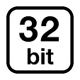

# Announcing ML.NET 0.7 - Machine Learning for .NET

<table border="0">
  <tr>
    <td width=10%>
       
    </td> 
    <td>
       We're excited to announce today the release of ML.NET 0.7 - the latest release of the cross-platform and open source machine learning framework for .NET developers. This release focuses on enabling better recommendations use cases, enabling anomaly detection, enhancing the customizability of the machine learning pipelines, enabling using ML.NET in x86 apps, and more.
    </td> 
  </tr>
</table>

This blog post provides details about the following topics in the ML.NET 0.7 release:

* [Enhanced recommendations use cases with Matrix Factorization](http://TBD-Set-Local-URL)
* [Enabled anomaly detection scenarios - detecting unusual events](http://TBD-Set-Local-URL)
* [Improved customizability of ML pipelines](http://TBD-Set-Local-URL)
* [x86 support](http://TBD-Set-Local-URL)
* [Visual Studio extension for ML.NET](http://TBD-Set-Local-URL)
* [NimbusML - experimental Python bindings for ML.NET](http://TBD-Set-Local-URL)


## Enhanced recommendations use cases with Matrix Factorization

<table border="0">
  <tr>
    <td width=18%>
       
    </td> 
    <td>
       Matrix factorization (MF) is a common approach to recommendations when you have data on how users rated items in your catalog. For example, you might know how users rated some movies and want to recommend which other movies they are likely to watch next. ML.NET now includes matrix factorization (using <a href="https://github.com/cjlin1/libmf">LIBMF</a>).
    </td> 
  </tr>
</table>

Note that [ML.NET 0.3](https://blogs.msdn.microsoft.com/dotnet/2018/07/09/announcing-ml-net-0-3/#ffm-section) included Field-Aware Factorization Machines (FFM) as a learner for binary classification. FFM is a generalization of MF, but there are a few differences:

* FFM enables taking advantage of other information beyond the rating  a user assigns to an item (e.g. movie genre, movie release date,  user profile). 
* FFM is currently limited to binary classification (the ratings needs to be converted to 0 or 1), whereas MF solves a regression problem  (the ratings can be continuous numbers).
* If the only information available is the user-item ratings, MF is likely to be significantly faster than FFM.
* A more in-depth discussion can be found [here](https://www.csie.ntu.edu.tw/~cjlin/talks/recsys.pdf).

Example usage of MF can be found [here](https://github.com/dotnet/machinelearning/blob/d68388a1c9994a5b429b194b64b2b0782834cb78/docs/samples/Microsoft.ML.Samples/Dynamic/MatrixFactorization.cs). The example is general but you can imagine that the matrix rows correspond to users, matrix columns correspond to movies, and matrix values correspond to ratings. This matrix would be quite sparse as users have only rated a small subset of the catalog.

## Enabled anomaly detection scenarios - detecting unusual events

<table border="0">
  <tr>
    <td width=18%>
       
    </td> 
    <td>
       <a href="https://en.wikipedia.org/wiki/Anomaly_detection">Anomaly detection</a> enables identifying unusual values or events. It is used in scenarios such as fraud detection (identifying suspicious credit card transactions) and server monitoring (identifying unusual activity).

ML.NET 0.7 includes several anomaly detection techniques: SSAChangePointDetector, SSASpikeDetector, IidChangePointDetector, and IidSpikeDetector. 
    </td> 
  </tr>
</table>

Sample code using anomaly detection with ML.NET can be found [here](https://github.com/dotnet/machinelearning/blob/7fb76b026d0035d6da4d0b46bd3f2a6e3c0ce3f1/test/Microsoft.ML.TimeSeries.Tests/TimeSeriesDirectApi.cs).

## Improved customizability of ML.NET pipelines

<table border="0">
  <tr>
    <td width=18%>
       
    </td> 
    <td>
       ML.NET pipelines are very flexible and have a wide variety of data transformations for pre-processing and featurizing data (e.g. processing text, images, categorical features, etc.).
    </td> 
  </tr>
</table>


However, there might be application-specific transformations that would be useful to do within an ML.NET pipeline (as opposed to as a pre-processing step). For example, calculating [cosine similarity](https://en.wikipedia.org/wiki/Cosine_similarity) between two text columns (after featurization) or something as simple as creating a new column that adds the values in two other columns.

This is where the `CustomMappingEstimator` comes in. It allows you to write your own methods to process data and bring them into the ML.NET pipeline. Here is what it would look like in your pipeline:

```csharp
var estimator = mlContext.Transforms.CustomMapping<MyInput, MyOutput>(MyLambda.MyAction, "MyLambda")
    .Append(...)
    .Append(...)
```     

Below is the definition of what this custom mapping will do. In this example, we convert the text label ("spam" or "ham") to a boolean label (true or false). 

```csharp
public class MyInput
{
    public string Label { get; set; }
}

public class MyOutput
{
    public bool Label { get; set; }
}

public class MyLambda
{
    [Export("MyLambda")]
    public ITransformer MyTransformer => ML.Transforms.CustomMappingTransformer<MyInput, MyOutput>(MyAction, "MyLambda");

    [Import]
    public MLContext ML { get; set; }

    public static void MyAction(MyInput input, MyOutput output)
    {
        output.Label= input.Label == "spam" ? true : false;
    }
}
```

A more complete example of the `CustomMappingEstimator` can be found [here](https://github.com/dotnet/machinelearning/blob/d68388a1c9994a5b429b194b64b2b0782834cb78/test/Microsoft.ML.Tests/Transformers/CustomMappingTests.cs#L55). 


## x86 support in addition to x64

<table rules=none style='border-right:none;border-left:none;border-bottom:none;border-top:none'>
  <trborder="0">
    <td width=15% style='border-right:none;border-left:none;border-bottom:none;border-top:none'>
       
    </td> 
    <td style='border-right:none;border-left:none;border-bottom:none;border-top:none'>
       Until now, ML.NET only supported x64. Since this 0.7 release you can now also use ML.NET in x86 apps which provides a much broader array of supported devices when moving to some Edge devices. 
       Some components that are based on external dependencies (e.g. TensorFlow) will not be available in x86, though. 
    </td> 
  </tr>
</table>

## New Visual Studio ML.NET project templates preview – Easily to get started with ML

<table border="0">
  <tr>
    <td width=15%>
       
    </td> 
    <td>
       Today, we are pleased to announce a preview of Visual Studio project templates for ML.NET. These templates make it very easy to get started with machine learning. You can download these templates from Visual Studio gallery <a href="https://en.wikipedia.org/wiki/Anomaly_detection">here [LINK TBD]</a>. 
    </td> 
  </tr>
</table>

The templates cover the following scenarios:
-	**ML.NET Console Application** – Sample app that demonstrates how you can use a machine learning model in your application.
-	**ML.NET Model Library** – Creates a new machine learning model library which you can consume from within your application.


## [NimbusML](https://github.com/microsoft/nimbusml) - experimental Python bindings for ML.NET

<table border="0">
  <tr>
    <td width=10%>
       
    </td> 
    <td> 
    Some teams at Microsoft found it useful to use ML.NET capabilities in Python environments. <a href="https://github.com/microsoft/nimbusml">NimbusML</a> provides Python APIs to ML.NET and easily integrates into <a href="http://scikit-learn.org/stable/">scikit-learn</a> pipelines. Models trained in NimbusML can later be deployed into a .NET app using ML.NET. 
    Note that NimbusML is an experimental project without the same level of support as ML.NET.
    </td> 
  </tr>
</table>


## In case you missed it: provide your feedback on the new API

[ML.NET 0.6](https://blogs.msdn.microsoft.com/dotnet/2018/10/08/announcing-ml-net-0-6-machine-learning-net/) introduced a new set of APIs for ML.NET that provide enhanced flexibility. These APIs are still evolving and we would love to get your feedback so you can help shape the long-term API for ML.NET.

Want to get involved? Start by providing feedback through issues at the [ML.NET GitHub repo](https://github.com/dotnet/machinelearning/issues)!

## Additional resources

* The most important **ML.NET concepts** for understanding the new API are introduced [here](https://github.com/dotnet/machinelearning/blob/f9202628fbfac9e599e8c63dc5ed26eae77afbee/docs/code/MlNetHighLevelConcepts.md).

* A **cookbook** that shows how to use these APIs for a variety of existing and new scenarios can be found [here](https://github.com/dotnet/machinelearning/blob/f9202628fbfac9e599e8c63dc5ed26eae77afbee/docs/code/MlNetCookBook.md).


## Get started!

<table border="0">
  <tr>
    <td width=10%>
       
    </td> 
    <td> 
    If you haven’t already, get started with <a href="https://www.microsoft.com/net/learn/apps/machine-learning-and-ai/ml-dotnet/get-started">ML.NET here</a>
 
Next, explore some other great resources:

  * Tutorials and resources at the [Microsoft Docs ML.NET Guide](https://docs.microsoft.com/en-us/dotnet/machine-learning/)
  * Code samples at the [machinelearning-samples GitHub repo](https://github.com/dotnet/machinelearning-samples)
    </td> 
    
  </tr>
</table>

We look forward to your feedback and welcome you to file issues with any suggestions or enhancements in the [ML.NET GitHub repo](https://github.com/dotnet/machinelearning).

*This blog was authored by Gal Oshri and Cesar de la Torre*

Thanks,

The ML.NET Team

