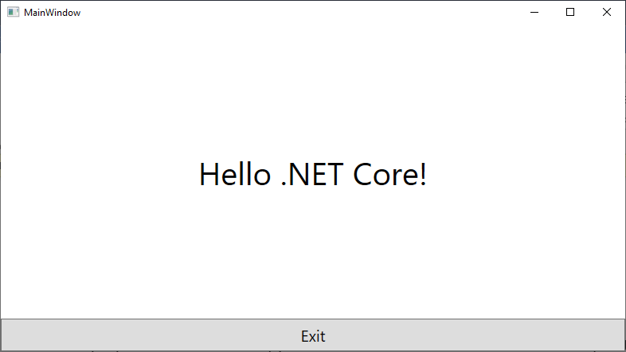
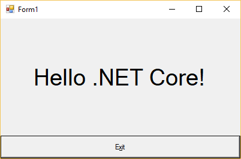
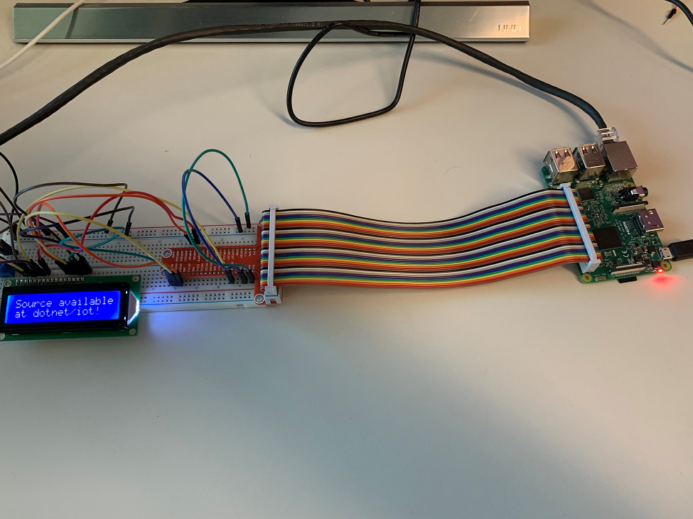
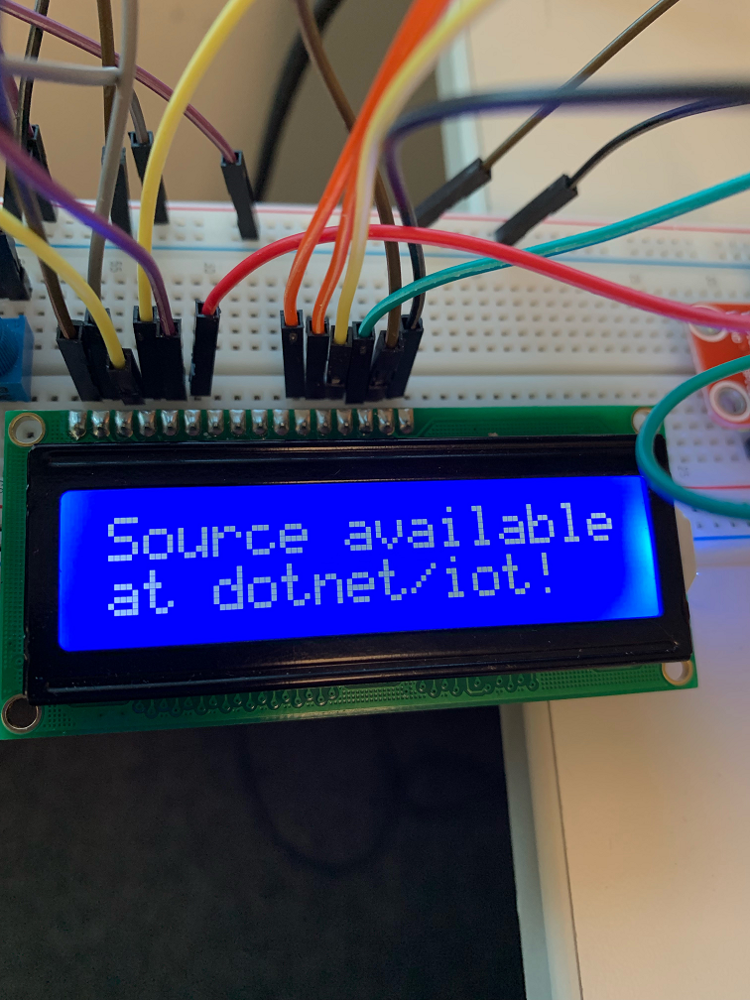

# Announcing .NET Core 3 Preview 1 and Open Sourcing Windows Desktop Frameworks

Today, we are announcing .NET Core 3 Preview 1. It is the first public release of .NET Core 3. We have some exciting new features to share and would love your feedback. You can develop .NET Core 3 applications with Visual Studio 2019 Preview 1, Visual Studio for Mac and Visual Studio Code.

[Download and get started with .NET Core 3 Preview 1](https://aka.ms/netcore3download) right now on Windows, Mac and Linux.

You can see complete details of the release in the [.NET Core 3 Preview 1 release notes](https://aka.ms/netcore3releasenotes).

Visual Studio 2019 will be the release to support building .NET Core 3 applications and the [preview was also released today](https://aka.ms/vs-blog) so we also encourage you to check that out.

.NET Core 3 is a major update which adds support for building Windows desktop applications using Windows Presentation Foundation (WPF), Windows Forms, and Entity Framework 6 (EF6). ASP.NET Core 3 enables client-side development with Razor Components. EF Core 3 will have support for Azure Cosmos DB. It will also include support for C# 8 and .NET Standard 2.1 and much more!

## .NET Framework 4.8

Before diving into .NET Core 3 let’s take a quick look at .NET Framework. Next year we will ship .NET Framework 4.8. With monitors supporting 4K and 8K resolutions we are adding better support for high DPI to WPF and Windows Forms. Many .NET applications use browser and media controls, which are based on older versions of Internet Explorer and Windows Media player. We are adding new controls that use the latest browser and media players in Windows 10 and support the latest standards. And WPF and Windows Forms applications will have access to Windows UI XAML Library (WinUI) via XAML Islands for modern look and touch support. Visual Studio 2019 is based on .NET Framework and uses many of these features. For more information on .NET Framework 4.8 see our post: [Update on .NET Core 3.0 and .NET Framework 4.8](https://blogs.msdn.microsoft.com/dotnet/2018/10/04/update-on-net-core-3-0-and-net-framework-4-8/).

## Windows Desktop Comes to .NET Core

The first two versions of .NET Core focused primarily on supporting web applications, web APIs, IoT and console applications. .NET Core 3 adds support for building Windows desktop applications using WPF and Windows Forms frameworks and modern controls and Fluent styling from the Windows UI XAML Library (WinUI) via XAML Islands.

Many desktop applications today use Entity Framework for data access and so we are supporting Entity Framework 6 on .NET Core 3 as well. These frameworks enable developers building Windows desktop applications to take advantage of the new features in .NET Core such as side by side deployment, self-contained applications (shipping .NET Core inside the application), the latest improvements in CoreFX, and more.

## WPF, Windows Forms, and WinUI Open Sourced

On November 12, 2014 we announced the open sourcing of .NET Core. It has been a tremendous success. The .NET platform has received over 60,000 community accepted pull requests from more than 3700 companies outside of Microsoft.

Today, we are excited to announce that are open sourcing [WPF](https://github.com/dotnet/wpf), [Windows Forms](https://github.com/dotnet/winforms), and [WinUI](https://github.com/Microsoft/microsoft-ui-xaml), so the three major Windows UX technologies will be open sourced. For the first time ever, the community will be able to see the development of WPF, Windows Forms, and WinUI happen in the open and we will take contributions for these frameworks on .NET Core. The first wave of code will be available in GitHub today and more will appear over the next few months.

WPF and Windows Forms projects are under the stewardship of the [.NET Foundation which also announced changes today](https://aka.ms/dnfmemberupdate) so that the community will directly guide foundation operations. It is also expanding the current sponsors – Red Hat, JetBrains, Google, Unity, Microsoft and Samsung, by also welcoming Pivotal, Progress Telerik and Insight. This new structure will help the .NET Foundation scale to meet the needs of the growing .NET open source ecosystem.

Truly an exciting time to be a .NET developer!

## WPF and Windows Forms

WPF and Windows Forms can now be used with .NET Core. They ship in a new component called “Windows Desktop” that is part of the Windows version of the SDK.

We’ve been working with community developers who have been making their Windows Desktop applications run on early builds of .NET Core 3. They’ve given us great feedback, that the WPF and Windows Forms APIs are compatible and that they’ve been successful!

* [Getting Started with .NET Core 3 – Create a WPF Application](http://brianlagunas.com/getting-started-net-core-3-create-wpf-application/)
* [Greenshot goes dotnet core!](https://getgreenshot.org/2018/12/04/dotnet-core/) -- [tweet](https://twitter.com/lakritzator/status/1062303845227917313)
* [Hello .NET Core with MahApps.Metro](https://twitter.com/punker76/status/1063883852286967809)
* [NETworkManager .NET Core port](https://www.youtube.com/watch?v=zbsf7e9xm3Y&feature=youtu.be)

You can create new .NET Core projects for WPF and Windows Forms from the command line.

```console
dotnet new wpf
dotnet new winforms
```

Once a project has been created, you can dotnet run them. The following image illustrates what a new WPF app looks like.



Windows Forms is very similar, displayed in the following image.



You can also open, launch and debug WPF and Windows Forms projects in Visual Studio 2019 Preview 1. It is currently possible to open .NET Core 3.0 projects in Visual Studio 2017 15.9, however, it is not a supported scenario (and you need to [enable previews](https://blogs.msdn.microsoft.com/dotnet/2018/11/13/net-core-tooling-update-for-visual-studio-2017-version-15-9/)).

The new projects are the same as existing .NET Core projects, with a couple additions. Here is the comparison of the basic .NET Core console project and a basic Windows Forms and WPF project.

In a .NET Core console project, the file uses `Microsoft.NET.Sdk` SDK and declares a dependency on .NET Core 3.0 via the `netcoreapp3.0` target framework:

```xml
<Project Sdk="Microsoft.NET.Sdk">
  <PropertyGroup>
    <OutputType>Exe</OutputType>
    <TargetFramework>netcoreapp3.0</TargetFramework>
  </PropertyGroup>
</Project>
```

The WPF and Windows Forms projects look similar but use a different SDK and also use properties to declare which UI framework is being used:

For WPF:

```xml
<Project Sdk="Microsoft.NET.Sdk.WindowsDesktop">
  <PropertyGroup>
    <OutputType>Exe</OutputType>
    <TargetFramework>netcoreapp3.0</TargetFramework>
    <UseWPF>true</UseWPF>
  </PropertyGroup>
</Project>
```

For Windows Forms:

```xml
<ProjectSdk="Microsoft.NET.Sdk.WindowsDesktop">
  <PropertyGroup>
    <OutputType>Exe</OutputType>
    <TargetFramework>netcoreapp3.0</TargetFramework>
    <UseWindowsForms>true</UseWindowsForms>
  </PropertyGroup>
</Project>
```

The `UseWPF` and `UseWindowsForms` properties allow a project to specify whether it uses Windows Forms, or WPF.  This will allow tooling (such as Intellisense, or the toolbox or menus in Visual Studio) to provide an experience tailored to the UI framework(s) being used.  Both properties can be set to true if the app uses both frameworks, for example when a Windows Forms dialog is hosting a WPF control.

In the upcoming months, we’re focusing on completing the open sourcing of WPF and Windows Forms, enabling the Visual Studio designers to work with .NET Core, and adding support for APIs that are typically used in Windows Desktop apps. Please share your feedback on the [dotnet/winforms](https://github.com/dotnet/winforms/issues),  [dotnet/wpf](https://github.com/dotnet/wpf/issues) and [dotnet/core](https://github.com/dotnet/core/issues) repos.

## Applications now have executables by default

.NET Core applications are now built with executables. This is new for applications that use a globally installed version of .NET Core. Until now, only self-contained applications had executables. You can see executables produced in the following examples.

You can expect the same things with these executables as you would other native executables, such as:

* You can double click on the executable.
* You can launch the application from a command prompt without using the dotnet tool, using `myconsole.exe`, on Windows, and `./myconsole`, on Linux and macOS, as you can see in the following examples.

On Windows:

```console
C:\Users\rlander\myconsole>dotnet build
C:\Users\rlander\myconsole>cd bin\Debug\netcoreapp3.0
C:\Users\rlander\myconsole\bin\Debug\netcoreapp3.0>dir /b 
myconsole.deps.json
myconsole.dll
myconsole.exe
myconsole.pdb
myconsole.runtimeconfig.dev.json
myconsole.runtimeconfig.json
C:\Users\rlander\myconsole\bin\Debug\netcoreapp3.0>myconsole.exe
Hello World!
C:\Users\rlander\myconsole\bin\Debug\netcoreapp3.0>dotnet myconsole.dll
Hello World!
```

On Linux (and macOS will be similar):

```console
root@cc08212a1da6:/myconsole# dotnet build
root@cc08212a1da6:/myconsole# cd bin/Debug/netcoreapp3.0/
root@cc08212a1da6:/myconsole/bin/Debug/netcoreapp3.0# ls
myconsole            myconsole.dll  myconsole.runtimeconfig.dev.json
myconsole.deps.json  myconsole.pdb  myconsole.runtimeconfig.json
root@cc08212a1da6:/myconsole/bin/Debug/netcoreapp3.0# ./myconsole
Hello World!
root@cc08212a1da6:/myconsole/bin/Debug/netcoreapp3.0# dotnet myconsole.dll
Hello World!
```

An executable is provided that matches the environment of the SDK you are using. We have not yet enabled specifying `-r` arguments for other runtime environments.

## dotnet build now copies dependencies

dotnet build now copies NuGet dependencies for your application from the NuGet cache to your build output folder during the build operation. Until this release,those dependencies were only copied as part of dotnet publish. This change allows you to xcopy your build output to different machines.

There are some operations, like linking and razor page publishing that will still require publishing.

You can see the new experience in the following example:

```console
C:\Users\rlander\myconsole>dotnet add package Newtonsoft.json
C:\Users\rlander\myconsole>dotnet build
C:\Users\rlander\myconsole>dir /b bin\Debug\netcoreapp3.0\*.dll
myconsole.dll
Newtonsoft.Json.dll
```

## Local dotnet tools

.NET Core tools has been updated to include a local tools scenario. We added [global tools](https://blogs.msdn.microsoft.com/dotnet/2018/05/30/announcing-net-core-2-1/) in .NET Core 2.1. Global tools are available from any location on the machine for the current user. This is great, but this does not allow the version to be selected per location (usually per repository) and they do not offer an easy way to restore a development or build tool environment. A particular location on disk can now be associated with a set of local tools and their versions. Local tools rely on a tool manifest file named `dotnet-tools.json`. We suggest supplying the tool manifest file at the root of the repository.

Local tools have a different experience for adding global tools to a tool manifest file (usually a repository) and cloning a repository containing them. If you clone a repo that contains local tools, you simply need to run the following command:

```console
dotnet tool restore
```

After restoring, you call a local tool with:

```console
dotnet tool run <toolCommandName>
```

When a local tool is called, dotnet searches for a manifest up the directory structure. When a tool manifest file is found, it is searched for the requested tool. If the tool is found, it includes the information needed to find the tool in the NuGet global packages location. The correct version of the tool from the tool manifest file was placed in the cache on restore.

If the tool is found in the manifest, but not the cache, the user receives an error. The message will be improved after Preview 1 to request the user run `dotnet tool restore`.

To add local tools to a directory, you need to first create the tool manifest file.  After Preview 1 we will offer a mechanism for creating tool manifest files, probably via a dotnet new template. For Preview 1 you must create the file names dotnet-tools.json with the following contents:

```json
{
  "version": 1,
  "isRoot": true,
  "tools": {}
}
```

Once the manifest is created, you can add local tools to it using:

```console
dotnet tool install <toolPackageId>
```

This command installs the latest version of the tool, unless another version is specified. This version is written into the tool manifest file to allow the correct version of the tool to be called. The tool manifest file is designed to allow hand editing – which you might do to update the required version for working with the repository. An example `dotnet-tools.json` file follows:

```json
{
  "version": 1,
  "isRoot": true,
  "tools": {
    "dotnetsay": {
      "version": "2.1.4",
      "commands": [
        "dotnetsay"
      ]
    },
    "t-rex": {
      "version": "1.0.103",
      "commands": [
        "t-rex"
      ]
    }
  }
}
```

To remove a tool from the tool manifest file, run the following command:

```console
dotnet tool uninstall <toolPackageId>
```

If the tool manifest file is checked into your source control, programmers cloning your repo can gain access to the correct tools as explained above.

For both global and local tools, a compatible version of the runtime is required. Many tools currently on NuGet.org target .NET Core Runtime 2.1. If you only install the preview of .NET Core 3.0, you may also need to manually install the [.NET Core 2.1 Runtime](https://dotnet.microsoft.com/download/dotnet-core/2.1).

For more information, see [Local Tools Early Preview Documentation](https://github.com/dotnet/cli/issues/10288).

## Introducing a fast in-box JSON Reader

`System.Text.Json.Utf8JsonReader` is a high-performance, low allocation, forward-only reader for UTF-8 encoded JSON text, read from a `ReadOnlySpan<byte>`. The `Utf8JsonReader` is a foundational, low-level type, that can be leveraged to build custom parsers and deserializers. Reading through a JSON payload using the new `Utf8JsonReader` is 2x faster than using the reader from Json.NET. It does not allocate until you need to actualize JSON tokens as (UTF16)strings.

This new API will include the following components:

* In Preview 1: JSON reader (sequential access)
* Coming next: JSON writer, DOM (random access), poco serializer, poco deserializer

Here is the basic reader loop for the `Utf8JsonReader` that can be used as a starting point:

```csharp
public static void Utf8JsonReaderLoop(ReadOnlySpan<byte> dataUtf8)
{
    var json = new Utf8JsonReader(dataUtf8, isFinalBlock: true, state: default);

    while (json.Read())
    {
        JsonTokenType tokenType = json.TokenType;
        ReadOnlySpan<byte> valueSpan = json.ValueSpan;
        switch (tokenType)
        {
            case JsonTokenType.StartObject:
            case JsonTokenType.EndObject:
                break;
            case JsonTokenType.StartArray:
            case JsonTokenType.EndArray:
                break;
            case JsonTokenType.PropertyName:
                break;
            case JsonTokenType.String:
                string valueString = json.GetStringValue();
                break;
            case JsonTokenType.Number:
                if (!json.TryGetInt32Value(out int valueInteger))
                {
                    throw new FormatException();
                }
                break;
            case JsonTokenType.True:
            case JsonTokenType.False:
                bool valueBool = json.GetBooleanValue();
                break;
            case JsonTokenType.Null:
                break;
            default:
                throw new ArgumentException();
        }
    }

    dataUtf8 = dataUtf8.Slice((int)json.BytesConsumed);
    JsonReaderState state = json.CurrentState;
}
```

The .NET ecosystem has relied on [Json.NET](https://www.newtonsoft.com/json) and other popular JSON libraries, which continue to be good choices. JSON.NET uses .NET strings as its base datatype, which are UTF16 under the hood. In .NET Core 2.1 and 3.0, we added new APIs that makes it possible to write JSON APIs that require much less memory, based on using `Span<T>` and UTF8 strings, and better serve the needs of high-throughput applications like Kestrel, ASP.NET Core web server. That’s what we’ve done with Utf8JsonReader.

You might wonder why we can't just update Json.NET to include support for parsing JSON using `Span<T>`? [James Newton-King](https://github.com/jamesnk) -- the author of Json.NET -- has the following to say about that:

Json.NET was created over 10 years ago, and since then it has added a wide range of features aimed to help developers work with JSON in .NET. In that time Json.NET has also become far and away NuGet's most depended on and downloaded package, and is the go-to library for JSON support in .NET. Unfortunately, Json.NET's wealth of features and popularity works against making major changes to it. Supporting new technologies like Span<T> would require fundamental breaking changes to the library and would disrupt existing applications and libraries that depend on it.

Going forward Json.NET will continue to be worked on and invested in, both addressing known issues today and supporting new platforms in the future. Json.NET has always existed alongside other JSON libraries for .NET, and there will be nothing to prevent you using one or more together, depending on whether you need the performance of the new JSON APIs or the large feature set of Json.NET.

See [dotnet/corefx #33115](https://github.com/dotnet/corefx/issues/33115) and [System.Text.Json Roadmap](https://github.com/dotnet/corefx/blob/master/src/System.Text.Json/roadmap/README.md) for more information.

## Ranges and indices

We’re adding a type `Index`, which can be used for indexing. You can create one from an `int` that counts from the beginning, or with a prefix `^` operator that counts from the end:

```csharp
Index i1 = 3;  // number 3 from beginning
Index i2 = ^4; // number 4 from end
int[] a = { 0, 1, 2, 3, 4, 5, 6, 7, 8, 9 };
Console.WriteLine($"{a[i1]}, {a[i2]}"); // "3, 6"
```

We’re also introducing a `Range` type, which consists of two `Index` values, one for the start and one for the end, and can be written with a `x..y` range expression. You can then index with a Range in order to produce a slice:

```csharp
var slice = a[i1..i2]; // { 3, 4, 5 }
```

Note: This feature is also part of [C# 8](https://blogs.msdn.microsoft.com/dotnet/2018/11/12/building-c-8-0/).

## Async streams

We introduce `IAsyncEnumerable<T>`, which is exactly what you’d expect; an asynchronous version of `IEnumerable<T>`. The language lets you await foreach over these to consume their elements, and yield return to them to produce elements.

The following example demonstrates both production and consumption of async streams. The foreach statement is async and itself uses `yield return` to produce an async stream for callers. This pattern – using `yield return` -- is the recommended model for producing async streams.

```csharp
async IAsyncEnumerable<int> GetBigResultsAsync()
{
    await foreach (var result in GetResultsAsync())
    {
        if (result > 20) yield return result; 
    }
}
```

In addition to being able to `await foreach`, you can also create async iterators, e.g. an iterator that returns an `IAsyncEnumerable/IAsyncEnumerator` that you can both `await` and `yield` in. For objects that need to be disposed, you can use `IAsyncDisposable`, which various BCL types implement, such as `Stream` and `Timer`.

Note: This feature is also part of [C# 8](https://blogs.msdn.microsoft.com/dotnet/2018/11/12/building-c-8-0/).

## System.Buffers.SequenceReader

We added `System.Buffers.SequenceReader` as a reader for `ReadOnlySequence<T>`. This allows easy, high performance, low allocation parsing of `System.IO.Pipelines` data that can cross multiple backing buffers. The following example breaks an input `Sequence` into valid CR/LF delimited lines:

```csharp
private static ReadOnlySpan<byte> CRLF => new byte[] { (byte)'\r', (byte)'\n' };

public static void ReadLines(ReadOnlySequence<byte> sequence)
{
    SequenceReader<byte> reader = new SequenceReader<byte>(sequence);

    while (!reader.End)
    {
        if (!reader.TryReadToAny(out ReadOnlySpan<byte> line, CRLF, advancePastDelimiter:false))
        {
            // Couldn't find another delimiter
            // ...
        }

        if (!reader.IsNext(CRLF, advancePast: true))
        {
            // Not a good CR/LF pair
            // ...
        }

        // line is valid, process
        ProcessLine(line);
    }
}
```

## Serial Port APIs now supported on Linux

The serial port may seem like an old peripheral that you have not seen on a machine in years. It's not a commonly used or available port on laptops and desktops, but it’s critical for Internet of Things (IoT) solutions. We now have support for serial ports on Linux. Up until now, support was limited to Windows.

We have been talking to IoT developers about this capability over the last few months.  One of the specific requests was to communicate with an Arduino from a Raspberry Pi. The following sample and video demonstrate that scenario. We’re also working on making it possible to flash an Arduino from a Raspberry Pi with .NET Core APIs.

[Serial Port - Arduino demo](https://www.youtube.com/watch?v=5UokJM3LIfs)

https://github.com/dotnet/iot/tree/master/samples/arduino-demo


We have had requests from developers that want to use specific standards like [RS-485](https://en.wikipedia.org/wiki/RS-485) and protocols such as [MODBUS](https://en.wikipedia.org/wiki/Modbus), [CANBUS](https://en.wikipedia.org/wiki/CAN_bus) and [ccTalk](https://en.wikipedia.org/wiki/CcTalk). Please tell us which protocols are needed for your application scenarios.

## GPIO, PWM, SPI and I2C APIs now available

IoT devices expose much more than serial ports. They typically expose [multiple kinds of pins](https://pinout.xyz/) that can be programmatically used to read sensors, drive LED/LCD/eInk displays and communicate with our devices. .NET Core now has APIs for [GPIO](https://en.wikipedia.org/wiki/General-purpose_input/output), [PWM](https://en.wikipedia.org/wiki/Pulse-width_modulation), [SPI](https://en.wikipedia.org/wiki/Serial_Peripheral_Interface), and [I²C](https://en.wikipedia.org/wiki/I%C2%B2C) pin types.

These APIs are available via the [System.Device.GPIO NuGet package](https://dotnet.myget.org/feed/dotnet-corefxlab/package/nuget/System.Devices.Gpio). It will be supported for .NET Core 2.1 and later releases.

The previous section shows a raspberry Pi communicating with an Arduino using Pins 8 and 10 (TX and RX, respectively) for serial port communication. That's one example of programmatically programming these pins.

The following image demonstrates printing text to an LCD panel.





The packages are built from [dotnet/iot repo](https://github.com/dotnet/iot). The repo also includes [samples](https://github.com/dotnet/iot/blob/master/samples/README.md) and [device bindings](https://github.com/dotnet/iot/blob/master/src/devices/README.md). We hope that the community will join us by contributing samples and device bindings. We have noticed that the Python community has a rich set of samples and bindings, particularly as [provided by AdaFruit](https://github.com/adafruit/Adafruit_Learning_System_Guides). In fact, we ported some of those samples (where licenses allowed) to C#. We aspire to provide a similarly rich set of samples and bindings for .NET developers over time.

Most of our effort has been spent on supporting these APIs in [Raspberry Pi 3](https://www.raspberrypi.org/products/raspberry-pi-3-model-b-plus/). We plan to support other devices, like the [Hummingboard](https://www.solid-run.com/nxp-family/hummingboard/). Please tell us which boards are important to you. We are in the process of testing [Mono](https://www.mono-project.com/) on the [Raspberry Pi Zero](https://www.raspberrypi.org/products/raspberry-pi-zero/).

## Supporting TLS 1.3 and OpenSSL 1.1.1 now Supported on Linux

.NET Core will now take advantage of [TLS 1.3 support in OpenSSL 1.1.1](https://www.openssl.org/blog/blog/2018/09/11/release111/), when it is available in a given environment.  There are multiple benefits of TLS 1.3, per the [OpenSSL team](https://www.openssl.org/blog/blog/2018/09/11/release111/):

* Improved connection times due to a reduction in the number of round trips required between the client and server
* Improved security due to the removal of various obsolete and insecure cryptographic algorithms and encryption of more of the connection handshake

.NET Core 3.0 Preview 1 is capable of utilizing OpenSSL 1.1.1, OpenSSL 1.1.0, or OpenSSL 1.0.2 (whatever the best version found is, on a Linux system).  When OpenSSL 1.1.1 is available the SslStream and HttpClient types will use TLS 1.3 when using SslProtocols.None (system default protocols), assuming both the client and server support TLS 1.3.

The following sample demonstrates .NET Core 3.0 Preview 1 on Ubuntu 18.10 connecting to https://www.cloudflare.com:

```console
jbarton@jsb-ubuntu1810:~/tlstest$ cat Program.cs
using System;
using System.Net.Security;
using System.Net.Sockets;
using System.Threading.Tasks;

namespace tlstest
{
    class Program
    {
        static async Task Main()
        {
            using (TcpClient tcpClient = new TcpClient())
            {
                string targetHost = "www.cloudflare.com";

                await tcpClient.ConnectAsync(targetHost, 443);

                using (SslStream sslStream = new SslStream(tcpClient.GetStream()))
                {
                    await sslStream.AuthenticateAsClientAsync(targetHost);

                    await Console.Out.WriteLineAsync($"Connected to {targetHost} with {sslStream.SslProtocol}");
                }
            }
        }
    }
}
jbarton@jsb-ubuntu1810:~/tlstest$ dotnet run
Connected to www.cloudflare.com with Tls13
jbarton@jsb-ubuntu1810:~/tlstest$ openssl version
OpenSSL 1.1.1  11 Sep 2018
```

Note: Windows and macOS do not yet support TLS 1.3. .NET Core will support TLS 1.3 on those operating systems -- we expect automatically -- when support becomes available.

## Cryptography

We added support for AES-GCM and AES-CCM ciphers, implemented via `System.Security.Cryptography.AesGcm` and `System.Security.Cryptography.AesCcm`. These algorithms are both [Authenticated Encryption with Association Data (AEAD) algorithms](https://en.wikipedia.org/wiki/Authenticated_encryption), and the first Authenticated Encryption (AE) algorithms added to .NET Core.

The following code demonstrates using AesGcm cipher to encrypt and decrypt random data. The code for AesCcm would look almost identical (only the class variable names would be different).

```csharp
// key should be: pre-known, derived, or transported via another channel, such as RSA encryption
byte[] key = new byte[16];
RandomNumberGenerator.Fill(key);

byte[] nonce = new byte[12];
RandomNumberGenerator.Fill(nonce);

// normally this would be your data
byte[] dataToEncrypt = new byte[1234];
byte[] associatedData = new byte[333];
RandomNumberGenerator.Fill(dataToEncrypt);
RandomNumberGenerator.Fill(associatedData);

// these will be filled during the encryption
byte[] tag = new byte[16];
byte[] ciphertext = new byte[dataToEncrypt.Length];

using (AesGcm aesGcm = new AesGcm(key))
{
    aesGcm.Encrypt(nonce, dataToEncrypt, ciphertext, tag, associatedData);
}

// tag, nonce, ciphertext, associatedData should be sent to the other part

byte[] decryptedData = new byte[ciphertext.Length];

using (AesGcm aesGcm = new AesGcm(key))
{
    aesGcm.Decrypt(nonce, ciphertext, tag, decryptedData, associatedData);
}

// do something with the data
// this should always print that data is the same
Console.WriteLine($"AES-GCM: Decrypted data is{(dataToEncrypt.SequenceEqual(decryptedData) ? "the same as" : "different than")} original data.");
```

## Cryptographic Key Import/Export

.NET Core 3.0 Preview 1 now supports the import and export of asymmetric public and private keys from standard formats, without needing to use an X.509 certificate.

All key types (RSA, DSA, ECDsa, ECDiffieHellman) support the X.509 SubjectPublicKeyInfo format for public keys, and the PKCS#8 PrivateKeyInfo and PKCS#8 EncryptedPrivateKeyInfo formats for private keys.  RSA additionally supports PKCS#1 RSAPublicKey and PKCS#1 RSAPrivateKey.  The export methods all produce DER-encoded binary data, and the import methods expect the same; if a key is stored in the text-friendly PEM format the caller will need to base64-decode the content before calling an import method.

```console
jbarton@jsb-ubuntu1810:~/rsakeyprint$ cat Program.cs
using System;
using System.IO;
using System.Security.Cryptography;

namespace rsakeyprint
{
    class Program
    {
        static void Main(string[] args)
        {
            using (RSA rsa = RSA.Create())
            {
                byte[] keyBytes = File.ReadAllBytes(args[0]);
                rsa.ImportRSAPrivateKey(keyBytes, out int bytesRead);
 
                Console.WriteLine($"Read {bytesRead} bytes, {keyBytes.Length-bytesRead} extra byte(s) in file.");
                RSAParameters rsaParameters = rsa.ExportParameters(true);
                Console.WriteLine(BitConverter.ToString(rsaParameters.D));
            }
        }
    }
}
jbarton@jsb-ubuntu1810:~/rsakeyprint$ echo Making a small key to save on screen space.
Making a small key to save on screen space.
jbarton@jsb-ubuntu1810:~/rsakeyprint$ openssl genrsa 768 | openssl rsa -outform der -out rsa.key
Generating RSA private key, 768 bit long modulus (2 primes)
..+++++++
........+++++++
e is 65537 (0x010001)
writing RSA key
jbarton@jsb-ubuntu1810:~/rsakeyprint$ dotnet run rsa.key
Read 461 bytes, 0 extra byte(s) in file.
0F-D0-82-34-F8-13-38-4A-7F-C7-52-4A-F6-93-F8-FB-6D-98-7A-6A-04-3B-BC-35-8C-7D-AC-A5-A3-6E-AD-C1-66-30-81-2C-2A-DE-DA-60-03-6A-2C-D9-76-15-7F-61-97-57-
79-E1-6E-45-62-C3-83-04-97-CB-32-EF-C5-17-5F-99-60-92-AE-B6-34-6F-30-06-03-AC-BF-15-24-43-84-EB-83-60-EF-4D-3B-BD-D9-5D-56-26-F0-51-CE-F1
jbarton@jsb-ubuntu1810:~/rsakeyprint$ openssl rsa -in rsa.key -inform der -text -noout | grep -A7 private
privateExponent:
    0f:d0:82:34:f8:13:38:4a:7f:c7:52:4a:f6:93:f8:
    fb:6d:98:7a:6a:04:3b:bc:35:8c:7d:ac:a5:a3:6e:
    ad:c1:66:30:81:2c:2a:de:da:60:03:6a:2c:d9:76:
    15:7f:61:97:57:79:e1:6e:45:62:c3:83:04:97:cb:
    32:ef:c5:17:5f:99:60:92:ae:b6:34:6f:30:06:03:
    ac:bf:15:24:43:84:eb:83:60:ef:4d:3b:bd:d9:5d:
    56:26:f0:51:ce:f1
```

PKCS#8 files can be inspected with the `System.Security.Cryptography.Pkcs.Pkcs8PrivateKeyInfo` class.

PFX/PKCS#12 files can be inspected and manipulated with `System.Security.Cryptography.Pkcs.Pkcs12Info` and `System.Security.Cryptography.Pkcs.Pkcs12Builder`, respectively.

## More BCL Improvements

We optimized `Span<T>`, `Memory<T>` and related types that were introduced in .NET Core 2.1. Common operations such as span construction, slicing, parsing, and formatting now perform better. Additionally, types like String have seen under-the-cover improvements to make them more efficient when used as keys with `Dictionary<TKey, TValue>` and other collections. No code changes are required to enjoy these improvements.

The following improvements are also new in .NET Core 3 Preview 1:

* Brotli support built-in to HttpClient
* ThreadPool.UnsafeQueueWorkItem(IThreadPoolWorkItem)
* Unsafe.Unbox
* CancellationToken.Unregister
* Complex arithmetic operators
* Socket APIs for TCP keep alive
* StringBuilder.GetChunks
* IPEndPoint parsing
* RandomNumberGenerator.GetInt32

## Default implementations of interface members

Today, once you publish an interface it’s game over: you can’t add members to it without breaking all the existing implementers of it.

In [C# 8.0](https://blogs.msdn.microsoft.com/dotnet/2018/11/12/building-c-8-0/) we let you provide a body for an interface member. Thus, if somebody doesn’t implement that member (perhaps because it wasn’t there yet when they wrote the code), they will just get the default implementation instead.

```csharp
interface ILogger
{
    void Log(LogLevel level, string message);
    void Log(Exception ex) => Log(LogLevel.Error, ex.ToString()); // New overload
}
class ConsoleLogger : ILogger
{
    public void Log(LogLevel level, string message) { ... }
    // Log(Exception) gets default implementation
}
```

In this example. the `ConsoleLogger` class doesn’t have to implement the Log(Exception) overload of ILogger, because it is declared with a default implementation. Now you can add new members to existing public interfaces as long as you provide a default implementation for existing implementors to use.

## Tiered Compilation

[Tiered compilation](https://blogs.msdn.microsoft.com/dotnet/2018/08/02/tiered-compilation-preview-in-net-core-2-1/) is on by default with .NET Core 3.0. It’s a feature that enables the runtime to more adaptively use the Just-In-Time (JIT) compiler to get better performance, both at startup and to maximize throughput. It was added as an opt-in feature in [.NET Core 2.1](https://blogs.msdn.microsoft.com/dotnet/2018/05/30/announcing-net-core-2-1/) and then was enabled by default in [.NET Core 2.2 Preview 2](https://blogs.msdn.microsoft.com/dotnet/2018/09/12/announcing-net-core-2-2-preview-2/). We decided that we were not quite ready to enable it by default in the final .NET Core 2.2 release, so switched it back to opt-in, just like .NET Core 2.1. It is enabled by default in .NET Core 3.0 and we expect it to stay in that configuration.

## Assembly Metadata Reading with MetadataLoadContext

We have added the new [MetadataLoadContext](https://github.com/dotnet/corefx/blob/master/src/System.Reflection.MetadataLoadContext/src/System/Reflection/MetadataLoadContext.Apis.cs) type that enables reading assembly metadata without affecting the caller’s application domain.  Assemblies are read as data, including assemblies built for different architectures and platforms than the current runtime environment. MetadataLoadContext overlaps with the [ReflectionOnlyLoad type](https://docs.microsoft.com/en-us/dotnet/api/system.reflection.assembly.reflectiononlyload?view=netframework-4.7.2#System_Reflection_Assembly_ReflectionOnlyLoad_System_String_), which is only available in the .NET Framework.

MetdataLoadContext is available in the [System.Reflection.MetadataLoadContext package](https://www.nuget.org/packages/System.Reflection.MetadataLoadContext). It is a .NET Standard 2.0 package.

The MetadataLoadContext exposes APIs similar to the [AssemblyLoadContext](https://docs.microsoft.com/dotnet/api/system.runtime.loader.assemblyloadcontext) type, but is not based on that type. Much like AssemblyLoadContext, the MetadataLoadContext enables loading assemblies within an isolated assembly loading universe. MetdataLoadContext APIs returns Assembly objects, enabling the use of familiar reflection APIs. Execution-oriented APIs, such as [MethodBase.Invoke](https://github.com/dotnet/corefx/blob/master/src/System.Reflection.MetadataLoadContext/src/System/Reflection/TypeLoading/Methods/RoMethod.cs#L127), are not allowed and will throw InvalidOperationException.

The following sample demonstrates how to find concrete types in an assembly that implements a given interface:

```csharp
var paths = new string[] {@"C:\myapp\mscorlib.dll", @"C:\myapp\myapp.dll"};
var resolver = new PathAssemblyResolver(paths);
using (var lc = new MetadataLoadContext(resolver))
{
    Assembly a = lc.LoadFromAssemblyName("myapp");
    Type myInterface = a.GetType("MyApp.IPluginInterface");
    foreach (Type t in a.GetTypes())
    {
        if (t.IsClass && myInterface.IsAssignableFrom(t))
            Console.WriteLine($"Class {t.FullName} implements IPluginInterface");
    }
}
```

Scenarios for MetadataLoadContext include design-time features, build-time tooling, and runtime light-up features that need to inspect a set of assemblies as data and have all file locks and memory freed after inspection is performed.

The MetadataLoadContext has a resolver class passed to its constructor. The resolver's job is to load an Assembly given its AssemblyName. The resolver class derives from the abstract MetadataAssemblyResolver class. An implementation of the resolver for path-based scenarios is provided with PathAssemblyResolver.

The [MetadataLoadContext tests](https://github.com/dotnet/corefx/tree/master/src/System.Reflection.MetadataLoadContext/tests/src/Tests) demonstrate many use cases. The [Assembly tests](https://github.com/dotnet/corefx/blob/master/src/System.Reflection.MetadataLoadContext/tests/src/Tests/Assembly/AssemblyTests.cs) are a good place to start.

Note: The following (now ancient) article about .NET assembly metadata would have benefited from this new API: [Displaying Metadata in .NET EXEs with MetaViewer](https://msdn.microsoft.com/en-us/library/bb985748.aspx).

## ARM64

We are adding support for ARM64 for Linux this release. For context, we added support for ARM32 for Linux with .NET Core 2.1 and Windows with .NET Core 2.2. The primary use case for ARM64 is currently with IoT scenarios. Some developers we are working with want to deploy on ARM32 environments and others on ARM64.

Alpine, Debian and Ubuntu [Docker images are available for .NET Core for ARM64](https://hub.docker.com/r/microsoft/dotnet/).

Please check [.NET Core ARM64 Status](https://github.com/dotnet/announcements/issues/82) for more information.

## Platform Support

.NET Core 3 will be supported on the following operating systems:

* Windows Client: 7, 8.1, 10 (1607+)
* Windows Server: 20012 R2 SP1+
* macOS: 10.12+
* RHEL: 6+
* Fedora: 26+
* Ubuntu: 16.04+
* Debian: 9+
* SLES: 12+
* openSUSE: 42.3+
* Alpine: 3.8+

Chip support follows:

* x64 on Windows, macOS, and Linux
* x86 on Windows
* ARM32 on Windows (coming with preview 2) and Linux
* ARM64 on Linux

For Linux, ARM32 is supported on Debian 9+ and Ubuntu 16.04+. For ARM64, it is the same with the addition of Alpine 3.8. These are the same versions of those distros as is supported for X64. We made a conscious decision to make supported platforms as similar as possible between X64, ARM32 and ARM64.

Docker images for .NET Core 3.0 are available at [microsoft/dotnet on Docker Hub](https://hub.docker.com/r/microsoft/dotnet/), including for ARM64.

## Summary

We are excited to have the first preview of .NET Core 3 available today! .NET Core 3 Preview 1 also includes features in .NET Core 2.2, which . You can read more about the various components here:

We’ll be releasing more detailed posts on .NET Core 3 in the coming weeks, which will also include an update on .NET Standard 2.1, which didn’t make it into Preview 1 yet.

Know that if you have existing .NET Framework apps that there is not pressure to port them to .NET Core. We will be adding features to .NET Framework 4.8 to support new desktop scenarios. While we do recommend that new desktop apps should consider targeting .NET Core, the .NET Framework will keep the high compatibility bar and will provide support for your apps for a very long time to come. And with .NET Core 3 we will provide a great experience for applications that want to take advantage of the latest features in .NET Core.
