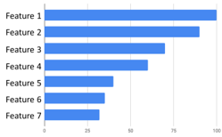
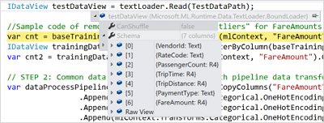
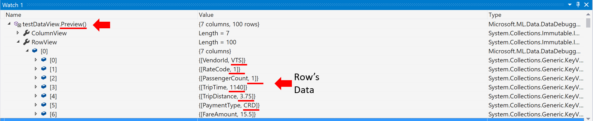

# Announcing ML.NET 0.8 - Machine Learning for .NET


We're excited to announce today the release of ML.NET 0.8 - the latest release of the cross-platform and open source machine learning framework for .NET developers (<a href="https://blogs.msdn.microsoft.com/dotnet/2018/05/07/introducing-ml-net-cross-platform-proven-and-open-source-machine-learning-framework/">ML.NET 0.1 was released at //Build 2018</a>). This release focuses on adding model explainability in the form of feature importance, debuggability by previewing IDataViews, improved support for recommendation scenarios without specific ratings but just implicit feedback, API improvements such as caching, filtering, and more.


This blog post provides details about the following topics in the ML.NET 0.8 release:

* [Model explainability](http://TBD-Set-Local-URL)
* [Improved debuggability by previewing DataViews](http://TBD-Set-Local-URL)
* [Enhanced support for recommendation tasks with implicit feedback](http://TBD-Set-Local-URL)
* [API improvements on caching and filtering](http://TBD-Set-Local-URL)
* [Enabled saving and loading data in IDV format for improved performance](http://TBD-Set-Local-URL)
* [New Visual Studio ML.NET project templates preview](http://TBD-Set-Local-URL)


## Model explainability



This release adds the first steps towards model explainability in the form of feature importance. Feature importance helps you understand which information is most valuable to the model for making a good prediction. For instance, when predicting the price of a car, some features are more important, like mileage and make/brand while other features might impact less, like the car's color.

The features that are more important for the model's prediction are more "informative" features. Model explainability provides information about the best informative features by providing metrics per feature.

There are two classes of feature importance implemented in ML.NET:

- **Overall feature importance** gives a sense of which features are overall most important for the model. This is available for all trainers.

- **Per-example feature importance** tells you which features contributed the most to a prediction for a specific example. This is currently available for some linear and tree trainers.

The following is sample code you can use to look at which features (independent input variables/columns) are most important to the model overall:

```csharp

// Train the model
var model = pipeline.Fit(data);

// Extract the trainer from the model
var linearPredictor = model.LastTransformer;
var weights = GetLinearModelWeights(linearPredictor.Model);

// Compute the permutation metrics using the properly-featurized data.
var transformedData = model.Transform(data);
var permutationMetrics = mlContext.Regression.PermutationFeatureImportance(
    linearPredictor, transformedData, label: labelName, features: "Features");

// Now let's look at which features are most important to the model overall
// Get the feature names from the schema
var featureNames = data.Schema.GetColumns()
    .Select(tuple => tuple.column.Name) // Get the column names
    .Where(name => name != labelName) // Drop the Label
    .ToArray();

// Get the feature indices sorted by their impact on R-Squared
var sortedIndices = permutationMetrics.Select((metrics, index) => new { index, metrics.RSquared })
    .OrderByDescending(feature => Math.Abs(feature.RSquared))
    .Select(feature => feature.index);

// Print out the permutation results, with the model weights, in order of their impact:
//
Console.WriteLine("Feature\tModel Weight\tChange in R-Squared");
var rSquared = permutationMetrics.Select(x => x.RSquared).ToArray(); // Fetch r-squared as an array
foreach (int i in sortedIndices)
{
    Console.WriteLine($"{featureNames[i]}\t{weights[i]:0.00}\t{rSquared[i]:G4}");
}
```
That code would show you a list of features with their importance per feature/column:

Console output:

    Feature            Model Weight    Change in R - Squared
    --------------------------------------------------------
    RoomsPerDwelling      50.80             -0.3695
    EmploymentDistance   -17.79             -0.2238
    TeacherRatio         -19.83             -0.1228
    TaxRate              -8.60              -0.1042
    NitricOxides         -15.95             -0.1025
    HighwayDistance        5.37             -0.09345
    CrimesPerCapita      -15.05             -0.05797
    PercentPre40s         -4.64             -0.0385
    PercentResidental      3.98             -0.02184
    CharlesRiver           3.38             -0.01487
    PercentNonRetail      -1.94             -0.007231


Further example usage can be found [here](https://github.com/dotnet/machinelearning/blob/master/docs/samples/Microsoft.ML.Samples/Dynamic/PermutationFeatureImportance.cs)


## Improved debuggability by previewing DataViews


In most of the cases when starting to work with your pipeline and loading your dataset it is very useful to peek at the data that was loaded into an ML.NET DataView and even look at it after some intermediate transformation steps to ensure the data is transformed as expected.

First what you can do is to review schema of your DataView.
All you need to do is hover over IDataView object, expand it, and look for the Schema property.



If you want to take a look to the actual data loaded in the DataView, you can do following:

- While debugging, open a **Watch window**.
- Enter variable name of you DataView object (in this case `testDataView`) and call `Preview()` method for it.
- Now, click over the rows you want to inspect. That will show you actual data loaded in the DataView.

By default we output first 100 values in ColumnView and RowView. But that can be changed by passing the amount of rows you interested into the to Preview() function as argument, such as `Preview(500)`.



**RowView** allow you iterate over each row and check values for the whole row, while **ColumnView** allows you iterate over each column and peek into values for each row.

Note that the DataView works as "lazy loading", so in reality, in your code you don't load data in the DataView until you call the method pipeline.Fit(). 

This data preview feature in Visual Studio is doing the same, under the covers, using a transformation which runs in parallel. 


## Enhanced support for recommendation tasks with implicit feedback (Based on Matrix Factorization)


Recommender systems enable producing a list of recommendations for products in a product catalog, songs, movies, and more.

In ML.NET v0.7 we already introduced support for recommendation tasks with [Matrix Factorizacion supporting scenarios with product ratings](https://blogs.msdn.microsoft.com/dotnet/2018/11/08/announcing-ml-net-0-7-machine-learning-net/#enhanced-support-for-recommendation-tasks-with-matrix-factorization) which are continuous number ratings (e.g. 1-5 stars), so users recommend items they like based on that rating.

However, in many other cases, you don't have specific ratings from users but only implicit feedback (e.g. they watched the movie but didn't rate it, or they bought a product multiple times but didn't rate it).
For such scenarios, in ML.NET 0.8, we're improving support for recommendation scenarios with implicit feedback by extending Matrix Factorization in ML.NET with this type of implicit feedback to train models for recommendation scenarios.

A sample app usaging Matrix Factorization with implicit feedback can be found [here TBD-TBD-TBD](TBD). 

## Added filtering and caching APIs

### Filtering rows in a DataView


Sometimes you might need to filter the data used for training a model. For example, you might need to remove rows where a certain column's value is lower or higher than certain boundaries because of any reason like 'outliers' data. 

This can now be done with additional filters like `FilterByColumn()` API such as in the following code from this [sample app at ML.NET samples](https://github.com/dotnet/machinelearning-samples/blob/master/samples/csharp/getting-started/Regression_TaxiFarePrediction/TaxiFarePrediction/TaxiFarePredictionConsoleApp/Program.cs#L74), where we want to keep only payment rows between $1 and $150 because for this particular scenario, because higher than $150 are considered "outliers" (extreme data distorting the model) and lower than $1 might be errors in data:

```csharp
IDataView trainingDataView = mlContext.Data.FilterByColumn(baseTrainingDataView, "FareAmount", lowerBound: 1, upperBound: 150);
``` 

Thanks to the added DataView preview in Visual Studio previously mentioned above, you could now inspect the filtered data in your DataView.

Additional sample code can be check-out [here](https://github.com/dotnet/machinelearning/blob/71d58fa83f77abb630d815e5cf8aa9dd3390aa65/test/Microsoft.ML.Tests/RangeFilterTests.cs#L30). 

### Caching APIs


Some estimators iterate over the data multiple times. Instead of always reading from file, you can choose to cache the data to sometimes speed training execution. 

A good example is the following when the training is using an OVA (One Versus All) trainer which is running multiple iterations agaist the same data. In this particular case, when using Cache, the training time gets reduced from 24 secs to 12 secs (using a small dataset, if much larger, time improvement could be comparable):

```csharp
var dataProcessPipeline = mlContext.Transforms.Conversion.MapValueToKey("Area", "Label")
        .Append(mlContext.Transforms.Text.FeaturizeText("Title", "TitleFeaturized"))
        .Append(mlContext.Transforms.Text.FeaturizeText("Description", "DescriptionFeaturized"))
        .Append(mlContext.Transforms.Concatenate("Features", "TitleFeaturized", "DescriptionFeaturized"))
        //Example Caching the DataView 
        .AppendCacheCheckpoint(mlContext) 
        .Append(mlContext.BinaryClassification.Trainers.AveragedPerceptron(DefaultColumnNames.Label,                                  
                                                                          DefaultColumnNames.Features,
                                                                          numIterations: 10));
```

This example code is implemented and execution time measured in [this sample app](https://github.com/dotnet/machinelearning-samples/blob/master/samples/csharp/end-to-end-apps/MulticlassClassification-GitHubLabeler/GitHubLabeler/GitHubLabelerConsoleApp/Program.cs#L79) at the ML.NET Samples repo.

An additional test example can be found [here]( https://github.com/dotnet/machinelearning/blob/71d58fa83f77abb630d815e5cf8aa9dd3390aa65/test/Microsoft.ML.Tests/CachingTests.cs#L56).


## Enabled saving and loading data in IDV format for improved performance


It is sometimes useful to save data after it has been transformed. For example, you might have featurized all the text into sparse vectors and want to perform repeated experimentation with different trainers without continuously repeating the data transformation.

[IDV format](https://github.com/dotnet/machinelearning/blob/master/docs/code/IdvFileFormat.md) is a binary dataview file format provided by ML.NET. 

Saving and loading files in [IDV format](https://github.com/dotnet/machinelearning/blob/master/docs/code/IdvFileFormat.md) is often significantly faster than using a text format plus you don't need to specify the column types like you need to do when using a regular TextLoader, so the code to use is simpler in addition to faster.

Sample of usage of IDV format files can be found here ___________


## New Visual Studio ML.NET project templates preview – get started with ML easily


Today, we are pleased to announce a preview of Visual Studio project templates for ML.NET. These templates make it very easy to get started with machine learning. You can download these templates from [Visual Studio gallery, here](https://aka.ms/mlnettemplates). 

The templates cover the following scenarios:
-	**ML.NET Console Application** – Sample app that demonstrates how you can use a machine learning model in your application.
-	**ML.NET Model Library** – Creates a new machine learning model library which you can consume from within your application.


## In case you missed it: provide your feedback on the new API

[ML.NET 0.6](https://blogs.msdn.microsoft.com/dotnet/2018/10/08/announcing-ml-net-0-6-machine-learning-net/) introduced a new set of APIs for ML.NET that provide enhanced flexibility. These APIs in 0.8 and upcoming versions are still evolving and we would love to get your feedback so you can help shape the long-term API for ML.NET.

Want to get involved? Start by providing feedback through issues at the [ML.NET GitHub repo](https://github.com/dotnet/machinelearning/issues)!

## Additional resources

* The most important **ML.NET concepts** for understanding the new API are introduced [here](https://docs.microsoft.com/en-us/dotnet/machine-learning/basic-concepts-model-training-in-mldotnet).

* A **cookbook** or **How to guides** that shows how to use these APIs for a variety of existing and new scenarios can be found [here](https://docs.microsoft.com/en-us/dotnet/machine-learning/how-to-guides/).


## Get started!


If you haven’t already, get started with <a href="https://www.microsoft.com/net/learn/apps/machine-learning-and-ai/ml-dotnet/get-started">ML.NET here</a>
 
Next, explore some other great resources:

  * Tutorials and resources at the [Microsoft Docs ML.NET Guide](https://docs.microsoft.com/en-us/dotnet/machine-learning/)
  * Code samples at the [machinelearning-samples GitHub repo](https://github.com/dotnet/machinelearning-samples)

    
  </tr>
</table>

We look forward to your feedback and welcome you to file issues with any suggestions or enhancements in the [ML.NET GitHub repo](https://github.com/dotnet/machinelearning).

*This blog was authored by Cesar de la Torre and TBD*

Thanks,

The ML.NET Team

