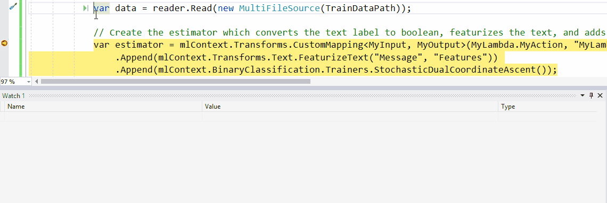
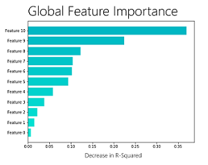

# Announcing ML.NET 0.8 - Machine Learning for .NET


[ML.NET](http://dot.net/ml) is an open-source and cross-platform framework (Windows, Linux, macOS) which makes machine learning accessible for .NET developers. Using ML.NET, developers can develop and infuse custom AI into their applications by creating custom machine learning models without needing deep expertise in data science and machine learning.

ML.NET allows you to create and use machine learning models targeting scenarios to achieve common tasks such as classification, regression, clustering, ranking, recommendations and anomaly detection. It also provides integration with other deep-learning frameworks like TensorFlow plus interoperability through ONNX.

Practical use cases of ML.NET are scenarios like Sentiment Analysis, Recommendations, Image Classification, Sales Forecast, etc. Check out our [GitHub repo with ML.NET samples](https://github.com/dotnet/machinelearning-samples) we've being evolving with ML.NET 0.8.

Today we’re happy to announce the release of ML.NET 0.8. (<a href="https://blogs.msdn.microsoft.com/dotnet/2018/05/07/introducing-ml-net-cross-platform-proven-and-open-source-machine-learning-framework/">ML.NET 0.1 was released at //Build 2018</a>). This release focuses on adding improved support for recommendation scenarios, model explainability in the form of feature importance, debuggability by previewing your in-memory datasets,  API improvements such as caching, filtering, and more.

This blog post provides details about the following topics in the ML.NET 0.8 release:

* [Enhanced support for recommendations](http://TBD-Set-Local-URL)
* [Improved debuggability](http://TBD-Set-Local-URL)
* [Model explainability](http://TBD-Set-Local-URL)
* [New Visual Studio ML.NET project templates preview](http://TBD-Set-Local-URL)
* [Additional API improvements](http://TBD-Set-Local-URL)


## Enhanced support for recommendation models 


Recommender systems enable producing a list of recommendations for products in a product catalog, songs, movies, and more.

These type of models allows you to predict what products users might be interested by showing them recommendations.

Basically, these "frequently bought together" algorithms in ML.NET allow you to predict and show product recommendations comparable to the ones typically shown in eCommerce sites at the item's page currently being viewed or in the basket pagen whe the user just added an item, such as in the picture below:


In ML.NET we support several types of recommendations. Here’s a quick summary of when to use which:

| Type of data you have | Recommended solution |
| - | - |
| Product Id, User Id | Co-pay |
| Product Id, Rating, User Id | Matrix Factorization |
| Product Id, Rating, User Id, and additional meta data  like user age or product description) | Field Aware Factorization Machines |

### Added recommendation tasks with implicit feedback (Based on Matrix Factorization)

In ML.NET v0.7 we introduced support for recommendation tasks with Matrix Factorization supporting scenarios with product ratings, such as in this [sample app](https://blogs.msdn.microsoft.com/dotnet/2018/11/08/announcing-ml-net-0-7-machine-learning-net/#enhanced-support-for-recommendation-tasks-with-matrix-factorization). In that scenario you are using the continuous ratings (e.g. 1-5 stars), so users are recommend items they like based on that rating.

However, in many other scenarios you may not have specific ratings from users but only implicit feedback (e.g. they watched the movie but didn't rate it, or they bought a product multiple times but didn't rate it).
For such scenarios, in ML.NET 0.8 we've added support for recommendation scenarios with implicit feedback by extending Matrix Factorization with this type of implicit feedback to train models for recommendation scenarios.

A sample usaging Matrix Factorization *with implicit feedback* can be found [here](https://github.com/dotnet/machinelearning-samples/tree/master/samples/csharp/getting-started/MatrixFactorization_ProductRecommendation).

## Improved debuggability by previewing the data


In most of the cases when starting to work with your pipeline and loading your dataset it is very useful to peek at the data that was loaded into an ML.NET DataView and even look at it after some intermediate transformation steps to ensure the data is transformed as expected.

First what you can do is to review schema of your DataView.
All you need to do is hover over IDataView object, expand it, and look for the Schema property.


If you want to take a look to the actual data loaded in the DataView, you can do following steps shown in the animation below.



The steps are:

- While debugging, open a **Watch window**.
- Enter variable name of you DataView object (in this case `testDataView`) and call `Preview()` method for it.
- Now, click over the rows you want to inspect. That will show you actual data loaded in the DataView.

By default we output first 100 values in ColumnView and RowView. But that can be changed by passing the amount of rows you interested into the to Preview() function as argument, such as `Preview(500)`. 

## Model explainability



In ML.NET 0.8 release, we have included APIs for model explainability that we use internally at Microsoft to help machine learning developers better understand the feature importance of models ("Overall Feature Importance") and create high-capacity models that can be interpreted by others ("Generalized Additive Models").

**Overall feature importance** gives a sense of which features are overall most important for the model. When creating Machine Learning models, it is often not enough to simply make predictions and evaluate its accuracy. As illustrated in the previous image, feature importance helps you understand which data features are most valuable to the model for making a good prediction. For instance, when predicting the price of a car, some features are more important like mileage and make/brand, while other features might impact less, like the car's color.

The "Overall feature importance" of a model is enabled through a technique named "Permutation Feature Importance" (PFI). PFI measures feature importance by asking the question, *"What would the effect on the model be if the values for a feature were set to a random value (permuted across the set of examples)?"*. 

The advantage of the PFI method is that it is model agnostic &mdash; it works with any model that can be evaluated &mdash; and it can use any dataset, not just the training set, to compute feature importance. 

You can use PFI like so to produce feature importances with code like the following:

```cs
// Compute the feature importance using PFI
var permutationMetrics = mlContext.Regression.PermutationFeatureImportance(model, data);

// Get the feature names from the training set
var featureNames = data.Schema.GetColumns()
                .Select(tuple => tuple.column.Name) // Get the column names
                .Where(name => name != labelName) // Drop the Label
                .ToArray();

// Write out the feature names and their importance to the model's R-squared value
for (int i = 0; i < featureNames.Length; i++)
  Console.WriteLine($"{featureNames[i]}\t{permutationMetrics[i].rSquared:G4}");
```

You would get a similar output in the console than the metrics below:

```cs
Console output:

    Feature            Model Weight    Change in R - Squared
    --------------------------------------------------------
    RoomsPerDwelling      50.80             -0.3695
    EmploymentDistance   -17.79             -0.2238
    TeacherRatio         -19.83             -0.1228
    TaxRate              -8.60              -0.1042
    NitricOxides         -15.95             -0.1025
    HighwayDistance        5.37             -0.09345
    CrimesPerCapita      -15.05             -0.05797
    PercentPre40s         -4.64             -0.0385
    PercentResidental      3.98             -0.02184
    CharlesRiver           3.38             -0.01487
    PercentNonRetail      -1.94             -0.007231
```

Note that in current ML.NET v0.8, PFI only works for binary classification and regression based models, but we'll expand to additional ML tasks in the upcoming versions.

See the <a href="https://github.com/dotnet/machinelearning/blob/master/docs/samples/Microsoft.ML.Samples/Dynamic/PermutationFeatureImportance.cs">sample in the ML.NET repository</a> for a complete example using PFI to analyze the feature importance of a model.

**Generalized Additive Models**, or (**GAMs**) have very explainable predictions. They are similar to [linear models](https://en.wikipedia.org/wiki/Linear_model) in terms of ease of understanding but are more flexible and can have better performance and and could also be visualized/plotted for easier analysis. 

Example usage of how to train a GAM model, inspect and interpret the results, can be found [here](https://github.com/dotnet/machinelearning/blob/master/docs/samples/Microsoft.ML.Samples/Dynamic/GeneralizedAdditiveModels.cs).

## New Visual Studio ML.NET project templates preview – get started with ML easily


Today, we are pleased to announce a preview of Visual Studio project templates for ML.NET. These templates make it very easy to get started with machine learning. You can download these templates from [Visual Studio gallery here](https://aka.ms/mlnettemplates). 

The templates cover the following scenarios:
-	**ML.NET Console Application** – Sample app that demonstrates how you can use a machine learning model in your application.
-	**ML.NET Model Library** – Creates a new machine learning model library which you can consume from within your application.


## Additional API improvements in ML.NET 0.8

In this release we have also added other enhancements to our APIs which help with filtering rows in DataViews, caching data, allowing users to save data to the IDataView (IDV) binary format. You can learn about these features here.

### Filtering rows in a DataView


Sometimes you might need to filter the data used for training a model. For example, you might need to remove rows where a certain column's value is lower or higher than certain boundaries because of any reason like 'outliers' data.

This can now be done with additional filters like `FilterByColumn()` API such as in the following code from this [sample app at ML.NET samples](https://github.com/dotnet/machinelearning-samples/blob/master/samples/csharp/getting-started/Regression_TaxiFarePrediction/TaxiFarePrediction/TaxiFarePredictionConsoleApp/Program.cs#L74), where we want to keep only payment rows between $1 and $150 because for this particular scenario, because higher than $150 are considered "outliers" (extreme data distorting the model) and lower than $1 might be errors in data:

```csharp
IDataView trainingDataView = mlContext.Data.FilterByColumn(baseTrainingDataView, "FareAmount", lowerBound: 1, upperBound: 150);
``` 

Thanks to the added DataView preview in Visual Studio previously mentioned above, you could now inspect the filtered data in your DataView.

Additional sample code can be check-out [here](https://github.com/dotnet/machinelearning/blob/71d58fa83f77abb630d815e5cf8aa9dd3390aa65/test/Microsoft.ML.Tests/RangeFilterTests.cs#L30). 

### Caching APIs


Some estimators iterate over the data multiple times. Instead of always reading from file, you can choose to cache the data to sometimes speed training execution.

A good example is the following when the training is using an OVA (One Versus All) trainer which is running multiple iterations against the same data. By eliminating the need to read data from disk multiple times you can reduce model training time by up to 50%:

```csharp
var dataProcessPipeline = mlContext.Transforms.Conversion.MapValueToKey("Area", "Label")
        .Append(mlContext.Transforms.Text.FeaturizeText("Title", "TitleFeaturized"))
        .Append(mlContext.Transforms.Text.FeaturizeText("Description", "DescriptionFeaturized"))
        .Append(mlContext.Transforms.Concatenate("Features", "TitleFeaturized", "DescriptionFeaturized"))
        //Example Caching the DataView 
        .AppendCacheCheckpoint(mlContext) 
        .Append(mlContext.BinaryClassification.Trainers.AveragedPerceptron(DefaultColumnNames.Label,                                  
                                                                          DefaultColumnNames.Features,
                                                                          numIterations: 10));
```

This example code is implemented and execution time measured in [this sample app](https://github.com/dotnet/machinelearning-samples/blob/master/samples/csharp/end-to-end-apps/MulticlassClassification-GitHubLabeler/GitHubLabeler/GitHubLabelerConsoleApp/Program.cs#L79) at the ML.NET Samples repo.

An additional test example can be found [here]( https://github.com/dotnet/machinelearning/blob/71d58fa83f77abb630d815e5cf8aa9dd3390aa65/test/Microsoft.ML.Tests/CachingTests.cs#L56).

### Enabled saving and loading data in IDataView (IDV) binary format for improved performance


It is sometimes useful to save data after it has been transformed. For example, you might have featurized all the text into sparse vectors and want to perform repeated experimentation with different trainers without continuously repeating the data transformation.

[IDV format](https://github.com/dotnet/machinelearning/blob/master/docs/code/IdvFileFormat.md) is a binary dataview file format provided by ML.NET. 

Saving and loading files in [IDV format](https://github.com/dotnet/machinelearning/blob/master/docs/code/IdvFileFormat.md) is often significantly faster than using a text format because it is compressed. 

In addtion, because it is already schematized 'in-file', you don't need to specify the column types like you need to do when using a regular TextLoader, so the code to use is simpler in addition to faster.

Reading a binary data file can be done using this simple line of code:

```csharp
mlContext.Data.ReadFromBinary("pathToFile");
```

Writing a binary data file can be done using this code:

```csharp
mlContext.Data.SaveAsBinary("pathToFile");
```

### Enabled stateful prediction engine for time series problems such as anomaly detection


ML.NET 0.7 enabled anomaly detection scenarios based on Time Series. However, the prediction engine was stateless, which means that every time you want to figure out whether the latest data point is anomolous, you need to provide historical data as well. This is unnatural.

The prediction engine can now keep state of time series data seen so far, so you can now get predictions by just providing the latest data point. This is enabled by using `CreateTimeSeriesPredictionFunction()` instead of `CreatePredictionFunction()`.

Example usage can be found [here](https://github.com/dotnet/machinelearning/blob/3d33e20f33da70cdd3da2ad9e0b2b03df929bef4/test/Microsoft.ML.TimeSeries.Tests/TimeSeriesDirectApi.cs#L141)

## Get started!


If you haven’t already get started with <a href="https://www.microsoft.com/net/learn/apps/machine-learning-and-ai/ml-dotnet/get-started">ML.NET here</a>.
 
Next, going further explore some other resources:

  * Tutorials and resources at the [Microsoft Docs ML.NET Guide](https://docs.microsoft.com/en-us/dotnet/machine-learning/)
  * Code samples at the [machinelearning-samples GitHub repo](https://github.com/dotnet/machinelearning-samples)
  * Important ML.NET concepts for understanding the new API are introduced [here](https://docs.microsoft.com/en-us/dotnet/machine-learning/basic-concepts-model-training-in-mldotnet)
  * "How to" guides that show how to use these APIs for a variety of scenarios can be found [here](https://docs.microsoft.com/en-us/dotnet/machine-learning/how-to-guides/)

 We will appreciate your feedback by filing issues with any suggestions or enhancements in the [ML.NET GitHub repo](https://github.com/dotnet/machinelearning) to help us shape ML.NET and make .NET a great platform of choice for Machine Learning.

Thanks,

The ML.NET Team.

*This blog was authored by Cesar de la Torre, Gal Oshri and the ML.NET team*
