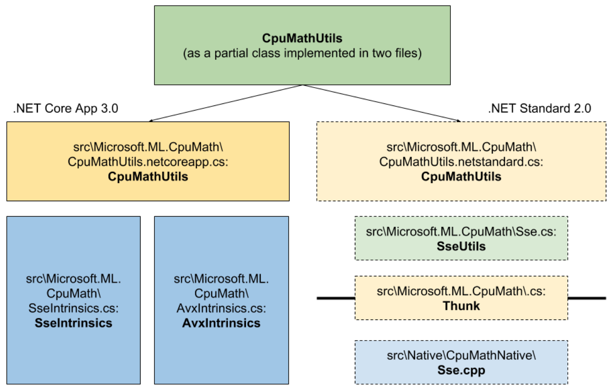
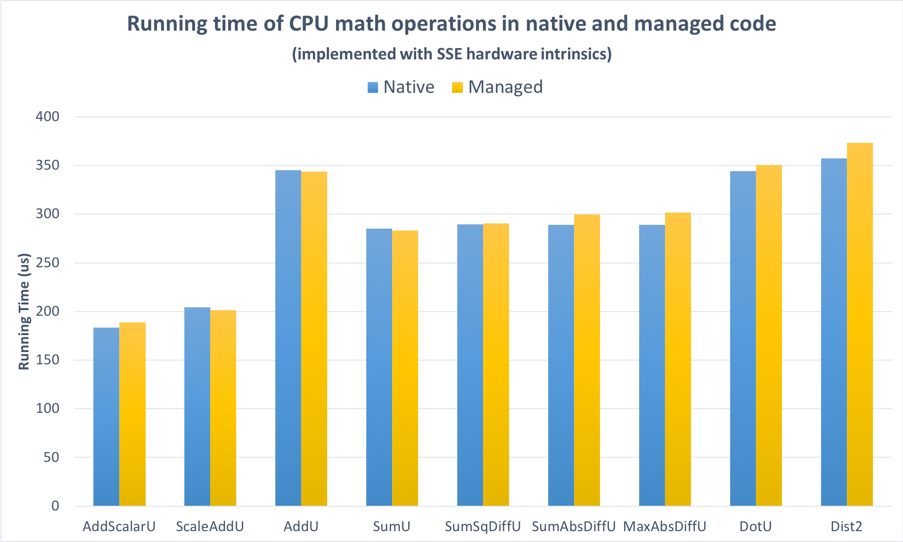
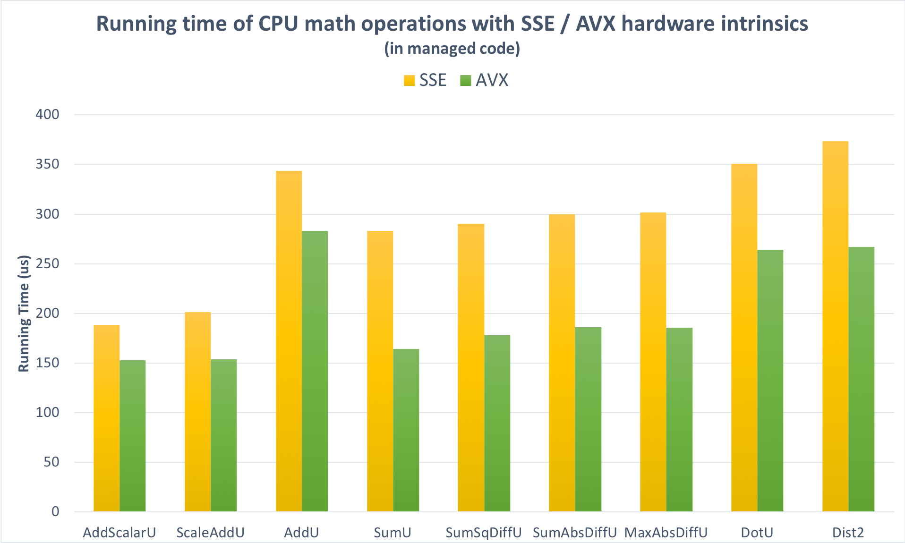
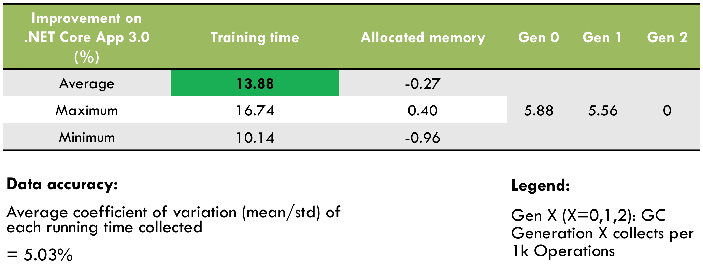

# Using .NET Hardware Intrinsics API to accelerate machine learning scenarios

_This week's blog post is by Brian Lui, one of our summer interns on the .NET team, who's been hard at work. Over to Brian:_

Hello everyone. This summer I interned in the .NET team, working on a project named [ML.NET](https://www.microsoft.com/net/learn/apps/machine-learning-and-ai/ml-dotnet) which is an open-source platform being introduced by Microsoft to make high performance Machine Learning more accessible from .NET apps. It's expected to ship next year, but you can [use previews already](https://github.com/dotnet/machinelearning).

At the start of my internship, ML.NET code was already relying on vectorization for performance, using a native code library to access x86 SSE instructions. This was an opportunity to reimplement an existing codebase in managed code, using .NET Hardware Intrinsics, and compare results.

## Project goals

1. **Increase ML.NET platform reach** (x86, x64, ARM32, ARM64, etc.) by creating a single managed assembly with software fallbacks
2. **Increase ML.NET performance** by using AVX instructions where available
3. **Validate .NET Hardware Intrinsics API** and demonstrate performance is comparable to native code

I could have achieved the second goal by simply updating the native code to use AVX instructions, but by moving to managed code at the same time I could eliminate the need to build and ship a separate binary for each target architecture - it's also usually easier to maintain managed code.

I was able to achieve all these goals.

## Challenges

It was necessary to first familarize myself with C# and .NET, and then my work included:
- use `Span<T>` in the base-layer implementation of CPU math operations in C# (if `Span<T>` is unfamilar to you, there is a great overview [here](https://msdn.microsoft.com/en-us/magazine/mt814808.aspx))
- enable switching between AVX, SSE, and software implementations depending on availability
- correctly handle pointers in the managed code, and remove alignment assumptions made by some of the existing code
- use Multitargeting to allow ML.NET continued to function on platforms that don't have .NET Hardware Intrinsics APIs.

## Multi-targeting

.NET Hardware Intrinsics will ship in .NET Core 3.0, which is currently in development. ML.NET also needs to run on .NET Standard 2.0 compliant platforms - such as .NET Framework 4.7.2 and .NET Core 2.1. In order to support both I chose to use [multitargeting](https://docs.microsoft.com/en-us/dotnet/core/porting/project-structure#replace-existing-projects-with-a-multi-targeted-net-core-project) to create a single `.csproj` file that targets both .NET Standard 2.0 and .NET Core 3.0. 
1. On **.NET Standard 2.0**, the system will use the original native implementation with SSE (Streaming SIMD Extensions) hardware intrinsics, while
2. On **.NET Core App 3.0**, the system will use the new managed implementation with AVX hardware intrinsics.

## What is Vectorization, and what are SSE and AVX?

Vectorization is a name used for applying the same operation to multiple elements of an array simultaneously. On the x86/x64 platform, vectorization can be achieved by using SIMD (single-instruction, multi-data) CPU instructions to operate on array-like objects.

SSE (Streaming SIMD Extensions) and AVX (Advanced Vector Extensions) are  then names for SIMD instruction set extensions to the x86 architecture. SSE has been available for a long time: the CoreCLR underlying .NET Core requires x86 platforms support at least the SSE2 instruction set. AVX is an extension to SSE that is now broadly available. Its key advantage is that it can handle 8 consecutive 32-bit elements in memory in one instruction, twice as much as SSE can.

ARM based CPU's do offer a similar range of intrinsics but they are not yet supported on .NET Core (although work is [in progress](https://github.com/dotnet/corefx/issues/26179)). Therefore I included software fallbacks for the case when neither AVX and SSE are available. The JIT makes it possible to do this fallback in a very efficient way. When .NET Core does expose ARM intrinsics, the code could exploit them at which point the a software fallback would rarely if ever be needed.

## As the code was originally

In the original code, every trainer, learner, and transform used in machine learning ultimately called a `SseUtils` wrapper method that performs a CPU math operation on input arrays, such as
- `MatMulDense`, which takes the matrix multiplication of two dense arrays interpreted as matrices, and 
- `SdcaL1UpdateSparse`, which performs the update step of the stochastic dual coordinate ascent for sparse arrays.

These wrapper methods assumed a preference for SSE SIMD instructions, and called a corresponding method in another class `Thunk`, which serves as the interface between managed and native code and contains methods that directly invoke their native equivalents. These native methods in `.cpp` files in turn implemented the CPU math operations with loops containing SSE hardware intrinsics.

## Splitting up the code-paths

To this code I added a new independent code path for CPU math operations that becomes active on .NET Core App 3.0, and by keeping the original code path running on .NET Standard 2.0. All previous call sites of `SseUtils` methods now called `CpuMathUtils` methods of the same name instead, keeping the API signatures of CPU math operations the same.

`CpuMathUtils` is a new partial class that contains two definitions for each public API representing CPU math operation, one of which is compiled only on .NET Standard 2.0 while the other, only on .NET Core App 3.0. This conditional compilation feature creates two independent code paths for `CpuMathUtils` methods. Those function definitions compiled on .NET Standard 2.0 call their `SseUtils` counterparts directly, which essentially follow the original native code path. On the other hand, the other function definitions compiled on .NET Core App 3.0 switch to one of three implementations of the same CPU math operation, based on availability at runtime:
1. an `AvxIntrinsics` method which implements the operation with loops containing AVX hardware intrinsics,
2. a `SseIntrinsics` method which implements the operation with loops containing SSE hardware intrinsics, and
3. a software fallback in case neither AVX nor SSE is supported.

You will commonly see this pattern whenever code uses .NET Hardware Intrinsics - for example, this is what the code looks like for adding a scalar to a vector:
```c#
        // Add scalar to each element of dst
        private static void Add(float scalar, Span<float> dst)
        {
            if (Avx.IsSupported)
            {
                AvxIntrinsics.AddScalarU(scalar, dst);
            }
            else if (Sse.IsSupported)
            {
                SseIntrinsics.AddScalarU(scalar, dst);
            }
            else
            {
                for (int i = 0; i < dst.Length; i++)
                {
                    dst[i] += scalar;
                }
            }
        }
```
If AVX is supported, it is preferred, otherwise SSE is used if available, otherwise the software fallback path. At runtime, the JIT will actually generate code for only one of these three blocks, as appropriate.

To give you an idea, here what the AVX implementation looks like that's called by the method above:
```c#
        // Add scalar to each element of dst
        public static unsafe void AddScalarU(float scalar, Span<float> dst)
        {
            fixed (float* pdst = dst)
            {
                float* pDstEnd = pdst + dst.Length;
                float* pDstCurrent = pdst;

                Vector256<float> scalarVector256 = Avx.SetAllVector256(scalar);

                while (pDstCurrent + 8 <= pDstEnd)
                {
                    Vector256<float> dstVector = Avx.LoadVector256(pDstCurrent);
                    dstVector = Avx.Add(dstVector, scalarVector256);
                    Avx.Store(pDstCurrent, dstVector);

                    pDstCurrent += 8;
                }

                Vector128<float> scalarVector128 = Sse.SetAllVector128(scalar);

                if (pDstCurrent + 4 <= pDstEnd)
                {
                    Vector128<float> dstVector = Sse.LoadVector128(pDstCurrent);
                    dstVector = Sse.Add(dstVector, scalarVector128);
                    Sse.Store(pDstCurrent, dstVector);

                    pDstCurrent += 4;
                }

                while (pDstCurrent < pDstEnd)
                {
                    Vector128<float> dstVector = Sse.LoadScalarVector128(pDstCurrent);
                    dstVector = Sse.AddScalar(dstVector, scalarVector128);
                    Sse.StoreScalar(pDstCurrent, dstVector);

                    pDstCurrent++;
                }
            }
        }
```
You will notice that it operates on `float`s in groups of 8 using AVX, then any group of 4 using SSE, and finally a software loop for any that remain. (There are potentially more efficient ways to do this, which I won't discuss here - there will be future blog posts dedicated to .NET Hardware Intrinsics.)

You can see all my code [here](https://github.com/dotnet/machinelearning/tree/master/src/Microsoft.ML.CpuMath).

Since the `AvxIntrinsics` and `SseIntrinsics` methods in managed code directly implement the CPU math operations analogous to the native methods originally in `.cpp` files, the code change not only removes native dependencies but also simplifies the levels of abstraction between public APIs and base-layer hardware intrinsics. 

After making this replacement I was able to use ML.NET to perform tasks such as train models with stochastic dual coordinate ascent, conduct hyperparameter tuning, and perform cross validation, on a Raspberry Pi, when previously an x86 CPU was required.

Here's what the architecture looks like now (Figure 1):

**Figure 1**: 

## Performance improvements

I used [Benchmark.NET](https://benchmarkdotnet.org/index.html) to make all my measurements.

First, I disabled the AVX code paths in order to compare the native and managed implementations while both were using the same SSE instructions. As Figure 2 shows, the performance is **closely comparable**: on the large vectors the tests operate on, the overhead added by managed code is not significant.

**Figure 2**: 

Second, I enabled AVX support. Figure 3 shows that the average performance gain in microbenchmarks was about **20%**.

**Figure 3**: 

Taking both together -- the upgrade from the SSE implementation in native code to the AVX implementation in managed code -- I measured an **18%** improvement in the microbenchmarks. Some operations were up to 42% faster, while some others involving sparse inputs have potential for further optimization.

What ultimately matters of course is the performance for real scenarios. On .NET Core App 3.0, training models of K-means clustering and logistic regression got faster by about **14%** (Figure 4).

Figure 4: 

## In closing

My summer internship experience with the .NET team has been rewarding and inspiring for me. My manager Dan and my mentors Santi and Eric gave me an opportunity to go hands-on with a real shipping project. I was able to work with other teams and external industry partners to optimize my code, and most importantly, as a software engineering intern with the .NET team, I was exposed to almost every step of the entire working cycle of a product enhancement, from idea generation to code review to product release with documentation.

I hope this has demonstrated how powerful .NET Hardware Intrinsics can be and I encourage you to consider opportunities to use them in your own projects when previews of .NET Core 3.0 become available.