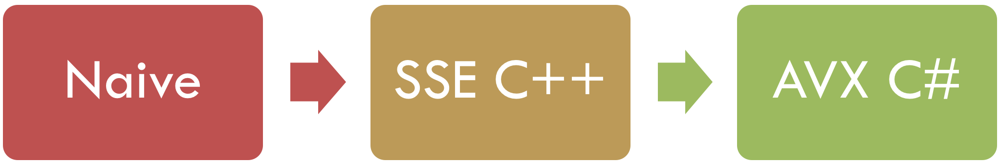

# Using .NET Hardware Intrinsics API to accelerate machine learning scenarios

_This blog post is by Brian Lui, one of our summer interns on the .NET team_

Hello everyone. This summer I interned in the .NET team, working on a project named [ML.NET](https://www.microsoft.com/net/learn/apps/machine-learning-and-ai/ml-dotnet) which is an open-source platform being introduced by Microsoft to make up-to-Machine Learning more accessible from .NET apps. It's expected to ship next year, but you can [use previews today](https://github.com/dotnet/machinelearning).

ML.NET code was already relying on vectorization for performance, using a native code library to access x86 SSE instructions. This was an opportunity to reimplement an existing codebase in managed code, using .NET Hardware Intrinsics, and compare results.

## Project goals

1. **Increase ML.NET platform reach** (x64, ARM32, ARM64, etc.) by creating a single managed assembly with software fallbacks
2. **Increase ML.NET performance** by using AVX instructions where available
3. **Validate .NET Hardware Intrinsics API** and demonstrate performance is comparable to native code

I could have simply updated the native code to use AVX instructions, but managed code eliminates the need to build and ship a separate binary for each target architecture, and it's more maintainable as well.

We ended up achieving all these goals.

## Multitargeting

In order to achieve this I had to make sure the code continued to work well on older platforms. .NET Hardware Intrinsics are only available in final form on .NET Core 3.0, which is still in development. ML.NET also supports .NET Standard 2.0 platforms - such as .NET Framework 4.7.2 and .NET Core 2.1. The approach I chose was to use [multitargeting](https://docs.microsoft.com/en-us/dotnet/core/porting/project-structure#replace-existing-projects-with-a-multi-targeted-net-core-project) to create a single `.csproj` file that targets both .NET Standard 2.0 and .NET Core 3.0. 
1. On **.NET Standard 2.0**, the system will use the original native implementation with SSE (Streaming SIMD Extensions) hardware intrinsics, while
2. On **.NET Core App 3.0**, the system will use the new managed implementation with AVX hardware intrinsics.

## Main challenges

Amongst the work I had to
- use `Span<T>`, introduced in C# 7.3, in the base-layer implementation of CPU math operations in C#,
- enable the switching between AVX and SSE technologies, as well as the services to overloaded public APIs,
- correctly handle pointers in the managed code, and remove alignment assumptions made by some of the existing code

## SIMD instructions as vectorization

Applying the same operation to multiple elements of an array simultaneously is called vectorization.  To implement vectorization in this project, SIMD (single-instruction, multi-data) instructions in the form of SSE and AVX hardware intrinsics are called in functions that implement CPU math operations on input array-like objects.

## What are SSE and AVX?

SSE (Streaming SIMD Extensions) and AVX (Advanced Vector Extensions) are SIMD instruction set extensions to the x86 architecture.  Most x86 architectures nowadays support both SSE and AVX. SSE has been available for a long time: the CoreCLR underlying .NET Core requires x86 platforms support at least the SSE2 instruction set. AVX is an extension to SSE that is nowadays broadly (but not always) availabile. The key advantage of AVX is that it can handle 8 consecutive 32-bit elements in memory in one instruction, twice as much as SSE.

ARM based CPU's have a similar range of intrinsics. Those are not yet supported on .NET Core, so I used software fallbacks when neither AVX and SSE are available [Figure 1]. The JIT makes it possible to do this fallback in a very efficient way. When .NET Core exposes ARM intrinsics, the code could exploit them at which point the a software fallback would rarely if ever be needed.

Figure 1: 

## How is the project implemented?

Originally, every trainer, learner, and transform used in machine learning ultimately called a `SseUtils` wrapper method that performs a CPU math operation on input arrays, such as
- `MatMulDense`, which takes the matrix multiplication of two dense arrays interpreted as matrices, and 
- `SdcaL1UpdateSparse`, which performs the update step of the stochastic dual coordinate ascent for sparse arrays.

These wrapper methods assumed a preference for SSE SIMD instructions, and calls a corresponding method in another class `Thunk`, which serves as the interface between managed and native code and contains methods that directly call their native equivalents through [P/Invoke](https://msdn.microsoft.com/en-us/library/55d3thsc.aspx) calls.  These native methods in `.cpp` files in turn implement the CPU math operations with loops containing SSE hardware intrinsics that perform SIMD instructions.

The original implementation provides room for enhancement in the following areas:
1. Can we simplify the layers between the `SseUtils` wrapper class and the bottom-level hardware intrinsics?
2. Can we remove native dependencies to support more architectures by implementing hardware intrinsics in managed code?
3. Can we leverage the more efficient AVX hardware intrinsics whenever the AVX technology is supported?

I achieved this by adding a new independent code path for CPU math operations that becomes active on .NET Core App 3.0, and by keeping the original code path running on .NET Standard 2.0. All previous call sites of `SseUtils` methods now call `CpuMathUtils` methods of the same name instead, thanks to an effort to keep the public API signatures of CPU math operations consistent [Figure 2].

Figure 2: 

`CpuMathUtils` is a new partial class that contains two definitions for each public API representing CPU math operation, one of which is compiled only on .NET Standard 2.0 while the other, only on .NET Core App 3.0.  This conditional compilation feature creates two independent code paths for `CpuMathUtils` methods.  Those function definitions compiled on .NET Standard 2.0 call their `SseUtils` counterparts directly, which essentially follow the original native code path.  On the other hand, the other function definitions compiled on .NET Core App 3.0 switch to one of three implementations of the same CPU math operation, based on availability at runtime:
1. an `AvxIntrinsics` method which implements the operation with loops containing AVX hardware intrinsics,
2. a `SseIntrinsics` method which implements the operation with loops containing SSE hardware intrinsics, and
3. a software fallback in case neither AVX nor SSE is supported [Figure 3].

Figure 3: 

Since the `AvxIntrinsics` and `SseIntrinsics` methods in managed code directly implement the CPU math operations analogous to the native methods originally in `.cpp` files, the code change not only removes native dependencies but also simplifies the levels of abstraction between public APIs and base-layer hardware intrinsics.  

After making this replacement I was able to use ML.NET to perform tasks such as train models with stochastic dual coordinate ascent, conduct hyperparameter tuning, and perform cross validation, on a Raspberry Pi.

Figure 4: 

## Performance improvements

(I used performance tests written with [Benchmark.NET](https://benchmarkdotnet.org/index.html) for measuring both user scenarios and microbenchmarks.)

[Figure 5] demonstrates the native and managed implementations - both constrained to use only SSE instructions - have closely similar performance -- the time is dominated by the same CPU instructions, and simply using managed code has added minimal overhead.

[Figure 6] shows the difference that AVX can make over SSE. The average performance gain in microbenchmarks was 20.2%.

Taking both together -- the upgrade from the SSE implementation in native code to the AVX implementation in managed code -- we gained  **18%** in microbenchmarks. In the best cases, some operations enjoy a +42.32% improvement in the running time, while some others involving sparse inputs have potential for further optimization.

Figure 5: 

Figure 6: 

What ultimately matters of course is the performance for real scenarios. On .NET Core App 3.0, training models of K-means clustering and logistic regression got faster by an average of **+13.9%**, and memory allocation was essentially the same [Figure 8].

Figure 8: 

## Epilogue

My summer internship experience with the .NET team has been rewarding and inspiring for me. I had the opportunity to go hands-on with a real shipping project. I was able to work with other teams and external industry partners to optimize my project, and most importantly, as a software engineering intern with the .NET team, I was exposed to almost every step of the entire working cycle of a product enhancement, from idea generation to code review to product release with documentation.

I encourage you to consider opportunities to increase the performance of your own projects using .NET Hardware Intrinsics on upcoming previews of .NET Core 3.0.