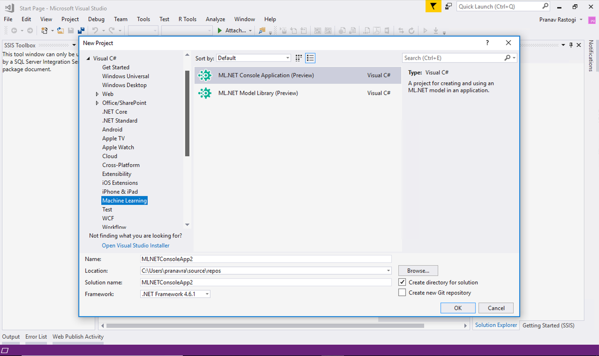

# Announcing ML.NET 0.9 - Machine Learning for .NET


[ML.NET](http://dot.net/ml) is an open-source and cross-platform machine learning framework (Windows, Linux, macOS) for .NET developers. Using ML.NET, developers can leverage their existing tools and skillsets to develop and infuse custom AI into their applications by creating custom machine learning models.

[ML.NET](http://dot.net/ml) allows you to create and use machine learning models targeting common tasks such as classification, regression, clustering, ranking, recommendations and anomaly detection. It also supports the broader open source ecosystem by proving integration with popular deep-learning frameworks like TensorFlow and interoperability through ONNX. Some common use cases of [ML.NET](http://dot.net/ml) are scenarios like Sentiment Analysis, Recommendations, Image Classification, Sales Forecast, etc. Please see our [samples](https://github.com/dotnet/machinelearning-samples) for more scenarios.

Today we’re happy to announce the release of [ML.NET](http://dot.net/ml) 0.9. (<a href="https://blogs.msdn.microsoft.com/dotnet/2018/05/07/introducing-ml-net-cross-platform-proven-and-open-source-machine-learning-framework/"> [ML.NET](http://dot.net/ml) 0.1 was released at //Build 2018</a>). This release focuses on: API improvements, model explainability and feature contribution, support for GPU when scoring ONNX models and significant clean up of the framework internals.

This blog post provides details about the following topics in the [ML.NET](http://dot.net/ml) 0.9 release:

* [Feature Contribution Calculation (FCC) and other Model Explainability improvements](http://TBD-Set-Local-URL)
* [Added GPU support for ONNX Transform](http://TBD-Set-Local-URL)
* [New Visual Studio ML.NET project templates preview](http://TBD-Set-Local-URL)
* [Additional API improvements in ML.NET 0.9](http://TBD-Set-Local-URL)


## Feature Contribution Calculation and other model explainability improvements

### Feature Contribution Calculation (FCC)

The **Feature Contribution Calculation (FCC for short)** shows which features are most influential for a model’s prediction on a particular and individual data sample by determining the amount each feature contributed to the model’s score for that particular data sample.

FCC is particulary important when you initialy have a lot of features/attributes in your historic data and you want to select and use only the most important features because using too many features (especially if including features that don't influence the model) can reduce the model's performance and accuracy. Therefore, with FCC you can identify the most influential positive and negative contributions from the initial attribute set.

You can use FCC to produce feature contributions with code like the following:

```cs
// Create a Feature Contribution Calculator
// Calculate the feature contributions for all features given trained model parameters

var featureContributionCalculator = mlContext.Model.Explainability.FeatureContributionCalculation(model.Model, model.FeatureColumn, numPositiveContributions: 11, normalize: false);

// FeatureContributionCalculatingEstimator can be use as an intermediary step in a pipeline. 
// The features retained by FeatureContributionCalculatingEstimator will be in the FeatureContribution column.

var pipeline = mlContext.Model.Explainability.FeatureContributionCalculation(model.Model, model.FeatureColumn, numPositiveContributions: 11)
    .Append(mlContext.Regression.Trainers.OrdinaryLeastSquares(featureColumn: "FeatureContributions"));
```

```
The output of the above code is:

  Label   Score   BiggestFeature         Value   Weight   Contribution

  24.00   27.74   RoomsPerDwelling        6.58    98.55   39.95
  21.60   23.85   RoomsPerDwelling        6.42    98.55   39.01
  34.70   29.29   RoomsPerDwelling        7.19    98.55   43.65
  33.40   27.17   RoomsPerDwelling        7.00    98.55   42.52
```


FCC can be used as a step in the ML pipeline and complements the current explainability tools in [ML.NET](http://dot.net/ml) like Permutation Feature Importance (PFI). With [ML.NET](http://dot.net/ml) 0.8, we already provided [initial APIs for model explainability](https://blogs.msdn.microsoft.com/dotnet/2018/12/04/announcing-ml-net-0-8-machine-learning-for-net/#model-explainability) to help machine learning developers better understand the feature importance of models ("Overall Feature Importance") and create ("Generalized Additive Models")

[Sample for FCC](https://github.com/dotnet/machinelearning/blob/master/docs/samples/Microsoft.ML.Samples/Dynamic/FeatureContributionCalculationTransform.cs).

### Additional model explainability improvements for features selection

In addition to FCC, we also extended the capabilities of Permutation Feature Importance (PFI) and Generalized Additive Models (GAMs):

- PFI now supports most learning tasks: Regression, Binary Classification, Multiclass Classification, and Ranking.

- PFI now allows you to calculate confidence intervals on feature importance scores to allow you to get a better estimate of the mean.

- GAMs now supports Feature Contribution Calculation (FCC) so you can quickly see which features drove an individual prediction.

[Sample for PFI](https://github.com/dotnet/machinelearning/blob/master/docs/samples/Microsoft.ML.Samples/Dynamic/PermutationFeatureImportance/PfiBinaryClassificationExample.cs).


## Added GPU support for ONNX Transform


In [ML.NET](http://dot.net/ml) 0.9 we added the capability to score/run [ONNX](https://onnx.ai/) models using [CUDA 10.0](https://developer.nvidia.com/cuda-downloads) enabled GPUs (such as most NVIDIA GPUs), by integrating the high performance [ONNX Runtime](https://github.com/Microsoft/onnxruntime) library. GPU support for ONNX models is currently available only on Windows 64-bit (not x86,yet), with Linux and Mac support coming soon. Learn [here](https://github.com/dotnet/machinelearning/blob/d9270c9c42da70817e8a71e39a069d2339f6972d/src/Microsoft.ML.OnnxTransform/OnnxTransform.cs#L46) about supported ONNX/CUDA formats/version. 

[Sample code](https://github.com/dotnet/machinelearning/blob/master/docs/samples/Microsoft.ML.Samples/Dynamic/OnnxTransform.cs) plus a Test [here](https://github.com/dotnet/machinelearning/blob/master/test/Microsoft.ML.OnnxTransformTest/OnnxTransformTests.cs#L151). 


## New Visual Studio ML.NET project templates preview


We are pleased to announce a preview of Visual Studio project templates for [ML.NET](http://dot.net/ml). These templates make it very easy to get started with machine learning. You can download these templates from [Visual Studio gallery here](https://aka.ms/mlnettemplates). 

The templates cover the following scenarios:
-	**ML.NET Console Application** – Sample app that demonstrates how you can use a machine learning model in your application.
-	**ML.NET Model Library** – Creates a new machine learning model library which you can consume from within your application.



## Additional API improvements in ML.NET 0.9

In this release we have also added other enhancements to our APIs such as the following.

### Text data loading is simplified

In [ML.NET](http://dot.net/ml) 0.9, when using the TextLoader class you can either directly provide the attributes/columns in the file as you were able to do it in previous versions or as a new improvement and optional choice you can instead specify those columns/attributes through a data-model class.

Before [ML.NET](http://dot.net/ml) v0.9 you always needed to have explicit code like the following:
```cs
//
//... Your code...
var mlContext = new MLContext();

// Create the reader: define the data columns and where to find them in the text file.
var reader = mlContext.Data.CreateTextReader(new[] {
        new TextLoader.Column("IsOver50K", DataKind.BL, 0),
        new TextLoader.Column("Workclass", DataKind.TX, 1)
    },hasHeader: true
);
var dataView = reader.Read(dataPath);
```

With 0.9, you can simply load the type as follows.

```cs
//
//... Your code in your class...
var mlContext = new MLContext();

// Read the data into a data view.
var dataView = mlContext.Data.ReadFromTextFile<InspectedRow>(dataPath, hasHeader: true);

// The data model. This type will be used from multiple code. 
private class InspectedRow
{
    [LoadColumn(0)]
    public bool IsOver50K { get; set; }
    [LoadColumn(1)]
    public string Workclass { get; set; }
}
```

[Sample code](https://github.com/dotnet/machinelearning/blob/master/test/Microsoft.ML.Tests/Scenarios/Api/Estimators/SimpleTrainAndPredict.cs#L24).

### Get prediction confidence factor

With Calibrator Estimators, in addition to the score column you can get when evaluating the quality of your model you can now get a probability column as well (probability of this example being on the predicted class; prediction confidence indicator).

For instance, you could get a list of the probabilities per each predicted value, like in the following list:

```
Score - 0.458968    Probability 0.4670409
Score - 0.7022135   Probability 0.3912723
Score 1.138822      Probability 0.8703266
```

 [Sample code](https://github.com/dotnet/machinelearning/blob/master/docs/samples/Microsoft.ML.Samples/Dynamic/Calibrator.cs) 

 
### New Key-Value mapping estimator and transform

This feature replaces the TermLookupTransform and provides a way to
specify the mapping betweeen two values (note this is specified and not
trained).  You can specify the mapping by providing a keys list and
values list that must be equal in size.

 [Sample code](https://github.com/dotnet/machinelearning/blob/master/test/Microsoft.ML.Tests/Transformers/ValueMappingTests.cs) 

### Other improvements and changes
 - Allow [ML.NET](http://dot.net/ml) to run on Windows Nano containers or  Windows machines without Visual C++ runtime installed.
- Metadata Support In DataView Construction with information about the model, like the evaluation metrics which is encoded metadata into the model and can be programatically extracted and therefore visualized in any tool. This feature can be useful for ISVs.
- For a with list of breaking changes in v0.9 that impacted the [ML.NET](http://dot.net/ml) samples, check this [Gist here](https://gist.github.com/CESARDELATORRE/38182e5f86e9df69e5dcf2f83936b2f5)

### Moving forward 
While on the past 9 months we have been adding new features and improving ML.NET, in the forthcoming 0.10, 0.11 and upcoming releases before we reach v1.0, we will focus on the overall stability of the package, continue to refine the API, increase test coverage and improve documentation and samples.

## Provide your feedback through the new ML.NET survey!

[ML.NET](http://dot.net/ml) is new, and as we are developing it, we would love to get your feedback! Please fill out the brief survey below and help shape the future of [ML.NET](http://dot.net/ml) by telling us about your usage and interest in Machine Learning and [ML.NET](http://dot.net/ml).

[Take the survey now!](https://www.research.net/r/mlnet-survey)


## Get started!


If you haven’t already get started with <a href="https://www.microsoft.com/net/learn/apps/machine-learning-and-ai/ml-dotnet/get-started">ML.NET here</a>.
 
Next, going further explore some other resources:

  * Tutorials and resources at the [Microsoft Docs ML.NET Guide](https://docs.microsoft.com/en-us/dotnet/machine-learning/)
  * Code samples at the [machinelearning-samples GitHub repo](https://github.com/dotnet/machinelearning-samples)
  * Important ML.NET concepts for understanding the new API are introduced [here](https://docs.microsoft.com/en-us/dotnet/machine-learning/basic-concepts-model-training-in-mldotnet)
  * "How to" guides that show how to use these APIs for a variety of scenarios can be found [here](https://docs.microsoft.com/en-us/dotnet/machine-learning/how-to-guides/)

 We will appreciate your feedback by filing issues with any suggestions or enhancements in the [ML.NET GitHub repo](https://github.com/dotnet/machinelearning) to help us shape [ML.NET](http://dot.net/ml) and make .NET a great platform of choice for Machine Learning.

Thanks and happy coding with [ML.NET](http://dot.net/ml)!

The [ML.NET](http://dot.net/ml) Team.

*This blog was authored by Cesar de la Torre and Pranav Rastogi*
