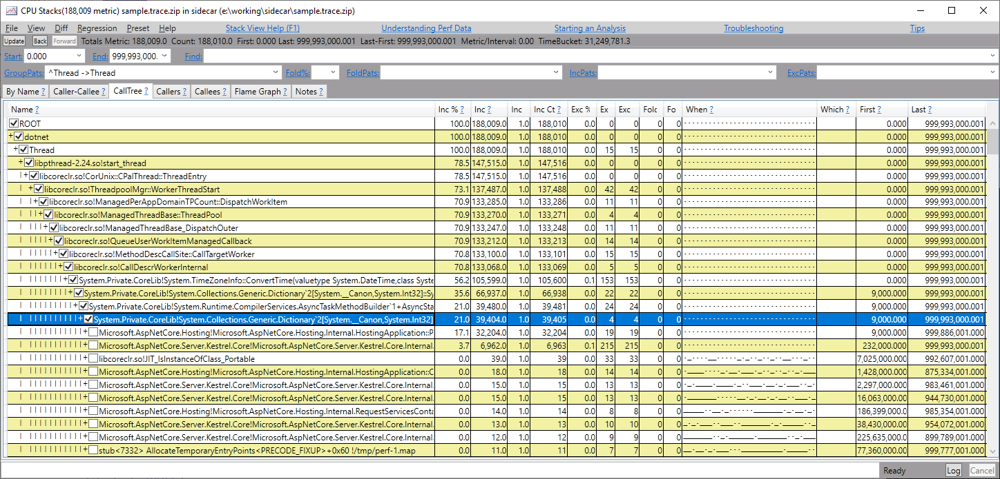

# Collecting .NET Core Linux Container CPU Traces from a Sidecar Container

## Introduction

In recent years, containerization has gained popularity in DevOps due to its
valuable capacities, including more efficient resource utilization and better
agility. Microsoft and Docker have been working together to create a great
experience for running .NET applications inside containers. See the following
blog posts for more information:

- [Using .NET and Docker Together](https://blogs.msdn.microsoft.com/dotnet/2017/05/25/using-net-and-docker-together/)
- [Using .NET and Docker Together – DockerCon 2018 Update](https://blogs.msdn.microsoft.com/dotnet/2018/06/13/using-net-and-docker-together-dockercon-2018-update/)

When there’s a performance problem, analyzing the problem often requires
detailed information about what was happening at the time.
[Perfcollect](https://github.com/dotnet/coreclr/blob/master/Documentation/project-docs/linux-performance-tracing.md)
is the recommended tool for gathering .NET Core performance data on Linux.
The .NET Team introduced `EventPipe` feature in .NET Core 2.0 and has been
continuously improving the usability of the feature for the end users. The goal
of `EventPipe` is to make it very easy to profile .NET Core applications.
However, currently `EventPipe` has limitations:
- Only the managed parts of call stacks are collected. If a performance issue is
  in native code, or in the .NET Core runtime it can only trace it to the
  boundary.
- it does not work for earlier versions of .NET Core.

In these cases `perfcollect` is still the preferred tools. Containers bring
challenges in using `perfcollect`. There are several ways to use `perfcollect`
to gather performance traces .NET Core application running in a Linux container,
each has its cons:

- Collecting from the host
  - Process Ids and file system in the host don't match those in the containers.
  - `perfcollect` cannot find container’s files under host paths (what is `/usr/share/dotnet/`?)
  - Some container operating systems (for example, CoreOS) don't support installing common
    packages/tools, for examples, `linux-tools` and `lttng` which are required by
    `perfcollect` tool.
- Collecting from the container running the application.
  - Installation of profiling tools bloat the container and increase the attack surface.
  - Profiling affects the application performance in the same container (for example,
    its resource consumption is counted against quota).
  - `perf` tool needs capabilities to run from a container, which defeats the
    security features of containers.
- Collecting from another "sidecar" container running on the same host.
  - Possible environment mismatches between sidecar container and application
    container.

Tim Gross published [a blog post on debugging python containers in
production](http://blog.0x74696d.com/posts/debugging-python-containers-in-production/).
His approach is to run tools inside another (sidecar) container on the same host
as the application container. The idea can be applied to profiling/debugging
.NET Core Linux containers. This approach has the following benefits:

- Application containers don’t need elevated privileges.
- Application container images remain mostly unchanged. They are not bloated by
  tool packages that are not required to run applications.
- Profiling doesn't consume application container resources, which are usually
  throttled by a quota.
- Sidecar container can be built as close to the application container as
  possible, so tools used by `perfcollect`, such as `crossgen` and
  `objcopy`, could operate on files of the same versions at the same paths,
  even they are in different containers.

This article only describes the manual/one-off performance investigation
scenario. However, with additional effort the approach could work in an
automated way and/or under an orchestrator. See
[this tutorial](https://developer.ibm.com/recipes/tutorials/profiling-applications-deployed-on-kubernetes-with-sidecar-injector/)
for an example on profiling with a sidecar container in a Kubernetes environment.

**Note**: tracing .NET Core events using `LTTng` is not supported in this
sidecar approach due to how `LTTng` works (using shared memory and CPU buffer)
so this approach cannot be used to collect events from the .NET Core runtime.

The rest of this doc gives a step-by-step guide of using a sidecar container to
collect CPU trace of an ASP.NET application running in a Linux container.

## Building Container Images

1. Build the application image.

   The following `Dockerfile.app` example uses an
   ASP.NET Web API project that is created by the command `dotnet new webapi -o
   webapi`.

   [Dockerfile.app](./webapi/Dockerfile.app)

   ```Dockerfile
   FROM microsoft/dotnet:2.2-sdk AS builder
   WORKDIR /build
   COPY . .

   RUN dotnet publish -c release -o /publish-output

   FROM microsoft/dotnet:2.2-aspnetcore-runtime as runtime

   # COMPlus_PerfMapEnabled is set in order to resolve symbols for .NET code.
   ENV COMPlus_PerfMapEnabled=1

   WORKDIR /app
   COPY --from=builder /publish-output .

   ENTRYPOINT ["dotnet", "webapi.dll"]
   ```

   The `COMPlus_PerfMapEnabled` environment variable is required to properly
   resolve symbols for .NET code. When it is set, .NET Core generates symbol
   mapping files (`perf*.info`) under the `/tmp` directory, which is then used by
   `perfcollect` to associate symbols with call stacks.

   In the previous example, the environment variable is set in the Dockerfile.
   Other options of setting this environment variable include passing them
   through `-e` option of `docker run` command, or setting them in the
   application startup script if there is one.

2. Run the following command to build the application container image:

   ```shell
   docker build . -f Dockerfile.app -t application
   ```

3. Create the sidecar container image. Note that the first several Dockerfile
   steps must match those in the application container's Dockerfile. This is to
   ensure that sidecar container has the exact same files and installation paths
   for .NET Core and the application.

   A `dotnet restore` step is used to download matching version of `crossgen`
   from nuget.org. This step is just a convenient way to download matching
   `crossgen`. It does adds time to the docker build process. If this becomes a
   concern, there are other ways to add `crossgen` too, for example, copying a
   pre-downloaded version from a cached location. However, we must ensure that
   the cached `crossgen` is from the same version of the .NET Core runtime
   because `crossgen` doesn't always work properly across versions. In the
   future, the .NET team might make improvements in this area to make the
   experience better, for example, shipping a stable `crossgen` tool that works
   across different versions.

   After that add `perfcollect` and other tools that are required for profiling
   or debugging.

   [Dockerfile.sidecar](./webapi/Dockerfile.sidecar)

   ```Dockerfile
   FROM microsoft/dotnet:2.2-sdk AS builder
   WORKDIR /build
   COPY . .

   RUN dotnet publish -c release -o /publish-output

   # Restore with `-r linux-x64` so that the runtime package that contains crossgen is downloaded
   RUN dotnet restore -r linux-x64
   RUN cp `find ~/.nuget/packages -name crossgen` /publish-output

   FROM microsoft/dotnet:2.2-aspnetcore-runtime as sidecar-runtime

   # Add whatever tools you want here
   RUN apt-get update \
       && apt-get install -y \
          linux-tools \
          lttng-tools liblttng-ust-dev \
          zip \
          curl \
          binutils \
          procps \
   #      gdb \
   #      strace \
   #      tcpdump \
   #      sysstat \
   #      emacs-nox \
   #      vim \
          htop \
       && rm -rf /var/lib/apt/lists/*

   WORKDIR /tools

   RUN curl -OL http://aka.ms/perfcollect \
       && chmod a+x perfcollect

   WORKDIR /app
   COPY --from=builder /publish-output .

   # perfcollect expects to find crossgen along side libcoreclr.so
   RUN cp crossgen $(dirname `find /usr/share/dotnet/ -name libcoreclr.so`)
   ```

   In the example, the most important packages are:

   - `linux-tools`.
   - `lttng-tools`.
   - `liblttng-ust-dev`.
   - `zip`.
   - `curl`.
   - `binutils` (for `objcopy`/`objdump` commands).
   - `procps` (for `ps` command).

   The `perfcollect` script is downloaded and saved to `/tools` directory. Other
   tools can be installed as needed for diagnosing and debugging purposes.

4. Build the sidecar image by running the following command

   ```shell
   docker build . -f Dockerfile.sidecar -t sidecar
   ```

## Running Docker Containers

5. The Linux `perf` tool needs to access the `perf*.map` files that are
   generated by the .NET Core application. By default, containers are isolated
   thus the `*.map` files generated inside the application container are not
   visible to `perf` tool running inside of the sidecar container. We need to make
   these `*.map` files available to `perf` tool running inside the sidecar.

   In this example, the docker volume mount is used to map a directory on the host to
   the `/tmp` directory of both the application container and the sidecar container.
   Since both of their `/tmp` directories are backed by the same volume, the sidecar
   container can access files written by the application container.

   Run the application container with a name (`application` in this example); map
   the `/tmp` folder to an existing host directory `/home/core/shared_volume/tmp`.

   ```shell
   docker run -p 80:80 -v /home/core/shared_volume/tmp:/tmp --name application application
   ```

   Volume mount might not be desirable in some cases. Another option is to run
   the application container without the `-v` options and then use `docker cp`
   commands to copy the `/tmp/perf*.map` files from the running application
   container to the running sidecar container’s `/tmp` folder before starting the
   perfcollect tool. If this is the case, see step 7.

6. Run the sidecar using the `pid` and `net` namespaces of the application
   container, and with /tmp mapped to the same host folder for tmp. Give this
   container a name (`sidecar` in this example) since it’s easier to refer to the
   container by using its name.

   Linux namespaces isolate containers and make resources they are using
   invisible to other containers by default, however we can make docker
   containers to share namespaces using the options like `--pid`, `--net`, etc.
   Here’s [a wiki link](https://en.wikipedia.org/wiki/Linux_namespaces) to read
   more about Linux namespaces.

   The following command lets the `sidecar` container share the same `pid` and `net`
   namespaces with the application container so that it is allowed to debug or
   profile processes in the application container from the sidecar container.
   The `--cap-add ALL --privileged` switches grant the sidecar container
   permissions to collect performance traces.

   ```shell
   docker run -it --pid=container:application --net=container:application -v /home/core/shared_volume/tmp:/tmp --cap-add ALL --privileged --name sidecar sidecar bash
   ```

7. (**Alternative**) if volume mount is not used in the previous two steps, an
   alternative is to copy the `*.map` files to sidecar container so that
   `perfcollect` can access them. Find out the file names in the application
   container then copy those files to the sidecar container. The point is that
   `perfcollect` expects to find these map files under `/tmp`.

   On the host, run the following commands

   ```shell
   docker exec application /bin/ls -al /tmp/*.map
   ```

   You should see output similar to

   ```
   -rw-r--r--. 1 root root 1215081 May 19 08:56 tmp/perf-1.map
   -rw-r--r--. 1 root root   23828 May 18 17:21 tmp/perfinfo-1.map
   ```

   Copy the files from the `application` container to the host

   ```shell
   docker cp application:/tmp/perf-1.map /tmp/
   docker cp application:/tmp/perfinfo-1.map /tmp/
   ```

   Then copy the files from the host to the `sidecar` container's `/tmp` directory

   ```shell
   docker cp /tmp/perf-1.map sidecar:/tmp/
   docker cp /tmp/perfinfo-1.map sidecar:/tmp/
   ```

## Collection CPU Performance Traces

8. Inside the sidecar container, collect CPU traces for the `dotnet` process (or
   your .NET Core application process if it is published as self-contained),
   which usually has PID of 1, but may vary depending on what else you are
   running in the `application` container before running the application.


   ```shell
   ps -aux
   ```

   Output should be similar to the following

   ```
   USER        PID %CPU %MEM    VSZ   RSS TTY      STAT START   TIME COMMAND
   root          1  1.1  0.5 7511164 82576 pts/0   SLsl+ 18:25   0:03 dotnet webapi.dll
   root        104  0.0  0.0  18304  3332 pts/0    Ss   18:28   0:00 bash
   root        198  0.0  0.0  34424  2796 pts/0    R+   18:31   0:00 ps -aux
   ```

   In this example, the `dotnet` process has PID of 1 so when running the
   `perfcollect` script, pass the PID of the 1 to the `-pid` option.

   ```shell
   /tools/perfcollect collect sample -nolttng -pid 1
   ```

   By using the `-pid 1` option, `perfcollect` only captures performance data for
   the `dotnet` process. Remove it to collect performance data for the whole
   system.

   Press `Ctrl + C` to stop collecting.

9. After collection is stopped, view the report using the following command

   ```shell
   /tools/perfcollect view sample.trace.zip
   ```

10. Verify that the trace includes the map files by listing contents in the zip file

   ```shell
   unzip -l sample.trace.zip
   ```

   You should see `perf-1.map` and `perfinfo-1.map` in the zip, along with other `*.maps` files.

   If anything went wrong during the collection, check out `perfcollect.log` file inside the zip for more details.


```shell
   unzip sample.trace.zip sample.trace/perfcollect.log
   tail -100 sample.trace/perfcollect.log
   ```

   Messages like the following near the end of the log file indicate that you hit
   [a known issue](https://github.com/dotnet/corefx-tools/issues/84),
   please check out the [Potential Issues](#potential-issues)
   section for a workaround

   ```
   Running /usr/bin/perf_4.9 script -i perf.data.merged -F comm,pid,tid,cpu,time,period,event,ip,sym,dso,trace > perf.data.txt
   'trace' not valid for hardware events. Ignoring.
   'trace' not valid for software events. Ignoring.
   'trace' not valid for unknown events. Ignoring.
   'trace' not valid for unknown events. Ignoring.
   Samples for 'cpu-clock' event do not have CPU attribute set. Cannot print 'cpu' field.

   Running /usr/bin/perf_4.9 script -i perf.data.merged -f comm,pid,tid,cpu,time,event,ip,sym,dso,trace > perf.data.txt
     Error: Couldn't find script `comm,pid,tid,cpu,time,event,ip,sym,dso,trace'

    See perf script -l for available scripts.
   ```

11. On the host, retrieve the trace from the sidecar container

   ```shell
   docker cp sidecar:/tools/sample.trace.zip ./
   ```

12. Transfer the trace from the host machine to a Windows machine for further
   investigation using [PerfView](https://github.com/Microsoft/perfview).

   PerfView supports analyzing `perfcollect` traces from Linux. Open
   `sample.trace.zip` then follow the usual workflow of working with PerfView.

   

   For more information on analyzing CPU traces from Linux using PerfView, see
   [this blog post](https://blogs.msdn.microsoft.com/vancem/2016/02/20/analyzing-cpu-traces-from-linux-with-perfview/)
   and [Channel 9 series](https://channel9.msdn.com/Series/PerfView-Tutorial)
   by Vance Morrison.

## Potential Issues

a. In some configurations, the collected `cpu-clock` events don't have the `cpu`
   field. This causes a failure in step 12 when `perfcollect` tries to merge
   trace data. Here’s a workaround:

   Open `perfcollect` in an editor, find the line that contains "`-F`" (capital F),
   then remove "`cpu`" from the `$perfcmd` line so it becomes

   ```diff
   -LogAppend "Running $perfcmd script -i $mergedFile -F comm,pid,tid,cpu,time,period,event,ip,sym,dso,trace > $outputDumpFile"
   -$perfcmd script -i $mergedFile -F comm,pid,tid,cpu,time,period,event,ip,sym,dso,trace > $outputDumpFile 2>>$logFile
   -LogAppend
   +LogAppend "Running $perfcmd script -i $mergedFile -F comm,pid,tid,time,period,event,ip,sym,dso,trace > $outputDumpFile"
   +$perfcmd script -i $mergedFile -F comm,pid,tid,time,period,event,ip,sym,dso,trace > $outputDumpFile 2>>$logFile
   +LogAppend
   ```

   After applying the workaround and collecting the traces, be aware of
   [a known PerfView issue](https://github.com/Microsoft/perfview/issues/806)
   when viewing the traces whose cpu field is missing.
   This issue has been fixed already and will be available in the future releases of PerfView.

b.    If there are problems resolving .NET symbols, you can also use two additional
   settings. Note that this might affect the application start-up performance.

   ```
   COMPlus_ZapDisable=1
   COMPlus_ReadyToRun=0
   ```

   Setting `COMPlus_ZapDisabl=1` tells the .NET Core runtime to not use the
   precompiled framework code. All the code will be Just-in-Time compiled thus
   `crossgen` is no longer needed, which means the steps to run `dotnet restore`
   and copy `crossgen` in the sidecar container Dockerfile at step 3 can be
   removed. For more details, check out the relevant section at
   [Performance Tracing on Linux](https://github.com/dotnet/coreclr/blob/master/Documentation/project-docs/linux-performance-tracing.md#resolving-framework-symbols).

## Conclusion

This document describes a sidecar approach to collect CPU performance trace for
.NET Core application running inside of a container. The step-by-step guide here
describes a manual/on-demand investigation. However, most of steps above may
be automated by container orchestrator or infrastructure.

## References and Useful Links

1. [Linux Container Performance Analysis](https://www.usenix.org/conference/lisa17/conference-program/presentation/gregg), talk by Brendan Gregg, inventor of FlameGraph
2. Examples and hands-on labs for Linux tracing tools workshops by Sasha Goldshtein https://github.com/goldshtn/linux-tracing-workshop.
3. Debugging and Profiling .NET Core Apps on Linux, slides from Sasha Goldshtein https://assets.ctfassets.net/9n3x4rtjlya6/1qV39g0tAEC2OSgok0QsQ6/fbfface3edac8da65fd380cc05a1a028/Sasha-Goldshtein_Debugging-and-profiling-NET-Core-apps-on-Linux.pdf
4. Debugging Python Containers in Production http://blog.0x74696d.com/posts/debugging-python-containers-in-production/
5. perfcollect source code https://github.com/dotnet/corefx-tools/blob/master/src/performance/perfcollect/perfcollect
6. Documentation on Performance Tracing on Linux for .NET Core. https://github.com/dotnet/coreclr/blob/master/Documentation/project-docs/linux-performance-tracing.md
7. PerfView tutorials on Channel9 https://channel9.msdn.com/Series/PerfView-Tutorial
