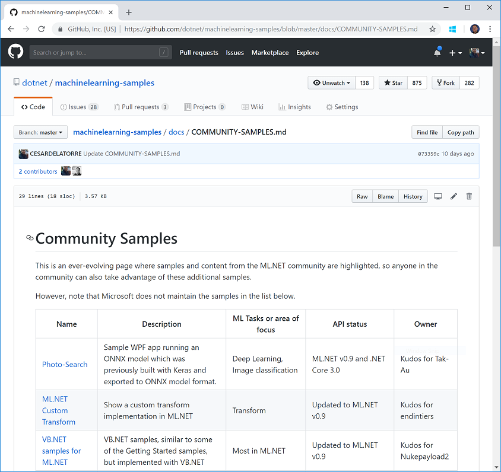
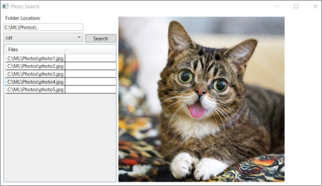

# Announcing ML.NET 0.10 - Machine Learning for .NET


[ML.NET](http://dot.net/ml) is an open-source and cross-platform machine learning framework (Windows, Linux, macOS) for .NET developers. Using ML.NET, developers can leverage their existing tools and skillsets to develop and infuse custom AI into their applications by creating custom machine learning models.

[ML.NET](http://dot.net/ml) allows you to create and use machine learning models targeting common tasks such as classification, regression, clustering, ranking, recommendations and anomaly detection. It also supports the broader open source ecosystem by proving integration with popular deep-learning frameworks like TensorFlow and interoperability through ONNX. Some common use cases of [ML.NET](http://dot.net/ml) are scenarios like Sentiment Analysis, Recommendations, Image Classification, Sales Forecast, etc. Please see our [samples](https://github.com/dotnet/machinelearning-samples) for more scenarios.

Today we’re announcing the release of [ML.NET](http://dot.net/ml) 0.10. (<a href="https://blogs.msdn.microsoft.com/dotnet/2018/05/07/introducing-ml-net-cross-platform-proven-and-open-source-machine-learning-framework/"> [ML.NET](http://dot.net/ml) 0.1 was released at //Build 2018</a>). 


This release focuses on the overall stability of the framework, continuing to improve the API, increase test coverage and increasing interopertability with IDataView as an independent package.
The main highlights for this blog post are described below in further details:

* [Improve interoperability with IDataView](http://xxxxxxxx)
* [Improve Recommendation model by using multiple features](http://xxxxxxxx)
* [Additional updates in v0.10](http://xxxxxxxx)
* [Help the community learn by contributing more samples](http://xxxxxxxx)
* [Need help for going into production?](http://xxxxxxxx)


# Improve interoperability with IDataView

The `IDataView` component provides a very efficient, compositional processing of tabular data (columns and rows) especialy made for machine learning and advanced analytics applications. It is designed to efficiently handle high dimensional data and large data sets. It is also suitable for single node processing of data partitions belonging to larger distributed data sets.

## What's new in v0.10 for IDataView

In [ML.NET](http://dot.net/ml) 0.10 we have segregated the [IDataView](https://docs.microsoft.com/en-us/dotnet/api/microsoft.ml.data.idataview?view=ml-dotnet) component into a single assembly and NuGet package. This is a very important step towards the interoperability with other APIs and frameworks.

## Why segregate IDataView from the rest of the ML.NET framework?

`IDataView` is very useful as a component for tabular data that will allow users to pass data between independent libraries (data prep, visualization etc.)


# Improve Recommendation model by using multiple features

In previous ML.NET releases, when using the *Field-aware Factorization Machine (FFM)* trainer (training algorithm) you could only provide a single feature column like in [this sample app](https://github.com/dotnet/machinelearning-samples/blob/master/samples/csharp/end-to-end-apps/Recommendation-MovieRecommender/MovieRecommender_Model/Program.cs#L74)

In 0.10 release we've added support for multiple 'feature columns' in your training dataset when using an FFM trainer by allowing to specify those additional column names in the trainer's 'Options' parameter as shown in the following code snippet:

```cs
var ffmArgs = new FieldAwareFactorizationMachineTrainer.Options();

// Create the multiple field names.
ffmArgs.FeatureColumn = nameof(MyObservationClass.MyField1); // First field.
ffmArgs.ExtraFeatureColumns = new[]{ nameof(MyObservationClass.MyField2), nameof(MyObservationClass.MyField3) }; // Additional fields.

var pipeline = mlContext.BinaryClassification.Trainers.FieldAwareFactorizationMachine(ffmArgs);

var model = pipeline.Fit(dataView);
```

You can see additional code example details in [this code](https://github.com/dotnet/machinelearning/blob/master/test/Microsoft.ML.Tests/TrainerEstimators/FAFMEstimator.cs#L17)


# Additional updates in v0.10 timeframe

## Support for returning multiple scored results when predicting

Until ML.NET v0.9, when predicting (for instance with a multi-class classification model), you could only predict and return a single label. That's an issue for many business scenarios. For instance, in an eCommerce scenario, you could want to automatically classify a product and assign it to multiple product categories instead of just a single category. 

Therefore, this improvement allows you to access the schema's data so you can get a list of possible labels raked by their related score/proability.

For additional info check [this code example](https://github.com/dotnet/machinelearning/blob/master/test/Microsoft.ML.Tests/Scenarios/Api/Estimators/PredictAndMetadata.cs#L41)

## Minor updates in 0.10

- *Introducing Microsoft.ML.Recommender NuGet name instead of Microsoft.ML.MatrixFactorization name:* [Microsoft.ML.Recommender](https://github.com/dotnet/machinelearning/blob/master/pkg/Microsoft.ML.Recommender/Microsoft.ML.Recommender.nupkgproj)] is a better naming for NuGet packages based on the scenario (Recommendations) instead of the trainer's name (Microsoft.ML.MatrixFactorization).

- *Added support in TensorFlow for using using text and sparse input in TensorFlow:* Specifically, this adds support for loading a map from a file through dataview by using ValueMapperTransformer. This provides support for additional scenarios like a [Text/NLP scenario](https://github.com/dotnet/machinelearning/issues/747)) in TensorFlowTransform where model's expected input is vector of integers.


- *Added Tensorflow unfrozen models support in GetModelSchema:* For a code example loading an unfrozen TensorFlow check it out [here](https://github.com/dotnet/machinelearning/blob/master/test/Microsoft.ML.Tests/ScenariosWithDirectInstantiation/TensorflowTests.cs#L765).

# Explore Community samples and contribute!

As part of the [ML.NET Samples repo](https://github.com/dotnet/machinelearning-samples) we also have a special [Community Samples page](https://github.com/dotnet/machinelearning-samples/blob/master/docs/COMMUNITY-SAMPLES.md) pointing to multiple samples provided by the community. These samples are not maintained by Microsoft but are very interesting and cover additional scenarios not covered by us.

Here's an screenshot of the current [community samples]((https://github.com/dotnet/machinelearning-samples/blob/master/docs/COMMUNITY-SAMPLES.md)):



There are pretty cool samples like the following:

**'Photo-Search' WPF app running a TensorFlow model exported to ONNX format**



**UWP app using ML.NET**


Other very interesting samples are:
- [ML.NET custom Transform implementation](https://github.com/endintiers/Unearth.Demo.MLCustomTransform) 

- [ML.NET samples in VB.NET](https://github.com/Nukepayload2/machinelearning-samples/tree/master/samples/visualbasic) 


## Share your sample with the ML.NET community!

We encourage you to share your [ML.NET](http://dot.net/ml) demos and samples with the community by simply submitting its brief description and URL pointing to your GitHub repo or blog posts, into this [repo issue "Request for your samples!"](https://github.com/dotnet/machinelearning-samples/issues/86). 

We'll do the rest and publish it at the [ML.NET Community Samples page](https://github.com/dotnet/machinelearning-samples/blob/master/docs/COMMUNITY-SAMPLES.md)! 

## Need help for going into production?

If you are looking to going into production soon (next 6 months), then we can help you with any questions. Fill out this survey.

## Get started!


If you haven’t already get started with <a href="https://www.microsoft.com/net/learn/apps/machine-learning-and-ai/ml-dotnet/get-started">ML.NET here</a>.
 
Next, going further explore some other resources:

  * Tutorials and resources at the [Microsoft Docs ML.NET Guide](https://docs.microsoft.com/en-us/dotnet/machine-learning/)
  * Code samples at the [machinelearning-samples GitHub repo](https://github.com/dotnet/machinelearning-samples)
  * Important [ML.NET](http://dot.net/ml) concepts for understanding the new API are introduced [here](https://docs.microsoft.com/en-us/dotnet/machine-learning/basic-concepts-model-training-in-mldotnet)
  * "How to" guides that show how to use these APIs for a variety of scenarios can be found [here](https://docs.microsoft.com/en-us/dotnet/machine-learning/how-to-guides/)

 We will appreciate your feedback by filing issues with any suggestions or enhancements in the [ML.NET GitHub repo](https://github.com/dotnet/machinelearning) to help us shape [ML.NET](http://dot.net/ml) and make .NET a great platform of choice for Machine Learning.

Thanks and happy coding with [ML.NET](http://dot.net/ml)!

The [ML.NET](http://dot.net/ml) Team.

*This blog was authored by Cesar de la Torre based on contributions from the ML.NET team*

