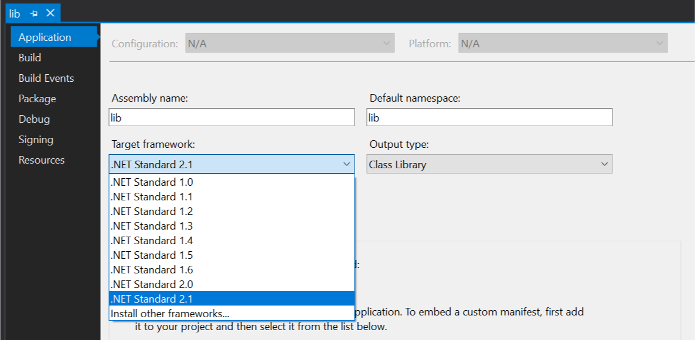

# Announcing .NET Core 3.0 Preview 3

Today, we are announcing .NET Core 3.0 Preview 3. We would like to update you on the .NET Core 3.0 schedule and introduce you to improvements in .NET Core SDK installers, Docker containers, Range, and Index. We also have updates on the Windows Desktop and Entity Framework projects.

[Download and get started with .NET Core 3 Preview 3](https://aka.ms/netcore3download) right now on Windows, macOS and Linux.

You can see complete details of the release in the [.NET Core 3 Preview 3 release notes](https://aka.ms/netcore3releasenotes).

.NET Core 3.0 will be supported in Visual Studio 2019, Visual Studio for Mac and Visual Studio Code.

## Schedule

We have seen people asking questions about when .NET Core 3.0 will be released. They also want to know if .NET Core 3.0 will be included in Visual Studio 2019. [Visual Studio 2019 RC](https://devblogs.microsoft.com/visualstudio/visual-studio-2019-release-candidate-rc-now-available/) was recently released, which is part of the motivation for the questions.

We plan to ship .NET Core 3.0 in the second half of 2019. We will announce the ship date at the Build 2019 conference.

Visual Studio 2019 will be released on April 2nd. .NET Core 2.1 and 2.2 will be included in that release, just like they have been in the Visual Studio 2019 preview builds.  At the point of the final .NET Core 3.0 release, we'll announce support for a specific Visual Studio 2019 update, and .NET Core 3.0 will be included in Visual Studio 2019 from that point on.

We're tracking to shipping .NET Core 3.0 preview releases every month. By coincidence,the previews now align with the months. We're releasing Preview 3 today and we're in the third month. We hope to continue that pattern until the final release.

## .NET Core SDK installers will now Upgrade in Place

For Windows, the .NET Core SDK MSI installers will start upgrading patch versions in place. This will reduce the number of SDKs that are installed on both developer and production machines.

The upgrade policy will specifically target .NET Core SDK feature bands. Feature bands are defined in hundreds groups in the patch section of the version number. For example, `3.0.101` and `3.0.201` are versions in two different feature bands while `3.0.101` and `3.0.199` are in the same feature band.

This means when .NET Core SDK 3.0.101 becomes available and is installed, .NET Core SDK 3.0.100 will be removed from the machine if it exists. When .NET Core SDK 3.0.200 becomes available and is installed on the same machine, .NET Core SDK 3.0.101 will not be removed. In that situation, .NET Core SDK 3.0.200 will still be used by default, but .NET Core SDK 3.0.101 (or higher .1xx versions) will still be usable if it is configured for use via [global.json](https://docs.microsoft.com/en-us/dotnet/core/tools/global-json).

This approach aligns with the behavior of `global.json`, which allows roll forward across patch versions, but not feature bands of the SDK. Thus, upgrading via the SDK installer will not result in errors due to a missing SDK. Feature bands also align with side by side Visual Studio installations for those users that install SDKs for Visual Studio use.

We would like feedback on the approach we've taken for upgrading the .NET Core SDK in place. We considered a few different policies and chose this one because it is the most conservative. We'd also like to hear if it is important to build similar experience on macOS. For Linux, we use package managers, so the need is less relevant.

For more information, please check out:

* [.NET Core versioning](https://docs.microsoft.com/dotnet/core/versions/#versioning-details)
* [Remove .NET Core SDK versions](https://docs.microsoft.com/dotnet/core/versions/remove-runtime-sdk-versions)

## Docker and cgroup memory Limits

Many developers are [packaging and running their application with containers](https://devblogs.microsoft.com/dotnet/using-net-and-docker-together-dockercon-2018-update/). A key scenario is [limiting a container's resources](https://docs.docker.com/config/containers/resource_constraints/) such as CPU or memory. We implemented [support for memory limits](https://github.com/dotnet/coreclr/pull/10064) back in 2017. Unfortunately, we found that the implementation isn't aggressive enough to reliably stay under the configured limits and applications are still being OOM killed when memory limits are set (particular &lt;500MB). We are fixing that in .NET Core 3.0. Note that this scenario only applies if memory limits are set.

The Docker resource limits feature is built on top of [cgroups](https://en.wikipedia.org/wiki/Cgroups), which a Linux kernel feature. From a runtime perspective, we need to target cgroup primitives.

You can limit the available memory for a container with the `docker run -m` argument, as shown in the following example that creates an Alpine-based container with a 4MB memory limit (and then [prints the memory limit](https://stackoverflow.com/questions/42187085/check-mem-limit-within-a-docker-container)):

```console
C:\>docker run -m 4mb --rm alpine cat /sys/fs/cgroup/memory/memory.limit_in_bytes
4194304
```

Mid-way through 2018, we started [testing applications with memory limits set below 100MB](https://github.com/dotnet/coreclr/issues/18971). The results were not great. This effort was based on enabling .NET Core to run well in containers in IoT scenarios. More recently, we published a [design](https://github.com/dotnet/designs/pull/49) and [implementation](https://github.com/dotnet/coreclr/pull/22180) to satisfy both server/cloud and IoT memory limits cases.

We concluded that the primary fix is to set a GC heap maximum significantly lower than the overall memory limit as a default behavior. In retrospect, this choice seems like an obvious requirement of our implementation. We also found that Java has taken a similar approach, introduced in Java 9 and updated in Java 10.

The following design summary describes the new .NET Core behavior (added in Preview 3) when cgroup limits are set:

* Default GC heap size: maximum of `20mb` or  `75%` of the memory limit on the container
* Explicit size can be set as an absolute number or percentage of cgroup limit
* Minimum reserved segment size per GC heap is 16mb, which will reduce the number of heaps created on machines with a large number of cores and small memory limits

The GC change is the most critical part of our memory limits solution. It is also important to [update BCL APIs to honor cgroup settings](https://github.com/dotnet/corefx/issues/35638). Those changes are not included in Preview 3 but will come later. We'd appreciate feedback on which BCL APIs are most important to update first ([another example](https://github.com/dotnet/corefx/issues/32748)).

Our focus in Preview 3 has been about making Docker limits work well for Linux containers. We're do the same for Windows containers in upcoming previews.

## Index and Range

`Index` and `Range` types were introduced in [Preview 1](https://devblogs.microsoft.com/dotnet/announcing-net-core-3-preview-1-and-open-sourcing-windows-desktop-frameworks/) to support the new C# 8.0 compiler index and range syntax (e.g. array[^10] and array[3..10]). We have polished these types for Preview 3 and added some more APIs to enable using `Index` and `Range` with some other types (e.g. `String`, `[Readonly]Span<T>`, `[Readonly]Memory<T>` and `Array`).

These changes enable the following syntax and scenarios:

```C#
// start with int[]
int[] nums = { 1, 2, 3, 4, 5, 6, 7, 8, 9, 10 };
int lastNum = nums[^1]; // 10
int[] subsetNums = nums[2..6]; // {3, 4, 5, 6}

// Create a Memory<int> using arrayofNums as input
// Create no-copy slices of the array
Memory<int> numbers = nums;
Memory<int> lastTwoNums = numbers.Slice(^2); // {9, 10}
Memory<int> middleNums = numbers.Slice(4..8); // {5, 6, 7, 8}

// Create a substring using a range
string myString = "0123456789ABCDEF";
string substring = myString[0..5]; // "01234"

// Create a Memory<char> using a range
ReadOnlyMemory<char> myChars = myString.AsMemory();
ReadOnlyMemory<char> firstChars = myChars[0..5]; // {'0', '1', '2', '3', '4'}

// Get an offset with an Index
Index indexFromEnd = Index.FromEnd(3); // equivalent to [^3]
int offsetFromLength = indexFromEnd.GetOffset(10); // 7
int value = nums[offsetFromLength]; // 8

// Get an offset with a Range
Range rangeFromEnd = 5..^0;
(int offset, int length) = rangeFromEnd.GetOffsetAndLength(10); // offset = 5, length = 5
Memory<int> values = numbers.Slice(offset, length); // {6, 7, 8, 9, 10}
```

```js
<script src="https://gist.github.com/richlander/eeddf77afa13d68727ead60e1f6c7736.js"></script>
```

Note: The following content (in this section) should be moved to release notes.

The following are the specific changes made in Preview 3:

Added to `Index`:

```C#
public bool IsFromEnd { get; }
public Index(int value, bool fromEnd = false);
```

Removed from `Index`:

```C#
public Index(int value, bool fromEnd);
public bool FromEnd { get; }
```

Added to `Index`:

```C#
public static Index End { get; }
public static Index Start { get; }
public static Index FromEnd(int value);
public static Index FromStart(int value);
public int GetOffset(int length);
```

Added to `Range`:

```C#
public static Range All { get; }
public static Range StartAt(Index start);
public static Range EndAt(Index end);
```

Removed from `Range`:

```C#
public static Range All();
public static Range FromStart(Index start);
public static Range ToEnd(Index end);
```

Added to `Range`:

```C#
public Range(Index start, Index end);
public Range.OffsetAndLength GetOffsetAndLength(int length);
```

Added the following Range and Index APIs to various types:

```C#
public readonly struct Memory<T>
{
    public Memory<T> this[Range range] { get; }
    public Memory<T> Slice(Index startIndex);
    public Memory<T> Slice(Range range);
}

public static class MemoryExtensions
{
    public static ReadOnlyMemory<char> AsMemory(this string text, Index startIndex);
    public static ReadOnlyMemory<char> AsMemory(this string text, Range range);
    public static Memory<T> AsMemory<T>(this T[] array, Index startIndex);
    public static Memory<T> AsMemory<T>(this T[] array, Range range);
    public static Span<T> AsSpan<T>(this ArraySegment<T> segment, Index startIndex);
    public static Span<T> AsSpan<T>(this ArraySegment<T> segment, Range range);
    public static Span<T> AsSpan<T>(this T[] array, Index startIndex);
    public static Span<T> AsSpan<T>(this T[] array, Range range);
}

public readonly struct ReadOnlyMemory<T>
{
    public ReadOnlyMemory<T> this[Range range] { get; }
    public ReadOnlyMemory<T> Slice(Index startIndex);
    public ReadOnlyMemory<T> Slice(Range range);
}

public readonly ref struct ReadOnlySpan<T>
{
    public ReadOnlySpan<T> Slice(Index startIndex);
    public ReadOnlySpan<T> Slice(Range range);
}

public readonly ref struct Span<T>
{
    public Span<T> Slice(Index startIndex);
    public Span<T> Slice(Range range);
}

public sealed class String
{
    public char this[Index index] { get; }
    public string this[Range range] { get; }
    public String Substring(Index startIndex);
    public String Substring(Range range);
}
```

## .NET Standard 2.1

This is the first preview that has support for authoring .NET Standard 2.1 libraries. By default, `dotnet new classlib` continues to create .NET Standard 2.0 libraries as we believe it gives you a better compromise between platform support and feature set. For example, [.NET Standard 2.1 won't be supported by .NET Framework](https://devblogs.microsoft.com/dotnet/announcing-net-standard-2-1/).

In order to target .NET Standard 2.1, you'll have to edit your project file and change the `TargetFramework` property to `netstandard2.1`:

```xml
<Project Sdk="Microsoft.NET.Sdk">

  <PropertyGroup>
    <TargetFramework>netstandard2.1</TargetFramework>
  </PropertyGroup>

</Project>
```

If you're using Visual Studio, you'll need Visual Studio 2019 as .NET Standard 2.1 won't be supported in Visual Studio 2017.



As the version number illustrates, .NET Standard 2.1 is a minor increment over what was added with .NET Standard 2.0 (we added ~3000 APIs). Here are the key additions:

* `Index` and `Range`. This adds both, the types as well as the indexers on the core types, such as `String`, `ArraySegment<T>`, and `Span<T>`.
* `IAsyncEnumerable<T>`. This adds support for an async `IEnumerable<T>`. We don't currently provide Linq-style extension methods but this gap is filled by the [System.Linq.Async community project](https://www.nuget.org/packages/System.Linq.Async).
* Support for `Span<T>` and friends. This includes both, the span types, as well as the hundreds of helper methods across various types that accept and return spans (e.g. `Stream`).
* Reflection emit & capability APIs. This includes Reflection emit itself as well as two new properties on the `RuntimeFeature` class that allows you to check whether runtime code generation is supported at all (`IsDynamicCodeSupported`) and whether it's compiled using a JIT or interpreted (`IsDynamicCodeCompiled`). This enables you to author .NET Standard libraries that can take advantage of dynamic code generation if available and fallback to other behavior when you run in environments that don't have JIT and/or don't have support for IL interpretation.
* SIMD. .NET had support for SIMD for a while now. We’ve leveraged them to speed up basic operations in the BCL, such as string comparisons. We’ve received quite a few requests to expose these APIs in .NET Standard as the functionality requires runtime support and thus cannot be provided meaningfully as a NuGet package.
* `DbProviderFactories`. In .NET Standard 2.0 we added almost all of the primitives in ADO.NET to allow O/R mappers and database implementers to communicate. Unfortunately, `DbProviderFactories` didn’t make the cut for 2.0 so we’re adding it now. In a nutshell, `DbProviderFactories` allows libraries and applications to utilize a specific ADO.NET provider without knowing any of its specific types at compile time, by selecting among registered `DbProviderFactory` instances based on a name, which can be read from, for example, configuration settings.
* General Goodness. Since .NET Core was open sourced, we’ve added many small features across the base class libraries such as `System.HashCode` for combining hash codes or new overloads on `System.String`. There are about 800 new members in .NET Core and virtually all of them got added in .NET Standard 2.1.

For more details on all the API additions and platform support, check out [.NET Standard version table on GitHub](https://github.com/dotnet/standard/blob/master/docs/versions.md).

## F# Update

We added the following for F# in Preview 3.

* F# 4.6 (Preview) (in the SDK)
* dotnet fsi (Preview) command

### F# 4.6

* Anonymous Record support
* FSharp.Core additions
  * ValueOption function parity with Option
  * tryExactlyOne function for List, Array, and Seq

Learn more at [Announcing F# 4.6 Preview](https://devblogs.microsoft.com/dotnet/announcing-f-4-6-preview/).

### dotnet fsi preview

F# interactive as a pure .NET Core application:

```console
dotnet fsi --readline

Microsoft (R) F# Interactive version 10.4.0 for F# 4.6
Copyright (c) Microsoft Corporation. All Rights Reserved.

For help type #help;;

> let lst = [ 1; 2; 3; 4; 5];;
val lst : int list = [1; 2; 3; 4; 5]

> let squares = lst |> List.map (fun x -> x * x);;
val squares : int list = [1; 4; 9; 16; 25]

> let sumOfSquares = lst |> List.sumBy (fun x -> x * x);;
val sumOfSquares : int = 55
```

Has basic colorization of F# types (thanks to [Saul Rennison](https://github.com/saul)):


## .NET Core Windows Desktop Project Update

We are continuing to make progress on the [WPF](https://github.com/dotnet/wpf) and [WinForms](https://github.com/dotnet/winforms) projects. We are still working on transitioning these code bases from a proprietary build system to an open source one, based on [dotnet/arcade](https://github.com/dotnet/arcade). We are coming to the tail end of this phase of the project and then expect that remaining parts of the WPF code base will be published afterwards, likely after Preview 4.

## High DPI for Windows Forms Applications

As technology progresses, more varied display monitors are avaiable for purchase. Dots-per-inch (DPI), that used to always be 96 DPI, is no longer a constant value. With that comes a need to be able to set different **DPI modes** for desktop applications.

Before, the only way to set the DPI mode for your .NET Core WinForms application was via `P/Invoke`. In .NET Core Preview 3 we are adding the ability to get and set High DPI mode by adding the `Application.SetHighDpiMode` and `Application.HighDpiMode`.

The `SetHighDpiMode` method will set the corresponding High DPI mode unless the setting has been set by other means like `App.Manifest` or `P/Invoke` before `Application.Run`.

The possible HighDPIMode values, as expressed by the `HighDpiMode` enum are:

* `DpiUnaware`
* `SystemAware`
* `PerMonitor`
* `PerMonitorV2`
* `DpiUnawareGdiScaled`

To learn more about High DPI modes check out [High DPI Desktop Application Development on Windows](https://docs.microsoft.com/en-us/windows/desktop/hidpi/high-dpi-desktop-application-development-on-windows) article.

## Entity Framework Project Update

In the first 3 previews, the EF team has prioritized API and behavior changes that could cause existing applications to break when upgrading from previous versions. These changes are themselves designed to improve EF Core or to unblock further improvements. But it also means that many other changes, including sought-after new features planned for EF Core 3.0, together with the porting of EF6 to .NET Core, haven't been completed yet.

Implementing architectural changes early in the release helps us maximize the opportunities to collect customer feedback, understand any unintended impact of the changes, and react accordingly.

You can expect to see more detailed announcements in this blog, as we make progress in the delivery of new features in upcoming previews.

In the meantime, you can visit [What’s new in EF Core 3.0](https://docs.microsoft.com/ef/core/what-is-new/ef-core-3.0/) in the product documentation to find more information about the new features planned for 3.0 as well as a detailed description of the breaking changes included so far.

## Docker Publishing Update

Microsoft teams are now publishing container images to the [Microsoft Container Registry (MCR)](https://azure.microsoft.com/en-us/blog/microsoft-syndicates-container-catalog/). There are two primary reasons for this change:

* Syndicate Microsoft-provided container images to multiple registries, like Docker Hub and Red Hat.
* Use Microsoft Azure as a global CDN for delivering Microsoft-provided container images.

On the .NET team, we are now publishing all .NET Core images to MCR. We switched the [.NET Core Nightly product repo](https://hub.docker.com/_/microsoft-dotnet-core-nightly) to MCR 2-3 weeks ago. The [.NET Core product repo](https://hub.docker.com/_/microsoft-dotnet-core) has now been moved to publishing to MCR as well, and includes .NET Core 3.0 Preview 3. As you can see from these links (if you click on them), we continue to have "home pages" on Docker Hub. We intend for that to continue indefinitely. MCR does not offer such pages, but relies of public registries, like Docker Hub, to provide users with image-related information.

The links to our old repos, such as  [microsoft/dotnet](https://hub.docker.com/r/microsoft/dotnet) and [microsoft/dotnet-nightly](https://hub.docker.com/r/microsoft/dotnet-nightly) now forward to the new locations. The images that existed at those locations still exists and will not be deleted.

We will continue servicing the floating tags in the old repos for the supported life of the various .NET Core versions. For example, `2.1-sdk`, `2.2-runtime`, and `latest` are examples of floating tags that will be serviced. A three-part version tag like `2.1.2-sdk` will not be serviced, which was already the case.

We have deleted the `3.0` images in the old repos. We will only be supporting .NET Core 3.0 images in MCR and want to make sure that everyone realizes that MCR is the correct place to pull those images, and transitions to using MCR immediately.

For example, the correct tag string to pull the 3.0 SDK image now looks like the following:

```console
mcr.microsoft.com/dotnet/core/sdk:3.0
```

The new MCR string will be used with both `docker pull` and in Dockerfile `FROM` statements.

This tag string previously looked like the following:

```console
microsoft/dotnet:3.0-sdk
```

See [Publishing .NET Core images to Microsoft Container Registry (MCR)](https://github.com/dotnet/announcements/issues/101) for more information.

## Other Changes and Resources

The following resources are describe other .NET Core 3.0 changes:

* [Floating-Point Parsing and Formatting improvements in .NET Core 3.0](https://devblogs.microsoft.com/dotnet/floating-point-parsing-and-formatting-improvements-in-net-core-3-0/)
* [DLLMap and Native image resolver events](https://docs.microsoft.com/en-us/dotnet/api/system.runtime.interopservices.nativelibrary?view=netcore-3.0)
* [Assembly Dependency Resolver – provides a set of APIs that enable deps.json parsing for plus-ins](https://github.com/dotnet/samples/tree/master/core/extensions/AppWithPlugin)

## Closing

Take a look at the [].NET Core 3.0 Preview 1](https://blogs.msdn.microsoft.com/dotnet/2018/12/04/announcing-net-core-3-preview-1-and-open-sourcing-windows-desktop-frameworks/) and [Preview 2](https://devblogs.microsoft.com/dotnet/announcing-net-core-3-preview-2/) posts if you missed those. With this post, they describe the complete set of new capabilities that have been added so far with the .NET Core 3.0 release.

Thanks for trying out .NET Core 3.0. Please continue to give us feedback, either in the comments or on GitHub. We are listening carefully and will continue to make changes based on your feedback.
